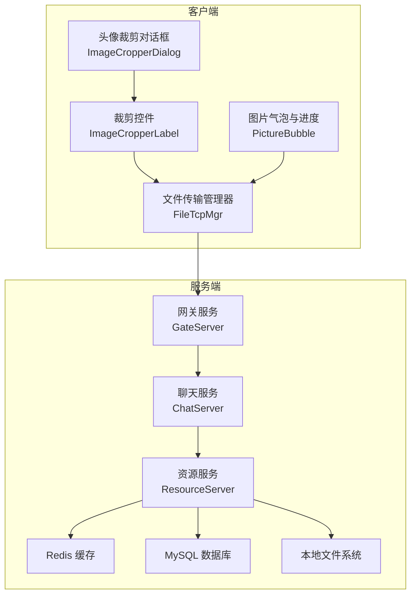
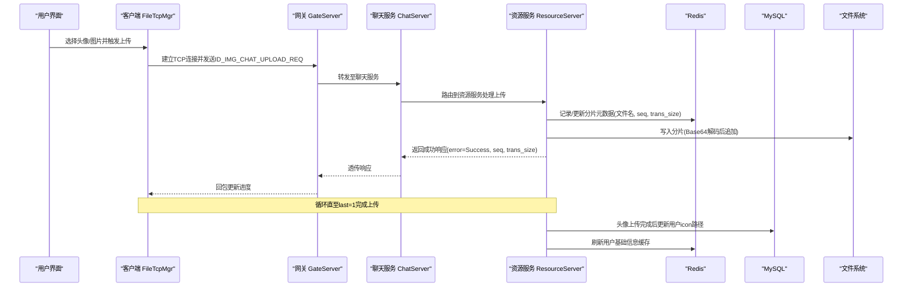
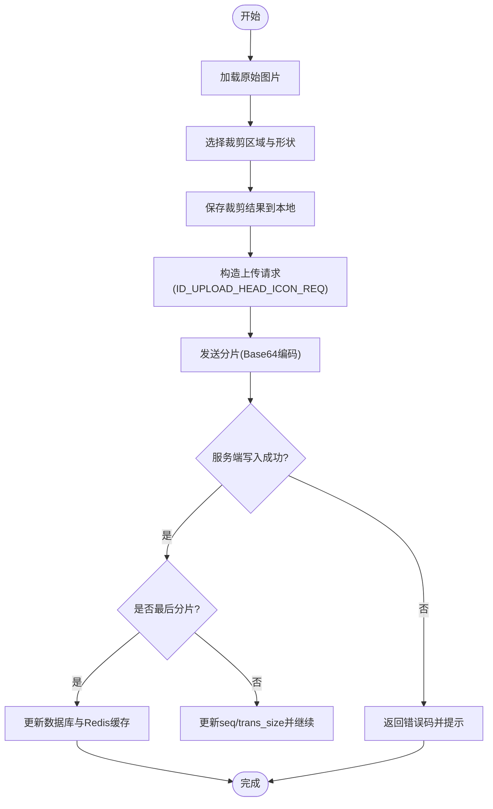
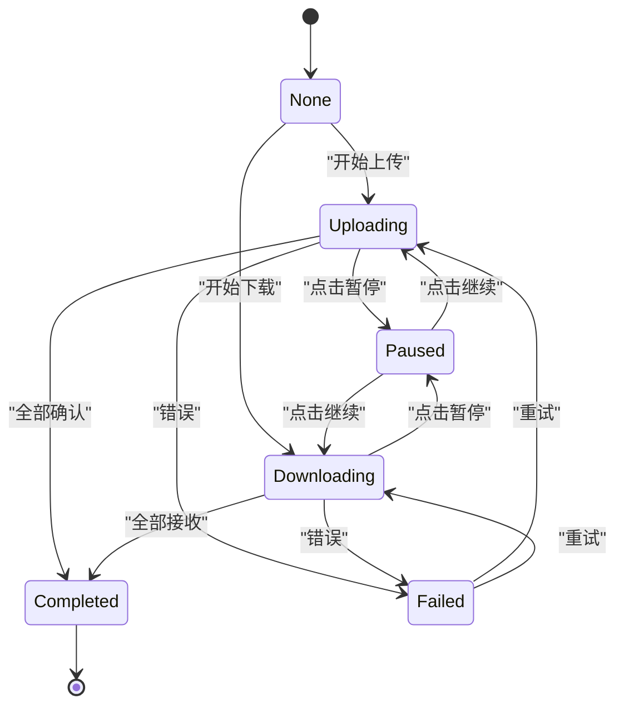
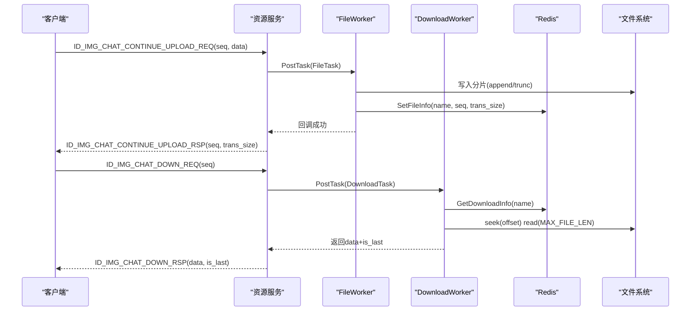
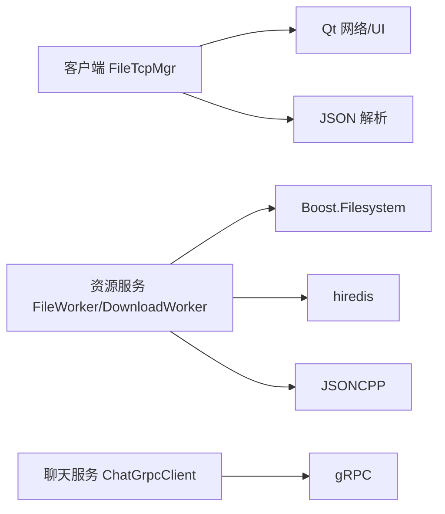

# 资源管理系统

<cite>
**本文引用的文件**   
- [README.md](file://README.md)
- [FileInfo.h](file://server/ResourceServer/include/FileInfo.h)
- [FileSystem.h](file://server/ResourceServer/include/FileSystem.h)
- [FileWorker.h](file://server/ResourceServer/include/FileWorker.h)
- [const.h](file://server/ResourceServer/include/const.h)
- [message.proto](file://server/proto/resource/message.proto)
- [filetcpmgr.h](file://client/llfcchat/include/filetcpmgr.h)
- [filetcpmgr.cpp](file://client/llfcchat/src/filetcpmgr.cpp)
- [imagecropperdialog.h](file://client/llfcchat/include/imagecropperdialog.h)
- [imagecropperlabel.h](file://client/llfcchat/include/imagecropperlabel.h)
- [RedisMgr.h](file://server/ResourceServer/include/RedisMgr.h)
- [FileSystem.cpp](file://server/ResourceServer/src/FileSystem.cpp)
- [FileWorker.cpp](file://server/ResourceServer/src/FileWorker.cpp)
- [day38-断点续传.md](file://开发文档/day38-断点续传.md)
- [day40-聊天图片资源续传和进度显示.md](file://开发文档/day40-聊天图片资源续传和进度显示.md)
- [day41-通知客户端异步下载聊天图片.md](file://开发文档/day41-通知客户端异步下载聊天图片.md)
- [ChatGrpcClient.cpp](file://server/ChatServer/src/ChatGrpcClient.cpp)
- [LogicSystem.cpp](file://server/ChatServer/src/LogicSystem.cpp)
</cite>

## 目录
1. [简介](#简介)
2. [项目结构](#项目结构)
3. [核心组件](#核心组件)
4. [架构总览](#架构总览)
5. [详细组件分析](#详细组件分析)
6. [依赖关系分析](#依赖关系分析)
7. [性能考量](#性能考量)
8. [故障排查指南](#故障排查指南)
9. [结论](#结论)
10. [附录](#附录)

## 简介
本技术文档围绕 LLFCChat 资源管理系统的“头像上传裁剪、文件断点续传、图片预览”等核心能力展开，系统性阐述分片上传机制、进度跟踪、并发控制、文件系统存储策略、缓存机制与安全访问控制等关键设计。同时覆盖文件元数据管理、版本控制与垃圾回收等企业级特性，并提供完整的 API 接口说明、错误码定义、性能监控指标以及分布式扩展、CDN 集成与备份恢复建议，帮助开发者快速集成并优化系统。

## 项目结构
资源管理系统由客户端与服务端两部分组成：
- 客户端（Qt/C++）：提供头像裁剪 UI、图片预览与上传/下载交互、TCP 网络传输与进度展示。
- 服务端（C++ 微服务）：包含资源服务器（ResourceServer）、聊天服务器（ChatServer）、网关（GateServer）、状态服务（StatusServer）等；资源服务器负责文件读写、分片处理、Redis 缓存与 MySQL 持久化。



**图表来源** 
- [filetcpmgr.h:1-85](file://client/llfcchat/include/filetcpmgr.h#L1-L85)
- [imagecropperdialog.h:1-100](file://client/llfcchat/include/imagecropperdialog.h#L1-L100)
- [imagecropperlabel.h:1-167](file://client/llfcchat/include/imagecropperlabel.h#L1-L167)
- [FileSystem.h:1-21](file://server/ResourceServer/include/FileSystem.h#L1-L21)
- [RedisMgr.h:1-313](file://server/ResourceServer/include/RedisMgr.h#L1-L313)

**章节来源**
- [README.md:1-112](file://README.md#L1-L112)

## 核心组件
- 头像裁剪与预览
  - ImageCropperDialog：弹出裁剪对话框，支持圆形/矩形等形状裁剪，返回裁剪后的 QPixmap。
  - ImageCropperLabel：自定义 QLabel，实现拖拽选区、透明度遮罩、边缘控制点绘制与输出形状裁剪。
- 文件传输与断点续传
  - FileTcpMgr：封装 QTcpSocket 收发、粘包处理、发送队列与拥塞窗口控制，支持上传/下载续传信号。
  - FileWorker/DownloadWorker：工作线程池，按消息 ID 分发任务，执行 Base64 编解码、文件读写、Redis 元数据更新。
  - FileSystem：单例调度器，维护多组 Worker 队列，按哈希将任务路由到不同工作者。
- 缓存与持久化
  - RedisMgr：连接池、PING 保活、自动重连；提供 Set/Get/Del、FileInfo 存取、下载进度存取、分布式锁等。
  - MysqlMgr：用户信息与头像路径更新、基础信息缓存写入。
- 协议与消息
  - message.proto：定义聊天与状态相关 gRPC 消息，包括图片通知等。
  - const.h：错误码枚举、消息 ID 枚举、常量（如 MAX_FILE_LEN、WORKER_COUNT）。

**章节来源**
- [imagecropperdialog.h:1-100](file://client/llfcchat/include/imagecropperdialog.h#L1-L100)
- [imagecropperlabel.h:1-167](file://client/llfcchat/include/imagecropperlabel.h#L1-L167)
- [filetcpmgr.h:1-85](file://client/llfcchat/include/filetcpmgr.h#L1-L85)
- [filetcpmgr.cpp:1-200](file://client/llfcchat/src/filetcpmgr.cpp#L1-L200)
- [FileWorker.h:1-90](file://server/ResourceServer/include/FileWorker.h#L1-L90)
- [FileSystem.h:1-21](file://server/ResourceServer/include/FileSystem.h#L1-L21)
- [RedisMgr.h:1-313](file://server/ResourceServer/include/RedisMgr.h#L1-L313)
- [const.h:1-117](file://server/ResourceServer/include/const.h#L1-L117)
- [message.proto:1-169](file://server/proto/resource/message.proto#L1-L169)

## 架构总览
资源管理采用“客户端-网关-聊天服务-资源服务”的分层架构，结合 Redis 作为高速缓存与元数据存储，MySQL 作为持久化存储，本地文件系统承载实际文件内容。上传/下载流程通过 TCP 长连接进行分片传输，配合序列号与确认机制实现可靠与断点续传。



**图表来源** 
- [filetcpmgr.cpp:1-200](file://client/llfcchat/src/filetcpmgr.cpp#L1-L200)
- [FileWorker.cpp:1-200](file://server/ResourceServer/src/FileWorker.cpp#L1-L200)
- [RedisMgr.h:1-313](file://server/ResourceServer/include/RedisMgr.h#L1-L313)
- [const.h:1-117](file://server/ResourceServer/include/const.h#L1-L117)

## 详细组件分析

### 头像上传与裁剪
- 客户端侧
  - ImageCropperDialog 打开裁剪对话框，设置裁剪形状（圆形/椭圆/矩形），返回裁剪后的 QPixmap。
  - 裁剪结果可缩放并保存到本地 avatars/head.png，便于后续上传或预览。
- 服务端侧
  - ID_UPLOAD_HEAD_ICON_REQ 处理器接收 Base64 数据，解码后按 seq 写入目标路径。
  - 最后一个分片完成后，调用 MysqlMgr 更新用户 icon 字段，并将用户基础信息写入 Redis 缓存。



**图表来源** 
- [imagecropperdialog.h:1-100](file://client/llfcchat/include/imagecropperdialog.h#L1-L100)
- [imagecropperlabel.h:1-167](file://client/llfcchat/include/imagecropperlabel.h#L1-L167)
- [FileWorker.cpp:115-196](file://server/ResourceServer/src/FileWorker.cpp#L115-L196)
- [RedisMgr.h:1-313](file://server/ResourceServer/include/RedisMgr.h#L1-L313)

**章节来源**
- [imagecropperdialog.h:1-100](file://client/llfcchat/include/imagecropperdialog.h#L1-L100)
- [imagecropperlabel.h:1-167](file://client/llfcchat/include/imagecropperlabel.h#L1-L167)
- [FileWorker.cpp:115-196](file://server/ResourceServer/src/FileWorker.cpp#L115-L196)

### 文件断点续传机制
- 客户端
  - FileTcpMgr 维护发送队列、拥塞窗口（_cwnd_size）、已发送未确认集合（_flighting_seqs）与已确认集合（_rsp_seqs）。
  - 支持暂停/继续：点击图标触发 pause/resume 信号，槽函数根据状态切换并调用 ContinueUploadFile/ContinueDownloadFile。
  - 分片大小由 MAX_FILE_LEN 控制，每片 Base64 编码后发送，携带 md5、name、seq、trans_size、total_size、last 等字段。
- 服务端
  - FileWorker 按 seq==1 时创建/清空文件，否则以追加模式写入；最后一个分片完成后回调上层。
  - DownloadWorker 读取指定偏移量分片，Base64 编码后返回，并在 last 时清理 Redis 中的下载进度。

```mermaid
classDiagram
class FileTask {
+shared_ptr<CSession> _session
+MSG_IDS _msg_id
+int _uid
+int _seq
+string _path
+string _name
+int _total_size
+int _trans_size
+int _last
+string _file_data
+function<void(Json : : Value&)> _callback
+int _chat_msg_id
+int _sender
+int _receiver
+int _thread_id
}
class DownloadTask {
+shared_ptr<CSession> _session
+int _uid
+int _seq
+string _name
+string _file_path
+function<void(Json : : Value&)> _callback
}
class FileWorker {
+RegisterHandlers()
+PostTask(shared_ptr<FileTask>)
-task_callback(shared_ptr<FileTask>)
-unordered_map<MSG_IDS,function> _handlers
-thread _work_thread
-queue<function> _task_que
-atomic<bool> _b_stop
-mutex _mtx
-condition_variable _cv
}
class DownloadWorker {
+PostTask(shared_ptr<DownloadTask>)
-task_callback(shared_ptr<DownloadTask>)
-thread _work_thread
-queue<shared_ptr<DownloadTask>> _task_que
-atomic<bool> _b_stop
-mutex _mtx
-condition_variable _cv
}
FileWorker --> FileTask : "处理"
DownloadWorker --> DownloadTask : "处理"
```

**图表来源** 
- [FileWorker.h:1-90](file://server/ResourceServer/include/FileWorker.h#L1-L90)

**章节来源**
- [filetcpmgr.h:1-85](file://client/llfcchat/include/filetcpmgr.h#L1-L85)
- [filetcpmgr.cpp:1-200](file://client/llfcchat/src/filetcpmgr.cpp#L1-L200)
- [FileWorker.h:1-90](file://server/ResourceServer/include/FileWorker.h#L1-L90)
- [FileWorker.cpp:1-200](file://server/ResourceServer/src/FileWorker.cpp#L1-L200)
- [day38-断点续传.md:479-1066](file://开发文档/day38-断点续传.md#L479-L1066)
- [day40-聊天图片资源续传和进度显示.md:934-1019](file://开发文档/day40-聊天图片资源续传和进度显示.md#L934-L1019)

### 图片预览与进度展示
- PictureBubble 组件在聊天气泡中嵌入 ClickableLabel 与 QProgressBar，支持悬停遮罩图标（暂停/播放/下载）。
- 状态机：None/Downloading/Uploading/Paused/Completed/Failed，点击图标触发对应操作（暂停/继续/重试）。
- 进度更新：收到服务器回包后计算百分比并更新 UI，完成延迟隐藏进度条。



**图表来源** 
- [day40-聊天图片资源续传和进度显示.md:130-449](file://开发文档/day40-聊天图片资源续传和进度显示.md#L130-L449)

**章节来源**
- [day40-聊天图片资源续传和进度显示.md:1-800](file://开发文档/day40-聊天图片资源续传和进度显示.md#L1-L800)

### 分片上传与下载流程
- 上传流程
  - 客户端分片读取文件，Base64 编码后发送 ID_IMG_CHAT_CONTINUE_UPLOAD_REQ。
  - 服务端 FileWorker 解码并写入文件，更新 Redis 元数据（seq、trans_size），返回响应。
  - 客户端根据响应更新已确认序列号与进度，直到 last=1。
- 下载流程
  - 客户端发起 ID_IMG_CHAT_DOWN_REQ，服务端 DownloadWorker 按 seq 定位偏移读取分片，Base64 编码返回。
  - 首次下载时初始化 FileInfo 并写入 Redis，后续续传从 Redis 获取历史进度。



**图表来源** 
- [FileWorker.cpp:198-226](file://server/ResourceServer/src/FileWorker.cpp#L198-L226)
- [day41-通知客户端异步下载聊天图片.md:571-709](file://开发文档/day41-通知客户端异步下载聊天图片.md#L571-L709)
- [RedisMgr.h:1-313](file://server/ResourceServer/include/RedisMgr.h#L1-L313)

**章节来源**
- [FileWorker.cpp:198-226](file://server/ResourceServer/src/FileWorker.cpp#L198-L226)
- [day41-通知客户端异步下载聊天图片.md:571-709](file://开发文档/day41-通知客户端异步下载聊天图片.md#L571-L709)

### 缓存机制与元数据管理
- Redis 键空间
  - 用户基础信息：USER_BASE_INFO_{uid}
  - 文件元数据：SetFileInfo/GetFileInfo(name, FileInfo)
  - 下载进度：SetDownLoadInfo/GetDownloadInfo(name, FileInfo)
  - 分布式锁：LOCK_PREFIX + lockName，带超时与重试
- 一致性保障
  - 上传分片顺序校验（seq），失败返回错误码（FileSeqInvalid、FileOffsetInvalid）
  - 下载首包初始化 FileInfo 并立即落库 Redis，续传时校验 seq 一致性

**章节来源**
- [RedisMgr.h:1-313](file://server/ResourceServer/include/RedisMgr.h#L1-L313)
- [const.h:1-117](file://server/ResourceServer/include/const.h#L1-L117)

### 安全访问控制
- 鉴权与会话
  - Token 校验（TokenInvalid），登录会话前缀 USERTOKENPREFIX
  - IP 限制与登录计数（LOGIN_COUNT、IPCOUNTPREFIX）
- 权限控制
  - 文件读写权限检查（FileReadPermissionFailed、FileWritePermissionFailed）
  - 分布式锁避免并发写冲突（lock_timeout、acquire_timeout）

**章节来源**
- [const.h:1-117](file://server/ResourceServer/include/const.h#L1-L117)
- [RedisMgr.h:1-313](file://server/ResourceServer/include/RedisMgr.h#L1-L313)

## 依赖关系分析
- 客户端依赖
  - Qt 网络模块（QTcpSocket）、JSON 解析、UI 组件（QLabel/QProgressBar）
  - 自定义类型注册（qRegisterMetaType）用于跨线程信号槽
- 服务端依赖
  - Boost.Filesystem 文件操作
  - hiredis Redis 客户端
  - JSONCPP 解析/序列化
  - gRPC 客户端（ChatGrpcClient）用于聊天服务通信



**图表来源** 
- [filetcpmgr.cpp:1-200](file://client/llfcchat/src/filetcpmgr.cpp#L1-L200)
- [FileWorker.cpp:1-200](file://server/ResourceServer/src/FileWorker.cpp#L1-L200)
- [RedisMgr.h:1-313](file://server/ResourceServer/include/RedisMgr.h#L1-L313)
- [ChatGrpcClient.cpp:92-143](file://server/ChatServer/src/ChatGrpcClient.cpp#L92-L143)

**章节来源**
- [filetcpmgr.cpp:1-200](file://client/llfcchat/src/filetcpmgr.cpp#L1-L200)
- [FileWorker.cpp:1-200](file://server/ResourceServer/src/FileWorker.cpp#L1-L200)
- [RedisMgr.h:1-313](file://server/ResourceServer/include/RedisMgr.h#L1-L313)
- [ChatGrpcClient.cpp:92-143](file://server/ChatServer/src/ChatGrpcClient.cpp#L92-L143)

## 性能考量
- 并发模型
  - 多 Worker 线程池（FILE_WORKER_COUNT、DOWN_LOAD_WORKER_COUNT）提升吞吐
  - 客户端拥塞窗口控制（MAX_CWND_SIZE）避免网络拥塞
- I/O 优化
  - 分片大小 MAX_FILE_LEN 平衡内存占用与网络效率
  - Redis 连接池与 PING 保活降低连接开销
- 缓存命中率
  - 用户基础信息缓存减少数据库压力
  - 下载进度缓存避免重复计算

[本节为通用指导，不直接分析具体文件]

## 故障排查指南
- 常见错误码
  - FileNotExists、FileSaveRedisFailed、CreateFilePathFailed、FileWritePermissionFailed、FileReadPermissionFailed、FileSeqInvalid、FileOffsetInvalid、FileReadFailed、RedisReadErr
- 排查步骤
  - 检查 Redis 连接与认证（AUTH 失败、PING 失败）
  - 验证文件路径权限与磁盘空间
  - 核对 seq 与 trans_size 一致性
  - 查看客户端拥塞窗口与发送队列积压情况

**章节来源**
- [const.h:1-117](file://server/ResourceServer/include/const.h#L1-L117)
- [RedisMgr.h:1-313](file://server/ResourceServer/include/RedisMgr.h#L1-L313)

## 结论
LLFCChat 资源管理系统通过清晰的客户端-服务端分层、可靠的分片传输与断点续传、高效的 Redis 缓存与 MySQL 持久化，实现了头像上传裁剪、图片预览与高可用文件传输。其模块化设计与并发控制为扩展分布式存储、CDN 集成与备份恢复奠定了坚实基础。

[本节为总结性内容，不直接分析具体文件]

## 附录

### API 接口定义（基于消息 ID 与 proto）
- 上传头像请求/回复
  - ID_UPLOAD_HEAD_ICON_REQ / ID_UPLOAD_HEAD_ICON_RSP
  - 字段：error、uid、name、seq、trans_size、total_size、last、data
- 聊天图片上传/续传
  - ID_IMG_CHAT_UPLOAD_REQ / ID_IMG_CHAT_UPLOAD_RSP
  - ID_IMG_CHAT_CONTINUE_UPLOAD_REQ / ID_IMG_CHAT_CONTINUE_UPLOAD_RSP
- 下载同步与下载
  - ID_IMG_CHAT_DOWN_INFO_SYNC_REQ / ID_IMG_CHAT_DOWN_INFO_SYNC_RSP
  - ID_IMG_CHAT_DOWN_REQ / ID_IMG_CHAT_DOWN_RSP
- 聊天图片通知（gRPC）
  - NotifyChatImgMsg / NotifyChatImgRsp（proto 定义）

**章节来源**
- [const.h:72-95](file://server/ResourceServer/include/const.h#L72-L95)
- [message.proto:138-165](file://server/proto/resource/message.proto#L138-L165)

### 错误码定义
- Success、Error_Json、RPCFailed、VarifyExpired、VarifyCodeErr、UserExist、PasswdErr、EmailNotMatch、PasswdUpFailed、PasswdInvalid、TokenInvalid、UidInvalid、FileNotExists、FileSaveRedisFailed、CreateFilePathFailed、FileWritePermissionFailed、FileReadPermissionFailed、FileSeqInvalid、FileOffsetInvalid、FileReadFailed、RedisReadErr、ServerIpErr、MsgIdErr

**章节来源**
- [const.h:5-29](file://server/ResourceServer/include/const.h#L5-L29)

### 性能监控指标（建议）
- 上传/下载吞吐（MB/s）
- 分片成功率与重传率
- Redis 连接池使用率与 PING 失败次数
- Worker 队列长度与处理延迟
- 拥塞窗口动态变化与丢包率

[本节为通用指导，不直接分析具体文件]

### 分布式存储扩展与 CDN 集成（建议）
- 分片命名策略：按 uid/name/md5 组织目录，便于水平扩展
- 对象存储适配：将本地文件系统替换为 S3/OSS 兼容接口
- CDN 接入：静态资源通过 CDN 加速，服务端仅返回签名 URL
- 备份恢复：定期快照 Redis 与 MySQL，文件增量备份至对象存储

[本节为通用指导，不直接分析具体文件]