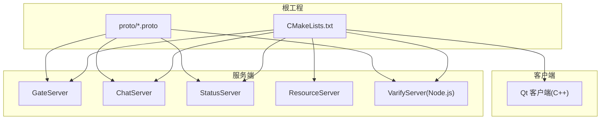
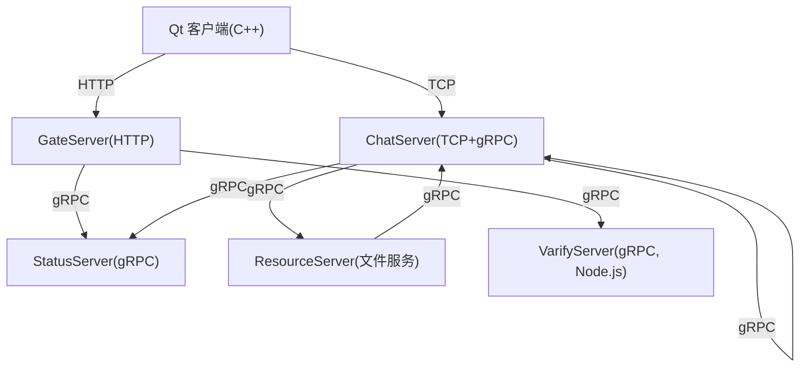
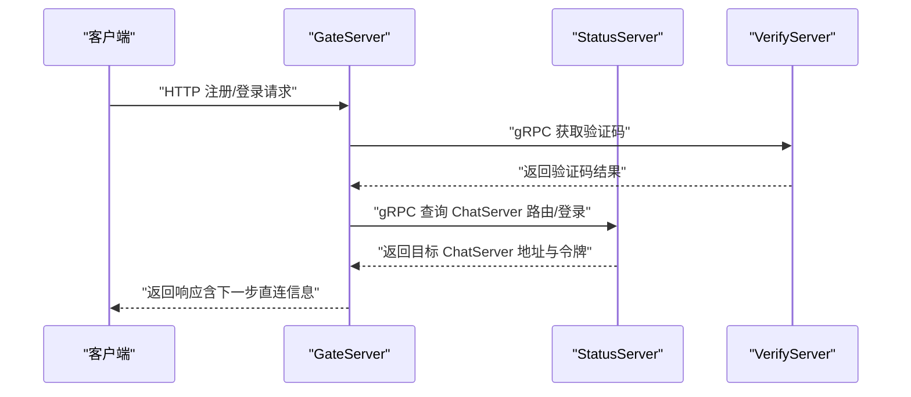
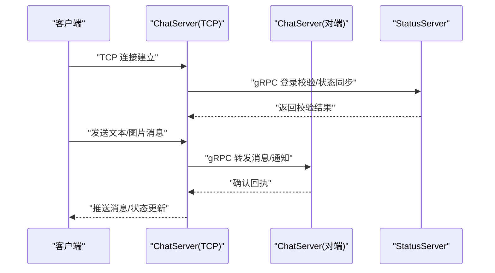
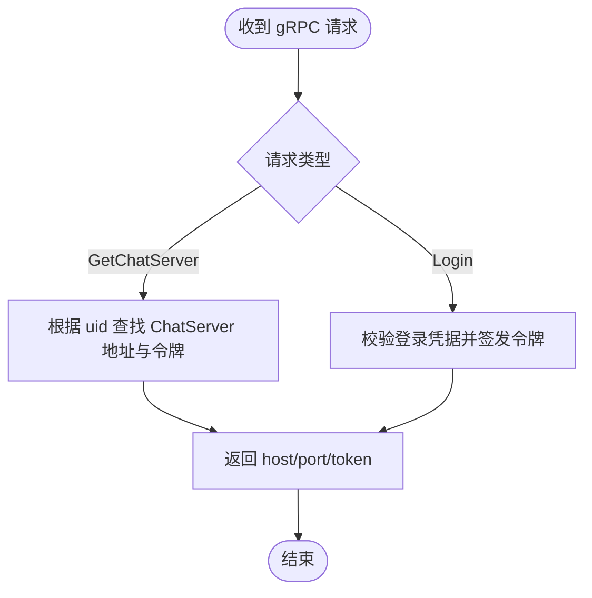
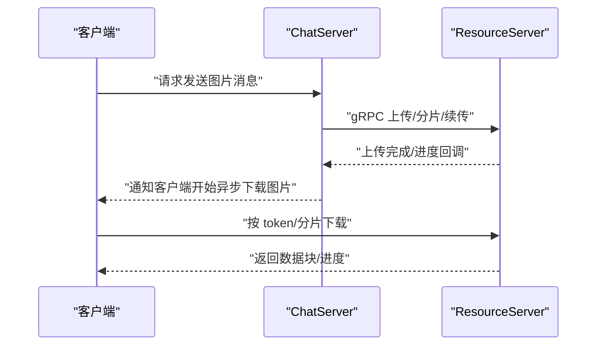
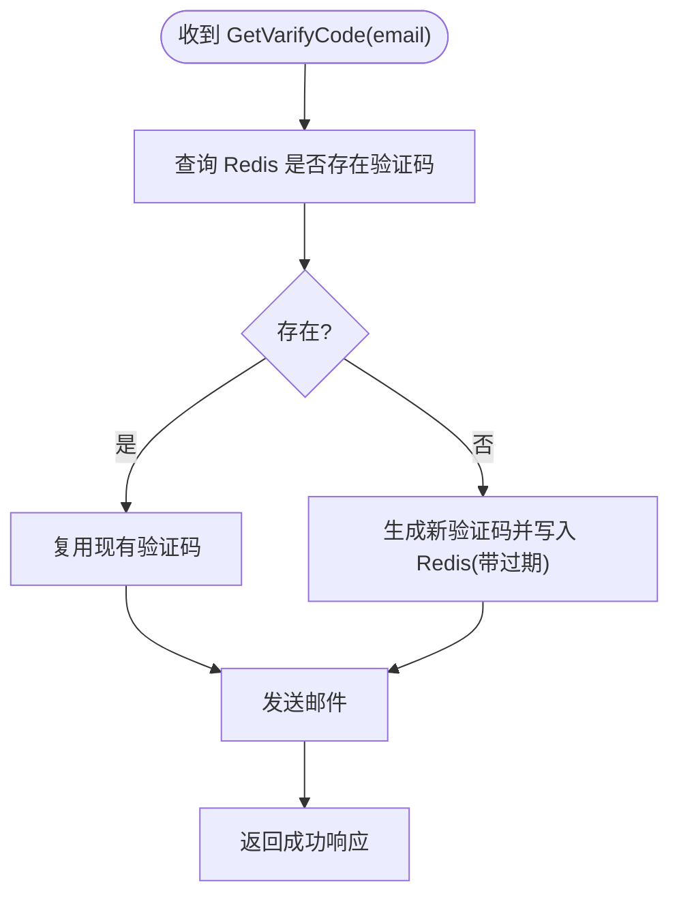
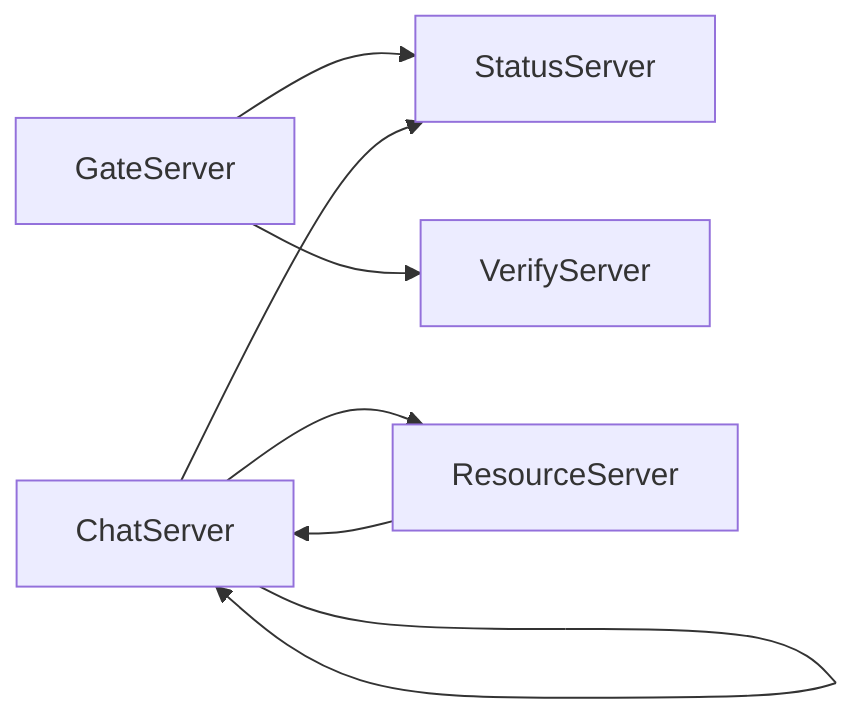

# 系统架构概览

<cite>
**本文引用的文件**   
- [README.md](file://README.md)
- [CMakeLists.txt](file://CMakeLists.txt)
- [chat.proto](file://proto/chat_service/chat.proto)
- [status.proto](file://proto/status_service/status.proto)
- [verify.proto](file://proto/verify_service/verify.proto)
- [GateServer.cpp](file://server/GateServer/src/GateServer.cpp)
- [ChatServer.cpp](file://server/ChatServer/src/ChatServer.cpp)
- [StatusServer.cpp](file://server/StatusServer/src/StatusServer.cpp)
- [ResourceServer.cpp](file://server/ResourceServer/src\ResourceServer.cpp)
- [server.js](file://server/VarifyServer/server.js)
- [config.ini（GateServer）](file://server/GateServer/config/config.ini)
- [chatserver1.ini（ChatServer）](file://server/ChatServer/config/chatserver1.ini)
- [config.ini（客户端）](file://client/llfcchat/config/config.ini)
</cite>

## 目录
1. [简介](#简介)
2. [项目结构](#项目结构)
3. [核心组件](#核心组件)
4. [架构总览](#架构总览)
5. [详细组件分析](#详细组件分析)
6. [依赖关系分析](#依赖关系分析)
7. [性能考量](#性能考量)
8. [故障排查指南](#故障排查指南)
9. [结论](#结论)
10. [附录](#附录)

## 简介
本文件为 LLFCChat 系统的全面架构概览，面向开发者与运维人员，帮助快速理解“客户端-服务器分离”的微服务设计。系统由以下微服务组成：
- GateServer（HTTP 网关）：对外提供 RESTful 接口，统一入口、鉴权、路由与限流等能力。
- ChatServer（聊天核心）：基于 TCP 的实时消息通道，承载会话、好友关系、消息转发等核心逻辑。
- StatusServer（状态管理）：gRPC 服务，负责用户登录、在线状态、ChatServer 路由发现等。
- ResourceServer（资源存储）：文件上传/下载、断点续传、分片与进度回调等。
- VerifyServer（验证码服务）：Node.js 实现的 gRPC 服务，负责邮箱验证码生成与发送。

通信协议分工：
- HTTP：客户端与 GateServer 之间的 REST API。
- gRPC：服务间调用（如 GateServer→StatusServer/VerifyServer，ChatServer↔StatusServer/其他 ChatServer）。
- TCP：客户端与 ChatServer 之间的长连接，用于实时消息推送。

数据流向要点：
- 用户请求先到达 GateServer，再由其根据业务路由到相应服务。
- 登录流程中，GateServer 通过 StatusServer 获取目标 ChatServer 地址与令牌；随后客户端直连 ChatServer 建立 TCP 会话。
- 聊天消息在 ChatServer 之间通过 gRPC 通知转发，图片等资源通过 ResourceServer 异步下载并回调通知。

**章节来源**
- [README.md:1-112](file://README.md#L1-L112)

## 项目结构
仓库采用多子工程组织，顶层 CMake 聚合构建 server 与 client 两个子系统，proto 定义跨语言契约。

**图表来源**
- [CMakeLists.txt:1-34](file://CMakeLists.txt#L1-L34)
- [chat.proto:1-105](file://proto/chat_service/chat.proto#L1-L105)
- [status.proto:1-32](file://proto/status_service/status.proto#L1-L32)
- [verify.proto:1-19](file://proto/verify_service/verify.proto#L1-L19)

**章节来源**
- [CMakeLists.txt:1-34](file://CMakeLists.txt#L1-L34)

## 核心组件
- GateServer（HTTP 网关）
  - 职责：接收客户端 HTTP 请求，校验参数，调用 StatusServer/VerifyServer，返回结果；必要时转发或重定向至 ChatServer。
  - 关键实现：启动 Asio IO 线程池、初始化 Redis/MySQL 管理器、加载配置、监听端口。
- ChatServer（聊天核心）
  - 职责：维护 TCP 长连接、处理消息收发、好友申请/认证、踢人、图片消息通知；通过 gRPC 与其他 ChatServer 实例互通。
  - 关键实现：Asio IOServicePool、TCP Server、gRPC ChatServiceImpl、Redis/MySQL 访问。
- StatusServer（状态管理）
  - 职责：提供 GetChatServer（按 uid 路由到具体 ChatServer）、Login（登录校验与令牌发放）等 gRPC 接口。
  - 关键实现：gRPC Server、Redis/MySQL 访问。
- ResourceServer（资源存储）
  - 职责：文件上传/下载、分片与断点续传、进度上报、与 ChatServer 协作完成图片消息的异步下载通知。
  - 关键实现：Asio IOServicePool、文件系统操作、与 ChatServer 的 gRPC 客户端。
- VerifyServer（验证码服务）
  - 职责：根据邮箱生成唯一验证码并发送邮件，使用 Redis 缓存验证码及过期时间。
  - 关键实现：Node.js + gRPC、Redis、邮件模块。

**章节来源**
- [GateServer.cpp:128-160](file://server/GateServer/src/GateServer.cpp#L128-L160)
- [ChatServer.cpp:20-81](file://server/ChatServer/src/ChatServer.cpp#L20-L81)
- [StatusServer.cpp:17-69](file://server/StatusServer/src/StatusServer.cpp#L17-L69)
- [ResourceServer.cpp:15-42](file://server/ResourceServer/src\ResourceServer.cpp#L15-L42)
- [server.js:15-76](file://server/VarifyServer/server.js#L15-L76)

## 架构总览
下图展示客户端与各服务的交互关系以及协议分工。

**图表来源**
- [chat.proto:1-105](file://proto/chat_service/chat.proto#L1-L105)
- [status.proto:1-32](file://proto/status_service/status.proto#L1-L32)
- [verify.proto:1-19](file://proto/verify_service/verify.proto#L1-L19)
- [GateServer.cpp:128-160](file://server/GateServer/src/GateServer.cpp#L128-L160)
- [ChatServer.cpp:20-81](file://server/ChatServer/src/ChatServer.cpp#L20-L81)
- [StatusServer.cpp:17-69](file://server/StatusServer/src/StatusServer.cpp#L17-L69)
- [ResourceServer.cpp:15-42](file://server/ResourceServer/src\ResourceServer.cpp#L15-L42)
- [server.js:15-76](file://server/VarifyServer/server.js#L15-L76)

## 详细组件分析

### GateServer（HTTP 网关）
- 功能要点
  - 启动 HTTP 服务，解析配置，初始化 Redis/MySQL 管理器。
  - 对外暴露 REST 接口，内部通过 gRPC 调用 StatusServer/VerifyServer。
- 关键流程
  - 主函数初始化 IO 上下文、信号捕获、创建并启动 CServer。
  - 通过配置读取端口并运行事件循环。

**图表来源**
- [GateServer.cpp:128-160](file://server/GateServer/src/GateServer.cpp#L128-L160)
- [status.proto:1-32](file://proto/status_service/status.proto#L1-L32)
- [verify.proto:1-19](file://proto/verify_service/verify.proto#L1-L19)

**章节来源**
- [GateServer.cpp:128-160](file://server/GateServer/src/GateServer.cpp#L128-L160)
- [config.ini（GateServer）:1-25](file://server/GateServer/config/config.ini#L1-L25)

### ChatServer（聊天核心）
- 功能要点
  - 提供 TCP 长连接，处理文本/图片消息、好友申请与认证、踢人等。
  - 通过 gRPC 与其他 ChatServer 实例进行跨节点消息转发与通知。
- 关键流程
  - 启动 Asio IOServicePool，创建 TCP Server，启动定时器。
  - 启动独立的 gRPC 服务线程，注册 ChatServiceImpl。
  - 将 TCP Server 注入 LogicSystem，供后续业务逻辑使用。

**图表来源**
- [ChatServer.cpp:20-81](file://server/ChatServer/src/ChatServer.cpp#L20-L81)
- [chat.proto:1-105](file://proto/chat_service/chat.proto#L1-L105)
- [status.proto:1-32](file://proto/status_service/status.proto#L1-L32)

**章节来源**
- [ChatServer.cpp:20-81](file://server/ChatServer/src/ChatServer.cpp#L20-L81)
- [chatserver1.ini（ChatServer）:1-30](file://server/ChatServer/config/chatserver1.ini#L1-L30)

### StatusServer（状态管理）
- 功能要点
  - 提供 GetChatServer（按 uid 路由到具体 ChatServer）与 Login（登录校验与令牌发放）接口。
- 关键流程
  - 启动 gRPC 服务，绑定端口，注册 StatusServiceImpl。
  - 使用 Asio 捕获信号优雅关闭。

**图表来源**
- [StatusServer.cpp:17-69](file://server/StatusServer/src/StatusServer.cpp#L17-L69)
- [status.proto:1-32](file://proto/status_service/status.proto#L1-L32)

**章节来源**
- [StatusServer.cpp:17-69](file://server/StatusServer/src/StatusServer.cpp#L17-L69)

### ResourceServer（资源存储）
- 功能要点
  - 文件上传/下载、分片与断点续传、进度回调；与 ChatServer 协作完成图片消息的异步下载通知。
- 关键流程
  - 启动 Asio IOServicePool，创建 TCP Server，处理文件相关请求。
  - 通过 gRPC 客户端与 ChatServer 交互，触发客户端侧的资源下载与进度上报。

**图表来源**
- [ResourceServer.cpp:15-42](file://server/ResourceServer/src\ResourceServer.cpp#L15-L42)
- [chat.proto:1-105](file://proto/chat_service/chat.proto#L1-L105)

**章节来源**
- [ResourceServer.cpp:15-42](file://server/ResourceServer/src\ResourceServer.cpp#L15-L42)

### VerifyServer（验证码服务）
- 功能要点
  - 根据邮箱生成唯一验证码，写入 Redis 并设置过期时间，发送邮件。
- 关键流程
  - 启动 gRPC 服务，实现 GetVarifyCode。
  - 从 Redis 读取已有验证码或生成新码，调用邮件模块发送。

**图表来源**
- [server.js:15-76](file://server/VarifyServer/server.js#L15-L76)
- [verify.proto:1-19](file://proto/verify_service/verify.proto#L1-L19)

**章节来源**
- [server.js:15-76](file://server/VarifyServer/server.js#L15-L76)

### 客户端（Qt 客户端）
- 功能要点
  - 通过 HTTP 与 GateServer 交互，通过 TCP 与 ChatServer 建立长连接，处理 UI 与消息渲染。
- 关键配置
  - 配置文件指定 GateServer 的 host/port。

**章节来源**
- [config.ini（客户端）:1-4](file://client/llfcchat/config/config.ini#L1-L4)

## 依赖关系分析
- 服务间依赖
  - GateServer 依赖 StatusServer、VerifyServer（gRPC），可选依赖 ResourceServer（gRPC/TCP）。
  - ChatServer 依赖 StatusServer（gRPC），可与其他 ChatServer 实例通过 gRPC 互通。
  - ResourceServer 依赖 ChatServer（gRPC）以触发客户端下载。
- 外部依赖
  - Redis：验证码缓存、登录计数、分布式锁等。
  - MySQL：用户信息与持久化数据。
  - Boost.Asio：高性能网络 I/O。
  - gRPC：跨语言服务间通信。

**图表来源**
- [chat.proto:1-105](file://proto/chat_service/chat.proto#L1-L105)
- [status.proto:1-32](file://proto/status_service/status.proto#L1-L32)
- [verify.proto:1-19](file://proto/verify_service/verify.proto#L1-L19)

**章节来源**
- [chat.proto:1-105](file://proto/chat_service/chat.proto#L1-L105)
- [status.proto:1-32](file://proto/status_service/status.proto#L1-L32)
- [verify.proto:1-19](file://proto/verify_service/verify.proto#L1-L19)

## 性能考量
- 高并发 I/O
  - 使用 Boost.Asio 的 io_context 与线程池模型，避免阻塞式 I/O。
- 连接复用与心跳
  - TCP 长连接减少握手开销；建议实现心跳保活与超时清理。
- 缓存与热点
  - 利用 Redis 缓存验证码、登录计数、在线状态等热点数据，降低数据库压力。
- 分片与断点续传
  - 大文件分片上传/下载提升稳定性与用户体验。
- 服务解耦
  - gRPC 服务独立部署，便于水平扩展与弹性伸缩。

[本节为通用指导，不直接分析具体文件]

## 故障排查指南
- 常见问题定位
  - 端口冲突：检查各服务配置的 Port/RPCPort 是否被占用。
  - 网络连通性：确认 GateServer/StatusServer/VerifyServer/ChatServer/ResourceServer 的 Host/Port 可达。
  - Redis/MySQL：验证连接参数（Host/Port/User/Passwd/Schema）与服务可用性。
  - gRPC 调用失败：检查 proto 定义一致性、服务地址与权限。
- 日志与调试
  - 观察各服务 main 函数的启动输出与异常堆栈。
  - 关注信号处理（SIGINT/SIGTERM）下的优雅关闭流程。
- 恢复策略
  - 重启服务前确保释放资源（关闭 Redis/MySQL 连接、停止 IO 循环）。
  - 对于分片上传失败，支持断点续传与重试机制。

**章节来源**
- [GateServer.cpp:128-160](file://server/GateServer/src/GateServer.cpp#L128-L160)
- [ChatServer.cpp:20-81](file://server/ChatServer/src/ChatServer.cpp#L20-L81)
- [StatusServer.cpp:17-69](file://server/StatusServer/src/StatusServer.cpp#L17-L69)
- [ResourceServer.cpp:15-42](file://server/ResourceServer/src\ResourceServer.cpp#L15-L42)
- [server.js:15-76](file://server/VarifyServer/server.js#L15-L76)

## 结论
LLFCChat 采用清晰的“客户端-服务器分离”与微服务架构，通过 HTTP/gRPC/TCP 三种协议各司其职，实现了可扩展、易维护的聊天系统。GateServer 作为统一入口，StatusServer 提供路由与状态，ChatServer 承载核心实时通信，ResourceServer 专注文件传输，VerifyServer 提供验证码能力。该设计有助于横向扩展、故障隔离与持续演进。

[本节为总结性内容，不直接分析具体文件]

## 附录
- 配置参考
  - GateServer：HTTP 端口、VerifyServer/StatusServer 地址、MySQL/Redis 连接、ResourceServer 地址。
  - ChatServer：SelfServer 名称/主机/端口、RPC 端口、PeerServer 列表。
  - 客户端：GateServer 的 host/port。

**章节来源**
- [config.ini（GateServer）:1-25](file://server/GateServer/config/config.ini#L1-L25)
- [chatserver1.ini（ChatServer）:1-30](file://server/ChatServer/config/chatserver1.ini#L1-L30)
- [config.ini（客户端）:1-4](file://client/llfcchat/config/config.ini#L1-L4)