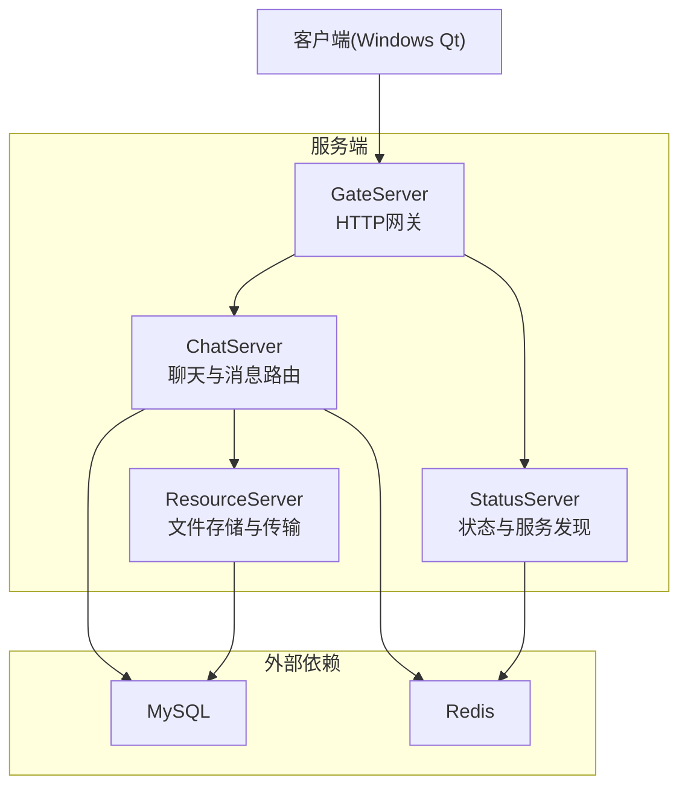
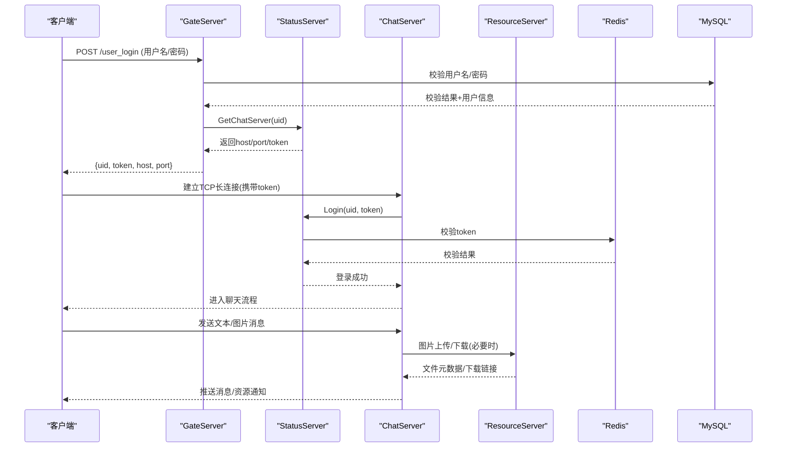
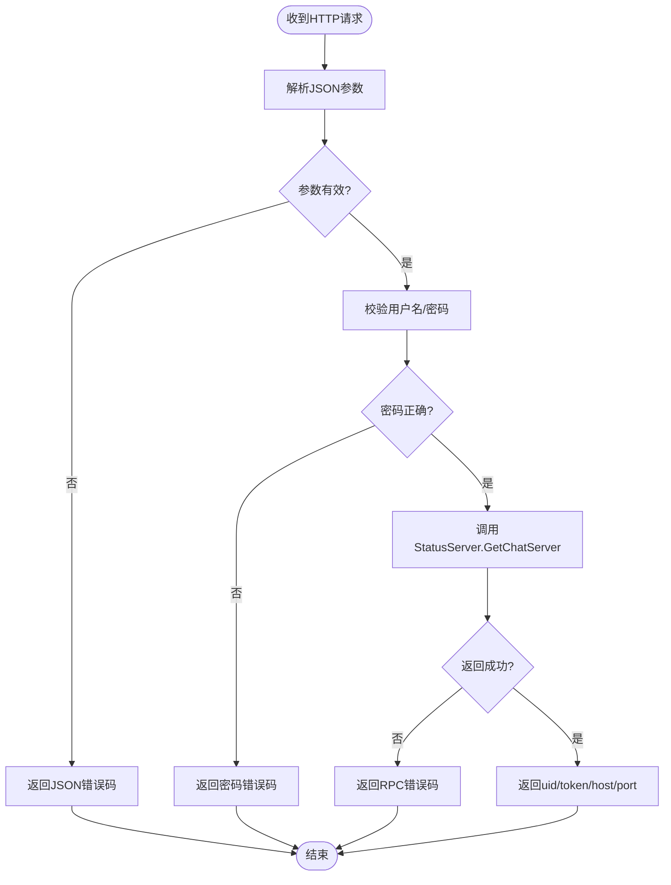
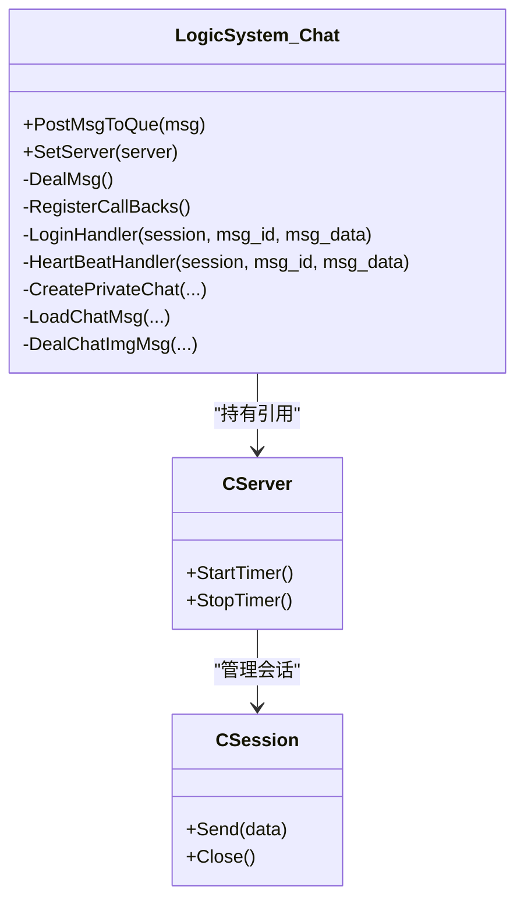
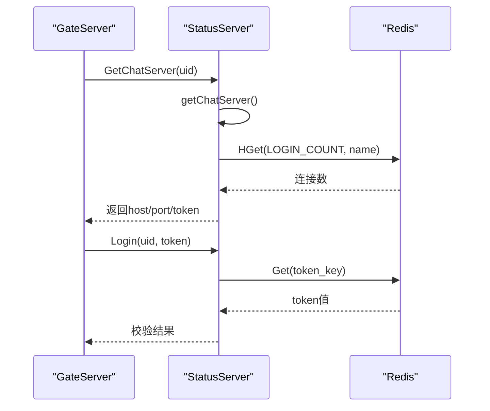
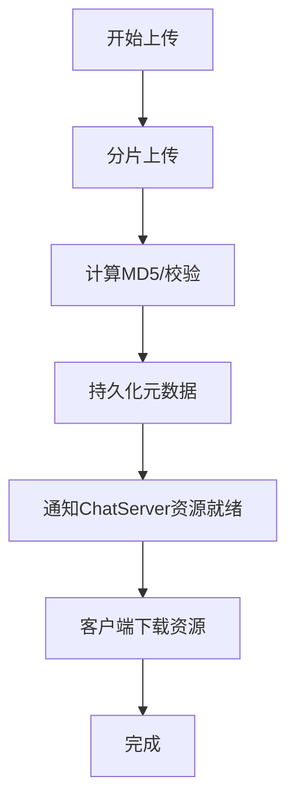
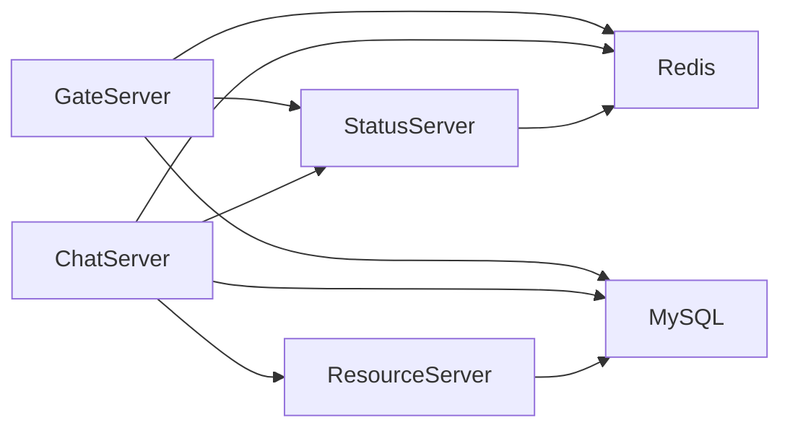

# 微服务架构设计

<cite>
**本文引用的文件**   
- [README.md](file://README.md)
- [CMakeLists.txt](file://CMakeLists.txt)
- [GateServer.cpp](file://server/GateServer/src/GateServer.cpp)
- [LogicSystem.h（Gate）](file://server/GateServer/include/LogicSystem.h)
- [config.ini（Gate）](file://server/GateServer/config/config.ini)
- [ChatServer.cpp](file://server/ChatServer/src/ChatServer.cpp)
- [LogicSystem.h（Chat）](file://server/ChatServer/include/LogicSystem.h)
- [data.h（Chat）](file://server/ChatServer/include/data.h)
- [chatserver1.ini（Chat）](file://server/ChatServer/config/chatserver1.ini)
- [StatusServer.cpp](file://server/StatusServer/src/StatusServer.cpp)
- [StatusServiceImpl.h](file://server/StatusServer/include/StatusServiceImpl.h)
- [StatusServiceImpl.cpp](file://server/StatusServer/src/StatusServiceImpl.cpp)
- [ResourceServer.cpp](file://server/ResourceServer/src\ResourceServer.cpp)
- [LogicSystem.h（Resource）](file://server/ResourceServer/include\LogicSystem.h)
- [message.proto（chat）](file://server/proto/chat/message.proto)
- [message.proto（control）](file://server/proto/control/message.proto)
- [message.proto（resource）](file://server/proto/resource/message.proto)
- [day27-分布式服务设计.md](file://开发文档/day27-分布式服务设计.md)
- [day35心跳逻辑.md](file://开发文档/day35心跳逻辑.md)
</cite>

## 目录
1. [引言](#引言)
2. [项目结构](#项目结构)
3. [核心组件](#核心组件)
4. [架构总览](#架构总览)
5. [详细组件分析](#详细组件分析)
6. [依赖关系分析](#依赖关系分析)
7. [性能与扩展性](#性能与扩展性)
8. [故障排查指南](#故障排查指南)
9. [结论](#结论)
10. [附录：接口与配置规范](#附录接口与配置规范)

## 引言
本设计文档面向LLFCChat系统的微服务架构，围绕四大核心服务进行职责划分与协作机制说明：
- GateServer：HTTP网关，负责用户认证、请求路由与Token分发。
- ChatServer：聊天业务与消息路由，维护长连接、会话管理与消息转发。
- StatusServer：状态管理与服务发现，提供负载均衡选择与登录校验。
- ResourceServer：文件存储与传输，处理图片、音视频等资源的上传下载。

系统采用C++实现后端服务，使用gRPC作为服务间通信协议，Redis用于缓存与会话状态，MySQL用于持久化数据，Boost.Asio驱动高并发网络I/O。通过分布式设计与心跳检测，实现多实例ChatServer的负载均衡与在线踢人能力。

## 项目结构
仓库采用分层与按服务划分的组织方式：
- server：包含GateServer、ChatServer、StatusServer、ResourceServer四个独立服务，以及共享的proto定义与公共工具。
- client：Qt客户端工程，负责UI与网络交互。
- cmake：构建脚本与gRPC代码生成配置。
- 开发文档：系列开发日志，涵盖分布式、心跳、断点续传等主题。

图表来源
- [CMakeLists.txt:1-34](file://CMakeLists.txt#L1-L34)
- [README.md:1-112](file://README.md#L1-L112)

章节来源
- [CMakeLists.txt:1-34](file://CMakeLists.txt#L1-L34)
- [README.md:1-112](file://README.md#L1-L112)

## 核心组件
- GateServer
  - HTTP入口，解析JSON请求，调用数据库验证用户名密码，查询StatusServer获取目标ChatServer地址与Token，返回给客户端建立长连接。
  - 使用AsioIOServicePool管理异步I/O，ConfigMgr加载配置，MysqlMgr/RedisMgr访问持久化与缓存。
- ChatServer
  - 基于Boost.Asio的TCP服务器，维护会话与消息队列，处理登录、好友申请、文本/图片消息、心跳与踢人。
  - 启动gRPC服务暴露ChatService，供其他ChatServer或ResourceServer跨进程调用。
  - 启动时向Redis注册自身名称与初始连接计数，退出时清理。
- StatusServer
  - gRPC服务，维护ChatServer列表与连接数，根据最小连接数策略返回目标ChatServer信息。
  - 提供Login接口校验Token有效性，并支持Token插入与查询。
- ResourceServer
  - TCP服务，处理文件分片上传、断点续传、MD5校验与元数据管理，配合ChatServer完成图片/文件的异步通知与下载。

章节来源
- [GateServer.cpp:131-163](file://server/GateServer/src/GateServer.cpp#L131-L163)
- [LogicSystem.h（Gate）:1-24](file://server/GateServer/include/LogicSystem.h#L1-L24)
- [ChatServer.cpp:20-81](file://server/ChatServer/src/ChatServer.cpp#L20-L81)
- [LogicSystem.h（Chat）:1-61](file://server/ChatServer/include/LogicSystem.h#L1-L61)
- [StatusServer.cpp:20-72](file://server/StatusServer/src/StatusServer.cpp#L20-L72)
- [StatusServiceImpl.h:1-52](file://server/StatusServer/include/StatusServiceImpl.h#L1-L52)
- [StatusServiceImpl.cpp:55-123](file://server/StatusServer/src/StatusServiceImpl.cpp#L55-L123)
- [ResourceServer.cpp:15-42](file://server/ResourceServer/src\ResourceServer.cpp#L15-L42)
- [LogicSystem.h（Resource）:1-34](file://server/ResourceServer/include\LogicSystem.h#L1-L34)

## 架构总览
整体采用“HTTP网关 + gRPC内部服务”的分层架构：
- 客户端通过HTTP与GateServer交互完成认证与路由；
- 客户端随后与目标ChatServer建立TCP长连接进行实时通信；
- ChatServer之间通过gRPC进行跨实例消息转发与事件通知；
- StatusServer集中管理服务发现与负载均衡；
- ResourceServer提供文件存取能力，被ChatServer按需调用。

图表来源
- [GateServer.cpp:131-163](file://server/GateServer/src/GateServer.cpp#L131-L163)
- [ChatServer.cpp:20-81](file://server/ChatServer/src/ChatServer.cpp#L20-L81)
- [StatusServer.cpp:20-72](file://server/StatusServer/src/StatusServer.cpp#L20-L72)
- [StatusServiceImpl.cpp:55-123](file://server/StatusServer/src/StatusServiceImpl.cpp#L55-L123)
- [message.proto（chat）:19-44](file://server/proto/chat/message.proto#L19-L44)

## 详细组件分析

### GateServer（HTTP网关）
- 职责
  - 接收HTTP请求，解析JSON参数，校验用户凭据。
  - 调用StatusServer获取目标ChatServer的地址与Token。
  - 将路由信息返回给客户端，以便后续直连ChatServer。
- 关键实现要点
  - 使用AsioIOServicePool进行异步I/O处理。
  - LogicSystem提供GET/POST处理器注册与分发。
  - MysqlMgr/RedisMgr分别访问数据库与缓存。
- 错误处理
  - JSON解析失败、密码不匹配、RPC调用异常均返回统一错误码。

图表来源
- [LogicSystem.h（Gate）:1-24](file://server/GateServer/include/LogicSystem.h#L1-L24)
- [GateServer.cpp:131-163](file://server/GateServer/src/GateServer.cpp#L131-L163)

章节来源
- [LogicSystem.h（Gate）:1-24](file://server/GateServer/include/LogicSystem.h#L1-L24)
- [GateServer.cpp:131-163](file://server/GateServer/src/GateServer.cpp#L131-L163)

### ChatServer（聊天与消息路由）
- 职责
  - 维护TCP长连接，处理登录、好友申请、文本/图片消息、心跳与踢人。
  - 启动gRPC服务暴露ChatService，支持跨实例消息转发。
  - 启动时向Redis注册自身名称与连接计数，退出时清理。
- 关键实现要点
  - AsioIOServicePool与CServer/CSession管理连接生命周期。
  - LogicSystem维护消息队列与回调分发。
  - data.h定义用户、线程、消息等数据结构。
- 负载均衡与心跳
  - 通过Redis记录各ChatServer的连接数，StatusServer据此选择最小负载实例。
  - 心跳超时触发踢人逻辑，保证单账号单端在线。

图表来源
- [LogicSystem.h（Chat）:1-61](file://server/ChatServer/include/LogicSystem.h#L1-L61)
- [ChatServer.cpp:20-81](file://server/ChatServer/src/ChatServer.cpp#L20-L81)

章节来源
- [LogicSystem.h（Chat）:1-61](file://server/ChatServer/include/LogicSystem.h#L1-L61)
- [ChatServer.cpp:20-81](file://server/ChatServer/src/ChatServer.cpp#L20-L81)
- [data.h（Chat）:1-65](file://server/ChatServer/include/data.h#L1-L65)

### StatusServer（状态与服务发现）
- 职责
  - 维护ChatServer列表与连接数，提供GetChatServer接口进行负载均衡选择。
  - 提供Login接口校验Token有效性，支持Token插入与查询。
- 关键实现要点
  - gRPC服务实现StatusServiceImpl。
  - Redis用于Token存储与连接计数统计。
  - 最小连接数策略优先分配空闲实例。

图表来源
- [StatusServer.cpp:20-72](file://server/StatusServer/src/StatusServer.cpp#L20-L72)
- [StatusServiceImpl.h:1-52](file://server/StatusServer/include/StatusServiceImpl.h#L1-L52)
- [StatusServiceImpl.cpp:55-123](file://server/StatusServer/src/StatusServiceImpl.cpp#L55-L123)

章节来源
- [StatusServer.cpp:20-72](file://server/StatusServer/src/StatusServer.cpp#L20-L72)
- [StatusServiceImpl.h:1-52](file://server/StatusServer/include/StatusServiceImpl.h#L1-L52)
- [StatusServiceImpl.cpp:55-123](file://server/StatusServer/src/StatusServiceImpl.cpp#L55-L123)

### ResourceServer（文件存储与传输）
- 职责
  - 处理文件分片上传、断点续传、MD5校验与元数据管理。
  - 为ChatServer提供文件下载接口，支持大文件高效传输。
- 关键实现要点
  - LogicSystem维护文件信息与Worker线程池。
  - 文件系统与数据库协同存储文件元数据与内容。
  - 与ChatServer通过gRPC或HTTP协作完成资源通知与下载。

图表来源
- [ResourceServer.cpp:15-42](file://server/ResourceServer/src\ResourceServer.cpp#L15-L42)
- [LogicSystem.h（Resource）:1-34](file://server/ResourceServer/include\LogicSystem.h#L1-L34)

章节来源
- [ResourceServer.cpp:15-42](file://server/ResourceServer/src\ResourceServer.cpp#L15-L42)
- [LogicSystem.h（Resource）:1-34](file://server/ResourceServer/include\LogicSystem.h#L1-L34)

## 依赖关系分析
- 服务间依赖
  - GateServer依赖StatusServer与MySQL/Redis。
  - ChatServer依赖StatusServer、Redis、MySQL，并通过gRPC与ResourceServer交互。
  - StatusServer依赖Redis。
  - ResourceServer依赖MySQL与文件系统。
- 通信协议
  - 客户端到GateServer：HTTP/JSON。
  - 客户端到ChatServer：TCP长连接（自定义协议）。
  - 服务间：gRPC（protobuf定义）。
- 负载均衡
  - StatusServer基于Redis中的连接计数选择最小负载ChatServer。
  - ChatServer启动时初始化计数为0，心跳更新计数。

图表来源
- [config.ini（Gate）:1-25](file://server/GateServer/config/config.ini#L1-L25)
- [chatserver1.ini（Chat）:1-30](file://server/ChatServer/config/chatserver1.ini#L1-L30)
- [message.proto（chat）:19-44](file://server/proto/chat/message.proto#L19-L44)

章节来源
- [config.ini（Gate）:1-25](file://server/GateServer/config/config.ini#L1-L25)
- [chatserver1.ini（Chat）:1-30](file://server/ChatServer/config/chatserver1.ini#L1-L30)
- [message.proto（chat）:19-44](file://server/proto/chat/message.proto#L19-L44)

## 性能与扩展性
- I/O模型
  - 全部服务基于Boost.Asio的异步I/O，结合线程池提升吞吐。
- 缓存与持久化
  - Redis用于高频读写的Token与连接计数，降低数据库压力。
  - MySQL用于用户、消息、文件元数据的持久化。
- 可扩展性
  - ChatServer可水平扩展，StatusServer动态感知实例数量与负载。
  - ResourceServer可独立扩容，支持分布式文件存储方案演进。
- 负载均衡策略
  - 最小连接数策略简单有效，适合聊天场景的短时连接波动。
  - 可通过加权或健康检查进一步优化。

[本节为通用指导，无需特定文件引用]

## 故障排查指南
- 常见问题
  - Redis连接失败：检查端口、密码与网络连通性。
  - MySQL连接失败：检查主机、端口、用户名与密码。
  - gRPC调用失败：确认服务监听地址与端口，检查防火墙。
  - Token无效：检查StatusServer的Login流程与Redis中Token是否存在。
- 定位方法
  - 查看服务启动日志，确认端口绑定与依赖服务连接状态。
  - 检查Redis键空间，确认LOGIN_COUNT与Token键值对。
  - 使用网络抓包工具验证HTTP/gRPC请求与响应。

章节来源
- [GateServer.cpp:131-163](file://server/GateServer/src/GateServer.cpp#L131-L163)
- [StatusServiceImpl.cpp:55-123](file://server/StatusServer/src/StatusServiceImpl.cpp#L55-L123)

## 结论
LLFCChat的微服务架构清晰分离了网关、聊天、状态与资源四大职责，通过gRPC与Redis实现高效的服务间通信与状态同步。最小连接数负载均衡与心跳机制保障了系统的可用性与一致性。未来可进一步引入服务网格、配置中心与监控告警体系，提升运维效率与系统韧性。

[本节为总结性内容，无需特定文件引用]

## 附录：接口与配置规范
- Proto接口定义
  - chat/message.proto：定义验证码、状态服务、聊天服务等接口与消息结构。
  - control/message.proto：控制面相关接口（与chat类似，侧重控制流）。
  - resource/message.proto：资源服务相关接口（与chat类似，侧重文件传输）。
- 配置文件
  - GateServer/config/config.ini：定义Gate、Verify、Status、MySQL、Redis、ResServer等连接信息。
  - ChatServer/config/chatserver1.ini：定义SelfServer、PeerServer、MySQL、Redis等连接信息。
- 部署拓扑
  - 建议将GateServer与StatusServer部署在公网可达节点，ChatServer与ResourceServer部署在内网，通过反向代理暴露必要端口。

章节来源
- [message.proto（chat）:1-167](file://server/proto/chat/message.proto#L1-L167)
- [message.proto（control）:1-143](file://server/proto/control/message.proto#L1-L143)
- [message.proto（resource）:1-169](file://server/proto/resource/message.proto#L1-L169)
- [config.ini（Gate）:1-25](file://server/GateServer/config/config.ini#L1-L25)
- [chatserver1.ini（Chat）:1-30](file://server/ChatServer/config/chatserver1.ini#L1-L30)