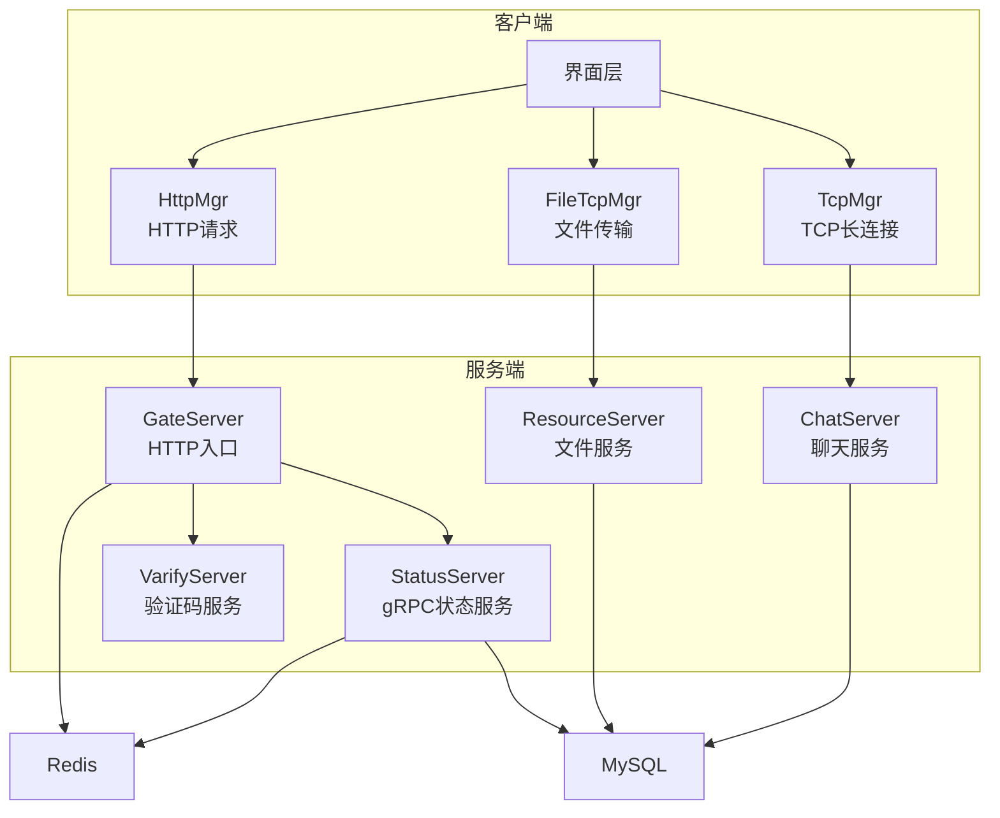
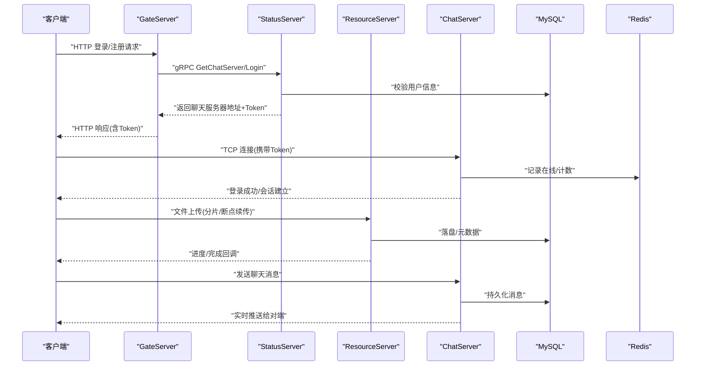
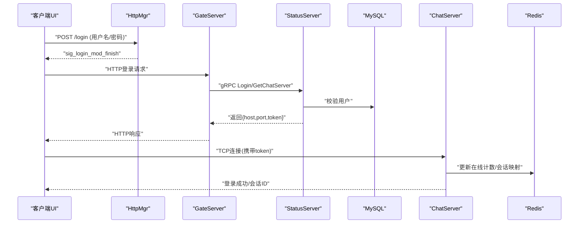
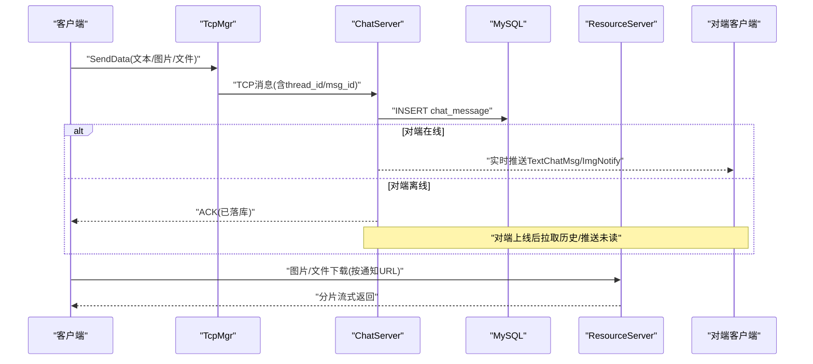
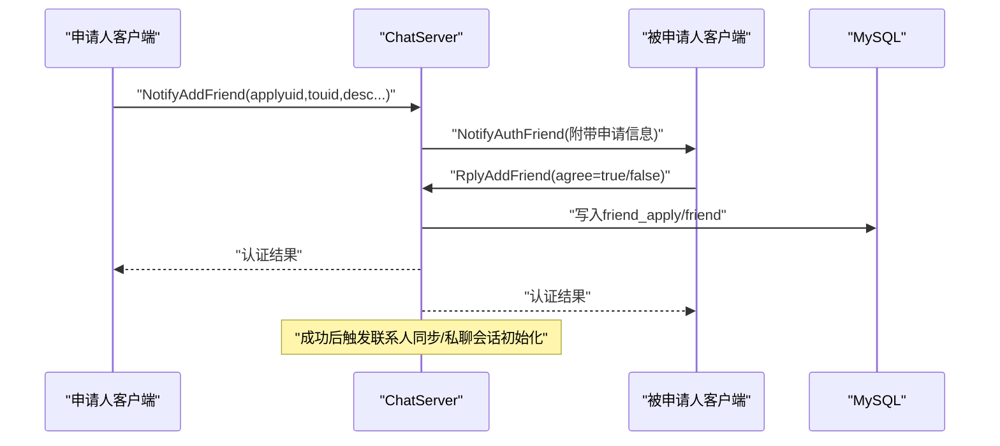
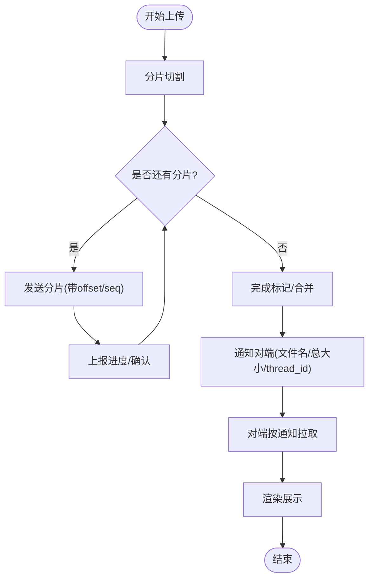
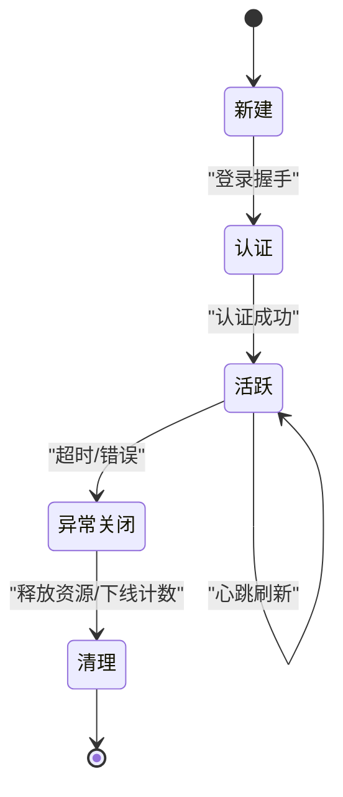
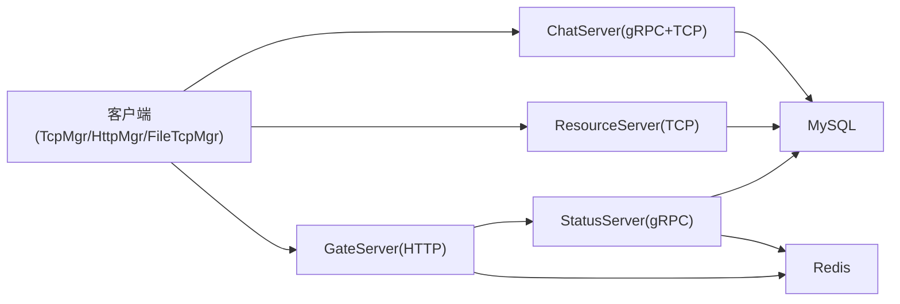
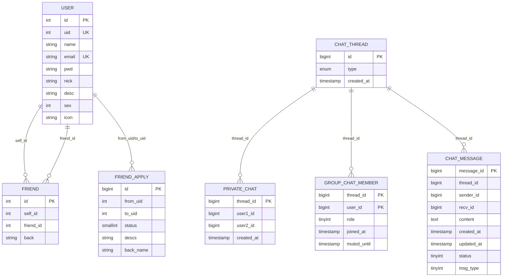

# 数据流设计

<cite>
**本文引用的文件**   
- [README.md](file://README.md)
- [main.cpp](file://client/llfcchat/src/main.cpp)
- [tcpmgr.h](file://client/llfcchat/include/tcpmgr.h)
- [tcpmgr.cpp](file://client/llfcchat/src/tcpmgr.cpp)
- [httpmgr.h](file://client/llfcchat/include/httpmgr.h)
- [httpmgr.cpp](file://client/llfcchat/src/httpmgr.cpp)
- [filetcpmgr.h](file://client/llfcchat/include/filetcpmgr.h)
- [ChatServer.cpp](file://server/ChatServer/src/ChatServer.cpp)
- [CSession.h](file://server/ChatServer/include/CSession.h)
- [UserMgr.h](file://server/ChatServer/include/UserMgr.h)
- [GateServer.cpp](file://server/GateServer/src/GateServer.cpp)
- [ResourceServer.cpp](file://server/ResourceServer/src/ResourceServer.cpp)
- [StatusServer.cpp](file://server/StatusServer/src/StatusServer.cpp)
- [FileWorker.h](file://server/ResourceServer/include/FileWorker.h)
- [message.proto（聊天）](file://server/proto/chat/message.proto)
- [message.proto（控制）](file://server/proto/control/message.proto)
- [message.proto（资源）](file://server/proto/resource/message.proto)
- [llfc.sql](file://sql备份/llfc.sql)
</cite>

## 目录
1. [引言](#引言)
2. [项目结构](#项目结构)
3. [核心组件](#核心组件)
4. [架构总览](#架构总览)
5. [详细组件分析](#详细组件分析)
6. [依赖关系分析](#依赖关系分析)
7. [性能考虑](#性能考虑)
8. [故障排查指南](#故障排查指南)
9. [结论](#结论)
10. [附录](#附录)

## 引言
本文件面向LLFCChat系统的数据流设计，聚焦以下关键流程：
- 用户登录认证的数据流向（客户端HTTP→网关→状态服务→聊天服务器）
- 聊天消息的发送与接收（路由、持久化、实时推送）
- 好友关系的建立与维护（申请、认证、联系人同步）
- 文件传输的数据流（分片上传、进度同步、断点续传）
并配套数据流图、序列图与状态转换图，说明一致性保证、缓存策略与性能优化方案。

## 项目结构
- 客户端（Qt/C++）
  - HTTP管理模块：封装HTTP请求与响应分发
  - TCP管理模块：长连接收发、粘包处理、消息路由
  - 文件传输模块：独立线程与拥塞控制、断点续传
- 服务端（C++/Asio + gRPC）
  - GateServer：HTTP入口，鉴权与路由
  - StatusServer：gRPC状态服务（获取聊天服务器地址、登录校验）
  - ChatServer：聊天业务（会话、心跳、消息转发、离线通知）
  - ResourceServer：文件上传下载、分片与断点续传
  - VarifyServer（Node.js）：验证码等辅助能力
- 协议定义（proto）
  - chat/control/resource 三套消息定义，覆盖登录、聊天、好友、图片通知等
- 数据库（MySQL）
  - 用户、好友、申请、聊天会话与消息表结构

图表来源
- [main.cpp:1-44](file://client/llfcchat/src/main.cpp#L1-L44)
- [GateServer.cpp:131-163](file://server/GateServer/src/GateServer.cpp#L131-L163)
- [StatusServer.cpp:20-72](file://server/StatusServer/src/StatusServer.cpp#L20-L72)
- [ChatServer.cpp:20-81](file://server/ChatServer/src/ChatServer.cpp#L20-L81)
- [ResourceServer.cpp:15-42](file://server/ResourceServer/src/ResourceServer.cpp#L15-L42)

章节来源
- [README.md:1-112](file://README.md#L1-L112)

## 核心组件
- 客户端
  - HttpMgr：统一HTTP POST封装，按模块分发完成信号
  - TcpMgr：基于QTcpSocket的粘包/拆包、异步读写、消息分发
  - FileTcpMgr：独立文件传输通道，支持断点续传与进度回调
- 服务端
  - GateServer：HTTP接入、鉴权、路由到状态或资源服务
  - StatusServer：gRPC接口提供GetChatServer与Login
  - ChatServer：会话管理、心跳、消息转发、离线通知
  - ResourceServer：文件分片上传、下载、断点续传、进度上报
  - 存储：MySQL（持久化）、Redis（缓存/分布式锁/在线计数）

章节来源
- [httpmgr.h:1-34](file://client/llfcchat/include/httpmgr.h#L1-L34)
- [httpmgr.cpp:1-62](file://client/llfcchat/src/httpmgr.cpp#L1-L62)
- [tcpmgr.h:1-90](file://client/llfcchat/include/tcpmgr.h#L1-L90)
- [tcpmgr.cpp:1-200](file://client/llfcchat/src/tcpmgr.cpp#L1-L200)
- [filetcpmgr.h:1-85](file://client/llfcchat/include/filetcpmgr.h#L1-L85)
- [GateServer.cpp:131-163](file://server/GateServer/src/GateServer.cpp#L131-L163)
- [StatusServer.cpp:20-72](file://server/StatusServer/src/StatusServer.cpp#L20-L72)
- [ChatServer.cpp:20-81](file://server/ChatServer/src/ChatServer.cpp#L20-L81)
- [ResourceServer.cpp:15-42](file://server/ResourceServer/src/ResourceServer.cpp#L15-L42)

## 架构总览
系统采用“HTTP入口 + gRPC状态 + 长连接聊天 + 独立文件通道”的分层架构。客户端通过HTTP完成注册/登录前置流程，再由状态服务返回聊天服务器地址与令牌；随后建立TCP长连接进行实时通信；大文件走独立文件通道，避免阻塞聊天通道。

图表来源
- [GateServer.cpp:131-163](file://server/GateServer/src/GateServer.cpp#L131-L163)
- [StatusServer.cpp:20-72](file://server/StatusServer/src/StatusServer.cpp#L20-L72)
- [ChatServer.cpp:20-81](file://server/ChatServer/src/ChatServer.cpp#L20-L81)
- [ResourceServer.cpp:15-42](file://server/ResourceServer/src/ResourceServer.cpp#L15-L42)
- [message.proto（聊天）:1-167](file://server/proto/chat/message.proto#L1-L167)

## 详细组件分析

### 登录认证数据流
- 客户端发起HTTP登录请求至GateServer
- GateServer调用StatusServer的gRPC接口进行校验，并查询/生成Token
- 状态服务返回目标ChatServer的地址与端口及Token
- 客户端使用Token建立TCP长连接到ChatServer，完成登录握手
- ChatServer维护会话、心跳、在线计数（Redis）

图表来源
- [httpmgr.cpp:1-62](file://client/llfcchat/src/httpmgr.cpp#L1-L62)
- [GateServer.cpp:131-163](file://server/GateServer/src/GateServer.cpp#L131-L163)
- [StatusServer.cpp:20-72](file://server/StatusServer/src/StatusServer.cpp#L20-L72)
- [ChatServer.cpp:20-81](file://server/ChatServer/src/ChatServer.cpp#L20-L81)
- [message.proto（聊天）:30-44](file://server/proto/chat/message.proto#L30-L44)

章节来源
- [httpmgr.h:1-34](file://client/llfcchat/include/httpmgr.h#L1-L34)
- [httpmgr.cpp:1-62](file://client/llfcchat/src/httpmgr.cpp#L1-L62)
- [GateServer.cpp:131-163](file://server/GateServer/src/GateServer.cpp#L131-L163)
- [StatusServer.cpp:20-72](file://server/StatusServer/src/StatusServer.cpp#L20-L72)
- [ChatServer.cpp:20-81](file://server/ChatServer/src/ChatServer.cpp#L20-L81)
- [message.proto（聊天）:30-44](file://server/proto/chat/message.proto#L30-L44)

### 聊天消息发送与接收
- 客户端通过TcpMgr将消息序列化后写入TCP队列
- ChatServer解析消息头/体，路由到业务逻辑，持久化到MySQL
- 若对端在线，则通过其会话直接推送；否则入队等待上线后推送
- 图片类消息先由ResourceServer落盘，再经ChatServer下发通知，客户端按需拉取

图表来源
- [tcpmgr.cpp:1-200](file://client/llfcchat/src/tcpmgr.cpp#L1-L200)
- [message.proto（聊天）:107-127](file://server/proto/chat/message.proto#L107-L127)
- [message.proto（聊天）:138-156](file://server/proto/chat/message.proto#L138-L156)
- [llfc.sql:24-37](file://sql备份/llfc.sql#L24-L37)

章节来源
- [tcpmgr.h:1-90](file://client/llfcchat/include/tcpmgr.h#L1-L90)
- [tcpmgr.cpp:1-200](file://client/llfcchat/src/tcpmgr.cpp#L1-L200)
- [message.proto（聊天）:107-127](file://server/proto/chat/message.proto#L107-L127)
- [message.proto（聊天）:138-156](file://server/proto/chat/message.proto#L138-L156)
- [llfc.sql:24-37](file://sql备份/llfc.sql#L24-L37)

### 好友关系建立与维护
- 申请：客户端向ChatServer发送AddFriendReq
- 认证：对端收到NotifyAuthFriend，可同意/拒绝
- 结果：双方同步联系人列表，必要时创建私聊会话

图表来源
- [message.proto（聊天）:46-72](file://server/proto/chat/message.proto#L46-L72)
- [message.proto（聊天）:95-105](file://server/proto/chat/message.proto#L95-L105)
- [llfc.sql:295-304](file://sql备份/llfc.sql#L295-L304)
- [llfc.sql:180-187](file://sql备份/llfc.sql#L180-L187)

章节来源
- [message.proto（聊天）:46-72](file://server/proto/chat/message.proto#L46-L72)
- [message.proto（聊天）:95-105](file://server/proto/chat/message.proto#L95-L105)
- [llfc.sql:295-304](file://sql备份/llfc.sql#L295-L304)
- [llfc.sql:180-187](file://sql备份/llfc.sql#L180-L187)

### 文件传输数据流（分片上传、进度同步、断点续传）
- 客户端将大文件切分为固定大小分片，逐片上传至ResourceServer
- 服务端记录每个分片的偏移量，支持断点续传
- 上传完成后，ChatServer向对端下发图片/文件通知，包含文件名与总大小
- 客户端根据通知拉取文件，显示进度，完成后渲染展示

图表来源
- [filetcpmgr.h:1-85](file://client/llfcchat/include/filetcpmgr.h#L1-L85)
- [FileWorker.h:14-56](file://server/ResourceServer/include/FileWorker.h#L14-L56)
- [message.proto（聊天）:138-156](file://server/proto/chat/message.proto#L138-L156)

章节来源
- [filetcpmgr.h:1-85](file://client/llfcchat/include/filetcpmgr.h#L1-L85)
- [FileWorker.h:14-56](file://server/ResourceServer/include/FileWorker.h#L14-L56)
- [message.proto（聊天）:138-156](file://server/proto/chat/message.proto#L138-L156)

### 会话与心跳状态机
- 会话生命周期：新建→认证→活跃→心跳保活→异常关闭→清理
- 心跳过期判定与恢复机制保障连接可靠性

图表来源
- [CSession.h:28-76](file://server/ChatServer/include/CSession.h#L28-L76)
- [ChatServer.cpp:20-81](file://server/ChatServer/src/ChatServer.cpp#L20-L81)

章节来源
- [CSession.h:28-76](file://server/ChatServer/include/CSession.h#L28-L76)
- [ChatServer.cpp:20-81](file://server/ChatServer/src/ChatServer.cpp#L20-L81)

## 依赖关系分析
- 客户端依赖
  - Qt网络栈（QNetworkAccessManager、QTcpSocket）
  - 自定义管理器（HttpMgr/TcpMgr/FileTcpMgr）
- 服务端依赖
  - Boost.Asio（高性能I/O）
  - gRPC（跨进程服务通信）
  - MySQL（持久化）
  - Redis（缓存/在线计数/分布式锁）
- 协议依赖
  - proto定义统一了各服务间消息契约

图表来源
- [tcpmgr.h:1-90](file://client/llfcchat/include/tcpmgr.h#L1-L90)
- [httpmgr.h:1-34](file://client/llfcchat/include/httpmgr.h#L1-L34)
- [filetcpmgr.h:1-85](file://client/llfcchat/include/filetcpmgr.h#L1-L85)
- [GateServer.cpp:131-163](file://server/GateServer/src/GateServer.cpp#L131-L163)
- [StatusServer.cpp:20-72](file://server/StatusServer/src/StatusServer.cpp#L20-L72)
- [ChatServer.cpp:20-81](file://server/ChatServer/src/ChatServer.cpp#L20-L81)
- [ResourceServer.cpp:15-42](file://server/ResourceServer/src/ResourceServer.cpp#L15-L42)

章节来源
- [tcpmgr.h:1-90](file://client/llfcchat/include/tcpmgr.h#L1-L90)
- [httpmgr.h:1-34](file://client/llfcchat/include/httpmgr.h#L1-L34)
- [filetcpmgr.h:1-85](file://client/llfcchat/include/filetcpmgr.h#L1-L85)
- [GateServer.cpp:131-163](file://server/GateServer/src/GateServer.cpp#L131-L163)
- [StatusServer.cpp:20-72](file://server/StatusServer/src/StatusServer.cpp#L20-L72)
- [ChatServer.cpp:20-81](file://server/ChatServer/src/ChatServer.cpp#L20-L81)
- [ResourceServer.cpp:15-42](file://server/ResourceServer/src/ResourceServer.cpp#L15-L42)

## 性能考虑
- I/O模型
  - 服务端采用Boost.Asio事件驱动，单进程多线程IO池，降低上下文切换开销
  - 客户端使用Qt异步网络API，避免阻塞UI线程
- 消息编解码
  - 头部定长（消息ID+长度），解决粘包/半包问题，提升解析效率
- 存储优化
  - 聊天消息表按thread_id与时间戳建索引，加速分页与倒序加载
  - Redis缓存热点数据（如在线计数、会话映射、验证码）
- 并发与限流
  - 文件上传引入拥塞窗口控制，避免突发流量打满带宽
  - 分布式锁用于多实例下的互斥操作（如分片合并）
- 资源分离
  - 文件通道与聊天通道分离，避免大文件阻塞即时消息

[本节为通用性能建议，不直接分析具体文件]

## 故障排查指南
- 登录失败
  - 检查GateServer到StatusServer的gRPC连通性
  - 核对MySQL用户信息与Redis中的Token状态
- 聊天消息丢失
  - 核查ChatServer会话是否存在、心跳是否正常
  - 检查MySQL写入是否成功、索引是否命中
- 文件上传中断
  - 确认分片序号与偏移量一致，服务端是否记录断点
  - 检查ResourceServer磁盘空间与权限
- 连接断开
  - 客户端侧检查网络错误码与重连逻辑
  - 服务端侧检查会话清理与Redis计数一致性

章节来源
- [tcpmgr.cpp:1-200](file://client/llfcchat/src/tcpmgr.cpp#L1-L200)
- [CSession.h:28-76](file://server/ChatServer/include/CSession.h#L28-L76)
- [llfc.sql:24-37](file://sql备份/llfc.sql#L24-L37)

## 结论
LLFCChat通过清晰的职责划分与协议约束，实现了高内聚、低耦合的数据流体系。HTTP入口负责鉴权与路由，gRPC状态服务提供轻量级控制面，TCP长连接承载实时消息，独立文件通道保障大对象传输。借助MySQL与Redis的组合，系统在一致性、可用性与性能之间取得平衡。后续可在消息幂等、重试补偿、灰度发布等方面持续演进。

[本节为总结性内容，不直接分析具体文件]

## 附录
- 关键表结构概览
  - user：用户基本信息
  - friend：好友关系双向记录
  - friend_apply：好友申请状态
  - chat_thread：会话标识（私聊/群聊）
  - private_chat/group_chat_member：会话成员关系
  - chat_message：聊天消息（文本/图片/文件）

图表来源
- [llfc.sql:467-481](file://sql备份/llfc.sql#L467-L481)
- [llfc.sql:180-187](file://sql备份/llfc.sql#L180-L187)
- [llfc.sql:295-304](file://sql备份/llfc.sql#L295-L304)
- [llfc.sql:150-155](file://sql备份/llfc.sql#L150-L155)
- [llfc.sql:409-418](file://sql备份/llfc.sql#L409-L418)
- [llfc.sql:383-391](file://sql备份/llfc.sql#L383-L391)
- [llfc.sql:24-37](file://sql备份/llfc.sql#L24-L37)