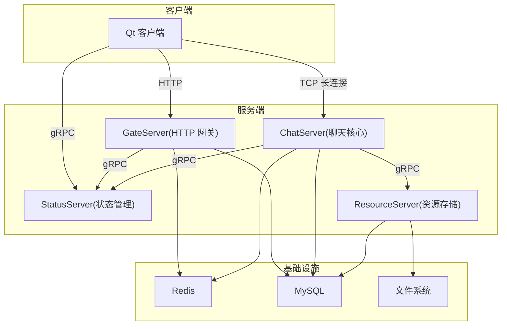
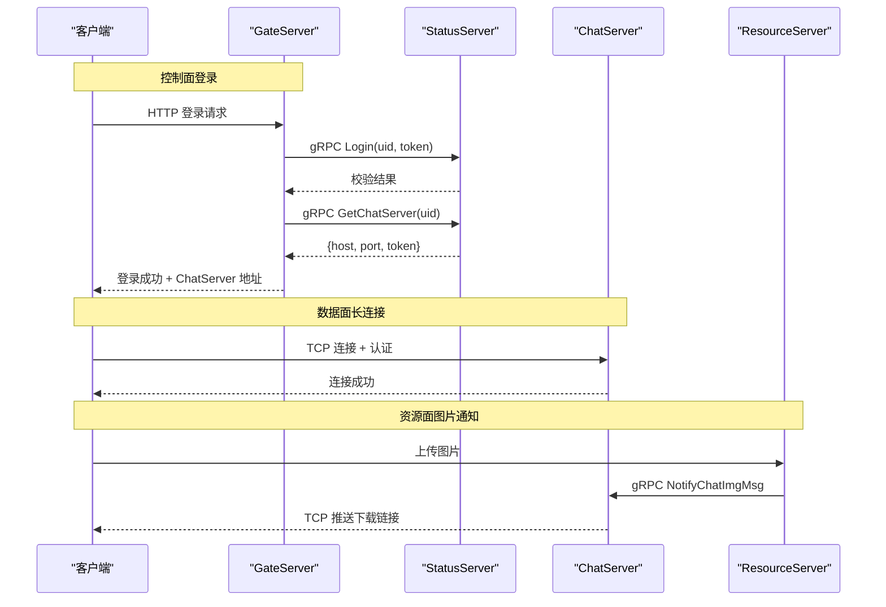
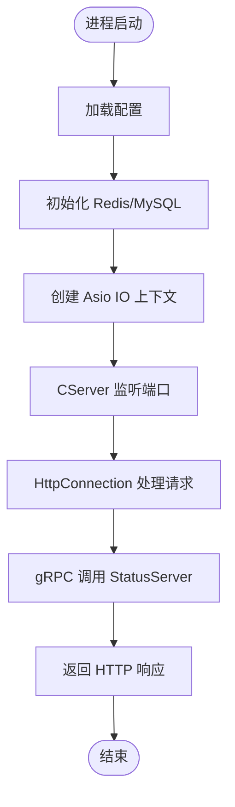
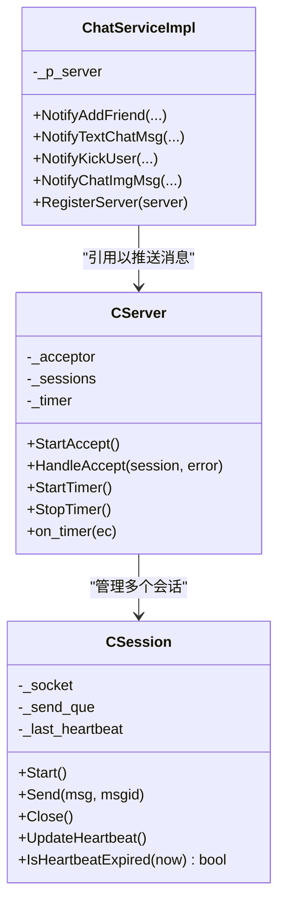
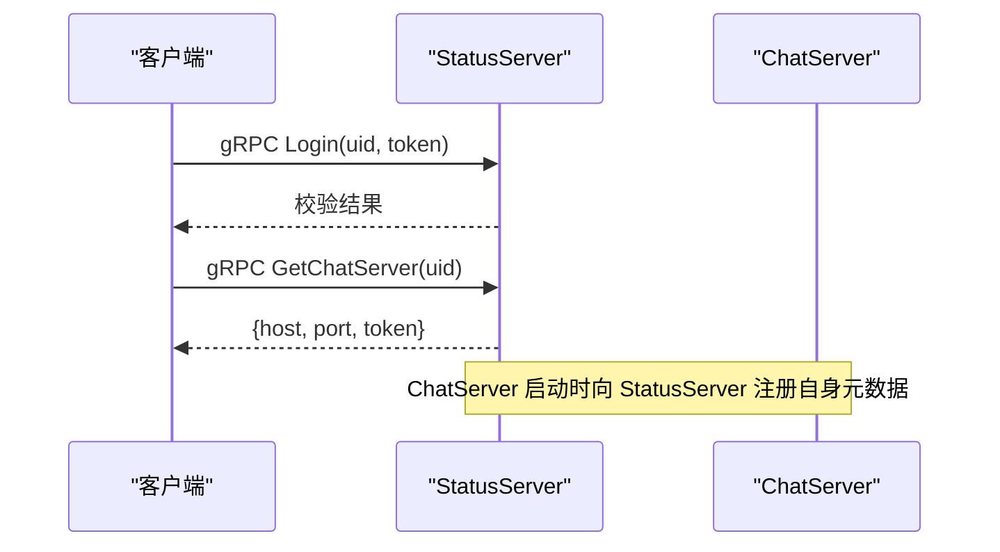
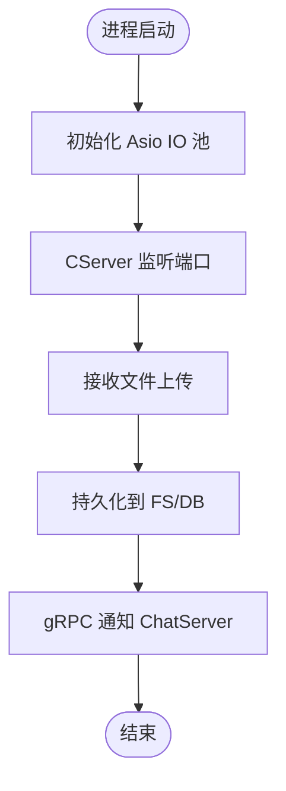
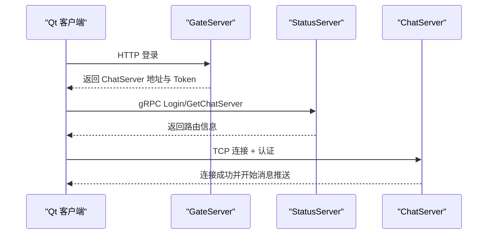
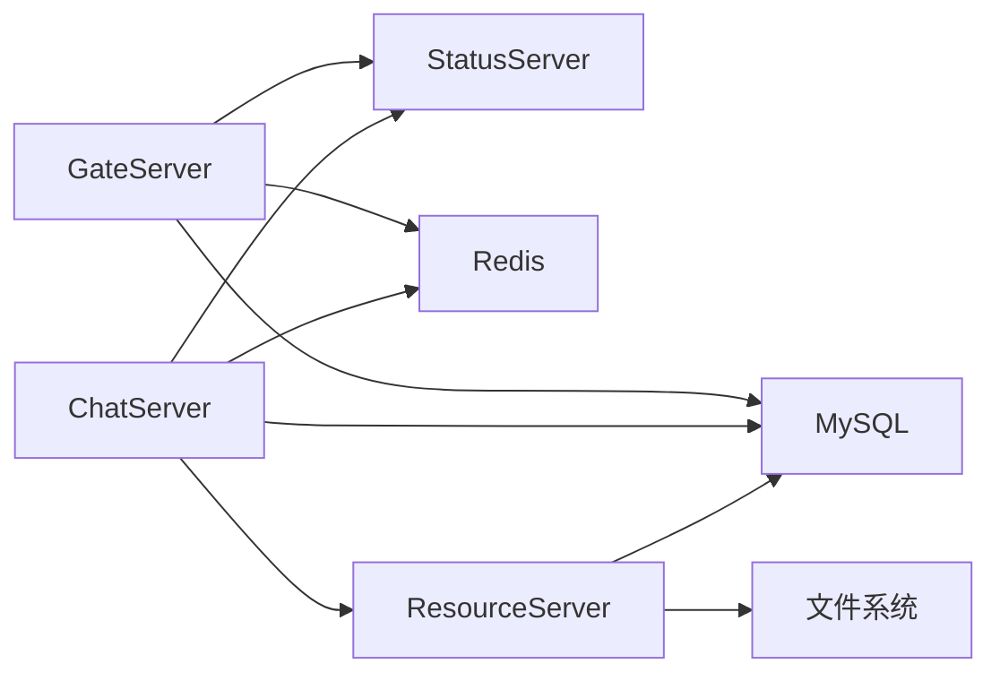

# 系统架构设计

<cite>
**本文引用的文件**   
- [README.md](file://README.md)
- [server/proto/chat/message.proto](file://server/proto/chat/message.proto)
- [server/proto/control/message.proto](file://server/proto/control/message.proto)
- [server/proto/resource/message.proto](file://server/proto/resource/message.proto)
- [server/GateServer/src/GateServer.cpp](file://server/GateServer/src/GateServer.cpp)
- [server/GateServer/include/CServer.h](file://server/GateServer/include/CServer.h)
- [server/GateServer/include/HttpConnection.h](file://server/GateServer/include/HttpConnection.h)
- [server/ChatServer/src/ChatServer.cpp](file://server/ChatServer/src/ChatServer.cpp)
- [server/ChatServer/include/CServer.h](file://server/ChatServer/include/CServer.h)
- [server/ChatServer/include/CSession.h](file://server/ChatServer/include/CSession.h)
- [server/ChatServer/include/ChatServiceImpl.h](file://server/ChatServer/include/ChatServiceImpl.h)
- [server/StatusServer/src/StatusServer.cpp](file://server/StatusServer/src/StatusServer.cpp)
- [server/StatusServer/include/StatusServiceImpl.h](file://server/StatusServer/include/StatusServiceImpl.h)
- [server/ResourceServer/src\ResourceServer.cpp](file://server/ResourceServer/src\ResourceServer.cpp)
- [server/ResourceServer/include/CSession.h](file://server/ResourceServer/include/CSession.h)
- [client/llfcchat/src/main.cpp](file://client/llfcchat/src/main.cpp)
</cite>

## 目录
1. [简介](#简介)
2. [项目结构](#项目结构)
3. [核心组件](#核心组件)
4. [架构总览](#架构总览)
5. [详细组件分析](#详细组件分析)
6. [依赖关系分析](#依赖关系分析)
7. [性能与可扩展性](#性能与可扩展性)
8. [故障转移与高可用](#故障转移与高可用)
9. [监控与日志](#监控与日志)
10. [排错指南](#排错指南)
11. [结论](#结论)

## 简介
本文件为 LLFCChat 即时通讯系统的全面架构设计文档。系统采用微服务架构，围绕四大核心服务展开：GateServer（HTTP 网关）、ChatServer（聊天核心）、StatusServer（状态管理）、ResourceServer（资源存储）。客户端通过 HTTP 访问 GateServer 完成注册、登录等控制面操作；登录后由 StatusServer 返回 ChatServer 的 TCP 地址与鉴权令牌，客户端建立长连接进行实时消息推送。服务间通信使用 gRPC，TCP 长连接用于低延迟的消息通道。系统设计涵盖分布式负载均衡、心跳检测、故障转移、高可用与可扩展性策略，并给出架构图、数据流图与时序图，帮助读者快速理解整体设计与实现要点。

## 项目结构
- 客户端（Qt）：负责 UI、HTTP 请求、TCP 长连接与文件传输线程。
- 服务端（C++）：按功能拆分为 GateServer、ChatServer、StatusServer、ResourceServer，均基于 Boost.Asio 与 gRPC。
- 协议定义（proto）：chat、control、resource 三个命名空间下的 message.proto，统一描述 RPC 接口与消息体。
- 配置与构建：各服务独立配置文件，CMake 构建脚本，vcpkg 依赖管理。

**图表来源** 
- [server/GateServer/src/GateServer.cpp:1-163](file://server/GateServer/src/GateServer.cpp#L1-L163)
- [server/ChatServer/src/ChatServer.cpp:1-81](file://server/ChatServer/src/ChatServer.cpp#L1-L81)
- [server/StatusServer/src/StatusServer.cpp:1-72](file://server/StatusServer/src/StatusServer.cpp#L1-L72)
- [server/ResourceServer/src\ResourceServer.cpp:1-42](file://server/ResourceServer/src\ResourceServer.cpp#L1-L42)
- [client/llfcchat/src/main.cpp:1-44](file://client/llfcchat/src/main.cpp#L1-L44)

**章节来源**
- [README.md:1-112](file://README.md#L1-L112)
- [client/llfcchat/src/main.cpp:1-44](file://client/llfcchat/src/main.cpp#L1-L44)

## 核心组件
- GateServer（HTTP 网关）
  - 职责：对外暴露 HTTP API，处理注册、登录、验证码等控制面请求；通过 gRPC 调用 StatusServer 获取 ChatServer 路由信息；读写 Redis/MySQL 做会话与用户数据缓存。
  - 关键类：CServer（Asio 监听）、HttpConnection（Beast HTTP 连接）、ConfigMgr、RedisMgr、MysqlMgr、StatusGrpcClient、VerifyGrpcClient。
- ChatServer（聊天核心）
  - 职责：维护客户端 TCP 长连接，处理消息转发、好友申请、踢人、图片通知等；提供 gRPC 服务供其他服务调用；定时心跳检测与异常连接清理。
  - 关键类：CServer（Asio 监听与 Accept）、CSession（会话、收发、心跳）、ChatServiceImpl（gRPC 实现）、LogicSystem、UserMgr、DistLock、RedisMgr、MysqlMgr。
- StatusServer（状态管理）
  - 职责：维护 ChatServer 实例元数据（host/port/name/con_count），提供 GetChatServer 与 Login 两个 gRPC 接口；支持简单负载均衡与路由。
  - 关键类：StatusServiceImpl、ChatServer（元数据结构）、RedisMgr、MysqlMgr。
- ResourceServer（资源存储）
  - 职责：接收 ChatServer 的图片上传/下载请求，持久化到文件系统与数据库；通过 gRPC 回调 ChatServer 通知客户端开始下载。
  - 关键类：CServer、CSession、FileWorker、FileSystem、UserInfo、DistLock、RedisMgr、MysqlMgr、ChatServerGrpcClient。

**章节来源**
- [server/GateServer/include/CServer.h:1-16](file://server/GateServer/include/CServer.h#L1-L16)
- [server/GateServer/include/HttpConnection.h:1-36](file://server/GateServer/include/HttpConnection.h#L1-L36)
- [server/ChatServer/include/CServer.h:1-33](file://server/ChatServer/include/CServer.h#L1-L33)
- [server/ChatServer/include/CSession.h:1-86](file://server/ChatServer/include/CSession.h#L1-L86)
- [server/ChatServer/include/ChatServiceImpl.h:1-55](file://server/ChatServer/include/ChatServiceImpl.h#L1-L55)
- [server/StatusServer/include/StatusServiceImpl.h:1-52](file://server/StatusServer/include/StatusServiceImpl.h#L1-L52)
- [server/ResourceServer/include/CSession.h:1-64](file://server/ResourceServer/include/CSession.h#L1-L64)

## 架构总览
- 客户端-服务器交互模式
  - 控制面：客户端通过 HTTP 访问 GateServer，完成注册、登录、验证码等流程。
  - 信令面：客户端通过 gRPC 调用 StatusServer，获取 ChatServer 的地址与 Token。
  - 数据面：客户端与 ChatServer 建立 TCP 长连接，进行实时消息推送与业务指令下发。
  - 资源面：大文件或图片通过 ResourceServer 上传/下载，ChatServer 通过 gRPC 通知客户端开始异步下载。
- 服务拆分原则
  - 单一职责：GateServer 专注 HTTP 接入与鉴权；ChatServer 专注消息与连接；StatusServer 专注路由与状态；ResourceServer 专注文件存储。
  - 松耦合：服务间通过 gRPC 接口通信，避免直接共享内存或强依赖。
  - 可水平扩展：ChatServer 多实例注册至 StatusServer，StatusServer 根据负载选择实例。
- 数据流向
  - 登录：客户端 -> GateServer(HTTP) -> StatusServer(gRPC) -> 返回 ChatServer(host,port,token)。
  - 消息：客户端 <-> ChatServer(TCP)；跨端消息由 ChatServer 转发；图片通知由 ResourceServer -> ChatServer(gRPC) -> 客户端(TCP)。

**图表来源** 
- [server/proto/chat/message.proto:1-167](file://server/proto/chat/message.proto#L1-L167)
- [server/proto/control/message.proto:1-143](file://server/proto/control/message.proto#L1-L143)
- [server/proto/resource/message.proto:1-169](file://server/proto/resource/message.proto#L1-L169)
- [server/StatusServer/include/StatusServiceImpl.h:1-52](file://server/StatusServer/include/StatusServiceImpl.h#L1-L52)
- [server/ChatServer/include/ChatServiceImpl.h:1-55](file://server/ChatServer/include/ChatServiceImpl.h#L1-L55)

## 详细组件分析

### GateServer（HTTP 网关）
- 启动流程
  - 初始化配置、Redis/MySQL 管理器，创建 Asio IO 上下文与信号处理，启动 CServer 监听 HTTP 端口。
- HTTP 请求处理
  - HttpConnection 解析 GET/POST 参数，调用 LogicSystem 分发业务逻辑，最终通过 gRPC 调用 StatusServer 或 VerifyService。
- 错误处理
  - 捕获异常并关闭 Redis 连接，记录错误日志。

**图表来源** 
- [server/GateServer/src/GateServer.cpp:1-163](file://server/GateServer/src/GateServer.cpp#L1-L163)
- [server/GateServer/include/CServer.h:1-16](file://server/GateServer/include/CServer.h#L1-L16)
- [server/GateServer/include/HttpConnection.h:1-36](file://server/GateServer/include/HttpConnection.h#L1-L36)

**章节来源**
- [server/GateServer/src/GateServer.cpp:1-163](file://server/GateServer/src/GateServer.cpp#L1-L163)
- [server/GateServer/include/CServer.h:1-16](file://server/GateServer/include/CServer.h#L1-L16)
- [server/GateServer/include/HttpConnection.h:1-36](file://server/GateServer/include/HttpConnection.h#L1-L36)

### ChatServer（聊天核心）
- 启动流程
  - 初始化 Asio IO 池、Redis 登录计数、创建 CServer 监听 TCP 端口，启动定时器；同时启动 gRPC 服务 ChatServiceImpl。
- 连接与会话
  - CServer 接受连接并创建 CSession，维护会话映射；CSession 负责粘包处理、发送队列、心跳更新与过期检测。
- gRPC 服务
  - ChatServiceImpl 实现好友申请、文本消息、踢人、图片通知等 RPC；内部持有 CServer 引用以推送消息给客户端。
- 心跳与异常
  - 定时器触发 on_timer，检查会话心跳是否过期，必要时断开并清理。

**图表来源** 
- [server/ChatServer/include/CServer.h:1-33](file://server/ChatServer/include/CServer.h#L1-L33)
- [server/ChatServer/include/CSession.h:1-86](file://server/ChatServer/include/CSession.h#L1-L86)
- [server/ChatServer/include/ChatServiceImpl.h:1-55](file://server/ChatServer/include/ChatServiceImpl.h#L1-L55)

**章节来源**
- [server/ChatServer/src/ChatServer.cpp:1-81](file://server/ChatServer/src/ChatServer.cpp#L1-L81)
- [server/ChatServer/include/CServer.h:1-33](file://server/ChatServer/include/CServer.h#L1-L33)
- [server/ChatServer/include/CSession.h:1-86](file://server/ChatServer/include/CSession.h#L1-L86)
- [server/ChatServer/include/ChatServiceImpl.h:1-55](file://server/ChatServer/include/ChatServiceImpl.h#L1-L55)

### StatusServer（状态管理）
- 启动流程
  - 启动 gRPC 服务，监听指定端口；在独立线程运行 Asio IO 上下文以处理信号。
- 路由与登录
  - StatusServiceImpl 维护 ChatServer 实例集合（host/port/name/con_count），提供 GetChatServer 与 Login 接口；根据连接数选择负载较低的实例。
- 错误处理
  - 优雅关闭 gRPC 服务并停止 IO 上下文。

**图表来源** 
- [server/StatusServer/src/StatusServer.cpp:1-72](file://server/StatusServer/src/StatusServer.cpp#L1-L72)
- [server/StatusServer/include/StatusServiceImpl.h:1-52](file://server/StatusServer/include/StatusServiceImpl.h#L1-L52)

**章节来源**
- [server/StatusServer/src/StatusServer.cpp:1-72](file://server/StatusServer/src/StatusServer.cpp#L1-L72)
- [server/StatusServer/include/StatusServiceImpl.h:1-52](file://server/StatusServer/include/StatusServiceImpl.h#L1-L52)

### ResourceServer（资源存储）
- 启动流程
  - 初始化 Asio IO 池与信号处理，启动 CServer 监听 TCP 端口。
- 文件处理
  - 接收上传请求，写入文件系统与数据库；完成后通过 gRPC 调用 ChatServer.NotifyChatImgMsg 通知客户端开始下载。
- 会话管理
  - CSession 处理粘包与发送队列，确保可靠传输。

**图表来源** 
- [server/ResourceServer/src\ResourceServer.cpp:1-42](file://server/ResourceServer/src\ResourceServer.cpp#L1-L42)
- [server/ResourceServer/include/CSession.h:1-64](file://server/ResourceServer/include/CSession.h#L1-L64)

**章节来源**
- [server/ResourceServer/src\ResourceServer.cpp:1-42](file://server/ResourceServer/src\ResourceServer.cpp#L1-L42)
- [server/ResourceServer/include/CSession.h:1-64](file://server/ResourceServer/include/CSession.h#L1-L64)

### 客户端（Qt）
- 启动流程
  - 加载样式与配置文件，读取 GateServer 地址前缀；启动 TCP 线程与文件传输线程；显示主窗口。
- 网络交互
  - 通过 HTTP 访问 GateServer，随后通过 gRPC 与 StatusServer 通信，最后建立 TCP 长连接到 ChatServer。

**图表来源** 
- [client/llfcchat/src/main.cpp:1-44](file://client/llfcchat/src/main.cpp#L1-L44)

**章节来源**
- [client/llfcchat/src/main.cpp:1-44](file://client/llfcchat/src/main.cpp#L1-L44)

## 依赖关系分析
- 服务间依赖
  - GateServer 依赖 StatusServer（gRPC）与 Redis/MySQL。
  - ChatServer 依赖 StatusServer（gRPC）与 Redis/MySQL，并通过 gRPC 与 ResourceServer 通信。
  - ResourceServer 依赖 ChatServer（gRPC）与文件系统/MySQL。
- 外部依赖
  - gRPC：服务间通信协议。
  - Redis：会话缓存、登录计数、分布式锁。
  - MySQL：用户信息与消息持久化。
  - Boost.Asio/Beast：高性能网络 I/O。

**图表来源** 
- [server/proto/chat/message.proto:1-167](file://server/proto/chat/message.proto#L1-L167)
- [server/proto/control/message.proto:1-143](file://server/proto/control/message.proto#L1-L143)
- [server/proto/resource/message.proto:1-169](file://server/proto/resource/message.proto#L1-L169)

**章节来源**
- [server/proto/chat/message.proto:1-167](file://server/proto/chat/message.proto#L1-L167)
- [server/proto/control/message.proto:1-143](file://server/proto/control/message.proto#L1-L143)
- [server/proto/resource/message.proto:1-169](file://server/proto/resource/message.proto#L1-L169)

## 性能与可扩展性
- 并发模型
  - 所有服务基于 Boost.Asio 的事件驱动 I/O，配合线程池（AsioIOServicePool）提升吞吐。
- 负载均衡
  - StatusServer 维护 ChatServer 实例元数据，包括连接数 con_count；GetChatServer 可根据负载选择最优实例。
- 心跳机制
  - CSession 维护 _last_heartbeat，定时器周期性检测过期；超时后断开并清理会话，保障资源释放。
- 可扩展性
  - ChatServer 多实例横向扩展，StatusServer 动态注册与发现；ResourceServer 可按容量扩容。
- 存储优化
  - Redis 缓存热点数据（会话、登录计数），MySQL 持久化关键数据；文件系统分片存储大文件。

[本节为通用指导，不直接分析具体文件]

## 故障转移与高可用
- 心跳与断线重连
  - 客户端检测到心跳超时或连接断开后，自动重连；服务端清理无效会话，释放资源。
- 服务降级
  - StatusServer 不可用时，GateServer 可缓存最近路由信息；ChatServer 本地队列暂存消息，待恢复后重试。
- 分布式锁
  - DistLock 基于 Redis 实现，防止多实例竞争写冲突；死锁解决方案参考开发文档。
- 优雅关闭
  - 捕获 SIGINT/SIGTERM，停止 IO 上下文、关闭 gRPC 服务、释放连接，保证数据一致性。

**章节来源**
- [server/ChatServer/include/CSession.h:1-86](file://server/ChatServer/include/CSession.h#L1-L86)
- [server/StatusServer/src/StatusServer.cpp:1-72](file://server/StatusServer/src/StatusServer.cpp#L1-L72)
- [server/ChatServer/src/ChatServer.cpp:1-81](file://server/ChatServer/src/ChatServer.cpp#L1-L81)

## 监控与日志
- 指标采集
  - 记录 ChatServer 登录计数、连接数、消息吞吐、错误率；Redis 键值统计。
- 日志收集
  - 结构化日志输出到文件与集中式日志系统；关键路径打点（登录、消息转发、文件上传）。
- 健康检查
  - StatusServer 暴露健康检查接口；GateServer 定期探测后端服务可用性。

[本节为通用指导，不直接分析具体文件]

## 排错指南
- 常见问题
  - 连接失败：检查防火墙、端口配置、Redis/MySQL 连通性。
  - 心跳超时：确认客户端心跳发送频率与服务端阈值匹配。
  - 消息丢失：检查粘包处理与发送队列；确认 TCP 连接状态。
  - 文件上传失败：验证文件系统权限与磁盘空间；检查 gRPC 回调是否成功。
- 调试步骤
  - 启用详细日志；使用网络抓包工具分析 TCP/gRPC 流量；检查 Redis/MySQL 慢查询。

**章节来源**
- [server/GateServer/src/GateServer.cpp:1-163](file://server/GateServer/src/GateServer.cpp#L1-L163)
- [server/ChatServer/src/ChatServer.cpp:1-81](file://server/ChatServer/src/ChatServer.cpp#L1-L81)
- [server/StatusServer/src/StatusServer.cpp:1-72](file://server/StatusServer/src/StatusServer.cpp#L1-L72)

## 结论
LLFCChat 通过清晰的微服务拆分与标准化的 gRPC/TCP 通信协议，实现了高内聚、低耦合的即时通讯系统。GateServer 作为统一入口，StatusServer 提供路由与状态管理，ChatServer 承载实时消息，ResourceServer 专注资源存储。结合心跳检测、负载均衡与分布式锁，系统在稳定性与可扩展性方面具备良好基础。建议进一步完善监控告警、自动化部署与混沌工程测试，以提升生产环境的可靠性与可观测性。