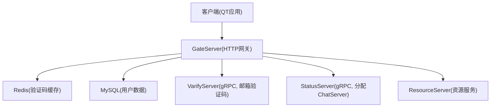
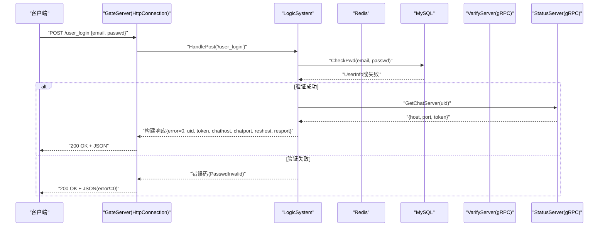
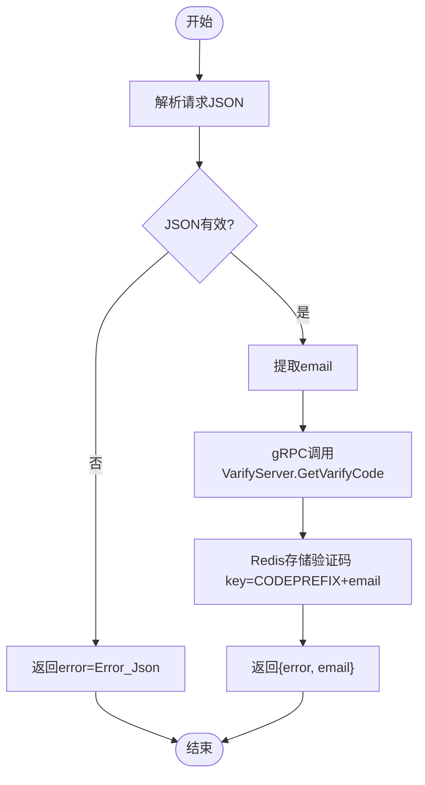
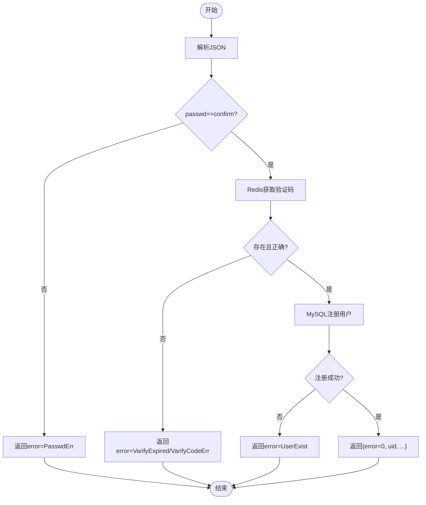
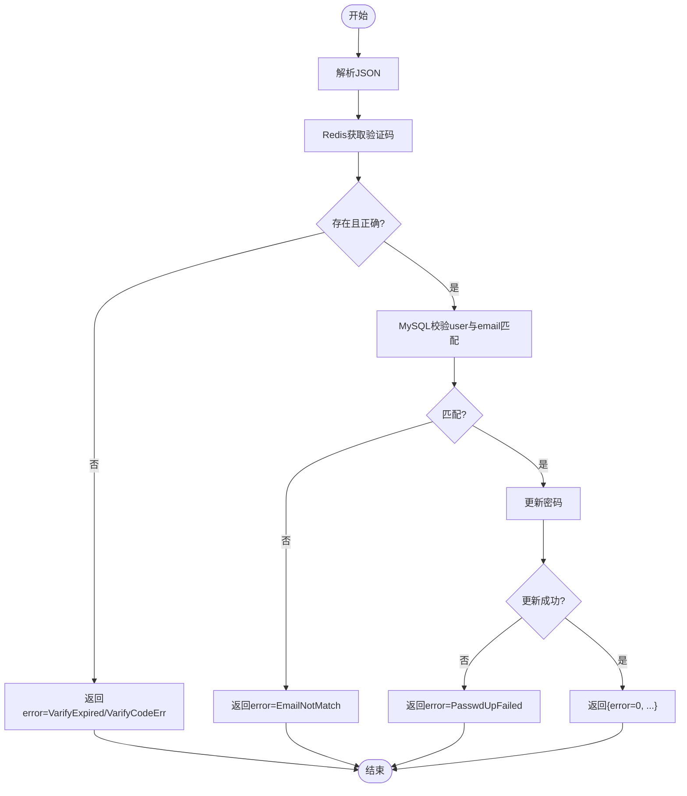
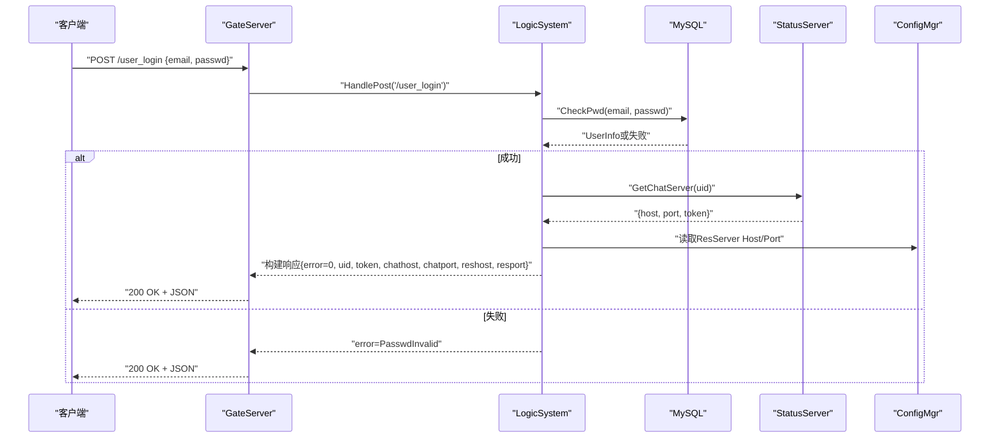
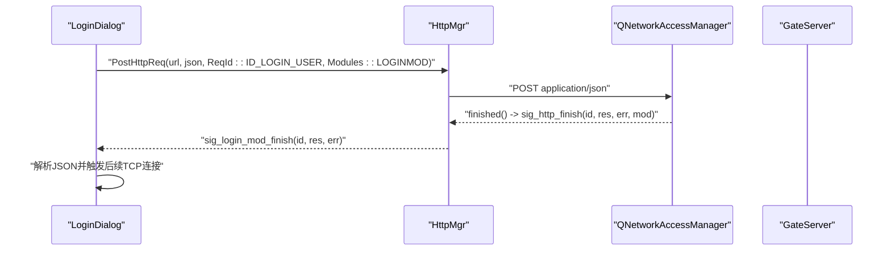
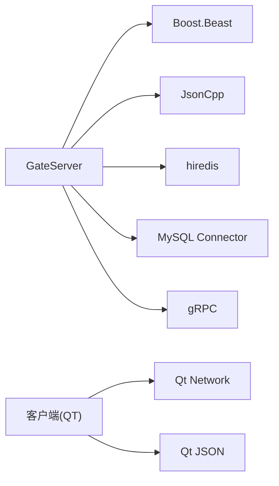

# HTTP API接口设计

<cite>
**本文引用的文件**   
- [HttpConnection.h](file://server/GateServer/include/HttpConnection.h)
- [HttpConnection.cpp](file://server/GateServer/src/HttpConnection.cpp)
- [LogicSystem.h](file://server/GateServer/include/LogicSystem.h)
- [LogicSystem.cpp](file://server/GateServer/src/LogicSystem.cpp)
- [const.h](file://server/GateServer/include/const.h)
- [config.ini（GateServer）](file://server/GateServer/config/config.ini)
- [httpmgr.h](file://client/llfcchat/include/httpmgr.h)
- [httpmgr.cpp](file://client/llfcchat/src/httpmgr.cpp)
- [global.h](file://client/llfcchat/include/global.h)
- [logindialog.h](file://client/llfcchat/include/logindialog.h)
- [logindialog.cpp](file://client/llfcchat/src/logindialog.cpp)
- [registerdialog.h](file://client/llfcchat/include/registerdialog.h)
- [registerdialog.cpp](file://client/llfcchat/src/registerdialog.cpp)
- [resetdialog.h](file://client/llfcchat/include/resetdialog.h)
</cite>

## 目录
1. [简介](#简介)
2. [项目结构](#项目结构)
3. [核心组件](#核心组件)
4. [架构总览](#架构总览)
5. [详细组件分析](#详细组件分析)
6. [依赖关系分析](#依赖关系分析)
7. [性能考虑](#性能考虑)
8. [故障排查指南](#故障排查指南)
9. [结论](#结论)
10. [附录](#附录)

## 简介
本文件为LLFCChat系统的HTTP API接口设计文档，聚焦于RESTful风格与认证相关接口（注册、登录、验证码获取、密码重置）。文档涵盖：
- RESTful设计原则：URL命名规范、HTTP方法使用、状态码约定
- 请求/响应格式规范：JSON数据结构、参数校验、错误处理
- 完整API端点说明：路径、方法、请求体、响应体、示例
- 客户端调用流程与信号回调机制
- 签名与安全建议（基于现有实现的安全要点与扩展建议）

## 项目结构
系统采用网关（GateServer）统一对外暴露HTTP接口，内部通过gRPC与验证码服务（VarifyServer）、状态服务（StatusServer）交互，并通过Redis缓存验证码、MySQL持久化用户数据。客户端侧通过Qt网络模块发起HTTP请求，并由统一的HttpMgr分发到各业务模块。

**图表来源** 
- [HttpConnection.cpp:132-194](file://server/GateServer/src/HttpConnection.cpp#L132-L194)
- [LogicSystem.cpp:36-406](file://server/GateServer/src/LogicSystem.cpp#L36-L406)
- [config.ini（GateServer）:1-25](file://server/GateServer/config/config.ini#L1-L25)

**章节来源**
- [HttpConnection.h:1-36](file://server/GateServer/include/HttpConnection.h#L1-L36)
- [HttpConnection.cpp:1-225](file://server/GateServer/src/HttpConnection.cpp#L1-L225)
- [LogicSystem.h:1-24](file://server/GateServer/include/LogicSystem.h#L1-L24)
- [LogicSystem.cpp:1-477](file://server/GateServer/src/LogicSystem.cpp#L1-L477)
- [config.ini（GateServer）:1-25](file://server/GateServer/config/config.ini#L1-L25)

## 核心组件
- GateServer HTTP网关：接收HTTP请求，解析GET/POST，路由到具体处理器，设置响应头与状态码。
- LogicSystem路由系统：维护GET/POST路由表，按路径分发到对应处理函数。
- HttpConnection连接封装：管理请求/响应对象、超时、CORS、异步读写。
- 客户端HttpMgr：封装QNetworkAccessManager，发送POST请求并回调业务模块。
- 配置与常量：ErrorCodes定义错误码；config.ini提供端口与后端服务地址。

**章节来源**
- [HttpConnection.cpp:132-194](file://server/GateServer/src/HttpConnection.cpp#L132-L194)
- [LogicSystem.cpp:416-477](file://server/GateServer/src/LogicSystem.cpp#L416-L477)
- [httpmgr.cpp:8-62](file://client/llfcchat/src/httpmgr.cpp#L8-L62)
- [const.h:32-45](file://server/GateServer/include/const.h#L32-L45)
- [config.ini（GateServer）:1-25](file://server/GateServer/config/config.ini#L1-L25)

## 架构总览
GateServer作为唯一HTTP入口，负责：
- 解析请求方法与路径
- GET：解析查询参数，转发至HandleGet
- POST：读取请求体JSON，转发至HandlePost
- 根据路由调用业务逻辑（验证码、注册、登录、重置密码等）
- 返回标准JSON响应，设置Content-Type与状态码

**图表来源** 
- [HttpConnection.cpp:132-194](file://server/GateServer/src/HttpConnection.cpp#L132-L194)
- [LogicSystem.cpp:338-405](file://server/GateServer/src/LogicSystem.cpp#L338-L405)

## 详细组件分析

### 通用RESTful设计规范
- URL命名规范
  - 使用名词复数形式表示资源集合，如/user_register、/get_varifycode、/reset_pwd、/user_login
  - 路径简洁明确，避免动词滥用；操作语义由HTTP方法表达
- HTTP方法使用
  - GET：用于获取资源或测试参数解析（如/get_test）
  - POST：用于创建资源或执行有副作用的操作（注册、登录、验证码、重置密码）
- 状态码约定
  - 200 OK：请求成功（无论业务是否成功，业务结果通过JSON的error字段表达）
  - 404 Not Found：未匹配的路由
  - 其他错误通过JSON.error编码返回（见ErrorCodes）
- 响应格式
  - Content-Type: text/json
  - 统一JSON结构包含error字段，成功时error=0，失败时为错误码
  - 可选附加字段随接口不同而不同（如uid、token、chathost等）

**章节来源**
- [HttpConnection.cpp:132-194](file://server/GateServer/src/HttpConnection.cpp#L132-L194)
- [const.h:32-45](file://server/GateServer/include/const.h#L32-L45)

### 认证相关接口

#### 获取验证码 /get_varifycode
- 方法：POST
- 路径：/get_varifycode
- 请求体(JSON)
  - email: string，必填，邮箱地址
- 响应体(JSON)
  - error: int，0表示成功，非0表示错误码
  - email: string，回显输入的邮箱
- 处理流程
  - GateServer解析JSON，提取email
  - 通过gRPC调用VarifyServer生成验证码并发送邮件
  - 验证码存入Redis（key前缀CODEPREFIX+email）
  - 返回error与email

**图表来源** 
- [LogicSystem.cpp:113-151](file://server/GateServer/src/LogicSystem.cpp#L113-L151)
- [const.h:63](file://server/GateServer/include/const.h#L63)

**章节来源**
- [LogicSystem.cpp:113-151](file://server/GateServer/src/LogicSystem.cpp#L113-L151)
- [const.h:63](file://server/GateServer/include/const.h#L63)

#### 用户注册 /user_register
- 方法：POST
- 路径：/user_register
- 请求体(JSON)
  - user: string，用户名
  - email: string，邮箱
  - passwd: string，密码
  - confirm: string，确认密码
  - icon: string，头像（可选）
  - varifycode: string，验证码
- 响应体(JSON)
  - error: int，0表示成功
  - uid: int，新注册用户ID
  - email: string，邮箱
  - user: string，用户名
  - passwd: string，密码
  - confirm: string，确认密码
  - icon: string，头像
  - varifycode: string，验证码
- 处理流程
  - 校验两次密码一致
  - 从Redis获取验证码并校验（过期/错误）
  - 调用MySQL注册用户（检查用户名/邮箱唯一性）
  - 返回用户信息

**图表来源** 
- [LogicSystem.cpp:161-239](file://server/GateServer/src/LogicSystem.cpp#L161-L239)

**章节来源**
- [LogicSystem.cpp:161-239](file://server/GateServer/src/LogicSystem.cpp#L161-L239)

#### 重置密码 /reset_pwd
- 方法：POST
- 路径：/reset_pwd
- 请求体(JSON)
  - email: string，邮箱
  - user: string，用户名
  - passwd: string，新密码
  - varifycode: string，验证码
- 响应体(JSON)
  - error: int，0表示成功
  - email: string，邮箱
  - user: string，用户名
  - passwd: string，新密码
  - varifycode: string，验证码
- 处理流程
  - 校验验证码（Redis中是否存在且正确）
  - 校验用户名与邮箱匹配（防止恶意重置他人密码）
  - 更新数据库密码

**图表来源** 
- [LogicSystem.cpp:249-324](file://server/GateServer/src/LogicSystem.cpp#L249-L324)

**章节来源**
- [LogicSystem.cpp:249-324](file://server/GateServer/src/LogicSystem.cpp#L249-L324)

#### 用户登录 /user_login
- 方法：POST
- 路径：/user_login
- 请求体(JSON)
  - email: string，邮箱
  - passwd: string，密码
- 响应体(JSON)
  - error: int，0表示成功
  - email: string，邮箱
  - uid: int，用户ID
  - token: string，TCP连接认证令牌
  - chathost: string，ChatServer地址
  - chatport: string，ChatServer端口
  - reshost: string，ResourceServer地址
  - resport: string，ResourceServer端口
- 处理流程
  - 校验邮箱与密码（MySQL）
  - 通过StatusServer分配ChatServer并获取token
  - 从配置文件读取ResourceServer地址
  - 返回连接信息与token

**图表来源** 
- [LogicSystem.cpp:338-405](file://server/GateServer/src/LogicSystem.cpp#L338-L405)
- [config.ini（GateServer）:19-24](file://server/GateServer/config/config.ini#L19-L24)

**章节来源**
- [LogicSystem.cpp:338-405](file://server/GateServer/src/LogicSystem.cpp#L338-L405)
- [config.ini（GateServer）:19-24](file://server/GateServer/config/config.ini#L19-L24)

### 客户端调用示例与回调机制
- 客户端通过HttpMgr::PostHttpReq发送POST请求，设置Content-Type为application/json
- 请求完成后通过信号sig_http_finish回调，再根据Modules分发到具体模块（REGISTERMOD、RESETMOD、LOGINMOD）
- 登录流程中，LoginDialog解析响应后建立TCP连接并发送聊天服务器登录消息

**图表来源** 
- [httpmgr.cpp:8-62](file://client/llfcchat/src/httpmgr.cpp#L8-L62)
- [logindialog.cpp:175-223](file://client/llfcchat/src/logindialog.cpp#L175-L223)

**章节来源**
- [httpmgr.h:11-34](file://client/llfcchat/include/httpmgr.h#L11-L34)
- [httpmgr.cpp:8-62](file://client/llfcchat/src/httpmgr.cpp#L8-L62)
- [logindialog.cpp:175-223](file://client/llfcchat/src/logindialog.cpp#L175-L223)

## 依赖关系分析
- GateServer依赖：
  - Boost.Asio/Beast：HTTP协议栈与异步IO
  - JsonCpp：JSON解析与序列化
  - hiredis：Redis客户端
  - MySQL Connector/C++：数据库访问
  - gRPC：与VarifyServer、StatusServer通信
- 客户端依赖：
  - Qt Network：HTTP请求
  - QJsonObject/QJsonDocument：JSON处理

**图表来源** 
- [LogicSystem.cpp:1-477](file://server/GateServer/src/LogicSystem.cpp#L1-L477)
- [httpmgr.cpp:1-62](file://client/llfcchat/src/httpmgr.cpp#L1-L62)

**章节来源**
- [LogicSystem.cpp:1-477](file://server/GateServer/src/LogicSystem.cpp#L1-L477)
- [httpmgr.cpp:1-62](file://client/llfcchat/src/httpmgr.cpp#L1-L62)

## 性能考虑
- GateServer使用AsioIOServicePool提升并发能力，多个io_context并行处理请求
- Redis缓存验证码，减少重复计算与邮件发送压力
- gRPC连接池复用通道，降低握手开销
- 短连接模式（keep_alive=false），简化连接生命周期管理

[本节为通用指导，不直接分析具体文件]

## 故障排查指南
- JSON解析失败：检查请求体是否为合法JSON，确保Content-Type为application/json
- 验证码过期/错误：确认验证码是否在有效期内，Redis键是否存在
- 用户已存在：注册时用户名或邮箱已占用
- 密码不匹配：登录时邮箱与密码不一致
- RPC失败：gRPC调用VarifyServer/StatusServer失败，检查服务状态与配置
- 404未找到：请求路径未注册或拼写错误

**章节来源**
- [const.h:32-45](file://server/GateServer/include/const.h#L32-L45)
- [LogicSystem.cpp:113-151](file://server/GateServer/src/LogicSystem.cpp#L113-L151)
- [LogicSystem.cpp:161-239](file://server/GateServer/src/LogicSystem.cpp#L161-L239)
- [LogicSystem.cpp:249-324](file://server/GateServer/src/LogicSystem.cpp#L249-L324)
- [LogicSystem.cpp:338-405](file://server/GateServer/src/LogicSystem.cpp#L338-L405)

## 结论
LLFCChat的HTTP API以GateServer为核心，遵循RESTful原则，统一通过JSON进行数据交换，并使用ErrorCodes表达业务状态。认证相关接口覆盖注册、登录、验证码获取与密码重置，结合Redis与MySQL保障安全与一致性。客户端通过HttpMgr与信号槽机制解耦业务逻辑，便于扩展与维护。

[本节为总结，不直接分析具体文件]

## 附录

### API端点清单与示例

- 获取验证码
  - 方法：POST
  - 路径：/get_varifycode
  - 请求体：{"email":"user@example.com"}
  - 响应体：{"error":0,"email":"user@example.com"}

- 用户注册
  - 方法：POST
  - 路径：/user_register
  - 请求体：{"user":"alice","email":"alice@example.com","passwd":"P@ssw0rd","confirm":"P@ssw0rd","icon":"","varifycode":"123456"}
  - 响应体：{"error":0,"uid":1001,"email":"alice@example.com","user":"alice","passwd":"P@ssw0rd","confirm":"P@ssw0rd","icon":"","varifycode":"123456"}

- 重置密码
  - 方法：POST
  - 路径：/reset_pwd
  - 请求体：{"email":"alice@example.com","user":"alice","passwd":"NewP@ssw0rd","varifycode":"123456"}
  - 响应体：{"error":0,"email":"alice@example.com","user":"alice","passwd":"NewP@ssw0rd","varifycode":"123456"}

- 用户登录
  - 方法：POST
  - 路径：/user_login
  - 请求体：{"email":"alice@example.com","passwd":"P@ssw0rd"}
  - 响应体：{"error":0,"email":"alice@example.com","uid":1001,"token":"abc123","chathost":"127.0.0.1","chatport":"8001","reshost":"127.0.0.1","resport":"9090"}

[本节为接口汇总，不直接分析具体文件]

### 客户端调用示例（伪代码）
- 发送验证码
  - 构造QJsonObject{"email":"..."}
  - 调用HttpMgr::PostHttpReq("http://host:port/get_varifycode", json, ID_GET_VARIFY_CODE, REGISTERMOD)
- 注册
  - 构造QJsonObject{"user":"...","email":"...","passwd":"...","confirm":"...","icon":"...","varifycode":"..."}
  - 调用HttpMgr::PostHttpReq("http://host:port/user_register", json, ID_REG_USER, REGISTERMOD)
- 登录
  - 构造QJsonObject{"email":"...","passwd":"..."}
  - 调用HttpMgr::PostHttpReq("http://host:port/user_login", json, ID_LOGIN_USER, LOGINMOD)

[本节为调用示例，不直接分析具体文件]

### 安全考虑与建议
- 传输层安全：建议使用HTTPS替代明文HTTP，防止中间人攻击
- 密码安全：服务端应使用哈希加盐存储密码，不在响应中回显明文密码
- 验证码安全：限制发送频率，验证码一次性使用，设置合理过期时间
- Token安全：登录返回的token应短期有效，必要时引入刷新机制
- CORS策略：生产环境应限制允许的源，避免*开放跨域
- 输入校验：对email、密码长度与字符集进行严格校验，防止注入与越权

[本节为安全建议，不直接分析具体文件]