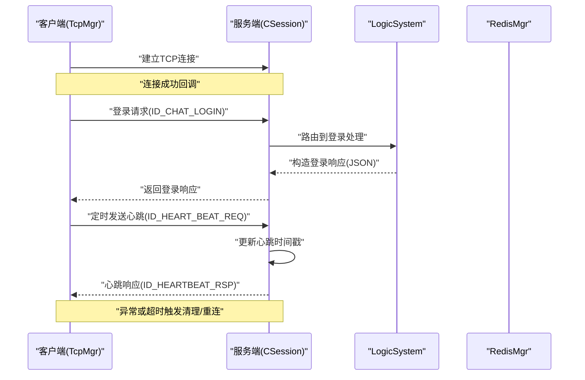
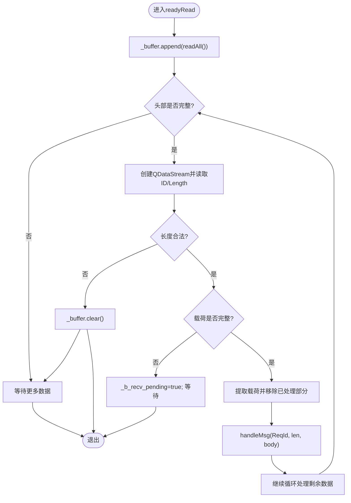
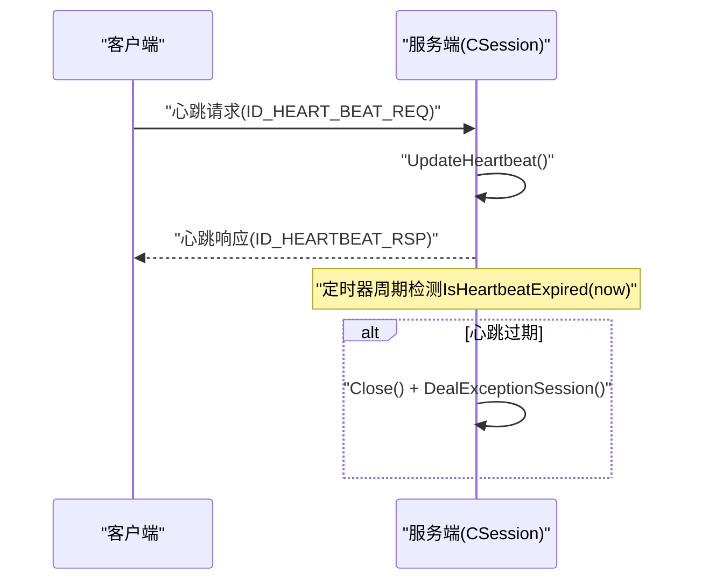
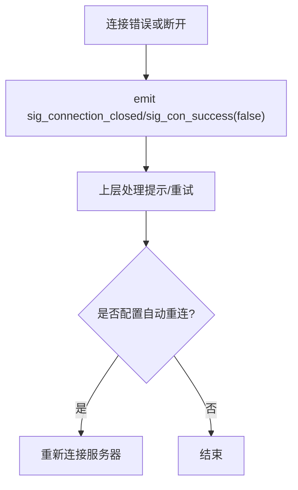
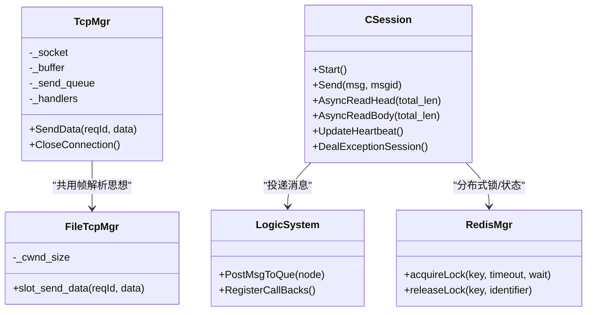

# TCP长连接协议

<cite>
**本文引用的文件**   
- [tcpmgr.h](file://client/llfcchat/include/tcpmgr.h)
- [tcpmgr.cpp](file://client/llfcchat/src/tcpmgr.cpp)
- [global.h](file://client/llfcchat/include/global.h)
- [filetcpmgr.cpp](file://client/llfcchat/src/filetcpmgr.cpp)
- [CSession.h](file://server/ChatServer/include/CSession.h)
- [CSession.cpp](file://server/ChatServer/src/CSession.cpp)
- [MsgNode.h](file://server/ChatServer/include/MsgNode.h)
- [const.h](file://server/ChatServer/include/const.h)
- [data.h](file://server/ChatServer/include/data.h)
- [day15-客户端Tcp管理类设计.md](file://开发文档/day15-客户端Tcp管理类设计.md)
- [day16-asio实现tcp服务器.md](file://开发文档/day16-asio实现tcp服务器.md)
- [day35心跳逻辑.md](file://开发文档/day35心跳逻辑.md)
- [day42-Qt粘包引发的血案.md](file://开发文档/day42-Qt粘包引发的血案.md)
</cite>

## 目录
1. [简介](#简介)
2. [项目结构](#项目结构)
3. [核心组件](#核心组件)
4. [架构总览](#架构总览)
5. [详细组件分析](#详细组件分析)
6. [依赖关系分析](#依赖关系分析)
7. [性能考量](#性能考量)
8. [故障排查指南](#故障排查指南)
9. [结论](#结论)
10. [附录](#附录)

## 简介
本文件为 LLFCChat 系统的 TCP 长连接协议设计文档，面向开发者与测试人员，系统化阐述自定义 TCP 消息帧格式、粘包处理、心跳保活、断线重连、连接生命周期管理、会话状态维护、异常恢复流程、握手过程、消息路由机制与性能优化方案。文档同时提供协议解析思路、调试要点与常见问题解决方案，帮助读者快速理解并正确实现该协议。

## 项目结构
LLFCChat 的 TCP 通信由客户端与服务端两部分组成：
- 客户端（Qt）：使用 QTcpSocket 维护长连接，封装 TcpMgr/FileTcpMgr 负责收发、粘包处理、发送队列与信号分发。
- 服务端（Boost.Asio）：使用 CServer/CSession 管理连接，基于 MsgNode 构建固定长度头部+变长载荷的消息帧，异步读写、心跳检测与异常清理。

```mermaid
graph TB
subgraph "客户端"
UI["界面层"]
TcpMgr["TcpMgr<br/>消息收发/粘包处理"]
FileTcpMgr["FileTcpMgr<br/>文件传输专用"]
Socket["QTcpSocket"]
end
subgraph "服务端"
CServer["CServer<br/>监听/接受连接"]
CSession["CSession<br/>会话/读写/心跳"]
LogicSystem["LogicSystem<br/>业务路由"]
RedisMgr["RedisMgr<br/>分布式锁/状态"]
end
UI --> TcpMgr
UI --> FileTcpMgr
TcpMgr --> Socket
FileTcpMgr --> Socket
Socket < --> CServer
CServer --> CSession
CSession --> LogicSystem
CSession --> RedisMgr
```

图表来源
- [tcpmgr.h](file://client/llfcchat/include/tcpmgr.h)
- [tcpmgr.cpp](file://client/llfcchat/src/tcpmgr.cpp)
- [filetcpmgr.cpp](file://client/llfcchat/src/filetcpmgr.cpp)
- [CSession.h](file://server/ChatServer/include/CSession.h)
- [CSession.cpp](file://server/ChatServer/src/CSession.cpp)

章节来源
- [tcpmgr.h:1-90](file://client/llfcchat/include/tcpmgr.h#L1-L90)
- [tcpmgr.cpp:1-137](file://client/llfcchat/src/tcpmgr.cpp#L1-L137)
- [CSession.h:1-86](file://server/ChatServer/include/CSession.h#L1-L86)
- [CSession.cpp:1-194](file://server/ChatServer/src/CSession.cpp#L1-L194)

## 核心组件
- 客户端 TcpMgr：封装 QTcpSocket 的收发、粘包处理、发送队列、错误与断开事件、消息处理器注册与分发。
- 客户端 FileTcpMgr：针对文件传输场景的独立模块，复用相同帧解析思想，支持大文件分片与进度同步。
- 服务端 CSession：基于 Asio 的异步读写，固定头（ID+Length）+变长体，心跳时间戳更新与过期检测，异常清理与分布式锁协调。
- 常量与消息ID：统一在 const.h 中定义，客户端 global.h 与之对齐，确保 ID 一致。

章节来源
- [tcpmgr.h:22-87](file://client/llfcchat/include/tcpmgr.h#L22-L87)
- [tcpmgr.cpp:18-137](file://client/llfcchat/src/tcpmgr.cpp#L18-L137)
- [filetcpmgr.cpp:1-143](file://client/llfcchat/src/filetcpmgr.cpp#L1-L143)
- [CSession.h:28-76](file://server/ChatServer/include/CSession.h#L28-L76)
- [const.h:38-79](file://server/ChatServer/include/const.h#L38-L79)
- [global.h:43-88](file://client/llfcchat/include/global.h#L43-L88)

## 架构总览
TCP 长连接采用“固定长度头部 + 变长载荷”的自研帧格式，客户端与服务端通过 ReqId/MSG_IDS 进行消息路由。连接建立后，双方维持心跳；异常时触发清理与重连。



图表来源
- [tcpmgr.cpp:18-137](file://client/llfcchat/src/tcpmgr.cpp#L18-L137)
- [CSession.cpp:133-194](file://server/ChatServer/src/CSession.cpp#L133-L194)
- [day16-asio实现tcp服务器.md:312-339](file://开发文档/day16-asio实现tcp服务器.md#L312-L339)
- [day35心跳逻辑.md:446-548](file://开发文档/day35心跳逻辑.md#L446-L548)

## 详细组件分析

### 自定义TCP协议消息帧格式
- 头部字段
  - 消息ID：短整型（2字节），网络字节序
  - 载荷长度：短整型（2字节），网络字节序
  - 头部总长度：4字节（HEAD_TOTAL_LEN）
- 载荷：JSON 文本（UTF-8），长度由头部指定
- 校验：未引入额外校验和，依赖长度字段与 JSON error 字段进行一致性检查

说明：
- 客户端使用 QDataStream 以 BigEndian 写入/读取，保证跨平台一致性。
- 服务端在解析头部时将网络字节序转换为主机字节序，并进行合法性校验（ID、长度范围）。

章节来源
- [const.h:38-44](file://server/ChatServer/include/const.h#L38-L44)
- [day16-asio实现tcp服务器.md:234-236](file://开发文档/day16-asio实现tcp服务器.md#L234-L236)
- [tcpmgr.cpp:400-428](file://client/llfcchat/src/tcpmgr.cpp#L400-L428)

### 粘包处理算法
- 接收缓冲区 _buffer 累积 socket 数据
- 循环解析：先读头部（ID+Len），再读载荷（按 Len 截取），不足则等待
- 关键修复：每次解析头部前重新创建 QDataStream，避免 stream 内部位置错乱
- 使用 remove() 而非 mid() 赋值，提升性能



图表来源
- [tcpmgr.cpp:18-55](file://client/llfcchat/src/tcpmgr.cpp#L18-L55)
- [filetcpmgr.cpp:16-55](file://client/llfcchat/src/filetcpmgr.cpp#L16-L55)
- [day42-Qt粘包引发的血案.md:258-320](file://开发文档/day42-Qt粘包引发的血案.md#L258-L320)

章节来源
- [tcpmgr.cpp:18-55](file://client/llfcchat/src/tcpmgr.cpp#L18-L55)
- [filetcpmgr.cpp:16-55](file://client/llfcchat/src/filetcpmgr.cpp#L16-L55)
- [day42-Qt粘包引发的血案.md:258-320](file://开发文档/day42-Qt粘包引发的血案.md#L258-L320)

### 心跳保活机制
- 客户端定时发送心跳请求（ID_HEART_BEAT_REQ），携带 fromuid
- 服务端收到后更新会话心跳时间戳，并返回心跳响应（ID_HEARTBEAT_RSP）
- 服务端周期性扫描会话，若超过阈值（示例20s，生产建议60s）判定为过期，关闭连接并清理资源



图表来源
- [day35心跳逻辑.md:446-548](file://开发文档/day35心跳逻辑.md#L446-L548)
- [CSession.cpp:288-302](file://server/ChatServer/src/CSession.cpp#L288-L302)

章节来源
- [day35心跳逻辑.md:446-548](file://开发文档/day35心跳逻辑.md#L446-L548)
- [CSession.cpp:288-302](file://server/ChatServer/src/CSession.cpp#L288-L302)

### 断线重连策略
- 客户端监听 disconnected/error 事件，根据错误类型通知上层
- 上层可触发 CloseConnection()，随后由调用方（如登录流程）发起重连
- 服务端在异常路径调用 DealExceptionSession() 清理会话与分布式锁



图表来源
- [tcpmgr.cpp:64-98](file://client/llfcchat/src/tcpmgr.cpp#L64-L98)
- [filetcpmgr.cpp:64-99](file://client/llfcchat/src/filetcpmgr.cpp#L64-L99)
- [CSession.cpp:304-336](file://server/ChatServer/src/CSession.cpp#L304-L336)

章节来源
- [tcpmgr.cpp:64-98](file://client/llfcchat/src/tcpmgr.cpp#L64-L98)
- [filetcpmgr.cpp:64-99](file://client/llfcchat/src/filetcpmgr.cpp#L64-L99)
- [CSession.cpp:304-336](file://server/ChatServer/src/CSession.cpp#L304-L336)

### 连接生命周期管理与会话状态
- 连接建立：客户端 connected 回调，服务端 Accept 后 Start() 启动读头
- 会话状态：CSession 维护 _last_heartbeat、_user_uid、_session_id
- 连接关闭：客户端 disconnected；服务端 Close() 并清理 session map

章节来源
- [tcpmgr.cpp:12-16](file://client/llfcchat/src/tcpmgr.cpp#L12-L16)
- [CSession.cpp:42-44](file://server/ChatServer/src/CSession.cpp#L42-L44)
- [CSession.cpp:80-84](file://server/ChatServer/src/CSession.cpp#L80-L84)

### 协议握手过程
- 客户端连接成功后发送登录请求（ID_CHAT_LOGIN），携带 uid/token
- 服务端验证后返回登录响应（ID_CHAT_LOGIN_RSP），包含用户信息与好友列表等
- 客户端解析响应并切换界面

章节来源
- [day15-客户端Tcp管理类设计.md:175-236](file://开发文档/day15-客户端Tcp管理类设计.md#L175-L236)
- [tcpmgr.cpp:185-234](file://client/llfcchat/src/tcpmgr.cpp#L185-L234)

### 消息路由机制
- 客户端：_handlers 映射 ReqId 到处理函数，handleMsg 根据 ID 分发
- 服务端：LogicSystem::RegisterCallBacks 将 MSG_ID 绑定到具体处理函数

章节来源
- [tcpmgr.cpp:182-234](file://client/llfcchat/src/tcpmgr.cpp#L182-L234)
- [day16-asio实现tcp服务器.md:312-339](file://开发文档/day16-asio实现tcp服务器.md#L312-L339)

### 性能优化方案
- 发送队列：客户端 _send_queue 与 _pending/_bytes_sent 控制顺序发送，避免阻塞
- 零拷贝优化：使用 remove() 替代 mid()，减少临时对象分配
- 异步IO：服务端使用 Asio 异步读写，降低线程阻塞
- 批量处理：逻辑层投递队列，解耦 IO 与业务处理

章节来源
- [tcpmgr.cpp:103-129](file://client/llfcchat/src/tcpmgr.cpp#L103-L129)
- [filetcpmgr.cpp:106-132](file://client/llfcchat/src/filetcpmgr.cpp#L106-L132)
- [day16-asio实现tcp服务器.md:236-306](file://开发文档/day16-asio实现tcp服务器.md#L236-L306)

## 依赖关系分析
- 客户端依赖 Qt 网络模块与 JSON 库，服务端依赖 Boost.Asio、JsonCpp、gRPC 客户端
- 常量与消息ID在两端保持一致，避免路由错误
- 分布式锁（Redis）用于多进程/多实例下的会话清理与踢人逻辑



图表来源
- [tcpmgr.h:22-87](file://client/llfcchat/include/tcpmgr.h#L22-L87)
- [filetcpmgr.cpp:1-143](file://client/llfcchat/src/filetcpmgr.cpp#L1-L143)
- [CSession.h:28-76](file://server/ChatServer/include/CSession.h#L28-L76)
- [CSession.cpp:288-336](file://server/ChatServer/src/CSession.cpp#L288-L336)

章节来源
- [tcpmgr.h:22-87](file://client/llfcchat/include/tcpmgr.h#L22-L87)
- [CSession.h:28-76](file://server/ChatServer/include/CSession.h#L28-L76)

## 性能考量
- 粘包解析避免重复创建大对象，优先使用 remove() 与 left()
- 发送队列限制 MAX_SENDQUE，防止内存膨胀
- 心跳间隔与阈值需平衡实时性与开销（示例20s，生产建议60s）
- 大数据传输（图片/文件）采用分片与断点续传，降低单次负载

章节来源
- [const.h:38-46](file://server/ChatServer/include/const.h#L38-L46)
- [day42-Qt粘包引发的血案.md:479-497](file://开发文档/day42-Qt粘包引发的血案.md#L479-L497)

## 故障排查指南
- 常见错误
  - QDataStream 位置错乱：确保每次解析头部前重新创建 stream
  - 粘包导致解析错位：使用 while 循环持续处理，直到 buffer 不足
  - 心跳超时：检查客户端定时器与服务端阈值设置
  - 分布式锁死锁：统一加锁顺序（分布式锁→线程锁），避免交叉等待
- 调试建议
  - 打印头部 ID/Length 与 buffer 长度变化
  - 记录 readyRead 触发次数与数据累积情况
  - 在服务端日志中观察 AsyncReadHead/Body 的错误码

章节来源
- [day42-Qt粘包引发的血案.md:258-320](file://开发文档/day42-Qt粘包引发的血案.md#L258-L320)
- [day35心跳逻辑.md:418-444](file://开发文档/day35心跳逻辑.md#L418-L444)

## 结论
LLFCChat 的 TCP 长连接协议以简洁高效的固定头+变长体帧格式为基础，结合稳健的粘包处理、心跳保活与异常清理机制，实现了高可靠的双向通信。通过客户端与服务端的清晰职责划分与消息路由，系统具备良好的扩展性与可维护性。建议在工程实践中严格遵循帧解析最佳实践，合理设置心跳阈值与发送队列大小，并结合日志与监控快速定位问题。

## 附录
- 协议字段对照
  - 客户端 ReqId（global.h）与服务端 MSG_IDS（const.h）一一对应
  - 载荷统一为 JSON，error 字段表示状态码
- 参考实现路径
  - 客户端解析：[tcpmgr.cpp:18-55](file://client/llfcchat/src/tcpmgr.cpp#L18-L55)
  - 服务端解析：[CSession.cpp:133-194](file://server/ChatServer/src/CSession.cpp#L133-L194)
  - 心跳逻辑：[day35心跳逻辑.md:446-548](file://开发文档/day35心跳逻辑.md#L446-L548)
  - 粘包修复：[day42-Qt粘包引发的血案.md:258-320](file://开发文档/day42-Qt粘包引发的血案.md#L258-L320)