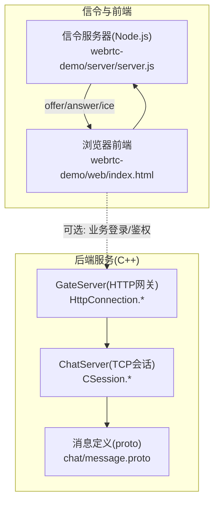
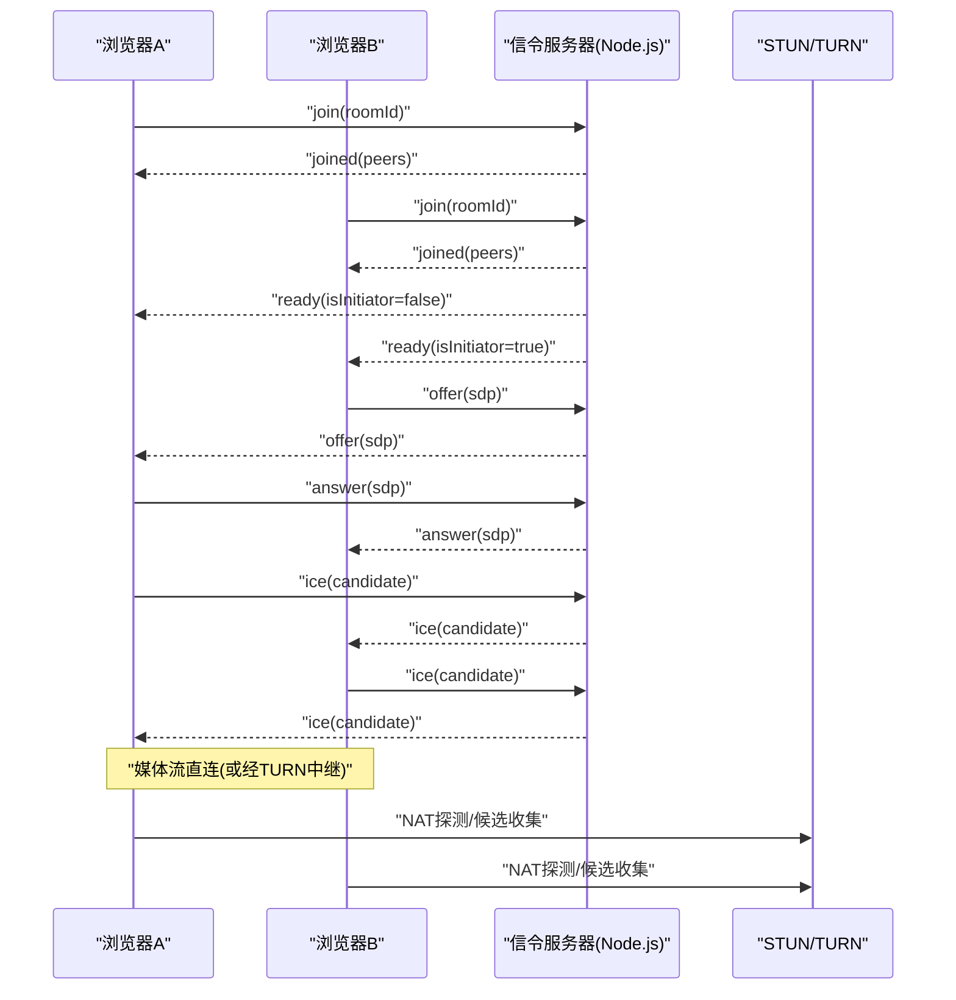
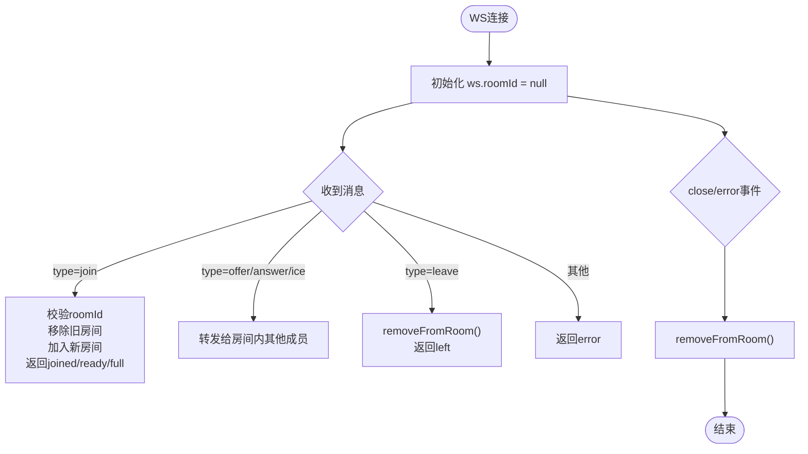
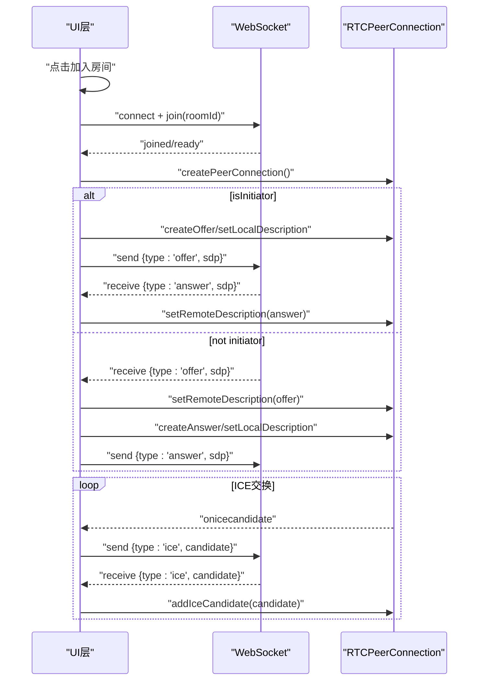
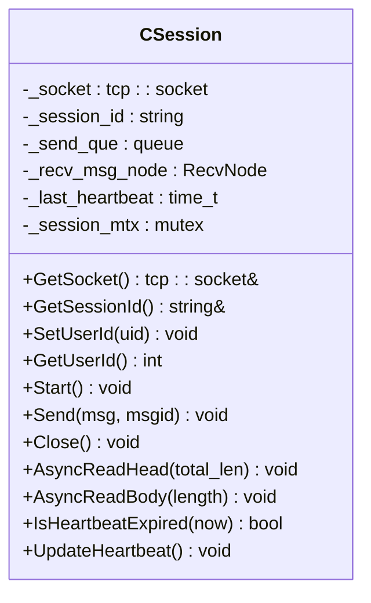
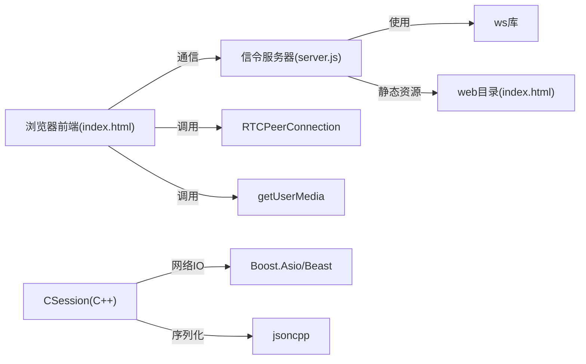

# WebSocket实时通信

<cite>
**本文引用的文件**   
- [webrtc-demo/server/server.js](file://webrtc-demo/server/server.js)
- [webrtc-demo/web/index.html](file://webrtc-demo/web/index.html)
- [开发文档/day44-webrtc信令服务器实现.md](file://开发文档/day44-webrtc信令服务器实现.md)
- [server/ChatServer/include/CSession.h](file://server/ChatServer/include/CSession.h)
- [server/ChatServer/src/CSession.cpp](file://server/ChatServer/src/CSession.cpp)
- [server/GateServer/include/HttpConnection.h](file://server/GateServer/include/HttpConnection.h)
- [server/GateServer/src/HttpConnection.cpp](file://server/GateServer/src/HttpConnection.cpp)
- [server/proto/chat/message.proto](file://server/proto/chat/message.proto)
- [开发文档/day35心跳逻辑.md](file://开发文档/day35心跳逻辑.md)
</cite>

## 目录
1. [引言](#引言)
2. [项目结构](#项目结构)
3. [核心组件](#核心组件)
4. [架构总览](#架构总览)
5. [详细组件分析](#详细组件分析)
6. [依赖关系分析](#依赖关系分析)
7. [性能考虑](#性能考虑)
8. [故障排查指南](#故障排查指南)
9. [结论](#结论)
10. [附录](#附录)

## 引言
本设计文档围绕LLFCChat系统中的WebSocket实时通信与WebRTC信令交换展开，重点说明：
- WebSocket在信令服务器中的应用场景：WebRTC连接建立、媒体协商与连接管理。
- WebSocket消息格式、事件类型与数据交换协议。
- 连接生命周期管理、消息路由机制与错误处理策略。
- 信令服务器实现原理（Node.js示例）与客户端集成方法（浏览器端）。
- 性能优化技巧、调试方法与故障排查指南。

## 项目结构
本项目包含两部分与WebSocket相关的关键实现：
- webrtc-demo：基于Node.js的轻量级信令服务器与前端演示页面，用于WebRTC 1v1视频通话的信令转发与房间管理。
- server：C++后端服务（ChatServer/GateServer等），提供TCP长连接、HTTP网关、gRPC服务等；虽未直接实现WebSocket，但其会话管理与心跳机制对WebSocket服务端设计有借鉴意义。

图表来源 
- [webrtc-demo/server/server.js:1-138](file://webrtc-demo/server/server.js#L1-L138)
- [webrtc-demo/web/index.html:1-276](file://webrtc-demo/web/index.html#L1-L276)
- [server/GateServer/include/HttpConnection.h:1-36](file://server/GateServer/include/HttpConnection.h#L1-L36)
- [server/GateServer/src/HttpConnection.cpp:1-47](file://server/GateServer/src/HttpConnection.cpp#L1-L47)
- [server/ChatServer/include/CSession.h:1-86](file://server/ChatServer/include/CSession.h#L1-L86)
- [server/ChatServer/src/CSession.cpp:1-200](file://server/ChatServer/src/CSession.cpp#L1-L200)
- [server/proto/chat/message.proto:1-167](file://server/proto/chat/message.proto#L1-L167)

章节来源
- [webrtc-demo/server/server.js:1-138](file://webrtc-demo/server/server.js#L1-L138)
- [webrtc-demo/web/index.html:1-276](file://webrtc-demo/web/index.html#L1-L276)
- [server/GateServer/include/HttpConnection.h:1-36](file://server/GateServer/include/HttpConnection.h#L1-L36)
- [server/GateServer/src/HttpConnection.cpp:1-47](file://server/GateServer/src/HttpConnection.cpp#L1-L47)
- [server/ChatServer/include/CSession.h:1-86](file://server/ChatServer/include/CSession.h#L1-L86)
- [server/ChatServer/src/CSession.cpp:1-200](file://server/ChatServer/src/CSession.cpp#L1-L200)
- [server/proto/chat/message.proto:1-167](file://server/proto/chat/message.proto#L1-L167)

## 核心组件
- 信令服务器（Node.js）
  - 职责：房间管理、WebSocket连接管理、WebRTC信令透传（offer/answer/ice）、连接生命周期清理。
  - 关键能力：Map<roomId, Set<ws>>房间模型、send/relayToOthers/removeFromRoom函数、ready状态触发协商。
- 前端客户端（浏览器）
  - 职责：获取本地音视频流、创建RTCPeerConnection、发起/响应offer/answer、收发ICE候选、通过WebSocket与信令服务器交互。
- C++后端会话（参考）
  - 职责：异步读写、粘包处理、心跳检测、异常连接处理、发送队列与锁保护。

章节来源
- [webrtc-demo/server/server.js:21-60](file://webrtc-demo/server/server.js#L21-L60)
- [webrtc-demo/web/index.html:74-170](file://webrtc-demo/web/index.html#L74-L170)
- [server/ChatServer/include/CSession.h:28-76](file://server/ChatServer/include/CSession.h#L28-L76)
- [server/ChatServer/src/CSession.cpp:46-131](file://server/ChatServer/src/CSession.cpp#L46-L131)

## 架构总览
信令服务器不参与媒体传输，仅负责信令交换与房间管理；媒体流走P2P路径（必要时经TURN中继）。

图表来源 
- [webrtc-demo/server/server.js:81-131](file://webrtc-demo/server/server.js#L81-L131)
- [webrtc-demo/web/index.html:172-261](file://webrtc-demo/web/index.html#L172-L261)

## 详细组件分析

### 信令服务器（Node.js）
- 房间模型：Map<roomId, Set<ws>>，限制每房间最多2人。
- 消息路由：
  - join：加入房间，满员返回full，凑齐2人后广播ready并标记isInitiator。
  - offer/answer/ice：透传给房间内其他成员。
  - leave/close/error：清理房间、通知剩余成员peer-left。
- 生命周期：
  - connection：初始化ws.roomId=null。
  - message：解析JSON，按type分发。
  - close/error：调用removeFromRoom确保一致性。

图表来源 
- [webrtc-demo/server/server.js:27-60](file://webrtc-demo/server/server.js#L27-L60)
- [webrtc-demo/server/server.js:81-131](file://webrtc-demo/server/server.js#L81-L131)

章节来源
- [webrtc-demo/server/server.js:1-138](file://webrtc-demo/server/server.js#L1-L138)
- [开发文档/day44-webrtc信令服务器实现.md:87-181](file://开发文档/day44-webrtc信令服务器实现.md#L87-L181)

### 前端客户端（浏览器）
- 媒体采集：getUserMedia获取音视频轨道。
- PeerConnection：配置STUN/TURN，添加本地轨道，监听onicecandidate/ontrack/onconnectionstatechange。
- 信令流程：
  - initiator：createOffer→setLocalDescription→发送offer。
  - receiver：接收offer→createAnswer→setLocalDescription→发送answer。
  - ICE：双方各自收集候选并通过WS发送。
- 连接管理：ws.onopen/onmessage/onclose/onerror统一处理状态与错误。

图表来源 
- [webrtc-demo/web/index.html:80-170](file://webrtc-demo/web/index.html#L80-L170)
- [webrtc-demo/web/index.html:172-261](file://webrtc-demo/web/index.html#L172-L261)

章节来源
- [webrtc-demo/web/index.html:1-276](file://webrtc-demo/web/index.html#L1-L276)

### C++后端会话（参考：心跳与异常处理）
- 会话类CSession：
  - 异步读头/体，粘包处理，发送队列+互斥锁。
  - 心跳更新与过期判断，异常连接清理。
- 与WebSocket设计的可借鉴点：
  - 心跳机制：定期检测最后活跃时间戳，超过阈值关闭连接。
  - 异常处理：读取失败、长度不匹配、无效session时及时关闭并清理。

图表来源 
- [server/ChatServer/include/CSession.h:28-76](file://server/ChatServer/include/CSession.h#L28-L76)

章节来源
- [server/ChatServer/src/CSession.cpp:46-131](file://server/ChatServer/src/CSession.cpp#L46-L131)
- [开发文档/day35心跳逻辑.md:35-92](file://开发文档/day35心跳逻辑.md#L35-L92)

## 依赖关系分析
- 信令服务器依赖：
  - Express静态资源服务（web目录）。
  - ws库提供WebSocketServer。
  - Map/Set进行房间与会话集合管理。
- 前端依赖：
  - navigator.mediaDevices.getUserMedia。
  - RTCPeerConnection与ICE/SDP标准API。
  - WebSocket API。
- 后端（C++）依赖：
  - Boost.Asio/Beast用于网络IO与HTTP。
  - gRPC用于服务间通信。
  - JSON解析库用于消息体处理。

图表来源 
- [webrtc-demo/server/server.js:1-20](file://webrtc-demo/server/server.js#L1-L20)
- [webrtc-demo/web/index.html:57-87](file://webrtc-demo/web/index.html#L57-L87)
- [server/ChatServer/include/CSession.h:1-26](file://server/ChatServer/include/CSession.h#L1-L26)

章节来源
- [webrtc-demo/server/server.js:1-20](file://webrtc-demo/server/server.js#L1-L20)
- [webrtc-demo/web/index.html:57-87](file://webrtc-demo/web/index.html#L57-L87)
- [server/ChatServer/include/CSession.h:1-26](file://server/ChatServer/include/CSession.h#L1-L26)

## 性能考虑
- 信令服务器
  - 使用Map/Set管理房间，避免不必要的遍历与拷贝。
  - 透传模式减少CPU解析开销。
  - 限制房间大小（2人）降低复杂度。
- 前端
  - 预取媒体权限，避免ready阶段阻塞。
  - 合理配置STUN/TURN，提升ICE成功率。
- 后端（参考）
  - 发送队列限流与锁保护，防止拥塞。
  - 心跳定时检测，及时回收僵尸连接。

[本节为通用指导，不直接分析具体文件]

## 故障排查指南
- 常见问题
  - 无法加入房间：检查roomId是否为空、是否已满(full)。
  - 协商失败：确认offer/answer顺序与内容正确，ICE候选是否成功交换。
  - 媒体不通：检查STUN/TURN配置与证书（WSS/HTTPS要求）。
  - 连接断开：关注close/error事件，确保removeFromRoom执行。
- 调试建议
  - 浏览器控制台打印WS消息与RTC状态。
  - 信令服务器日志记录join/ready/offer/answer/ice/leave。
  - 后端参考心跳与异常处理逻辑，定位断连原因。

章节来源
- [webrtc-demo/server/server.js:81-131](file://webrtc-demo/server/server.js#L81-L131)
- [webrtc-demo/web/index.html:200-261](file://webrtc-demo/web/index.html#L200-L261)
- [server/ChatServer/src/CSession.cpp:90-131](file://server/ChatServer/src/CSession.cpp#L90-L131)
- [开发文档/day35心跳逻辑.md:418-442](file://开发文档/day35心跳逻辑.md#L418-L442)

## 结论
本设计以Node.js信令服务器为核心，结合浏览器端WebRTC实现1v1视频通话。WebSocket承担信令交换与房间管理，媒体流走P2P路径。C++后端的心跳与会话管理机制为WebSocket服务端提供了可靠的工程实践参考。通过合理的消息协议、连接生命周期管理与错误处理策略，系统具备良好的可扩展性与稳定性。

[本节为总结性内容，不直接分析具体文件]

## 附录

### WebSocket消息协议定义
- 客户端→服务器
  - join：{ type:"join", roomId:string }
  - offer：{ type:"offer", sdp:RTCSessionDescription }
  - answer：{ type:"answer", sdp:RTCSessionDescription }
  - ice：{ type:"ice", candidate:RTCIceCandidate }
  - leave：{ type:"leave" }
- 服务器→客户端
  - joined：{ type:"joined", roomId:string, peers:number }
  - ready：{ type:"ready", isInitiator:boolean }
  - full：{ type:"full", roomId:string }
  - peer-left：{ type:"peer-left" }
  - left：{ type:"left" }
  - error：{ type:"error", message:string }

章节来源
- [webrtc-demo/server/server.js:81-131](file://webrtc-demo/server/server.js#L81-L131)
- [webrtc-demo/web/index.html:172-261](file://webrtc-demo/web/index.html#L172-L261)
- [开发文档/day44-webrtc信令服务器实现.md:114-181](file://开发文档/day44-webrtc信令服务器实现.md#L114-L181)

### 信令服务器实现要点
- 复用HTTP服务器承载静态资源与WebSocket。
- rooms: Map<roomId, Set<ws>>管理房间与会话。
- send/relayToOthers/removeFromRoom封装核心逻辑。
- ready阶段约定initiator角色，驱动offer发起。

章节来源
- [webrtc-demo/server/server.js:1-60](file://webrtc-demo/server/server.js#L1-L60)
- [开发文档/day44-webrtc信令服务器实现.md:245-367](file://开发文档/day44-webrtc信令服务器实现.md#L245-L367)

### 前端集成要点
- 获取媒体权限并挂载到本地视频元素。
- 创建RTCPeerConnection，配置ICE服务器。
- 根据ready中的isInitiator决定发起offer或等待offer。
- 统一处理WS事件与RTC状态变化。

章节来源
- [webrtc-demo/web/index.html:74-170](file://webrtc-demo/web/index.html#L74-L170)
- [webrtc-demo/web/index.html:172-261](file://webrtc-demo/web/index.html#L172-L261)

### 后端会话与心跳（参考）
- CSession实现异步读写、粘包处理、发送队列与锁。
- 心跳检测：记录_last_heartbeat，定时判断是否过期。
- 异常处理：读取失败、长度不匹配、无效session时关闭并清理。

章节来源
- [server/ChatServer/include/CSession.h:28-76](file://server/ChatServer/include/CSession.h#L28-L76)
- [server/ChatServer/src/CSession.cpp:46-131](file://server/ChatServer/src/CSession.cpp#L46-L131)
- [开发文档/day35心跳逻辑.md:35-92](file://开发文档/day35心跳逻辑.md#L35-L92)