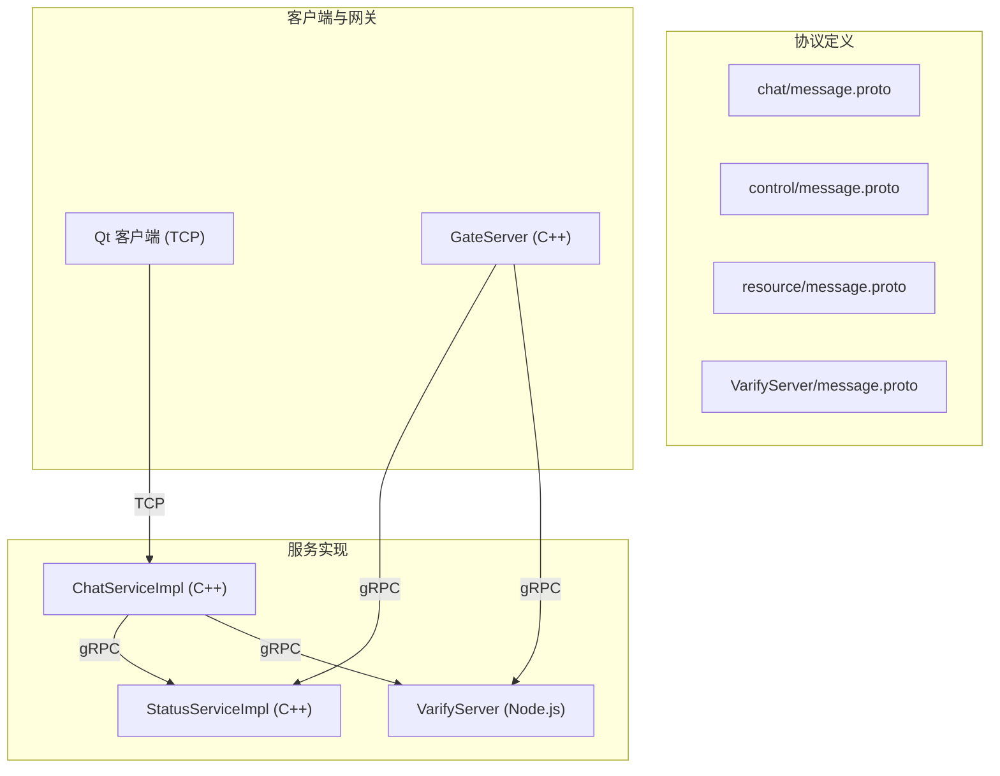
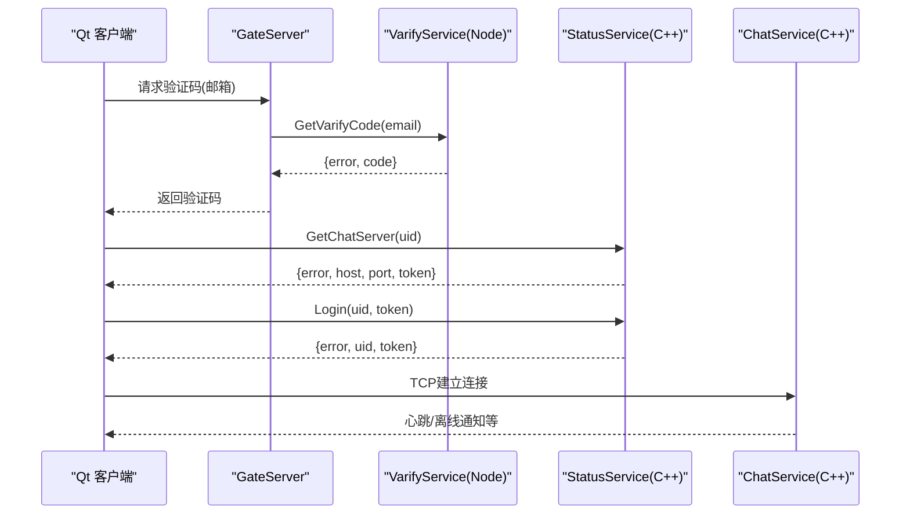
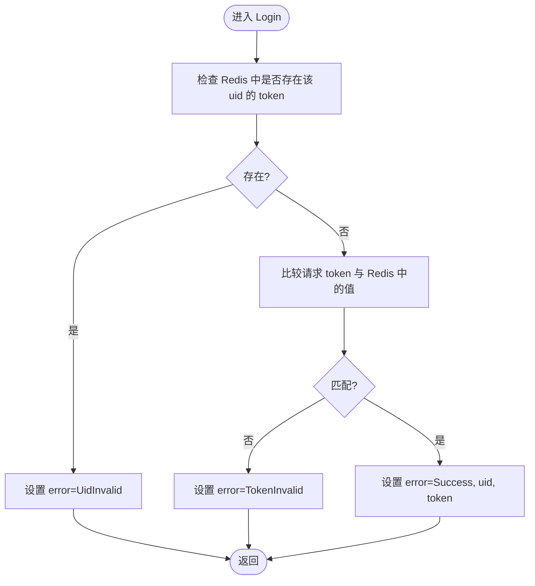
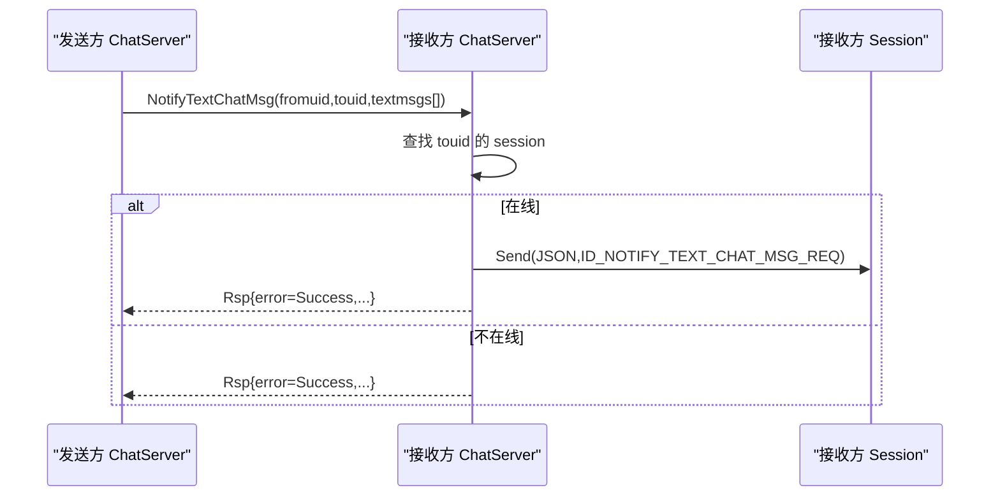
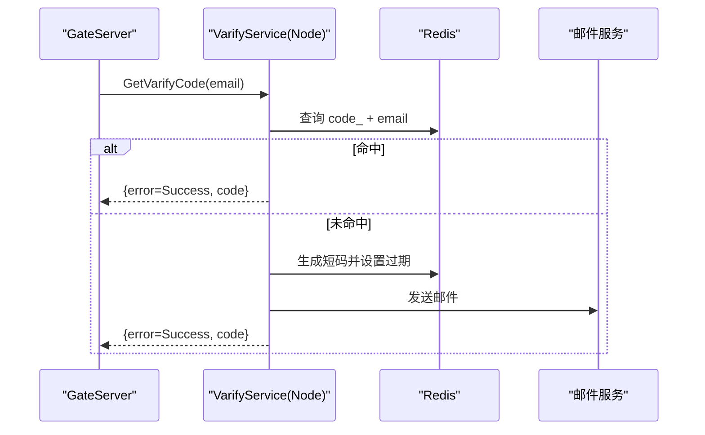
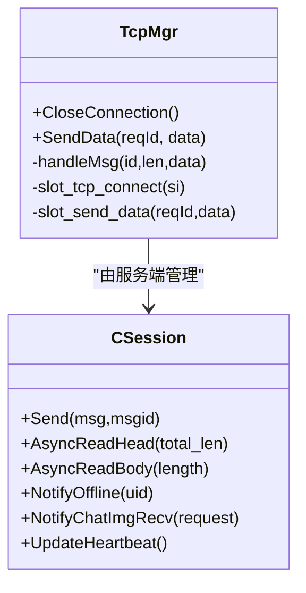
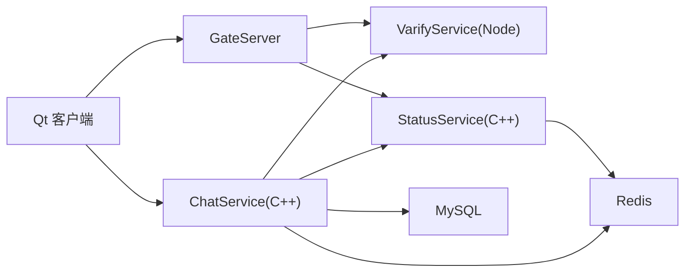

# gRPC协议设计

<cite>
**本文引用的文件**   
- [server/proto/chat/message.proto](file://server/proto/chat/message.proto)
- [server/proto/control/message.proto](file://server/proto/control/message.proto)
- [server/proto/resource/message.proto](file://server/proto/resource/message.proto)
- [server/VarifyServer/message.proto](file://server/VarifyServer/message.proto)
- [server/StatusServer/src/StatusServiceImpl.cpp](file://server/StatusServer/src/StatusServiceImpl.cpp)
- [server/ChatServer/src/ChatServiceImpl.cpp](file://server/ChatServer/src/ChatServiceImpl.cpp)
- [server/ChatServer/include/CSession.h](file://server/ChatServer/include/CSession.h)
- [server/ChatServer/include/const.h](file://server/ChatServer/include/const.h)
- [server/GateServer/include/VerifyGrpcClient.h](file://server/GateServer/include/VerifyGrpcClient.h)
- [server/GateServer/src/VerifyGrpcClient.cpp](file://server/GateServer/src/VerifyGrpcClient.cpp)
- [server/ChatServer/include/StatusGrpcClient.h](file://server/ChatServer/include/StatusGrpcClient.h)
- [server/ChatServer/src/StatusGrpcClient.cpp](file://server/ChatServer/src/StatusGrpcClient.cpp)
- [server/GateServer/src/StatusGrpcClient.cpp](file://server/GateServer/src/StatusGrpcClient.cpp)
- [client/llfcchat/include/tcpmgr.h](file://client/llfcchat/include/tcpmgr.h)
- [server/VarifyServer/server.js](file://server/VarifyServer/server.js)
- [server/VarifyServer/proto.js](file://server/VarifyServer/proto.js)
- [server/VarifyServer/const.js](file://server/VarifyServer/const.js)
</cite>

## 目录
1. [简介](#简介)
2. [项目结构](#项目结构)
3. [核心组件](#核心组件)
4. [架构总览](#架构总览)
5. [详细组件分析](#详细组件分析)
6. [依赖分析](#依赖分析)
7. [性能考虑](#性能考虑)
8. [故障排查指南](#故障排查指南)
9. [结论](#结论)
10. [附录](#附录)

## 简介
本文件为LLFCChat系统的gRPC协议设计文档，围绕protobuf定义规范、服务接口与错误处理机制展开。重点说明以下三个服务的接口设计与交互：
- StatusService：负责获取聊天服务器地址与登录校验（GetChatServer、Login）。
- ChatService：负责好友申请、认证、文本消息推送、图片通知、踢人等（NotifyAddFriend、RplyAddFriend、SendChatMsg、NotifyAuthFriend、NotifyTextChatMsg、NotifyKickUser、NotifyChatImgMsg）。
- VarifyService：负责验证码下发（GetVarifyCode）。

文档同时覆盖消息序列化格式、版本兼容性策略、错误码约定、请求响应示例、时序图与最佳实践，并提供客户端集成要点与调试方法。

## 项目结构
- 协议定义位于 server/proto 下，按业务域划分：
  - chat：聊天相关消息与服务
  - control：控制面消息与服务
  - resource：资源相关消息与服务
- 各服务实现：
  - StatusServer：C++实现StatusService
  - ChatServer：C++实现ChatService
  - VarifyServer：Node.js实现VarifyService
- 客户端通过TCP长连接与ChatServer通信；GateServer作为网关调用VarifyService与StatusService。

图表来源 
- [server/proto/chat/message.proto](file://server/proto/chat/message.proto)
- [server/proto/control/message.proto](file://server/proto/control/message.proto)
- [server/proto/resource/message.proto](file://server/proto/resource/message.proto)
- [server/VarifyServer/message.proto](file://server/VarifyServer/message.proto)
- [server/StatusServer/src/StatusServiceImpl.cpp](file://server/StatusServer/src/StatusServiceImpl.cpp)
- [server/ChatServer/src/ChatServiceImpl.cpp](file://server/ChatServer/src/ChatServiceImpl.cpp)
- [server/VarifyServer/server.js](file://server/VarifyServer/server.js)

章节来源
- [server/proto/chat/message.proto](file://server/proto/chat/message.proto)
- [server/proto/control/message.proto](file://server/proto/control/message.proto)
- [server/proto/resource/message.proto](file://server/proto/resource/message.proto)
- [server/VarifyServer/message.proto](file://server/VarifyServer/message.proto)

## 核心组件
- StatusService
  - GetChatServer：根据uid返回目标ChatServer的host/port及一次性token，并写入Redis用于后续Login校验。
  - Login：校验uid+token是否匹配且未重复使用，成功则返回用户信息与token。
- ChatService
  - NotifyAddFriend：向目标用户所在ChatServer发起好友申请通知。
  - RplyAddFriend：回复好友申请（同意/拒绝）。
  - SendChatMsg：发送单条文本消息（轻量通道）。
  - NotifyAuthFriend：批量同步认证历史消息至目标用户。
  - NotifyTextChatMsg：批量推送文本聊天数据。
  - NotifyKickUser：强制下线指定用户。
  - NotifyChatImgMsg：通知接收方图片消息已就绪（文件名、大小、thread_id等）。
- VarifyService
  - GetVarifyCode：生成或复用验证码，发送至邮箱，返回error与code。

章节来源
- [server/proto/chat/message.proto](file://server/proto/chat/message.proto)
- [server/proto/control/message.proto](file://server/proto/control/message.proto)
- [server/proto/resource/message.proto](file://server/proto/resource/message.proto)
- [server/VarifyServer/message.proto](file://server/VarifyServer/message.proto)
- [server/StatusServer/src/StatusServiceImpl.cpp](file://server/StatusServer/src/StatusServiceImpl.cpp)
- [server/ChatServer/src/ChatServiceImpl.cpp](file://server/ChatServer/src/ChatServiceImpl.cpp)
- [server/VarifyServer/server.js](file://server/VarifyServer/server.js)

## 架构总览
系统采用“状态服务 + 聊天服务 + 验证码服务”的分布式架构。客户端通过TCP与ChatServer保持长连接；GateServer作为统一入口，调用VarifyService与StatusService完成注册/登录流程；ChatServer内部通过gRPC跨服转发消息，将事件投递到对端在线会话。

图表来源 
- [server/VarifyServer/server.js](file://server/VarifyServer/server.js)
- [server/StatusServer/src/StatusServiceImpl.cpp](file://server/StatusServer/src/StatusServiceImpl.cpp)
- [server/ChatServer/src/ChatServiceImpl.cpp](file://server/ChatServer/src/ChatServiceImpl.cpp)
- [server/proto/chat/message.proto](file://server/proto/chat/message.proto)

## 详细组件分析

### 协议与消息定义
- 包名与语法
  - 所有proto文件使用syntax="proto3"，package=message。
- 服务与方法
  - StatusService：GetChatServer、Login
  - ChatService：NotifyAddFriend、RplyAddFriend、SendChatMsg、NotifyAuthFriend、NotifyTextChatMsg、NotifyKickUser、NotifyChatImgMsg
  - VarifyService：GetVarifyCode
- 关键消息字段
  - GetChatServerReq/Rsp：uid -> error/host/port/token
  - LoginReq/Rsp：uid/token -> error/uid/token
  - AddFriendReq/Rsp：applyuid/name/desc/icon/nick/sex/touid -> error/applyuid/touid
  - RplyFriendReq/Rsp：rplyuid/agree/touid -> error/rplyuid/touid
  - SendChatMsgReq/Rsp：fromuid/touid/message -> error/fromuid/touid
  - AuthFriendReq/Rsp：fromuid/touid/textmsgs[] -> error/fromuid/touid
  - TextChatMsgReq/Rsp：fromuid/touid/thread_id/textmsgs[] -> error/fromuid/touid/thread_id/textmsgs[]
  - KickUserReq/Rsp：uid -> error/uid
  - NotifyChatImgReq/Rsp：from_uid/to_uid/message_id/file_name/total_size/thread_id -> error/from_uid/to_uid/message_id/file_name/total_size/thread_id

注意：不同proto文件中存在细微差异（如TextChatData中chat_time vs thread_id位置），建议以最新resource版为准，并在演进时保持向后兼容。

章节来源
- [server/proto/chat/message.proto](file://server/proto/chat/message.proto)
- [server/proto/control/message.proto](file://server/proto/control/message.proto)
- [server/proto/resource/message.proto](file://server/proto/resource/message.proto)
- [server/VarifyServer/message.proto](file://server/VarifyServer/message.proto)

### StatusService 实现与错误处理
- GetChatServer
  - 从配置读取可用ChatServer列表，选择其一，生成唯一token并写入Redis（键前缀USERTOKENPREFIX+uid）。
  - 返回host/port/token/error=Success。
- Login
  - 校验Redis中是否存在该uid的token记录，若存在则视为重复登录，返回UidInvalid。
  - 校验token值是否一致，不一致返回TokenInvalid。
  - 校验通过返回Success，并回传uid与token。

图表来源 
- [server/StatusServer/src/StatusServiceImpl.cpp](file://server/StatusServer/src/StatusServiceImpl.cpp)
- [server/ChatServer/include/const.h](file://server/ChatServer/include/const.h)

章节来源
- [server/StatusServer/src/StatusServiceImpl.cpp](file://server/StatusServer/src/StatusServiceImpl.cpp)
- [server/ChatServer/include/const.h](file://server/ChatServer/include/const.h)

### ChatService 实现与消息路由
- NotifyAddFriend
  - 根据touid查找在线session，若存在则构造JSON并通过TCP下发ID_NOTIFY_ADD_FRIEND_REQ。
- NotifyAuthFriend
  - 拉取发送者基础信息（优先Redis，否则MySQL），组装chat_datas数组，下发ID_NOTIFY_AUTH_FRIEND_REQ。
- NotifyTextChatMsg
  - 将textmsgs[]序列化为chat_datas数组，下发ID_NOTIFY_TEXT_CHAT_MSG_REQ。
- NotifyKickUser
  - 找到session后触发离线通知并清理旧连接。
- NotifyChatImgMsg
  - 通知接收方图片消息就绪，包含message_id、file_name、total_size、thread_id等。

图表来源 
- [server/ChatServer/src/ChatServiceImpl.cpp](file://server/ChatServer/src/ChatServiceImpl.cpp)
- [server/ChatServer/include/CSession.h](file://server/ChatServer/include/CSession.h)

章节来源
- [server/ChatServer/src/ChatServiceImpl.cpp](file://server/ChatServer/src/ChatServiceImpl.cpp)
- [server/ChatServer/include/CSession.h](file://server/ChatServer/include/CSession.h)

### VarifyService 实现与验证码流程
- GetVarifyCode
  - 从Redis尝试获取已有验证码，不存在则生成短码并设置过期时间。
  - 发送邮件，返回error与code。
- Node.js服务加载proto并绑定服务。

图表来源 
- [server/VarifyServer/server.js](file://server/VarifyServer/server.js)
- [server/VarifyServer/proto.js](file://server/VarifyServer/proto.js)
- [server/VarifyServer/const.js](file://server/VarifyServer/const.js)

章节来源
- [server/VarifyServer/server.js](file://server/VarifyServer/server.js)
- [server/VarifyServer/proto.js](file://server/VarifyServer/proto.js)
- [server/VarifyServer/const.js](file://server/VarifyServer/const.js)

### 客户端集成与TCP消息
- Qt客户端通过TcpMgr维护TCP连接，发送/接收自定义头部+载荷的消息。
- 服务端通过CSession封装读写、心跳检测、异常处理与消息下发。
- 客户端需处理ID_NOTIFY_*系列通知消息，更新UI与本地缓存。

图表来源 
- [client/llfcchat/include/tcpmgr.h](file://client/llfcchat/include/tcpmgr.h)
- [server/ChatServer/include/CSession.h](file://server/ChatServer/include/CSession.h)

章节来源
- [client/llfcchat/include/tcpmgr.h](file://client/llfcchat/include/tcpmgr.h)
- [server/ChatServer/include/CSession.h](file://server/ChatServer/include/CSession.h)

## 依赖分析
- 客户端与GateServer：HTTP/业务逻辑（不在本文范围）
- GateServer：
  - 调用VarifyService（Node.js）获取验证码
  - 调用StatusService（C++）获取ChatServer与登录校验
- ChatServer：
  - 调用StatusService进行登录校验
  - 通过gRPC在ChatServer之间转发消息
- 存储：
  - Redis：验证码、用户token、用户基础信息缓存
  - MySQL：用户基础信息持久化

图表来源 
- [server/GateServer/include/VerifyGrpcClient.h](file://server/GateServer/include/VerifyGrpcClient.h)
- [server/GateServer/src/VerifyGrpcClient.cpp](file://server/GateServer/src/VerifyGrpcClient.cpp)
- [server/ChatServer/include/StatusGrpcClient.h](file://server/ChatServer/include/StatusGrpcClient.h)
- [server/ChatServer/src/StatusGrpcClient.cpp](file://server/ChatServer/src/StatusGrpcClient.cpp)
- [server/GateServer/src/StatusGrpcClient.cpp](file://server/GateServer/src/StatusGrpcClient.cpp)

章节来源
- [server/GateServer/include/VerifyGrpcClient.h](file://server/GateServer/include/VerifyGrpcClient.h)
- [server/GateServer/src/VerifyGrpcClient.cpp](file://server/GateServer/src/VerifyGrpcClient.cpp)
- [server/ChatServer/include/StatusGrpcClient.h](file://server/ChatServer/include/StatusGrpcClient.h)
- [server/ChatServer/src/StatusGrpcClient.cpp](file://server/ChatServer/src/StatusGrpcClient.cpp)
- [server/GateServer/src/StatusGrpcClient.cpp](file://server/GateServer/src/StatusGrpcClient.cpp)

## 性能考虑
- gRPC连接池
  - StatusConPool与RPConPool均实现了基于队列的连接池，避免频繁创建销毁Channel与Stub。
- 异步I/O
  - ChatServer使用Boost.Asio进行非阻塞读写，提升吞吐。
- 缓存策略
  - 用户基础信息优先读Redis，未命中再查MySQL并回填缓存。
- 心跳与超时
  - CSession维护心跳时间戳，定期检测过期连接，及时释放资源。
- 消息批量化
  - TextChatMsg与AuthFriend支持repeated字段，减少往返次数。

[本节为通用指导，无需特定文件引用]

## 故障排查指南
- 常见错误码
  - Success=0：成功
  - RPCFailed=1002：RPC调用失败
  - TokenInvalid=1010：Token无效
  - UidInvalid=1011：UID无效
  - VarifyExpired=1003：验证码过期
  - VarifyCodeErr=1004：验证码错误
- 定位步骤
  - 检查gRPC调用返回的status.ok()与reply.error字段。
  - 查看Redis中对应key是否存在（如utoken_{uid}、code_{email}）。
  - 确认ChatServer配置中chatservers列表有效。
  - 观察CSession心跳是否过期，必要时重启连接。
- 日志与调试
  - 在StatusServiceImpl与ChatServiceImpl中添加关键路径日志。
  - 使用网络抓包工具验证gRPC帧与TCP帧内容。
  - 对VarifyService增加Redis与邮件发送的日志输出。

章节来源
- [server/ChatServer/include/const.h](file://server/ChatServer/include/const.h)
- [server/StatusServer/src/StatusServiceImpl.cpp](file://server/StatusServer/src/StatusServiceImpl.cpp)
- [server/ChatServer/src/ChatServiceImpl.cpp](file://server/ChatServer/src/ChatServiceImpl.cpp)
- [server/VarifyServer/server.js](file://server/VarifyServer/server.js)

## 结论
本设计通过清晰的proto定义与分层服务，实现了可扩展、可观测的聊天系统。StatusService负责路由与鉴权，ChatService负责消息路由与推送，VarifyService提供验证码能力。配合连接池、缓存与心跳机制，系统在稳定性与性能上具备良好基础。建议在后续迭代中统一proto差异、完善错误码体系与监控埋点。

[本节为总结性内容，无需特定文件引用]

## 附录

### 请求/响应示例（文字描述）
- GetChatServer
  - 请求：uid=12345
  - 响应：error=0, host="chat1.llfc.club", port="50052", token="a1b2c3d4"
- Login
  - 请求：uid=12345, token="a1b2c3d4"
  - 响应：error=0, uid=12345, token="a1b2c3d4"
- GetVarifyCode
  - 请求：email="user@example.com"
  - 响应：error=0, email="user@example.com", code="X7Y9"
- NotifyTextChatMsg
  - 请求：fromuid=111, touid=222, thread_id=1001, textmsgs=[{unique_id:"u1", msg_id:1, msgcontent:"你好"}]
  - 响应：error=0, fromuid=111, touid=222, thread_id=1001, textmsgs[...]
- NotifyChatImgMsg
  - 请求：from_uid=111, to_uid=222, message_id=2001, file_name="img.png", total_size=102400, thread_id=1001
  - 响应：error=0, from_uid=111, to_uid=222, message_id=2001, file_name="img.png", total_size=102400, thread_id=1001

[本节为概念性示例，无需特定文件引用]

### 版本兼容性与演进策略
- 新增字段应置于末尾，保证旧客户端忽略未知字段。
- 删除字段应标记deprecated并保留一段时间。
- 枚举值扩展需保持原有值语义不变。
- 多proto文件间差异（如TextChatData字段顺序）应在发布前统一，避免歧义。

[本节为通用指导，无需特定文件引用]

### 客户端集成要点（Qt）
- 使用TcpMgr建立连接与发送数据，处理ID_NOTIFY_*系列消息回调。
- 登录流程：先GetChatServer获取host/port/token，再Login校验成功后建立TCP连接。
- 心跳：客户端定时发送心跳，服务端CSession维护心跳时间戳。
- 重连：连接断开后指数退避重试，避免雪崩。

章节来源
- [client/llfcchat/include/tcpmgr.h](file://client/llfcchat/include/tcpmgr.h)
- [server/ChatServer/include/CSession.h](file://server/ChatServer/include/CSession.h)

### 调试方法
- gRPC调试
  - 使用grpcurl或gRPC-Web控制台发送测试请求。
  - 在服务端打印request与reply关键字段。
- TCP调试
  - 使用Wireshark抓取端口流量，解析自定义头部与载荷。
  - 在CSession::Send与HandleWrite处添加日志。
- 验证码调试
  - 检查Redis key是否存在与过期时间。
  - 检查邮件服务配置与发送结果。

章节来源
- [server/StatusServer/src/StatusServiceImpl.cpp](file://server/StatusServer/src/StatusServiceImpl.cpp)
- [server/ChatServer/src/ChatServiceImpl.cpp](file://server/ChatServer/src/ChatServiceImpl.cpp)
- [server/VarifyServer/server.js](file://server/VarifyServer/server.js)