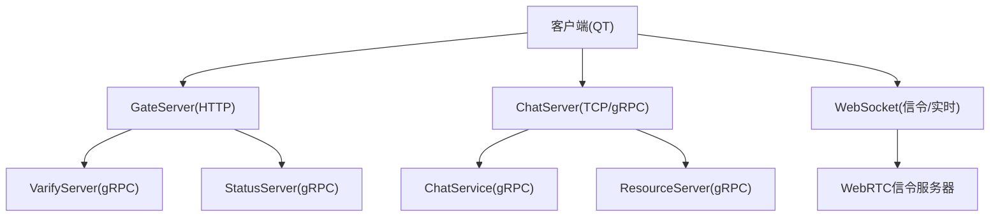
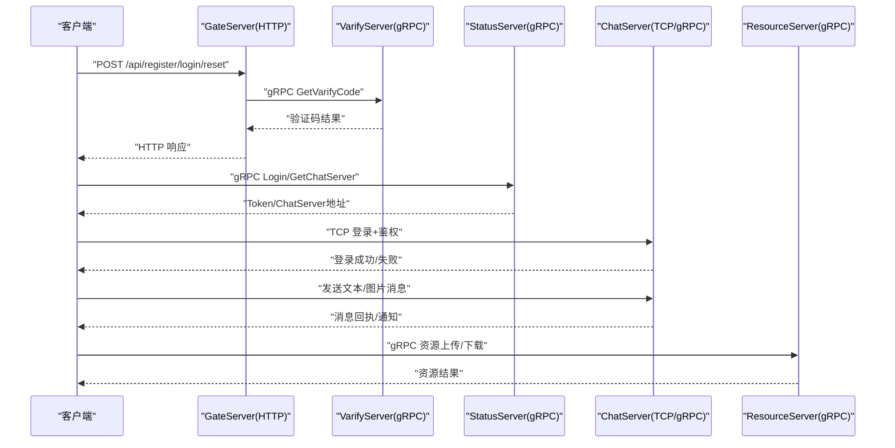
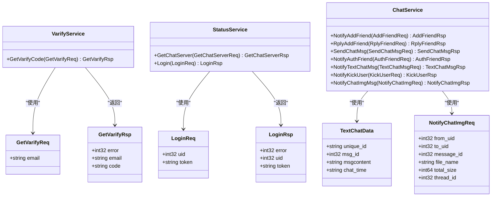
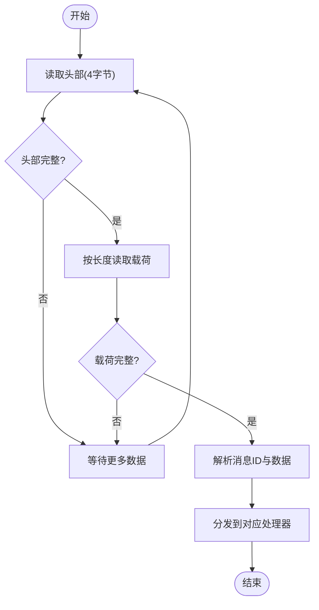
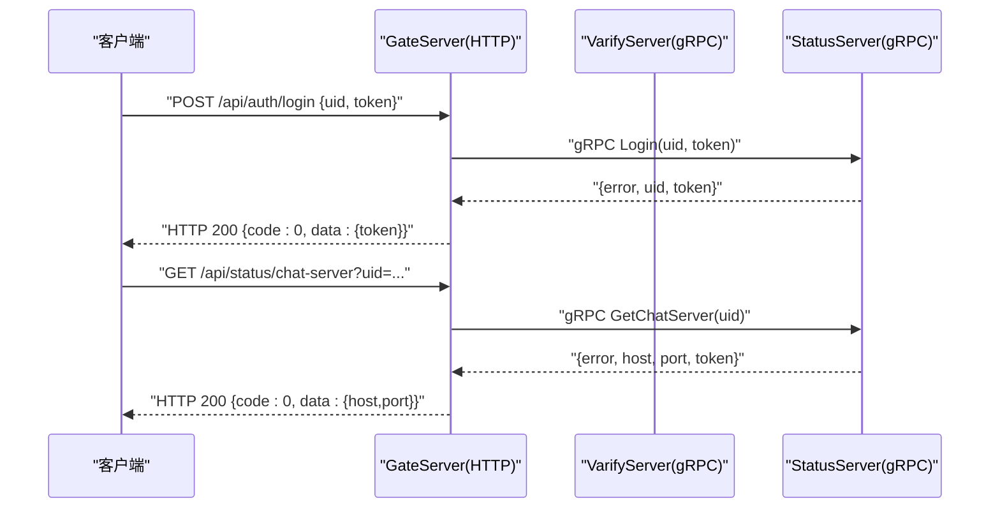
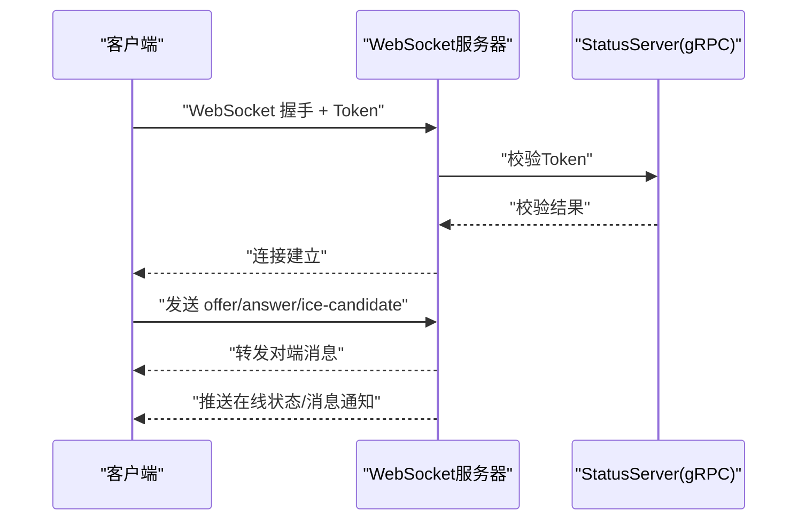
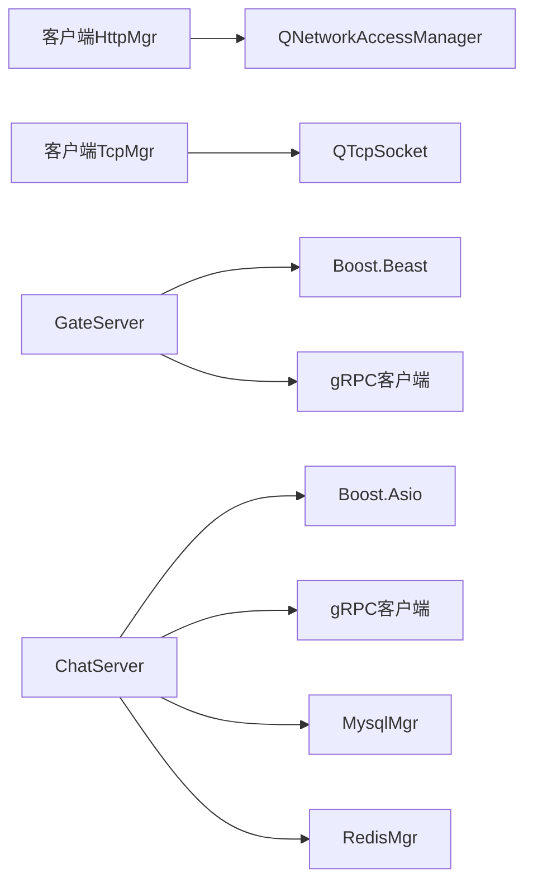

# 通信协议设计

<cite>
**本文引用的文件**   
- [README.md](file://README.md)
- [message.proto（聊天）](file://server/proto/chat/message.proto)
- [message.proto（控制）](file://server/proto/control/message.proto)
- [message.proto（资源）](file://server/proto/resource/message.proto)
- [tcpmgr.h](file://client/llfcchat/include/tcpmgr.h)
- [httpmgr.h](file://client/llfcchat/include/httpmgr.h)
- [global.h](file://client/llfcchat/include/global.h)
- [HttpConnection.h](file://server/GateServer/include/HttpConnection.h)
- [CSession.h](file://server/ChatServer/include/CSession.h)
- [const.h](file://server/ChatServer/include/const.h)
- [data.h](file://server/ChatServer/include/data.h)
</cite>

## 目录
1. [简介](#简介)
2. [项目结构](#项目结构)
3. [核心组件](#核心组件)
4. [架构总览](#架构总览)
5. [详细组件分析](#详细组件分析)
6. [依赖关系分析](#依赖关系分析)
7. [性能考量](#性能考量)
8. [故障排查指南](#故障排查指南)
9. [结论](#结论)
10. [附录](#附录)

## 简介
本文件为 LLFCChat 系统的通信协议设计文档，覆盖以下方面：
- gRPC 微服务间通信：protobuf 定义、服务接口规范与错误处理机制
- TCP 长连接协议：消息帧格式、粘包处理、心跳保活与断线重连
- HTTP API 接口规范：RESTful 原则、请求响应格式与认证授权流程
- WebSocket 实时通信：使用场景与数据交换格式
- 协议时序图、消息格式示例与错误码定义
- 客户端集成指南与调试工具使用方法

## 项目结构
LLFCChat 采用多服务架构，包含 GateServer（HTTP）、ChatServer（TCP/gRPC）、ResourceServer（资源）、StatusServer（状态）、VarifyServer（验证码）等。客户端通过 Qt 实现 HTTP/TCP 管理模块，并通过 gRPC 调用后端服务。

图表来源
- [HttpConnection.h:1-36](file://server/GateServer/include/HttpConnection.h#L1-L36)
- [CSession.h:1-86](file://server/ChatServer/include/CSession.h#L1-L86)
- [message.proto（聊天）:1-167](file://server/proto/chat/message.proto#L1-L167)
- [message.proto（控制）:1-143](file://server/proto/control/message.proto#L1-L143)
- [message.proto（资源）:1-169](file://server/proto/resource/message.proto#L1-L169)

章节来源
- [README.md:1-112](file://README.md#L1-L112)

## 核心组件
- 客户端 HTTP 管理器：封装 REST 请求、统一回调与错误码
- 客户端 TCP 管理器：封装长连接、消息帧编解码、粘包处理、心跳与重连
- 服务端 HTTP 连接：基于 Beast 的异步 HTTP 解析与响应
- 服务端 TCP 会话：基于 Asio 的异步读写、心跳检测、异常处理
- Protobuf 定义：gRPC 服务与消息体定义，贯穿各服务

章节来源
- [httpmgr.h:1-34](file://client/llfcchat/include/httpmgr.h#L1-L34)
- [tcpmgr.h:1-90](file://client/llfcchat/include/tcpmgr.h#L1-L90)
- [HttpConnection.h:1-36](file://server/GateServer/include/HttpConnection.h#L1-L36)
- [CSession.h:1-86](file://server/ChatServer/include/CSession.h#L1-L86)
- [message.proto（聊天）:1-167](file://server/proto/chat/message.proto#L1-L167)

## 架构总览
系统分层清晰：
- 接入层：GateServer 提供 HTTP 接口；ChatServer 提供 TCP/gRPC；可选 WebSocket 用于信令或实时推送
- 业务层：ChatServiceImpl、LogicSystem 等处理聊天、好友、消息路由
- 支撑层：MysqlMgr、RedisMgr、分布式锁、文件系统等
- 外部依赖：邮箱验证码服务、数据库、缓存、对象存储

图表来源
- [message.proto（控制）:1-143](file://server/proto/control/message.proto#L1-L143)
- [message.proto（聊天）:1-167](file://server/proto/chat/message.proto#L1-L167)
- [message.proto（资源）:1-169](file://server/proto/resource/message.proto#L1-L169)
- [HttpConnection.h:1-36](file://server/GateServer/include/HttpConnection.h#L1-L36)
- [CSession.h:1-86](file://server/ChatServer/include/CSession.h#L1-L86)

## 详细组件分析

### gRPC 协议与服务接口
- 服务划分
  - VarifyService：验证码获取
  - StatusService：查询聊天服务器地址、用户登录校验
  - ChatService：好友申请、认证、文本/图片消息通知、踢人、图片资源通知
- 消息体字段
  - 通用 error 字段表示错误码
  - 用户标识 uid/fromuid/touid
  - 消息唯一标识 unique_id、msg_id、thread_id
  - 内容字段 message/msgcontent
  - 图片资源 file_name、total_size、message_id
- 错误处理
  - 所有 RPC 返回均包含 error 字段，客户端据此判断成功与否
  - 服务端错误码集中定义于 const.h

图表来源
- [message.proto（聊天）:1-167](file://server/proto/chat/message.proto#L1-L167)
- [message.proto（控制）:1-143](file://server/proto/control/message.proto#L1-L143)
- [message.proto（资源）:1-169](file://server/proto/resource/message.proto#L1-L169)

章节来源
- [message.proto（聊天）:1-167](file://server/proto/chat/message.proto#L1-L167)
- [message.proto（控制）:1-143](file://server/proto/control/message.proto#L1-L143)
- [message.proto（资源）:1-169](file://server/proto/resource/message.proto#L1-L169)
- [const.h:1-104](file://server/ChatServer/include/const.h#L1-L104)

### TCP 长连接协议
- 帧格式
  - 头部固定长度 HEAD_TOTAL_LEN=4，其中 ID 占 HEAD_ID_LEN=2，数据长度 HEAD_DATA_LEN=2
  - 载荷为二进制或 JSON 序列化后的字节流
- 粘包处理
  - 接收端维护缓冲区，先读满头部，再按长度读取完整载荷
  - 未达长度时继续累积，避免粘包/拆包问题
- 心跳保活
  - 客户端周期性发送心跳请求（ID_HEART_BEAT_REQ），服务端回复心跳（ID_HEARTBEAT_RSP）
  - 服务端记录上次心跳时间，超时则判定连接异常并关闭
- 断线重连
  - 客户端检测到连接关闭或心跳超时后，进行指数退避重连
  - 重连成功后重新登录并恢复会话

图表来源
- [const.h:1-104](file://server/ChatServer/include/const.h#L1-L104)
- [CSession.h:1-86](file://server/ChatServer/include/CSession.h#L1-L86)
- [tcpmgr.h:1-90](file://client/llfcchat/include/tcpmgr.h#L1-L90)

章节来源
- [const.h:1-104](file://server/ChatServer/include/const.h#L1-L104)
- [CSession.h:1-86](file://server/ChatServer/include/CSession.h#L1-L86)
- [tcpmgr.h:1-90](file://client/llfcchat/include/tcpmgr.h#L1-L90)
- [global.h:1-296](file://client/llfcchat/include/global.h#L1-L296)

### HTTP API 接口规范
- 设计原则
  - RESTful：使用标准 HTTP 方法 GET/POST/PUT/DELETE
  - 路径清晰：/api/auth、/api/user、/api/chat 等
  - 统一响应格式：{code, message, data}
- 认证授权
  - 首次注册/重置密码需验证码（VarifyService）
  - 登录后获取 Token，后续请求在 Header 中携带 Authorization
  - GateServer 校验 Token 有效性，转发至 StatusServer 验证
- 请求响应示例
  - 登录：POST /api/auth/login，请求体包含 uid/token
  - 获取聊天服务器：GET /api/status/chat-server?uid=...
  - 验证码：POST /api/verify/code，请求体包含 email

图表来源
- [HttpConnection.h:1-36](file://server/GateServer/include/HttpConnection.h#L1-L36)
- [message.proto（控制）:1-143](file://server/proto/control/message.proto#L1-L143)

章节来源
- [httpmgr.h:1-34](file://client/llfcchat/include/httpmgr.h#L1-L34)
- [HttpConnection.h:1-36](file://server/GateServer/include/HttpConnection.h#L1-L36)
- [message.proto（控制）:1-143](file://server/proto/control/message.proto#L1-L143)

### WebSocket 实时通信
- 使用场景
  - WebRTC 信令交换：SDP 协商、ICE 候选交换
  - 实时推送：在线状态变更、消息到达提醒
- 数据交换格式
  - 统一 JSON 帧：{type, payload}
  - type 包括：offer、answer、ice-candidate、notify-online、notify-message
- 安全策略
  - 握手阶段校验 Token，建立连接后绑定用户会话
  - 限制消息频率与大小，防止滥用

[本图为概念性流程图，不直接映射具体源码文件]

### 错误码定义
- 通用错误码
  - SUCCESS = 0
  - ERR_JSON = 1（JSON 解析失败）
  - ERR_NETWORK = 2（网络错误）
- 服务端错误码
  - Error_Json = 1001
  - RPCFailed = 1002
  - VarifyExpired = 1003
  - VarifyCodeErr = 1004
  - UserExist = 1005
  - PasswdErr = 1006
  - EmailNotMatch = 1007
  - PasswdUpFailed = 1008
  - PasswdInvalid = 1009
  - TokenInvalid = 1010
  - UidInvalid = 1011
  - CREATE_CHAT_FAILED = 1012
  - LOAD_CHAT_FAILED = 1013

章节来源
- [global.h:1-296](file://client/llfcchat/include/global.h#L1-L296)
- [const.h:1-104](file://server/ChatServer/include/const.h#L1-L104)

## 依赖关系分析
- 客户端依赖
  - httpmgr 依赖 QNetworkAccessManager 发起 HTTP 请求
  - tcpmgr 依赖 QTcpSocket 实现长连接与消息收发
- 服务端依赖
  - GateServer 依赖 Beast 解析 HTTP，gRPC 调用 Varify/Status
  - ChatServer 依赖 Asio 实现 TCP 会话，gRPC 调用 Chat/Resource
  - 数据存储依赖 MysqlMgr、RedisMgr，分布式锁用于并发控制

图表来源
- [httpmgr.h:1-34](file://client/llfcchat/include/httpmgr.h#L1-L34)
- [tcpmgr.h:1-90](file://client/llfcchat/include/tcpmgr.h#L1-L90)
- [HttpConnection.h:1-36](file://server/GateServer/include/HttpConnection.h#L1-L36)
- [CSession.h:1-86](file://server/ChatServer/include/CSession.h#L1-L86)

章节来源
- [httpmgr.h:1-34](file://client/llfcchat/include/httpmgr.h#L1-L34)
- [tcpmgr.h:1-90](file://client/llfcchat/include/tcpmgr.h#L1-L90)
- [HttpConnection.h:1-36](file://server/GateServer/include/HttpConnection.h#L1-L36)
- [CSession.h:1-86](file://server/ChatServer/include/CSession.h#L1-L86)

## 性能考量
- 连接复用与线程池
  - 使用 IO 线程池（AsioIOServicePool）提升并发处理能力
  - 客户端发送队列与当前包分离，避免阻塞
- 内存与缓冲
  - 合理设置 MAX_LENGTH、HEAD_TOTAL_LEN，减少拷贝与分配
  - 使用环形缓冲或零拷贝技术优化大文件传输
- 心跳与超时
  - 心跳间隔与超时阈值需根据网络环境调优
  - 快速失败与重试策略降低无效等待
- 序列化与压缩
  - 对大消息启用 gzip 压缩，减少带宽占用
  - Protobuf 默认高效，避免频繁创建/销毁对象

[本节为通用指导，不直接分析具体文件]

## 故障排查指南
- 常见问题
  - 粘包/拆包：检查头部长度解析与缓冲区累积逻辑
  - 心跳超时：确认客户端心跳发送与服务器心跳检测配置
  - 登录失败：核对 Token 生成与校验流程
  - 资源下载失败：检查分片序号与续传逻辑
- 调试建议
  - 使用 Wireshark 抓包分析 TCP 帧
  - 启用详细日志，记录消息 ID 与长度
  - 单元测试覆盖边界条件（空消息、超长消息、乱序）

章节来源
- [const.h:1-104](file://server/ChatServer/include/const.h#L1-L104)
- [CSession.h:1-86](file://server/ChatServer/include/CSession.h#L1-L86)
- [tcpmgr.h:1-90](file://client/llfcchat/include/tcpmgr.h#L1-L90)

## 结论
LLFCChat 的通信协议设计以 gRPC 为核心，结合 TCP 长连接与 HTTP API，形成稳定高效的微服务架构。通过统一的错误码、心跳保活与断线重连机制，保障了系统的健壮性与可扩展性。WebSocket 作为补充，满足实时信令与推送需求。建议在后续迭代中进一步优化性能与安全性，完善监控与诊断能力。

[本节为总结，不直接分析具体文件]

## 附录
- 客户端集成步骤
  - 初始化 HttpMgr，配置网关地址
  - 初始化 TcpMgr，设置心跳间隔与重连策略
  - 订阅信号槽，处理登录、消息、资源回调
- 调试工具
  - Postman：测试 HTTP API
  - grpcurl：测试 gRPC 接口
  - Wireshark：分析 TCP/UDP 流量
  - 日志收集：集中化日志平台

[本节为操作指南，不直接分析具体文件]