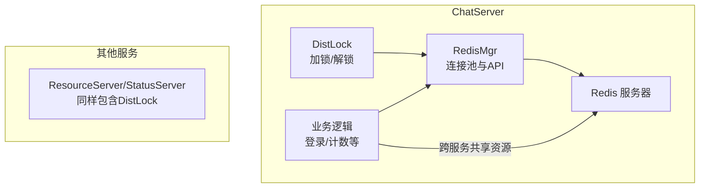
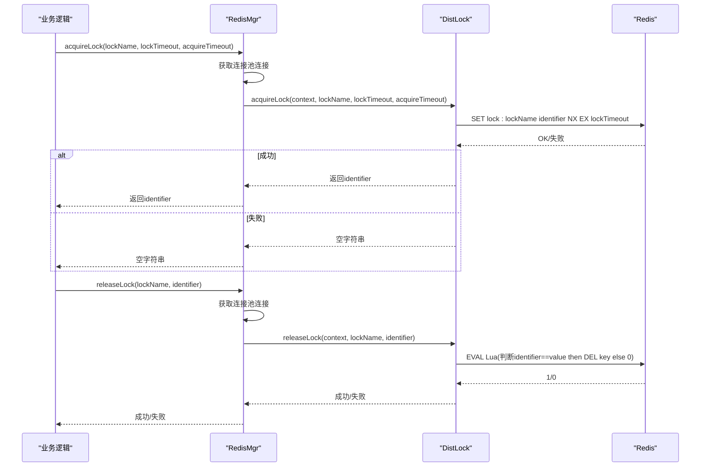
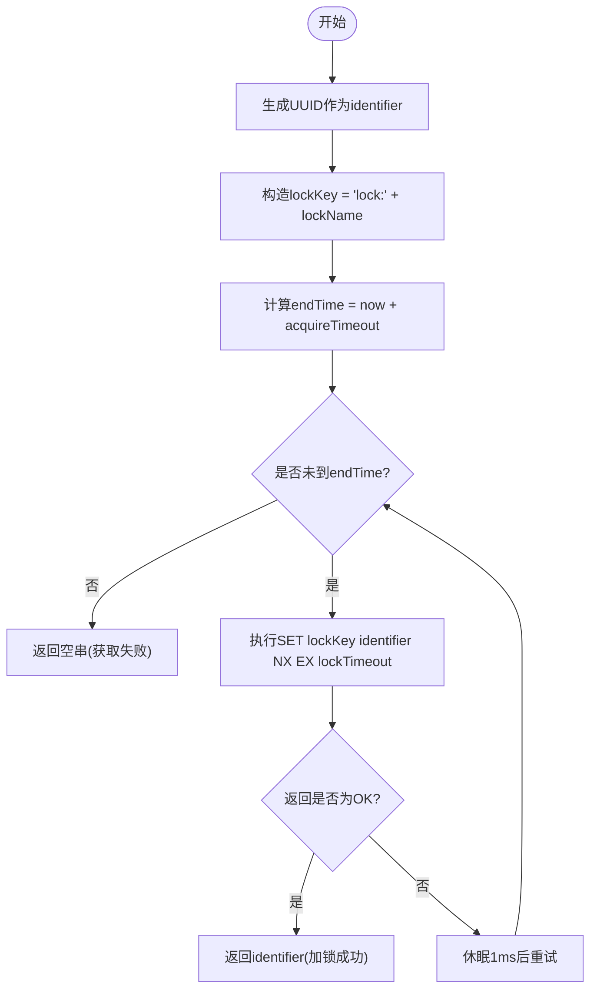
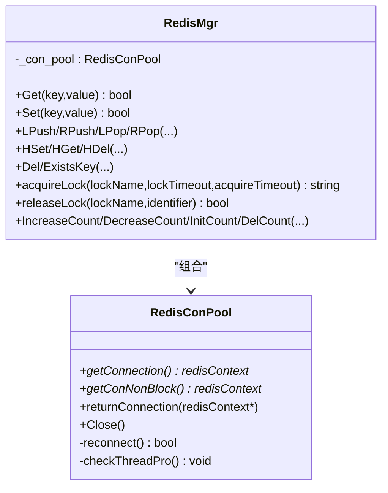
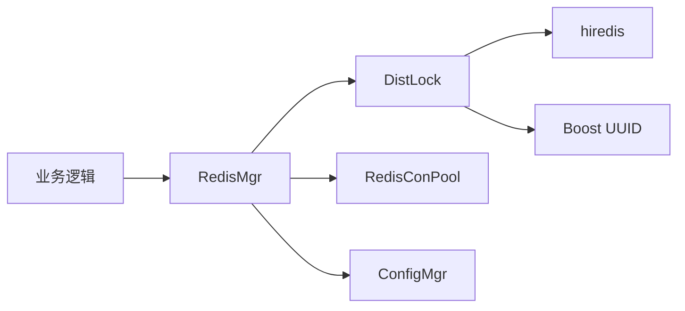

# 分布式锁系统

<cite>
**本文引用的文件**   
- [DistLock.h](file://server/ChatServer/include/DistLock.h)
- [DistLock.cpp](file://server/ChatServer/src/DistLock.cpp)
- [RedisMgr.h](file://server/ChatServer/include/RedisMgr.h)
- [RedisMgr.cpp](file://server/ChatServer/src/RedisMgr.cpp)
- [const.h](file://server/ChatServer/include/const.h)
- [day32分布式锁设计思路.md](file://开发文档/day32分布式锁设计思路.md)
- [day41-分布式死锁解决方案.md](file://开发文档/day41-分布式死锁解决方案.md)
- [day33单服程踢人逻辑.md](file://开发文档/day33单服程踢人逻辑.md)
</cite>

## 目录
1. [引言](#引言)
2. [项目结构](#项目结构)
3. [核心组件](#核心组件)
4. [架构总览](#架构总览)
5. [详细组件分析](#详细组件分析)
6. [依赖关系分析](#依赖关系分析)
7. [性能考量](#性能考量)
8. [故障排查指南](#故障排查指南)
9. [结论](#结论)
10. [附录：使用示例与最佳实践](#附录使用示例与最佳实践)

## 引言
本文件面向LLFCChat系统的分布式锁子系统，系统性阐述基于Redis的分布式锁实现机制、原子性保证、并发控制策略、超时与死锁预防、生命周期管理与异常恢复，并给出在多服务环境下的使用示例与最佳实践。该子系统由统一的DistLock类提供加锁/解锁能力，通过RedisMgr封装连接池与命令执行，配合常量配置与Lua脚本保障原子性与安全性。

## 项目结构
分布式锁相关代码主要分布在以下模块：
- DistLock：分布式锁核心实现（获取、释放、UUID标识生成）
- RedisMgr：Redis连接池、命令封装、加锁/解锁接口桥接
- const：分布式锁常量（锁名前缀、超时时间等）
- 开发文档：设计思路、死锁分析与使用案例

图表来源
- [DistLock.h:1-18](file://server/ChatServer/include/DistLock.h#L1-L18)
- [DistLock.cpp:1-73](file://server/ChatServer/src/DistLock.cpp#L1-L73)
- [RedisMgr.h:267-305](file://server/ChatServer/include/RedisMgr.h#L267-L305)
- [RedisMgr.cpp:362-393](file://server/ChatServer/src/RedisMgr.cpp#L362-L393)

章节来源
- [DistLock.h:1-18](file://server/ChatServer/include/DistLock.h#L1-L18)
- [DistLock.cpp:1-73](file://server/ChatServer/src/DistLock.cpp#L1-L73)
- [RedisMgr.h:267-305](file://server/ChatServer/include/RedisMgr.h#L267-L305)
- [RedisMgr.cpp:362-393](file://server/ChatServer/src/RedisMgr.cpp#L362-L393)

## 核心组件
- DistLock：提供静态实例与两个核心方法
  - acquireLock(context, lockName, lockTimeout, acquireTimeout)
  - releaseLock(context, lockName, identifier)
- RedisMgr：管理Redis连接池，暴露acquireLock/releaseLock供上层调用，内部委托DistLock完成具体操作
- 常量配置：LOCK_TIME_OUT、ACQUIRE_TIME_OUT、LOCK_PREFIX、LOCK_COUNT等

章节来源
- [DistLock.h:1-18](file://server/ChatServer/include/DistLock.h#L1-L18)
- [RedisMgr.h:267-305](file://server/ChatServer/include/RedisMgr.h#L267-L305)
- [const.h:81-94](file://server/ChatServer/include/const.h#L81-L94)

## 架构总览
下图展示从业务层到Redis的完整调用链，以及加锁/解锁的关键步骤。

图表来源
- [RedisMgr.cpp:362-393](file://server/ChatServer/src/RedisMgr.cpp#L362-L393)
- [DistLock.cpp:27-49](file://server/ChatServer/src/DistLock.cpp#L27-L49)
- [DistLock.cpp:52-73](file://server/ChatServer/src/DistLock.cpp#L52-L73)

## 详细组件分析

### 分布式锁核心：DistLock
- 加锁流程
  - 生成全局唯一标识符identifier（UUID）
  - 构造锁键lockKey = "lock:" + lockName
  - 设置获取超时endTime = now + acquireTimeout
  - 循环尝试SET lockKey identifier NX EX lockTimeout，直到成功或超时
  - 成功则返回identifier；失败返回空串
- 解锁流程
  - 使用Lua脚本原子判断当前值是否等于identifier，是则DEL key，否则返回0
  - 确保只有持有者能释放锁，避免误删

图表来源
- [DistLock.cpp:27-49](file://server/ChatServer/src/DistLock.cpp#L27-L49)

章节来源
- [DistLock.cpp:1-73](file://server/ChatServer/src/DistLock.cpp#L1-L73)

### Redis连接与命令封装：RedisMgr
- 连接池管理
  - 初始化时创建固定数量连接，支持AUTH认证
  - 后台线程定期PING检测连接健康，失败则重建连接
  - getConnection/getConNonBlock/returnConnection保证线程安全
- 加锁/解锁接口
  - acquireLock/releaseLock内部获取连接，委托DistLock执行
  - 使用Defer确保连接正确归还

图表来源
- [RedisMgr.h:9-265](file://server/ChatServer/include/RedisMgr.h#L9-L265)
- [RedisMgr.h:267-305](file://server/ChatServer/include/RedisMgr.h#L267-L305)
- [RedisMgr.cpp:1-11](file://server/ChatServer/src/RedisMgr.cpp#L1-L11)

章节来源
- [RedisMgr.h:9-265](file://server/ChatServer/include/RedisMgr.h#L9-L265)
- [RedisMgr.cpp:1-11](file://server/ChatServer/src/RedisMgr.cpp#L1-L11)

### 常量与配置
- LOCK_TIME_OUT：锁持有超时（秒），防止死锁
- ACQUIRE_TIME_OUT：获取锁最大等待时间（秒），避免无限重试
- LOCK_PREFIX、LOCK_COUNT：锁键命名规范与计数器键名

章节来源
- [const.h:81-94](file://server/ChatServer/include/const.h#L81-L94)

## 依赖关系分析
- DistLock依赖hiredis进行Redis通信，依赖Boost UUID生成唯一标识
- RedisMgr依赖ConfigMgr读取Redis配置，依赖RedisConPool管理连接
- 业务逻辑通过RedisMgr间接使用DistLock，形成清晰的解耦

图表来源
- [DistLock.cpp:1-11](file://server/ChatServer/src/DistLock.cpp#L1-L11)
- [RedisMgr.cpp:1-11](file://server/ChatServer/src/RedisMgr.cpp#L1-L11)

章节来源
- [DistLock.cpp:1-11](file://server/ChatServer/src/DistLock.cpp#L1-L11)
- [RedisMgr.cpp:1-11](file://server/ChatServer/src/RedisMgr.cpp#L1-L11)

## 性能考量
- 加锁重试间隔为1ms，避免忙等，降低CPU占用
- 连接池复用减少频繁建立连接的开销
- 后台健康检查线程周期性PING，快速剔除坏连接并重建
- 使用Lua脚本在Redis端原子执行，减少网络往返与竞态条件

[本节为通用指导，不直接分析具体文件]

## 故障排查指南
- 加锁失败
  - 检查acquireTimeout是否过短
  - 确认Redis可达且未处于高负载状态
  - 观察是否存在长时间持有锁的业务逻辑
- 解锁失败
  - 确认传入identifier与加锁时一致
  - 检查是否被其他进程覆盖或提前过期
- 连接问题
  - 查看RedisConPool的健康检查日志
  - 确认AUTH密码与端口配置正确

章节来源
- [RedisMgr.cpp:137-206](file://server/ChatServer/src/RedisMgr.cpp#L137-L206)
- [RedisMgr.cpp:209-253](file://server/ChatServer/src/RedisMgr.cpp#L209-L253)

## 结论
本分布式锁子系统以Redis为核心，结合UUID标识、NX+EX原子设置与Lua脚本原子删除，实现了可靠的分布式互斥。通过连接池与健康检查提升稳定性，通过合理超时与重试策略避免死锁与无限等待。建议在多服务环境下统一使用RedisMgr提供的接口，严格遵循“先加锁、后处理、再解锁”的生命周期，并结合监控与日志定位问题。

[本节为总结，不直接分析具体文件]

## 附录：使用示例与最佳实践

### 典型使用流程（登录互斥）
- 拼接用户级锁键：lock_key = LOCK_PREFIX + uid_str
- 调用RedisMgr::acquireLock获取identifier
- 使用Defer确保异常路径也能释放锁
- 执行业务逻辑（如踢人、更新会话等）
- 调用RedisMgr::releaseLock释放锁

章节来源
- [day33单服程踢人逻辑.md:275-282](file://开发文档/day33单服程踢人逻辑.md#L275-L282)

### 计数器保护（登录数增减）
- 使用LOCK_COUNT作为全局锁键
- 增加/减少计数前后分别加锁与解锁
- 利用HGet/HSet/HDel操作字段计数

章节来源
- [RedisMgr.cpp:395-461](file://server/ChatServer/src/RedisMgr.cpp#L395-L461)

### 设计要点与注意事项
- 锁键命名规范：建议采用“lock:业务域:资源标识”，避免冲突
- 超时设置：lockTimeout应大于临界区最长执行时间；acquireTimeout根据业务容忍度设定
- 标识符管理：必须保存identifier并在释放时使用同一值
- 原子性保证：加锁使用SET NX EX，解锁使用EVAL Lua脚本
- 错误处理：捕获网络异常、Redis错误码，记录日志并回滚事务（如有）
- 监控指标：加锁成功率、平均耗时、解锁失败率、连接池健康状态

章节来源
- [day32分布式锁设计思路.md:95-189](file://开发文档/day32分布式锁设计思路.md#L95-L189)
- [day32分布式锁设计思路.md:193-260](file://开发文档/day32分布式锁设计思路.md#L193-L260)