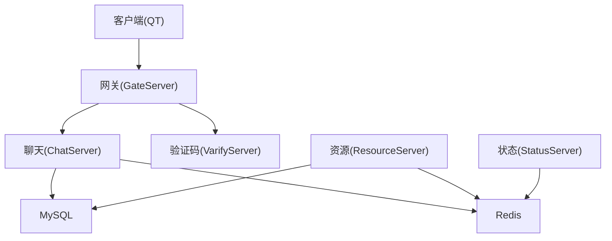
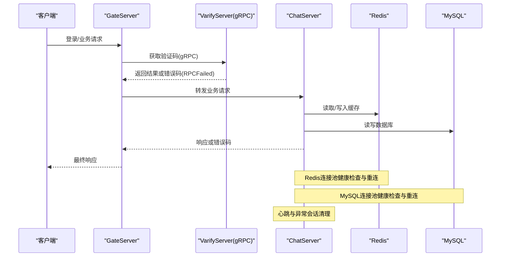
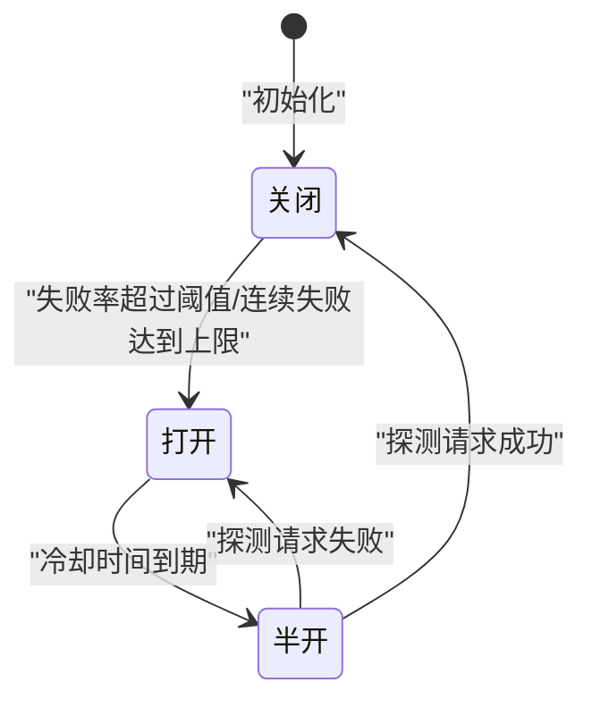
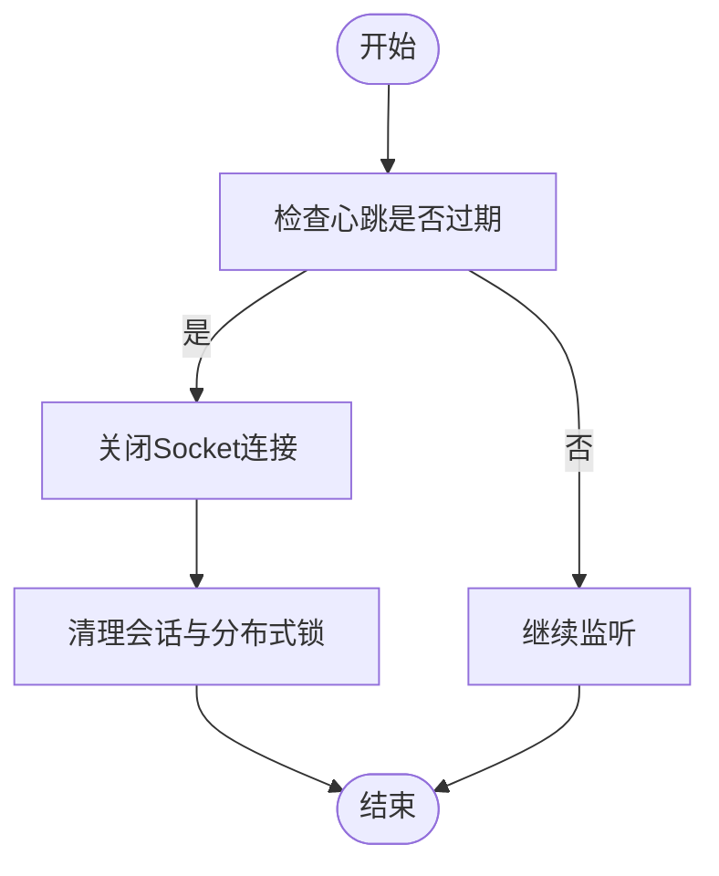
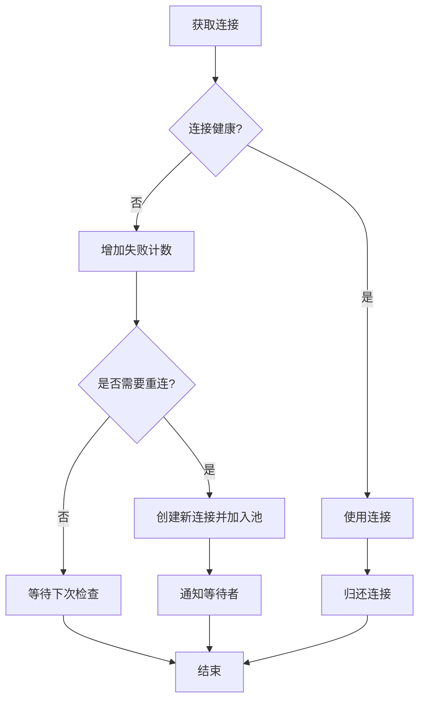
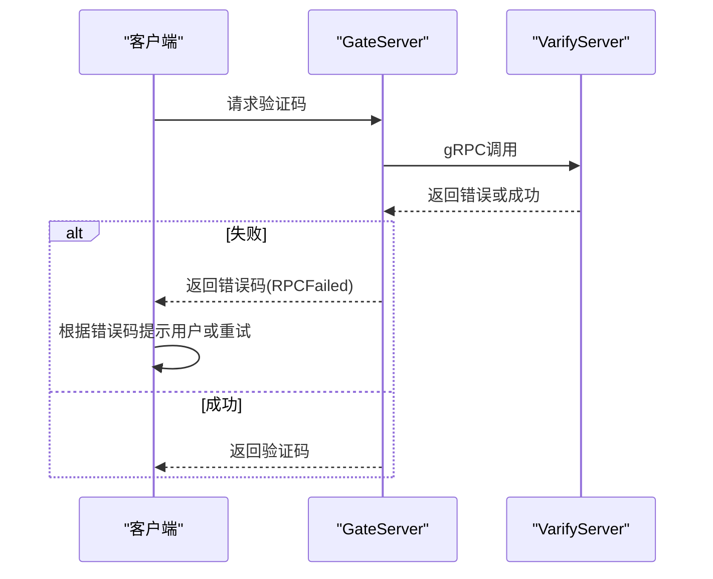
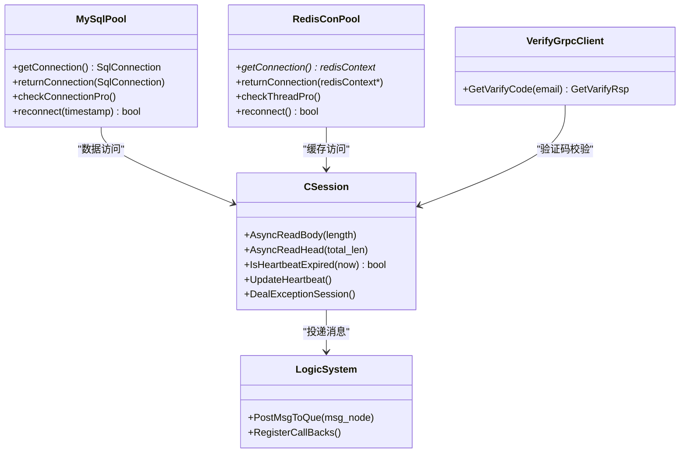

# 容错与熔断机制

<cite>
**本文引用的文件**   
- [CSession.h](file://server/ChatServer/include/CSession.h)
- [MysqlDao.h](file://server/ChatServer/include/MysqlDao.h)
- [RedisMgr.h](file://server/GateServer/include/RedisMgr.h)
- [VerifyGrpcClient.h](file://server/GateServer/include/VerifyGrpcClient.h)
- [const.h](file://server/ChatServer/include/const.h)
- [LogicSystem.cpp](file://server/ChatServer/src/LogicSystem.cpp)
- [tcpmgr.cpp](file://client/llfcchat/src/tcpmgr.cpp)
- [day35心跳逻辑.md](file://开发文档/day35心跳逻辑.md)
- [day41分布式死锁解决方案.md](file://开发文档/day41分布式死锁解决方案.md)
</cite>

## 目录
1. [简介](#简介)
2. [项目结构](#项目结构)
3. [核心组件](#核心组件)
4. [架构总览](#架构总览)
5. [详细组件分析](#详细组件分析)
6. [依赖关系分析](#依赖关系分析)
7. [性能考量](#性能考量)
8. [故障排查指南](#故障排查指南)
9. [结论](#结论)
10. [附录](#附录)

## 简介
本文件面向LLFCChat系统的容错与熔断机制，聚焦以下目标：
- 服务降级策略：功能裁剪、缓存替代、默认值返回
- 熔断器模式：状态管理、阈值配置、自动恢复
- 重试机制：重试策略、退避算法、幂等性保证
- 错误隔离：线程池隔离、资源隔离、电路保护
- 配套图示：容错架构图、熔断状态转换图、降级处理流程图
- 配置示例与故障恢复操作指南

说明：当前仓库中尚未实现统一的“熔断器”抽象类，但已具备连接池健康检查、异常会话清理、RPC失败码、超时与心跳检测等基础能力。本文在尊重现有代码的基础上，给出可落地的设计与增强建议，并标注对应源码位置以便对照实现。

## 项目结构
LLFCChat采用多服务架构（ChatServer、GateServer、ResourceServer、StatusServer、VarifyServer），各服务通过gRPC或HTTP交互，并使用MySQL与Redis作为持久化与缓存层。客户端使用Qt TCP通信。

[本图为概念性结构示意，不直接映射具体源码文件]

## 核心组件
- CSession：会话管理与心跳、异常会话处理入口
- MySqlPool：MySQL连接池与健康检查、重连
- RedisConPool：Redis连接池与健康检查、重连
- VerifyGrpcClient：gRPC客户端连接池与错误码封装
- LogicSystem：消息路由与回调分发
- const.h：错误码、常量定义

这些组件共同构成系统的基础容错能力：连接池保活、异常会话清理、RPC失败码上报、心跳超时检测。

**章节来源**
- [CSession.h:1-86](file://server/ChatServer/include/CSession.h#L1-L86)
- [MysqlDao.h:25-232](file://server/ChatServer/include/MysqlDao.h#L25-L232)
- [RedisMgr.h:9-305](file://server/GateServer/include/RedisMgr.h#L9-L305)
- [VerifyGrpcClient.h:18-113](file://server/GateServer/include/VerifyGrpcClient.h#L18-L113)
- [LogicSystem.cpp:51-85](file://server/ChatServer/src/LogicSystem.cpp#L51-L85)
- [const.h:5-20](file://server/ChatServer/include/const.h#L5-L20)

## 架构总览
下图展示从客户端到后端服务的请求路径，以及关键容错点（心跳、连接池健康检查、RPC失败码、异常会话清理）。

**图表来源**
- [VerifyGrpcClient.h:87-104](file://server/GateServer/include/VerifyGrpcClient.h#L87-L104)
- [RedisMgr.h:137-206](file://server/GateServer/include/RedisMgr.h#L137-L206)
- [MysqlDao.h:62-145](file://server/ChatServer/include/MysqlDao.h#L62-L145)
- [CSession.h:42-51](file://server/ChatServer/include/CSession.h#L42-L51)

**章节来源**
- [VerifyGrpcClient.h:87-104](file://server/GateServer/include/VerifyGrpcClient.h#L87-L104)
- [RedisMgr.h:137-206](file://server/GateServer/include/RedisMgr.h#L137-L206)
- [MysqlDao.h:62-145](file://server/ChatServer/include/MysqlDao.h#L62-L145)
- [CSession.h:42-51](file://server/ChatServer/include/CSession.h#L42-L51)

## 详细组件分析

### 熔断器模式设计（建议）
由于当前未实现统一熔断器，建议新增一个轻量级熔断器组件，围绕以下要点落地：
- 状态管理：关闭→半开→打开，基于失败率/连续失败次数切换
- 阈值配置：失败率阈值、最小请求数、半开探测窗口、观察周期
- 自动恢复：半开状态下允许少量探测请求，成功则回到关闭，失败则回到打开
- 指标采集：成功率、延迟P95/P99、错误码分布、慢调用比例

[本图为概念性状态转换图，不直接映射具体源码文件]

### 服务降级策略
- 功能裁剪：在熔断打开时，对非核心功能直接返回默认值或快速失败，避免阻塞主链路
- 缓存替代：优先读Redis缓存；若缓存不可用，回退到只读模式或返回空集合
- 默认值返回：对查询接口返回空列表或默认对象，确保UI可用性与用户体验

结合现有错误码与RPC失败码，可在Gate/Chat层统一拦截错误码，触发降级流程。

**章节来源**
- [const.h:5-20](file://server/ChatServer/include/const.h#L5-L20)
- [VerifyGrpcClient.h:87-104](file://server/GateServer/include/VerifyGrpcClient.h#L87-L104)

### 重试机制设计
- 重试策略：针对瞬时错误（网络抖动、临时超时）进行有限次重试；对于业务错误（如Token无效、Uid无效）不重试
- 退避算法：指数退避+抖动，避免雪崩；最大重试次数与间隔需配置化
- 幂等性保证：对写操作使用唯一ID（如消息ID、事务ID）去重；读操作天然幂等

当前代码中已有部分错误码与异常捕获，可作为重试判定的依据。

**章节来源**
- [const.h:5-20](file://server/ChatServer/include/const.h#L5-L20)
- [day41分布式死锁解决方案.md:1211-1229](file://开发文档/day41分布式死锁解决方案.md#L1211-L1229)

### 错误隔离策略
- 线程池隔离：不同业务模块使用独立线程池或队列，避免相互阻塞
- 资源隔离：连接池隔离（MySQL/Redis/gRPC各自独立池），限制单资源耗尽影响范围
- 电路保护：熔断器保护下游依赖，防止级联故障

现有MySqlPool与RedisConPool已提供连接池隔离与健康检查；VerifyGrpcClient提供gRPC连接池。

**章节来源**
- [MysqlDao.h:25-232](file://server/ChatServer/include/MysqlDao.h#L25-L232)
- [RedisMgr.h:9-305](file://server/GateServer/include/RedisMgr.h#L9-L305)
- [VerifyGrpcClient.h:18-113](file://server/GateServer/include/VerifyGrpcClient.h#L18-L113)

### 心跳与异常会话处理
- 心跳检测：服务端定时扫描会话，超过阈值判定为过期，触发清理
- 异常会话：异步IO错误时关闭连接并清理会话状态，释放资源

**图表来源**
- [CSession.h:42-51](file://server/ChatServer/include/CSession.h#L42-L51)
- [day35心跳逻辑.md:41-92](file://开发文档/day35心跳逻辑.md#L41-L92)

**章节来源**
- [CSession.h:42-51](file://server/ChatServer/include/CSession.h#L42-L51)
- [day35心跳逻辑.md:41-92](file://开发文档/day35心跳逻辑.md#L41-L92)

### 连接池健康检查与重连
- MySQL连接池：周期性执行SELECT 1检测健康，失败计数累加后触发重连
- Redis连接池：周期性PING检测，失败计数累加后触发重连
- gRPC连接池：失败时返回错误码，上层可据此做降级或重试

**图表来源**
- [MysqlDao.h:62-145](file://server/ChatServer/include/MysqlDao.h#L62-L145)
- [RedisMgr.h:137-206](file://server/GateServer/include/RedisMgr.h#L137-L206)

**章节来源**
- [MysqlDao.h:62-145](file://server/ChatServer/include/MysqlDao.h#L62-L145)
- [RedisMgr.h:137-206](file://server/GateServer/include/RedisMgr.h#L137-L206)

### RPC失败与错误码处理
- VerifyGrpcClient在RPC失败时设置错误码，上层可根据错误码决定降级或重试
- 客户端TCP错误分类处理，区分连接拒绝、远程关闭、超时等

**图表来源**
- [VerifyGrpcClient.h:87-104](file://server/GateServer/include/VerifyGrpcClient.h#L87-L104)
- [tcpmgr.cpp:63-91](file://client/llfcchat/src/tcpmgr.cpp#L63-L91)

**章节来源**
- [VerifyGrpcClient.h:87-104](file://server/GateServer/include/VerifyGrpcClient.h#L87-L104)
- [tcpmgr.cpp:63-91](file://client/llfcchat/src/tcpmgr.cpp#L63-L91)

## 依赖关系分析
- CSession依赖LogicSystem进行消息投递
- MySqlPool与RedisConPool被各服务用于数据访问与缓存
- VerifyGrpcClient被GateServer用于验证码服务调用
- const.h中的错误码在各服务间共享，便于统一处理

**图表来源**
- [CSession.h:28-76](file://server/ChatServer/include/CSession.h#L28-L76)
- [MysqlDao.h:25-232](file://server/ChatServer/include/MysqlDao.h#L25-L232)
- [RedisMgr.h:9-305](file://server/GateServer/include/RedisMgr.h#L9-L305)
- [VerifyGrpcClient.h:18-113](file://server/GateServer/include/VerifyGrpcClient.h#L18-L113)
- [LogicSystem.cpp:51-85](file://server/ChatServer/src/LogicSystem.cpp#L51-L85)

**章节来源**
- [CSession.h:28-76](file://server/ChatServer/include/CSession.h#L28-L76)
- [MysqlDao.h:25-232](file://server/ChatServer/include/MysqlDao.h#L25-L232)
- [RedisMgr.h:9-305](file://server/GateServer/include/RedisMgr.h#L9-L305)
- [VerifyGrpcClient.h:18-113](file://server/GateServer/include/VerifyGrpcClient.h#L18-L113)
- [LogicSystem.cpp:51-85](file://server/ChatServer/src/LogicSystem.cpp#L51-L85)

## 性能考量
- 连接池大小与超时：合理设置MySQL/Redis连接池大小，避免过多连接导致内存与上下文切换开销
- 心跳间隔与阈值：心跳间隔不宜过短，避免频繁扫描；阈值需考虑网络抖动
- 重试退避：指数退避+抖动可有效缓解雪崩；最大重试次数需限制
- 降级开关：支持动态开关降级策略，便于运维控制

[本节为通用指导，不直接分析具体文件]

## 故障排查指南
- 连接池健康检查日志：关注MySQL/Redis连接池的保活查询与重连日志
- 心跳与异常会话：查看会话心跳过期与异常会话清理日志
- RPC失败码：检查VerifyGrpcClient返回的错误码，定位验证码服务问题
- 客户端错误分类：根据QTcpSocket错误类型判断网络问题

**章节来源**
- [MysqlDao.h:62-145](file://server/ChatServer/include/MysqlDao.h#L62-L145)
- [RedisMgr.h:137-206](file://server/GateServer/include/RedisMgr.h#L137-L206)
- [VerifyGrpcClient.h:87-104](file://server/GateServer/include/VerifyGrpcClient.h#L87-L104)
- [tcpmgr.cpp:63-91](file://client/llfcchat/src/tcpmgr.cpp#L63-L91)
- [day35心跳逻辑.md:41-92](file://开发文档/day35心跳逻辑.md#L41-L92)

## 结论
LLFCChat已具备连接池健康检查、异常会话清理、RPC失败码、心跳检测等基础容错能力。建议在此基础上引入统一熔断器组件，完善降级策略、重试机制与错误隔离，以提升系统在故障场景下的稳定性与可用性。

[本节为总结，不直接分析具体文件]

## 附录

### 熔断器配置示例（建议）
- 失败率阈值：0.5（50%）
- 最小请求数：10
- 半开探测窗口：10秒
- 观察周期：60秒
- 最大重试次数：3
- 退避基数：1秒，最大间隔：30秒，抖动系数：0.2

[本小节为概念性配置，不直接映射具体源码文件]

### 故障恢复操作指南（建议）
- 监控告警：连接池健康检查失败、心跳过期、RPC失败率升高
- 快速恢复：重启故障节点、扩容连接池、切换降级策略
- 根因分析：查看日志、追踪调用链、定位依赖服务问题

[本小节为概念性操作指南，不直接映射具体源码文件]