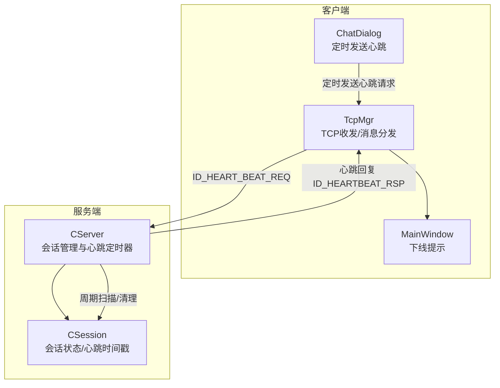
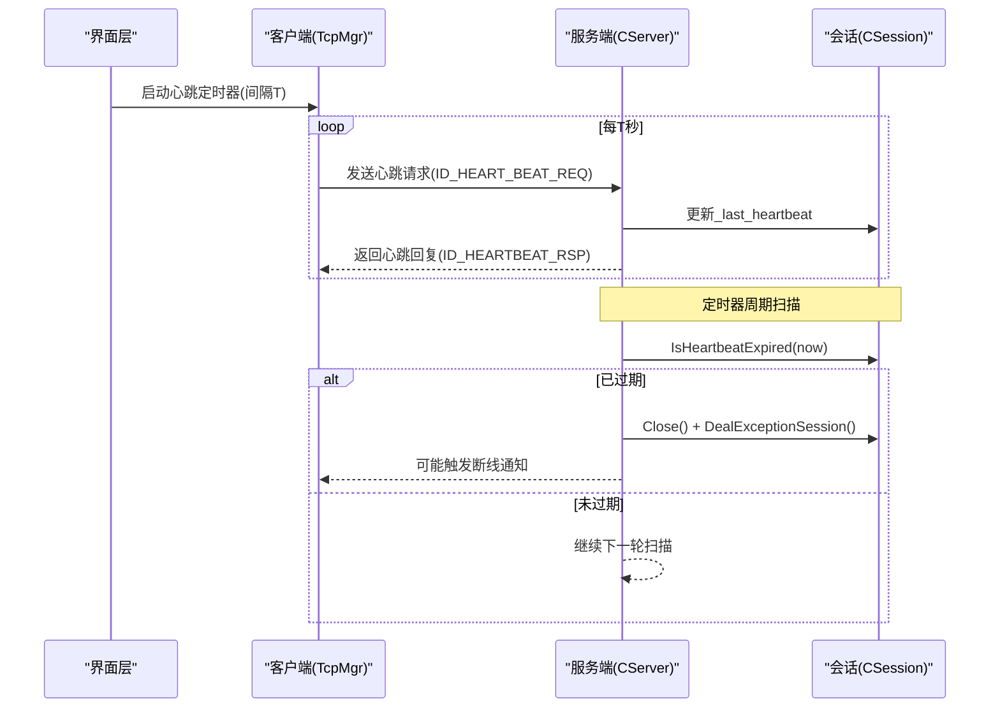
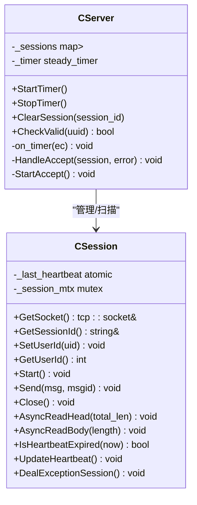
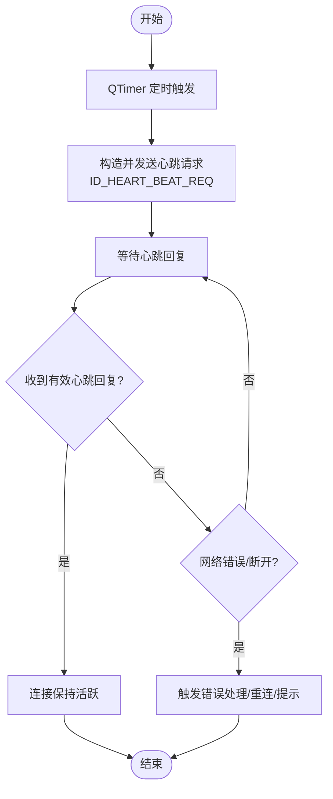
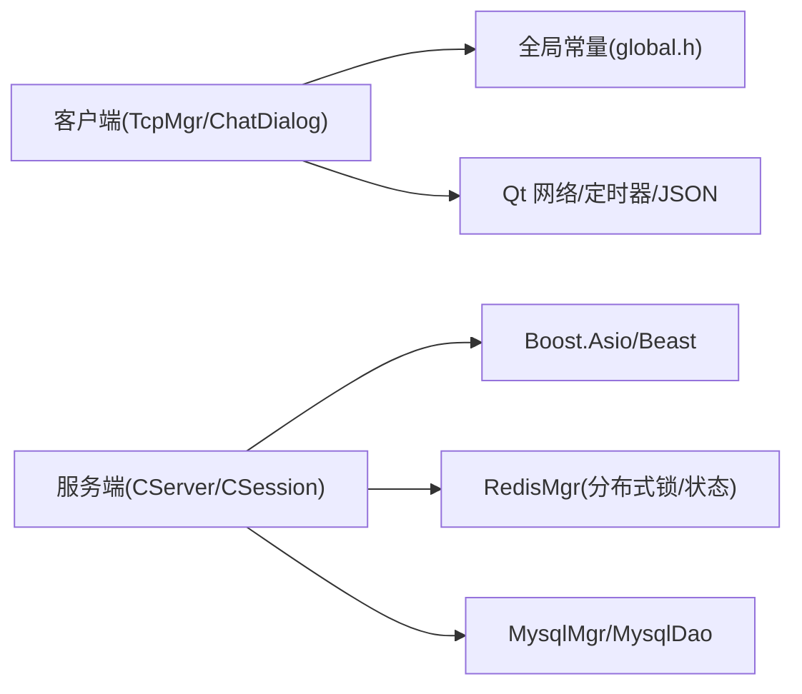

# 心跳检测与监控

<cite>
**本文引用的文件**   
- [CSession.h](file://server/ChatServer/include/CSession.h)
- [CSession.cpp](file://server/ChatServer/src/CSession.cpp)
- [CServer.h](file://server/ChatServer/include/CServer.h)
- [CServer.cpp](file://server/ChatServer/src/CServer.cpp)
- [global.h](file://client/llfcchat/include/global.h)
- [tcpmgr.h](file://client/llfcchat/include/tcpmgr.h)
- [tcpmgr.cpp](file://client/llfcchat/src/tcpmgr.cpp)
- [chatdialog.cpp](file://client/llfcchat/src/chatdialog.cpp)
- [mainwindow.cpp](file://client/llfcchat/src/mainwindow.cpp)
- [chatserver1.ini](file://server/ChatServer/config/chatserver1.ini)
- [config.ini](file://client/llfcchat/config/config.ini)
- [day35心跳逻辑.md](file://开发文档/day35心跳逻辑.md)
</cite>

## 目录
1. [简介](#简介)
2. [项目结构](#项目结构)
3. [核心组件](#核心组件)
4. [架构总览](#架构总览)
5. [详细组件分析](#详细组件分析)
6. [依赖关系分析](#依赖关系分析)
7. [性能考量](#性能考量)
8. [故障诊断指南](#故障诊断指南)
9. [结论](#结论)
10. [附录：配置参数与告警规则](#附录配置参数与告警规则)

## 简介
本文件面向 LLFCChat 系统的心跳检测与监控系统，系统性阐述心跳机制的设计原理、连接保活实现、异常检测与自动恢复策略，并给出流程图、监控告警建议与性能优化方法。内容覆盖客户端与服务端两端的关键实现，帮助读者快速理解并扩展该能力。

## 项目结构
- 服务端（ChatServer）
  - CServer：管理会话集合与定时器，周期性扫描会话是否“存活”
  - CSession：维护每个连接的最近一次活动时间戳，提供过期判断与异常处理
- 客户端（Qt）
  - TcpMgr：TCP 收发、粘包处理、消息分发；包含心跳响应处理器
  - chatdialog：启动定时任务发送心跳请求
  - mainwindow：展示心跳超时或异常导致的下线提示
- 配置
  - 服务器端口、名称等通过配置文件加载
  - 客户端网关地址与端口通过配置文件加载

**图表来源** 
- [CServer.h:1-33](file://server/ChatServer/include/CServer.h#L1-L33)
- [CServer.cpp:1-133](file://server/ChatServer/src/CServer.cpp#L1-L133)
- [CSession.h:1-86](file://server/ChatServer/include/CSession.h#L1-L86)
- [CSession.cpp:1-338](file://server/ChatServer/src/CSession.cpp#L1-L338)
- [tcpmgr.h:1-90](file://client/llfcchat/include/tcpmgr.h#L1-L90)
- [tcpmgr.cpp:1-1094](file://client/llfcchat/src/tcpmgr.cpp#L1-L1094)
- [chatdialog.cpp:150-200](file://client/llfcchat/src/chatdialog.cpp#L150-L200)
- [mainwindow.cpp:20-130](file://client/llfcchat/src/mainwindow.cpp#L20-L130)

**章节来源**
- [CServer.h:1-33](file://server/ChatServer/include/CServer.h#L1-L33)
- [CServer.cpp:1-133](file://server/ChatServer/src/CServer.cpp#L1-L133)
- [CSession.h:1-86](file://server/ChatServer/include/CSession.h#L1-L86)
- [CSession.cpp:1-338](file://server/ChatServer/src/CSession.cpp#L1-L338)
- [tcpmgr.h:1-90](file://client/llfcchat/include/tcpmgr.h#L1-L90)
- [tcpmgr.cpp:1-1094](file://client/llfcchat/src/tcpmgr.cpp#L1-L1094)
- [chatdialog.cpp:150-200](file://client/llfcchat/src/chatdialog.cpp#L150-L200)
- [mainwindow.cpp:20-130](file://client/llfcchat/src/mainwindow.cpp#L20-L130)

## 核心组件
- 服务端会话与定时器
  - CServer：持有会话映射、互斥锁、定时器；周期性扫描并清理过期会话
  - CSession：维护 _last_heartbeat 原子时间戳；提供 IsHeartbeatExpired、UpdateHeartbeat、DealExceptionSession
- 客户端 TCP 管理器与心跳调度
  - TcpMgr：封装 QTcpSocket 读写、粘包解析、消息路由；注册 ID_HEARTBEAT_RSP 处理器
  - ChatDialog：使用 QTimer 定期发送心跳请求
  - MainWindow：在心跳超时或异常时弹出下线提示

**章节来源**
- [CServer.h:1-33](file://server/ChatServer/include/CServer.h#L1-L33)
- [CServer.cpp:75-133](file://server/ChatServer/src/CServer.cpp#L75-L133)
- [CSession.h:45-76](file://server/ChatServer/include/CSession.h#L45-L76)
- [CSession.cpp:288-338](file://server/ChatServer/src/CSession.cpp#L288-L338)
- [tcpmgr.h:22-90](file://client/llfcchat/include/tcpmgr.h#L22-L90)
- [tcpmgr.cpp:584-613](file://client/llfcchat/src/tcpmgr.cpp#L584-L613)
- [chatdialog.cpp:150-200](file://client/llfcchat/src/chatdialog.cpp#L150-L200)
- [mainwindow.cpp:20-130](file://client/llfcchat/src/mainwindow.cpp#L20-L130)

## 架构总览
下图展示了心跳检测的端到端流程：客户端定时发送心跳请求，服务端收到后更新会话心跳时间戳；服务端定时器周期性检查所有会话，若超过阈值则判定为过期并清理；客户端收到心跳回复即认为连接正常，否则触发重连或提示。

**图表来源** 
- [tcpmgr.cpp:584-613](file://client/llfcchat/src/tcpmgr.cpp#L584-L613)
- [CSession.cpp:288-302](file://server/ChatServer/src/CSession.cpp#L288-L302)
- [CServer.cpp:75-118](file://server/ChatServer/src/CServer.cpp#L75-L118)

## 详细组件分析

### 服务端会话与心跳定时器
- 会话状态
  - 每次成功读取数据后调用 UpdateHeartbeat 更新 _last_heartbeat
  - IsHeartbeatExpired 比较当前时间与上次心跳时间差，超过阈值即视为过期
- 定时器扫描
  - CServer::on_timer 每隔固定间隔遍历会话副本，关闭过期会话并收集待清理列表
  - 将在线会话数量写入 Redis 用于监控
  - 对过期会话调用 DealExceptionSession，进行分布式锁保护下的资源清理

**图表来源** 
- [CServer.h:1-33](file://server/ChatServer/include/CServer.h#L1-L33)
- [CServer.cpp:1-133](file://server/ChatServer/src/CServer.cpp#L1-L133)
- [CSession.h:1-86](file://server/ChatServer/include/CSession.h#L1-L86)
- [CSession.cpp:1-338](file://server/ChatServer/src/CSession.cpp#L1-L338)

**章节来源**
- [CServer.cpp:75-118](file://server/ChatServer/src/CServer.cpp#L75-L118)
- [CSession.cpp:288-338](file://server/ChatServer/src/CSession.cpp#L288-L338)
- [day35心跳逻辑.md:35-92](file://开发文档/day35心跳逻辑.md#L35-L92)

### 客户端心跳调度与响应处理
- 心跳请求
  - ChatDialog 中创建 QTimer，按固定间隔触发发送心跳请求（ID_HEART_BEAT_REQ）
- 心跳响应
  - TcpMgr 注册 ID_HEARTBEAT_RSP 处理器，解析 JSON 并校验错误码
  - 若解析失败或错误码非成功，记录日志；成功则视为连接正常
- 异常与断开
  - 当网络错误或远端关闭时，QTcpSocket::error/disconnected 信号触发，上层可据此发起重连或提示

**图表来源** 
- [chatdialog.cpp:150-200](file://client/llfcchat/src/chatdialog.cpp#L150-L200)
- [tcpmgr.cpp:584-613](file://client/llfcchat/src/tcpmgr.cpp#L584-L613)
- [tcpmgr.cpp:64-98](file://client/llfcchat/src/tcpmgr.cpp#L64-L98)

**章节来源**
- [chatdialog.cpp:150-200](file://client/llfcchat/src/chatdialog.cpp#L150-L200)
- [tcpmgr.cpp:584-613](file://client/llfcchat/src/tcpmgr.cpp#L584-L613)
- [tcpmgr.cpp:64-98](file://client/llfcchat/src/tcpmgr.cpp#L64-L98)

### 连接保活与消息格式
- 协议头
  - 客户端采用 QDataStream 以 BigEndian 写入消息 ID 与长度，随后拼接消息体
  - 服务端解析头部 MSGID 与 DATALEN，再读取对应长度的消息体
- 心跳消息
  - 客户端发送 ID_HEART_BEAT_REQ
  - 服务端收到任意消息后更新会话心跳时间戳；心跳回复 ID_HEARTBEAT_RSP 携带错误码字段
- 粘包处理
  - 客户端维护缓冲区与接收状态标志，循环解析直到完整消息

**章节来源**
- [tcpmgr.cpp:1044-1079](file://client/llfcchat/src/tcpmgr.cpp#L1044-L1079)
- [CSession.cpp:133-194](file://server/ChatServer/src/CSession.cpp#L133-L194)
- [global.h:61-64](file://client/llfcchat/include/global.h#L61-L64)

### 异常检测与状态管理
- 服务端
  - 定时器扫描发现过期会话，调用 Close 并进入 DealExceptionSession
  - DealExceptionSession 使用分布式锁保护，校验 Redis 中的 session_id 一致性，清理用户登录信息与会话关联
- 客户端
  - 网络错误类型区分（拒绝、远端关闭、主机未知、超时、网络错误），统一触发信号通知上层
  - disconnected 事件触发下线提示

**章节来源**
- [CSession.cpp:304-338](file://server/ChatServer/src/CSession.cpp#L304-L338)
- [CServer.cpp:75-118](file://server/ChatServer/src/CServer.cpp#L75-L118)
- [tcpmgr.cpp:64-98](file://client/llfcchat/src/tcpmgr.cpp#L64-L98)
- [mainwindow.cpp:20-130](file://client/llfcchat/src/mainwindow.cpp#L20-L130)

### 自动恢复机制
- 断线重连
  - 客户端检测到错误/断开后，可触发重连流程（由业务层决定策略）
- 状态同步与一致性
  - 服务端清理会话时，基于分布式锁确保多实例下同一用户的会话清理一致性
  - 清理完成后删除 Redis 中的会话、IP、Token 等键，避免脏状态残留

**章节来源**
- [CSession.cpp:304-338](file://server/ChatServer/src/CSession.cpp#L304-L338)
- [CServer.cpp:75-118](file://server/ChatServer/src/CServer.cpp#L75-L118)

## 依赖关系分析
- 客户端依赖
  - Qt 网络模块（QTcpSocket）、定时器（QTimer）、JSON 解析（QJsonDocument）
  - 全局消息 ID 定义（global.h）
- 服务端依赖
  - Boost.Asio/Beast（异步 I/O、HTTP）
  - Redis 客户端（RedisMgr）用于分布式锁与状态存储
  - MySQL 客户端（MysqlMgr/MysqlDao）用于持久化（与本节心跳主题相关度较低）

**图表来源** 
- [tcpmgr.h:1-90](file://client/llfcchat/include/tcpmgr.h#L1-L90)
- [global.h:43-88](file://client/llfcchat/include/global.h#L43-L88)
- [CServer.h:1-33](file://server/ChatServer/include/CServer.h#L1-L33)
- [CSession.h:1-86](file://server/ChatServer/include/CSession.h#L1-L86)

**章节来源**
- [tcpmgr.h:1-90](file://client/llfcchat/include/tcpmgr.h#L1-L90)
- [global.h:43-88](file://client/llfcchat/include/global.h#L43-L88)
- [CServer.h:1-33](file://server/ChatServer/include/CServer.h#L1-L33)
- [CSession.h:1-86](file://server/ChatServer/include/CSession.h#L1-L86)

## 性能考量
- 定时器粒度
  - 服务端定时器默认 60s，适合大多数场景；可根据负载调优至 30s~120s
- 会话扫描开销
  - 复制会话表后再遍历，避免持锁期间长时间阻塞；过期会话单独处理，降低临界区耗时
- 心跳频率
  - 客户端心跳间隔建议 10~30s，需与中间设备空闲超时匹配，避免 NAT/防火墙回收
- 序列化与缓冲
  - 客户端使用 QDataStream 与内存缓冲，注意粘包与半包处理，减少频繁分配
- 监控指标
  - 在线会话数写入 Redis，便于集中监控与告警

[本节为通用指导，不直接分析具体文件]

## 故障诊断指南
- 常见问题定位
  - 客户端未收到心跳回复：检查 ID_HEARTBEAT_RSP 处理器是否注册、JSON 解析与错误码校验
  - 服务端会话被误判过期：核对 IsHeartbeatExpired 阈值与 UpdateHeartbeat 调用点
  - 分布式清理不一致：确认分布式锁获取成功、Redis session_id 一致性与清理顺序
- 日志与调试
  - 关注 read/write 错误、消息长度不匹配、msg_id 非法等关键日志
  - 使用 Redis 查看 LOGIN_COUNT 与用户会话键值，辅助定位问题
- 恢复策略
  - 客户端侧根据错误类型选择重试/退避/提示用户
  - 服务端侧确保清理幂等，避免重复清理导致状态不一致

**章节来源**
- [tcpmgr.cpp:584-613](file://client/llfcchat/src/tcpmgr.cpp#L584-L613)
- [CSession.cpp:288-338](file://server/ChatServer/src/CSession.cpp#L288-L338)
- [CServer.cpp:75-118](file://server/ChatServer/src/CServer.cpp#L75-L118)

## 结论
LLFCChat 的心跳机制通过客户端定时发送、服务端时间戳维护与定时器扫描相结合，实现了可靠的连接保活与异常检测。配合分布式锁与 Redis 状态管理，保证了多实例环境下的会话清理一致性。建议在部署时结合业务负载调整心跳间隔与超时阈值，并通过监控指标与日志完善可观测性。

[本节为总结性内容，不直接分析具体文件]

## 附录：配置参数与告警规则
- 配置参数说明
  - 服务端监听端口与名称：chatserver1.ini 中 SelfServer.Port、SelfServer.Name
  - 客户端网关地址与端口：config.ini 中 GateServer.host、GateServer.port
  - 心跳阈值：服务端 IsHeartbeatExpired 阈值（示例代码为 20s，生产建议与定时器周期协调，如 60s）
  - 定时器周期：CServer 构造函数初始化 steady_timer 为 60s
- 监控告警建议
  - 在线会话数突降：可能大规模断线或重启
  - 心跳失败率上升：网络抖动或服务端过载
  - 分布式锁竞争加剧：清理路径阻塞，需排查 Redis 与清理逻辑
- 故障诊断步骤
  - 检查客户端日志：连接建立、错误类型、心跳响应解析
  - 检查服务端日志：read/write 错误、过期会话清理、Redis 操作结果
  - 检查 Redis：LOGIN_COUNT、USER_SESSION_PREFIX、USERIPPREFIX、USERTOKENPREFIX

**章节来源**
- [chatserver1.ini:1-30](file://server/ChatServer/config/chatserver1.ini#L1-L30)
- [config.ini:1-4](file://client/llfcchat/config/config.ini#L1-L4)
- [CServer.cpp:8-14](file://server/ChatServer/src/CServer.cpp#L8-L14)
- [CSession.cpp:288-302](file://server/ChatServer/src/CSession.cpp#L288-L302)
- [day35心跳逻辑.md:35-92](file://开发文档/day35心跳逻辑.md#L35-L92)