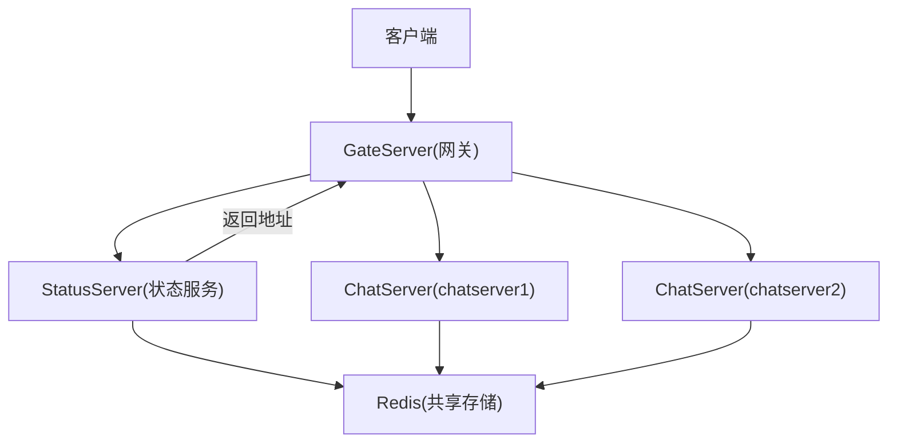
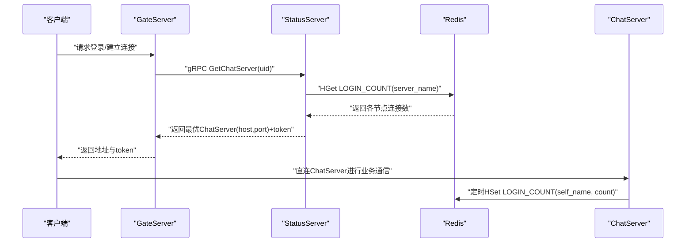
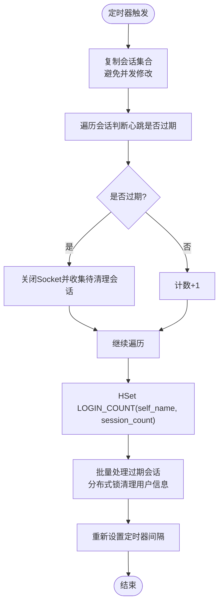
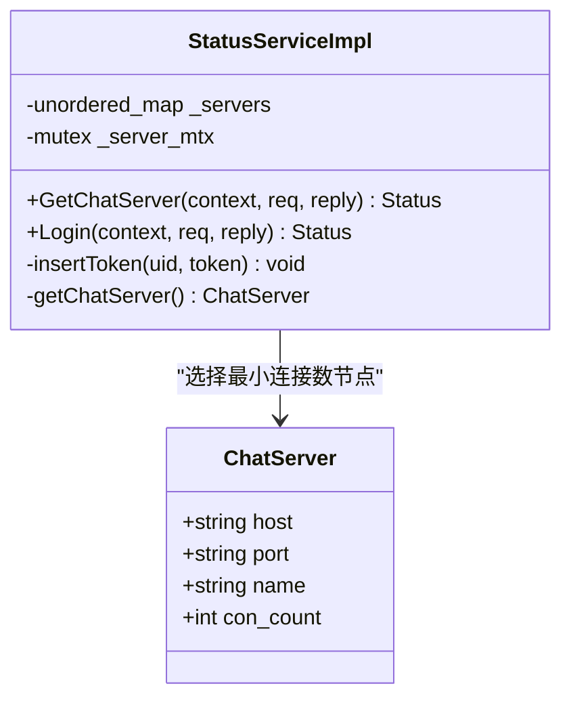
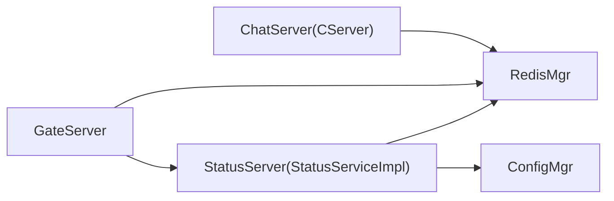
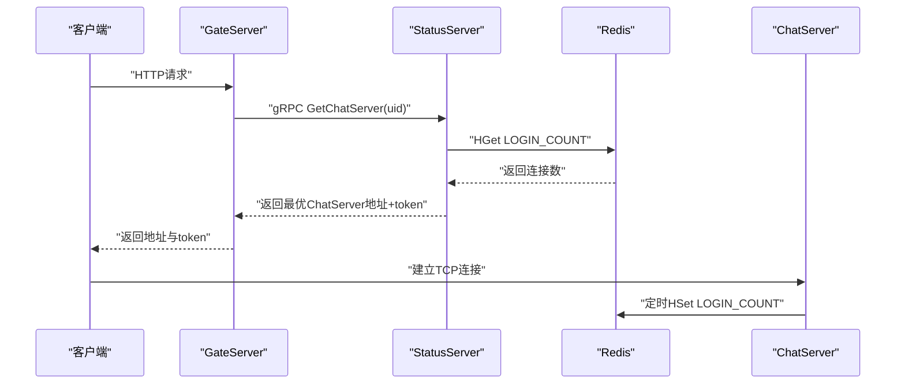

# 负载均衡策略

<cite>
**本文引用的文件**   
- [server/StatusServer/src/StatusServiceImpl.cpp](file://server/StatusServer/src/StatusServiceImpl.cpp)
- [server/StatusServer/include/StatusServiceImpl.h](file://server/StatusServer/include/StatusServiceImpl.h)
- [server/ChatServer/src/CServer.cpp](file://server/ChatServer/src/CServer.cpp)
- [server/ChatServer/include/CServer.h](file://server/ChatServer/include/CServer.h)
- [server/GateServer/src/GateServer.cpp](file://server/GateServer/src/GateServer.cpp)
- [server/StatusServer/config/config.ini](file://server/StatusServer/config/config.ini)
- [server/ChatServer/config/chatserver1.ini](file://server/ChatServer/config/chatserver1.ini)
- [开发文档/day27-分布式服务设计.md](file://开发文档/day27-分布式服务设计.md)
- [开发文档/day35心跳逻辑.md](file://开发文档/day35心跳逻辑.md)
</cite>

## 目录
1. [简介](#简介)
2. [项目结构](#项目结构)
3. [核心组件](#核心组件)
4. [架构总览](#架构总览)
5. [详细组件分析](#详细组件分析)
6. [依赖关系分析](#依赖关系分析)
7. [性能与监控指标](#性能与监控指标)
8. [配置与调优](#配置与调优)
9. [故障转移与服务发现](#故障转移与服务发现)
10. [流量分发流程](#流量分发流程)
11. [配置示例](#配置示例)
12. [故障排查指南](#故障排查指南)
13. [结论](#结论)

## 简介
本文件面向LLFCChat系统的负载均衡策略，聚焦以下目标：
- 连接数统计机制：实时连接数监控、负载指标收集与性能分析。
- 动态分配算法：轮询、加权、最小连接数的选择与应用（当前实现为最小连接数）。
- 故障转移机制：健康检查、自动切换与服务发现。
- 配置选项与调优参数：配置文件项、关键阈值与扩展点。
- 架构图、流程图与指标定义：提供可视化说明与可观测性建议。
- 配置示例与故障排查：落地实践与问题定位方法。

## 项目结构
本项目采用多服务拆分架构，负载均衡相关的关键模块包括：
- ChatServer：聊天业务服务，维护TCP会话、心跳检测、连接数上报。
- StatusServer：状态服务，负责服务发现与基于连接数的负载均衡决策。
- GateServer：网关服务，接收客户端请求并调用状态服务获取后端ChatServer地址。
- Redis：作为共享存储，承载各ChatServer的连接数统计（哈希键）与Token校验等。

图表来源
- [server/GateServer/src/GateServer.cpp:1-163](file://server/GateServer/src/GateServer.cpp#L1-L163)
- [server/StatusServer/src/StatusServiceImpl.cpp:1-125](file://server/StatusServer/src/StatusServiceImpl.cpp#L1-L125)
- [server/ChatServer/src/CServer.cpp:1-133](file://server/ChatServer/src/CServer.cpp#L1-L133)

章节来源
- [server/GateServer/src/GateServer.cpp:1-163](file://server/GateServer/src/GateServer.cpp#L1-L163)
- [server/StatusServer/config/config.ini:1-23](file://server/StatusServer/config/config.ini#L1-L23)
- [server/ChatServer/config/chatserver1.ini:1-30](file://server/ChatServer/config/chatserver1.ini#L1-L30)

## 核心组件
- ChatServer（CServer）
  - 职责：接受TCP连接、管理会话、心跳检测、定时统计连接数并写入Redis。
  - 关键点：定时器周期扫描会话，计算有效会话数量，更新Redis中的连接数；异常会话清理与分布式锁配合。
- StatusServer（StatusServiceImpl）
  - 职责：从配置加载ChatServer列表，根据Redis中连接数选择最小连接数的服务器返回给GateServer。
  - 关键点：getChatServer()读取LOGIN_COUNT哈希，比较各节点con_count，返回最优节点。
- GateServer
  - 职责：对外暴露HTTP接口，内部通过gRPC调用StatusServer获取ChatServer地址，再转发或引导客户端直连。
- Redis
  - 职责：存储LOGIN_COUNT（哈希），键为ChatServer名称，值为连接数；同时用于Token校验等。

章节来源
- [server/ChatServer/include/CServer.h:1-33](file://server/ChatServer/include/CServer.h#L1-L33)
- [server/ChatServer/src/CServer.cpp:1-133](file://server/ChatServer/src/CServer.cpp#L1-L133)
- [server/StatusServer/include/StatusServiceImpl.h:1-52](file://server/StatusServer/include/StatusServiceImpl.h#L1-L52)
- [server/StatusServer/src/StatusServiceImpl.cpp:1-125](file://server/StatusServer/src/StatusServiceImpl.cpp#L1-L125)
- [server/GateServer/src/GateServer.cpp:1-163](file://server/GateServer/src/GateServer.cpp#L1-L163)

## 架构总览
下图展示负载均衡的整体交互：客户端经GateServer访问StatusServer，后者基于Redis中的连接数选择最优ChatServer并返回地址；ChatServer周期性上报连接数至Redis。

图表来源
- [server/StatusServer/src/StatusServiceImpl.cpp:17-27](file://server/StatusServer/src/StatusServiceImpl.cpp#L17-L27)
- [server/ChatServer/src/CServer.cpp:75-118](file://server/ChatServer/src/CServer.cpp#L75-L118)
- [server/GateServer/src/GateServer.cpp:131-163](file://server/GateServer/src/GateServer.cpp#L131-L163)

## 详细组件分析

### ChatServer连接数统计与心跳
- 定时器on_timer周期性遍历会话，统计有效会话数量session_count。
- 将session_count写入Redis的LOGIN_COUNT哈希，键为SelfServer.Name。
- 对过期会话执行DealExceptionSession，结合分布式锁清理用户会话信息。

图表来源
- [server/ChatServer/src/CServer.cpp:75-118](file://server/ChatServer/src/CServer.cpp#L75-L118)
- [开发文档/day35心跳逻辑.md:644-730](file://开发文档/day35心跳逻辑.md#L644-L730)

章节来源
- [server/ChatServer/src/CServer.cpp:75-118](file://server/ChatServer/src/CServer.cpp#L75-L118)
- [开发文档/day35心跳逻辑.md:41-92](file://开发文档/day35心跳逻辑.md#L41-L92)

### StatusServer负载均衡决策
- getChatServer()从Redis的LOGIN_COUNT哈希读取每个ChatServer的连接数。
- 若某节点不存在则默认其连接数为INT_MAX，确保不会被选中。
- 选择con_count最小的节点返回给GateServer，并生成唯一token供后续校验。

图表来源
- [server/StatusServer/include/StatusServiceImpl.h:16-52](file://server/StatusServer/include/StatusServiceImpl.h#L16-L52)
- [server/StatusServer/src/StatusServiceImpl.cpp:57-92](file://server/StatusServer/src/StatusServiceImpl.cpp#L57-L92)

章节来源
- [server/StatusServer/src/StatusServiceImpl.cpp:17-27](file://server/StatusServer/src/StatusServiceImpl.cpp#L17-L27)
- [server/StatusServer/src/StatusServiceImpl.cpp:57-92](file://server/StatusServer/src/StatusServiceImpl.cpp#L57-L92)

### GateServer网关角色
- GateServer启动时初始化数据库与Redis连接，监听端口并启动CServer。
- 在负载均衡场景中，GateServer通过gRPC调用StatusServer获取ChatServer地址，再将结果返回给客户端。

章节来源
- [server/GateServer/src/GateServer.cpp:131-163](file://server/GateServer/src/GateServer.cpp#L131-L163)

## 依赖关系分析
- ChatServer依赖RedisMgr进行连接数上报与清理操作。
- StatusServer依赖ConfigMgr加载chatservers列表，依赖RedisMgr读取连接数。
- GateServer依赖RedisMgr进行基础测试与验证（示例代码），并在实际流程中依赖gRPC调用StatusServer。

图表来源
- [server/ChatServer/src/CServer.cpp:1-133](file://server/ChatServer/src/CServer.cpp#L1-L133)
- [server/StatusServer/src/StatusServiceImpl.cpp:1-125](file://server/StatusServer/src/StatusServiceImpl.cpp#L1-L125)
- [server/GateServer/src/GateServer.cpp:1-163](file://server/GateServer/src/GateServer.cpp#L1-L163)

章节来源
- [server/ChatServer/src/CServer.cpp:1-133](file://server/ChatServer/src/CServer.cpp#L1-L133)
- [server/StatusServer/src/StatusServiceImpl.cpp:1-125](file://server/StatusServer/src/StatusServiceImpl.cpp#L1-L125)
- [server/GateServer/src/GateServer.cpp:1-163](file://server/GateServer/src/GateServer.cpp#L1-L163)

## 性能与监控指标
- 连接数统计频率：定时器周期（默认60秒），可通过配置调整。
- 指标定义：
  - LOGIN_COUNT[server_name]：各ChatServer的活跃会话数。
  - Token有效性：用于登录态校验，存储在Redis中。
- 性能优化：
  - 心跳结束后统一写入Redis，减少频繁加锁与网络IO。
  - 过期会话批量清理，避免死锁与长事务。
- 可扩展性：
  - 支持多ChatServer实例横向扩展，StatusServer按连接数动态选择。
  - 未来可引入加权或轮询策略，通过配置开关切换。

章节来源
- [server/ChatServer/src/CServer.cpp:75-118](file://server/ChatServer/src/CServer.cpp#L75-L118)
- [开发文档/day35心跳逻辑.md:644-730](file://开发文档/day35心跳逻辑.md#L644-L730)

## 配置与调优
- StatusServer配置（config.ini）
  - chatservers.Name：逗号分隔的ChatServer名称列表。
  - chatserverX.Host/Port：各ChatServer的地址信息。
- ChatServer配置（chatserver1.ini）
  - SelfServer.Name/Host/Port/RPCPort：自身标识与监听端口。
  - PeerServer.Servers：对端ChatServer列表，用于跨服通信。
- 调优建议：
  - 定时器间隔：根据业务延迟要求调整（默认60秒）。
  - 心跳阈值：根据网络稳定性调整（默认20-60秒）。
  - Redis超时与重试：确保高可用与容错。

章节来源
- [server/StatusServer/config/config.ini:1-23](file://server/StatusServer/config/config.ini#L1-L23)
- [server/ChatServer/config/chatserver1.ini:1-30](file://server/ChatServer/config/chatserver1.ini#L1-L30)
- [开发文档/day35心跳逻辑.md:418-444](file://开发文档/day35心跳逻辑.md#L418-L444)

## 故障转移与服务发现
- 健康检查：通过心跳检测识别异常会话，自动清理并更新连接数。
- 自动切换：StatusServer基于最新连接数选择最优节点，若某节点不可用（连接数缺失）则视为最大负载，避免被选中。
- 服务发现：StatusServer从配置加载服务列表，无需外部注册中心；未来可集成Consul/Etcd增强动态发现能力。

章节来源
- [server/StatusServer/src/StatusServiceImpl.cpp:57-92](file://server/StatusServer/src/StatusServiceImpl.cpp#L57-L92)
- [server/ChatServer/src/CServer.cpp:75-118](file://server/ChatServer/src/CServer.cpp#L75-L118)
- [开发文档/day27-分布式服务设计.md:445-524](file://开发文档/day27-分布式服务设计.md#L445-L524)

## 流量分发流程

图表来源
- [server/GateServer/src/GateServer.cpp:131-163](file://server/GateServer/src/GateServer.cpp#L131-L163)
- [server/StatusServer/src/StatusServiceImpl.cpp:17-27](file://server/StatusServer/src/StatusServiceImpl.cpp#L17-L27)
- [server/ChatServer/src/CServer.cpp:75-118](file://server/ChatServer/src/CServer.cpp#L75-L118)

## 配置示例
- StatusServer配置片段（config.ini）
  - [chatservers]Name = chatserver1,chatserver2
  - [chatserver1]Name = chatserver1, Host = 127.0.0.1, Port = 8090
  - [chatserver2]Name = chatserver2, Host = 127.0.0.1, Port = 8091
- ChatServer配置片段（chatserver1.ini）
  - [SelfServer]Name = chatserver1, Host = 0.0.0.0, Port = 8090, RPCPort = 50055
  - [PeerServer]Servers = chatserver2

章节来源
- [server/StatusServer/config/config.ini:14-23](file://server/StatusServer/config/config.ini#L14-L23)
- [server/ChatServer/config/chatserver1.ini:9-30](file://server/ChatServer/config/chatserver1.ini#L9-L30)

## 故障排查指南
- 连接数未更新
  - 检查定时器是否正常启动与回调。
  - 确认Redis连接与权限正常。
  - 查看日志中on_timer错误码。
- 负载均衡未生效
  - 检查StatusServer是否正确加载chatservers配置。
  - 确认Redis中LOGIN_COUNT哈希键存在且值正确。
  - 验证StatusServer的getChatServer逻辑是否返回预期节点。
- 心跳超时与掉线
  - 调整心跳阈值与定时器间隔。
  - 检查网络连通性与防火墙规则。
  - 查看分布式锁释放与清理逻辑是否正常。

章节来源
- [server/ChatServer/src/CServer.cpp:75-118](file://server/ChatServer/src/CServer.cpp#L75-L118)
- [server/StatusServer/src/StatusServiceImpl.cpp:57-92](file://server/StatusServer/src/StatusServiceImpl.cpp#L57-L92)
- [开发文档/day35心跳逻辑.md:41-92](file://开发文档/day35心跳逻辑.md#L41-L92)

## 结论
LLFCChat系统通过ChatServer的心跳与连接数上报、StatusServer的最小连接数选择、GateServer的网关转发，实现了轻量级且高效的负载均衡。当前实现以Redis为共享状态源，具备良好扩展性，未来可引入更多调度策略（轮询、加权）与更强大的服务发现机制，进一步提升系统弹性与可用性。