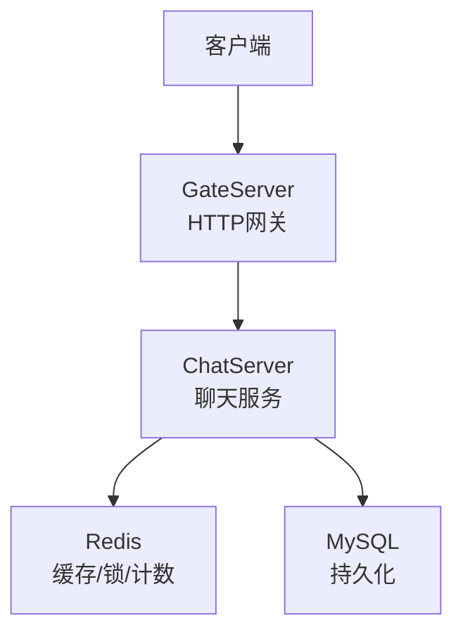
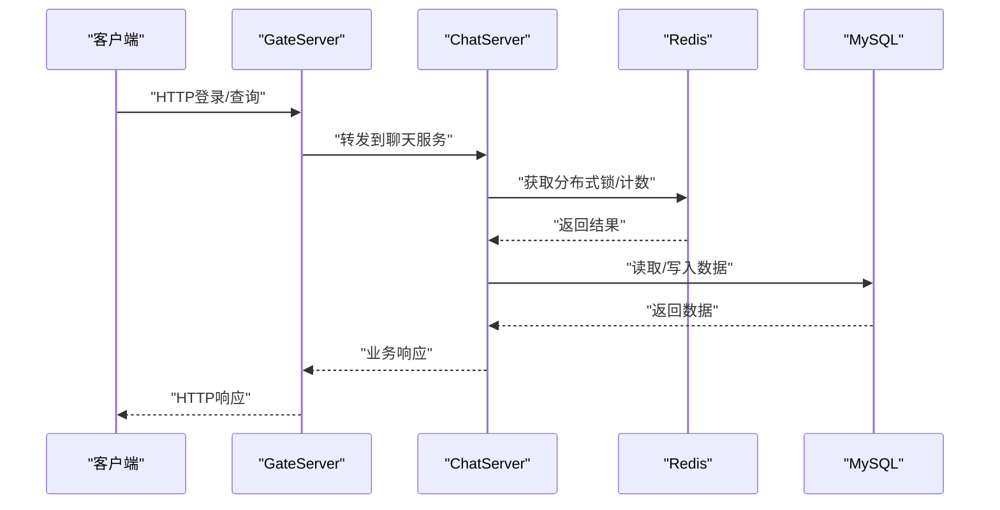
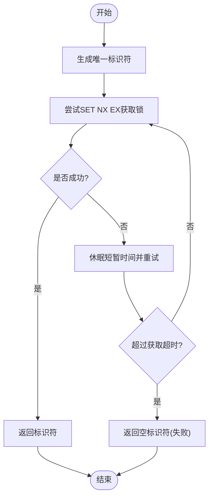
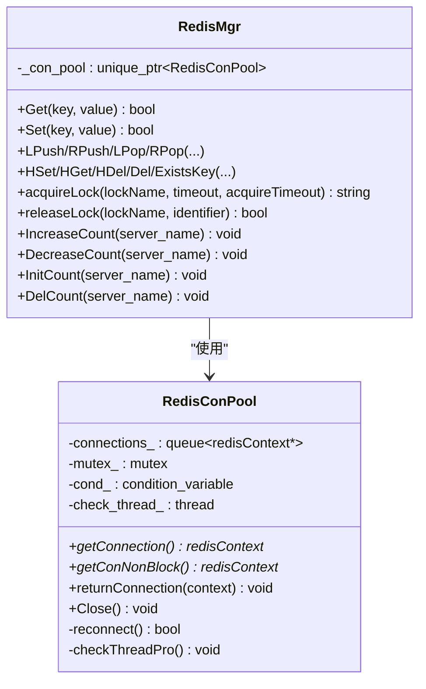
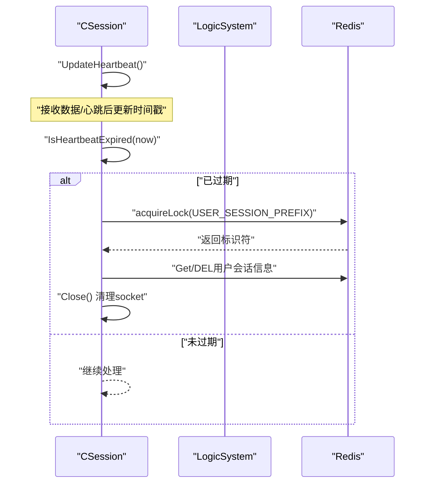
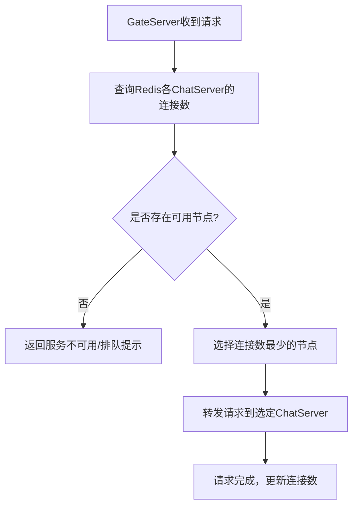
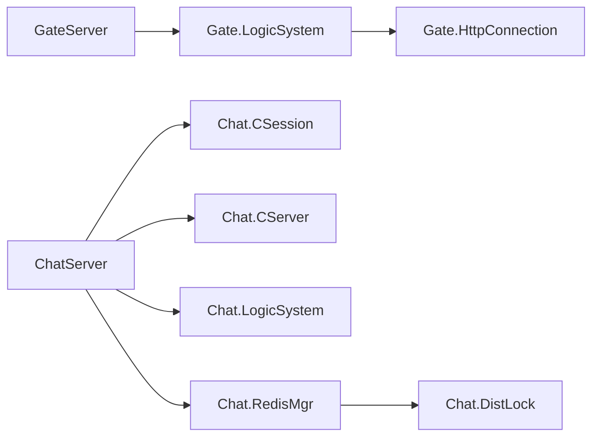
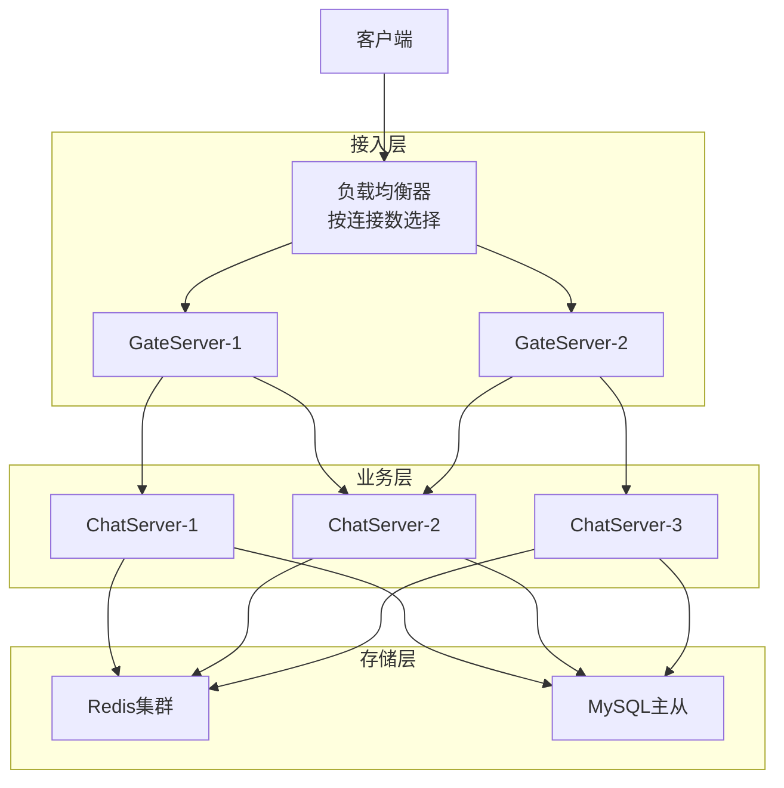
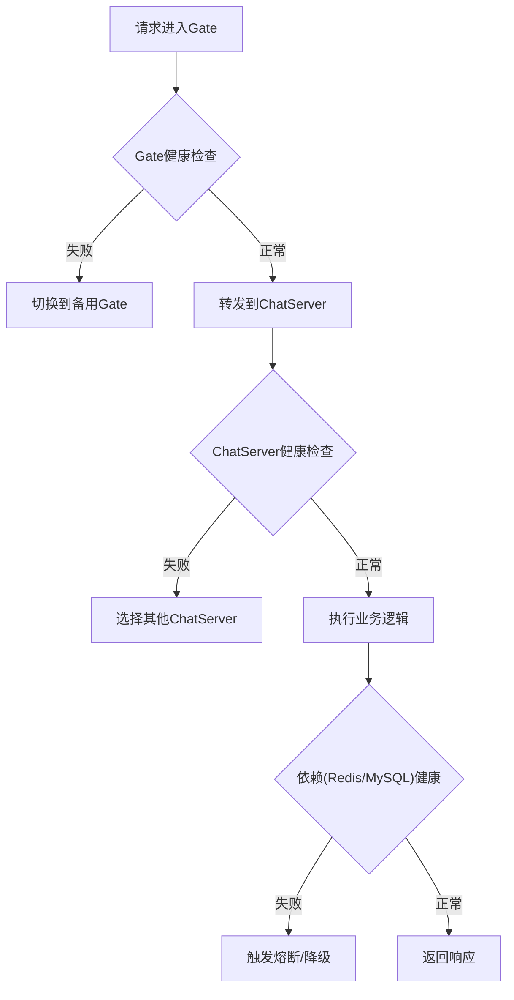

# 高可用设计

<cite>
**本文引用的文件**   
- [server/ChatServer/include/DistLock.h](file://server/ChatServer/include/DistLock.h)
- [server/ChatServer/src/DistLock.cpp](file://server/ChatServer/src/DistLock.cpp)
- [server/ChatServer/include/RedisMgr.h](file://server/ChatServer/include/RedisMgr.h)
- [server/ChatServer/src/RedisMgr.cpp](file://server/ChatServer/src/RedisMgr.cpp)
- [server/ChatServer/include/CSession.h](file://server/ChatServer/include/CSession.h)
- [server/ChatServer/src/CSession.cpp](file://server/ChatServer/src/CSession.cpp)
- [server/ChatServer/include/CServer.h](file://server/ChatServer/include/CServer.h)
- [server/GateServer/include/CServer.h](file://server/GateServer/include/CServer.h)
- [server/GateServer/include/LogicSystem.h](file://server/GateServer/include/LogicSystem.h)
- [server/GateServer/src/HttpConnection.cpp](file://server/GateServer/src/HttpConnection.cpp)
- [server/ChatServer/include/LogicSystem.h](file://server/ChatServer/include/LogicSystem.h)
</cite>

## 目录
1. [引言](#引言)
2. [项目结构](#项目结构)
3. [核心组件](#核心组件)
4. [架构总览](#架构总览)
5. [详细组件分析](#详细组件分析)
6. [依赖分析](#依赖分析)
7. [性能考虑](#性能考虑)
8. [故障排查指南](#故障排查指南)
9. [结论](#结论)
10. [附录](#附录)

## 引言
本设计文档面向LLFCChat系统的高可用目标，围绕分布式锁、负载均衡、心跳检测、服务降级与熔断、监控指标、容灾备份与灾难恢复等关键主题展开。文档基于仓库中现有实现进行提炼与扩展，确保读者既能理解当前代码层面的能力边界，也能据此制定生产级的高可用方案。

## 项目结构
- 网关层（GateServer）：负责HTTP接入、路由分发、鉴权转发，提供对外接口入口。
- 聊天服务（ChatServer）：维护长连接会话、消息处理、心跳保活、用户状态管理，并与Redis交互。
- 资源服务（ResourceServer）：文件传输与资源管理（与本高可用文档关联度较低）。
- 状态服务（StatusServer）：服务健康与状态上报（与本高可用文档关联度较低）。
- 验证服务（VarifyServer）：邮箱认证等辅助功能（与本高可用文档关联度较低）。

**图示来源** 
- [server/GateServer/include/CServer.h:1-16](file://server/GateServer/include/CServer.h#L1-L16)
- [server/ChatServer/include/CServer.h:1-33](file://server/ChatServer/include/CServer.h#L1-L33)
- [server/ChatServer/include/RedisMgr.h:1-305](file://server/ChatServer/include/RedisMgr.h#L1-L305)

**章节来源**
- [server/GateServer/include/CServer.h:1-16](file://server/GateServer/include/CServer.h#L1-L16)
- [server/ChatServer/include/CServer.h:1-33](file://server/ChatServer/include/CServer.h#L1-L33)

## 核心组件
- 分布式锁（DistLock + Redis）：基于Redis SET NX EX与Lua脚本原子释放，支持获取超时与锁过期时间配置，避免死锁。
- Redis连接池（RedisConPool + RedisMgr）：连接复用、PING保活、异常连接回收与自动重连，封装常用命令与分布式锁调用。
- 会话与心跳（CSession + CServer）：异步读写、发送队列限流、心跳更新与过期检测、异常会话清理。
- 逻辑调度（LogicSystem）：消息队列+工作线程，注册处理器，解耦IO与业务。
- HTTP网关（GateServer LogicSystem + HttpConnection）：请求解析、路由分发、超时控制。

**章节来源**
- [server/ChatServer/include/DistLock.h:1-18](file://server/ChatServer/include/DistLock.h#L1-L18)
- [server/ChatServer/src/DistLock.cpp:1-73](file://server/ChatServer/src/DistLock.cpp#L1-L73)
- [server/ChatServer/include/RedisMgr.h:1-305](file://server/ChatServer/include/RedisMgr.h#L1-L305)
- [server/ChatServer/src/RedisMgr.cpp:1-462](file://server/ChatServer/src/RedisMgr.cpp#L1-L462)
- [server/ChatServer/include/CSession.h:1-86](file://server/ChatServer/include/CSession.h#L1-L86)
- [server/ChatServer/src/CSession.cpp:1-338](file://server/ChatServer/src/CSession.cpp#L1-L338)
- [server/ChatServer/include/LogicSystem.h:1-61](file://server/ChatServer/include/LogicSystem.h#L1-L61)
- [server/GateServer/include/LogicSystem.h:1-24](file://server/GateServer/include/LogicSystem.h#L1-L24)
- [server/GateServer/src/HttpConnection.cpp:1-225](file://server/GateServer/src/HttpConnection.cpp#L1-L225)

## 架构总览
下图展示LLFCChat在高可用场景下的核心交互：客户端通过GateServer接入，GateServer将请求转发至ChatServer；ChatServer使用Redis进行分布式锁、连接保活与计数统计；会话层负责心跳与异常恢复；整体具备连接池、超时控制与错误隔离能力。

**图示来源** 
- [server/GateServer/src/HttpConnection.cpp:132-194](file://server/GateServer/src/HttpConnection.cpp#L132-L194)
- [server/ChatServer/src/RedisMgr.cpp:362-393](file://server/ChatServer/src/RedisMgr.cpp#L362-L393)

## 详细组件分析

### 分布式锁设计与实现
- 锁获取：使用SET key identifier NX EX lockTimeout，保证原子性与过期时间，避免进程崩溃导致永久持有。
- 锁释放：EVAL Lua脚本比较identifier并删除key，确保仅持有者能释放。
- 获取超时：acquireTimeout循环尝试，避免无限等待。
- 防死锁：过期时间+唯一标识符+Lua原子释放三重保障。

**图示来源** 
- [server/ChatServer/src/DistLock.cpp:27-49](file://server/ChatServer/src/DistLock.cpp#L27-L49)

**章节来源**
- [server/ChatServer/include/DistLock.h:1-18](file://server/ChatServer/include/DistLock.h#L1-L18)
- [server/ChatServer/src/DistLock.cpp:1-73](file://server/ChatServer/src/DistLock.cpp#L1-L73)

### Redis连接池与保活机制
- 连接池：构造时创建固定数量连接，AUTH校验，队列存取，条件变量唤醒。
- 保活线程：周期性PING检查，失败则回收并重建连接，维持池内有效连接数。
- 非阻塞取连接：getConNonBlock用于定时任务快速探测。
- 关闭与清理：Close通知停止，ClearConnections释放所有连接。

**图示来源** 
- [server/ChatServer/include/RedisMgr.h:1-305](file://server/ChatServer/include/RedisMgr.h#L1-L305)
- [server/ChatServer/src/RedisMgr.cpp:1-462](file://server/ChatServer/src/RedisMgr.cpp#L1-L462)

**章节来源**
- [server/ChatServer/include/RedisMgr.h:1-305](file://server/ChatServer/include/RedisMgr.h#L1-L305)
- [server/ChatServer/src/RedisMgr.cpp:1-462](file://server/ChatServer/src/RedisMgr.cpp#L1-L462)

### 会话管理与心跳检测
- 心跳更新：每次收到数据或主动心跳时更新_last_heartbeat。
- 过期检测：IsHeartbeatExpired判断超过阈值（如20秒）即视为过期。
- 异常处理：DealExceptionSession加分布式锁清理用户会话、IP映射、Token等，防止异地登录冲突。
- 发送队列：Send限制队列长度，避免内存膨胀；异步写回退重试。

**图示来源** 
- [server/ChatServer/src/CSession.cpp:288-336](file://server/ChatServer/src/CSession.cpp#L288-L336)
- [server/ChatServer/include/CSession.h:46-51](file://server/ChatServer/include/CSession.h#L46-L51)

**章节来源**
- [server/ChatServer/src/CSession.cpp:1-338](file://server/ChatServer/src/CSession.cpp#L1-L338)
- [server/ChatServer/include/CSession.h:1-86](file://server/ChatServer/include/CSession.h#L1-L86)

### 负载均衡策略（连接数统计与动态分配）
- 连接数统计：RedisMgr提供IncreaseCount/DecreaseCount/InitCount/DelCount，以服务器名称为键维护登录连接数。
- 动态分配建议：在GateServer侧根据Redis中的各ChatServer连接数选择负载最低的实例（轮询+权重），结合健康检查剔除故障节点。
- 故障转移：当某ChatServer不可用时，GateServer应快速切换至其他可用实例，并在Redis中记录健康状态。

**图示来源** 
- [server/ChatServer/src/RedisMgr.cpp:395-461](file://server/ChatServer/src/RedisMgr.cpp#L395-L461)

**章节来源**
- [server/ChatServer/src/RedisMgr.cpp:395-461](file://server/ChatServer/src/RedisMgr.cpp#L395-L461)

### 服务降级与熔断机制
- 降级策略：当Redis不可用时，ChatServer可返回“稍后重试”或启用本地缓存（如有）；对非关键路径直接拒绝或延迟处理。
- 熔断策略：对下游依赖（Redis/MySQL）设置失败阈值与冷却时间，达到阈值后快速失败，避免雪崩。
- 限流保护：对热点接口进行令牌桶/漏桶限流，保护后端稳定。

[本节为概念性内容，不直接分析具体文件]

### 监控指标定义
- 连接类：活跃会话数、平均心跳间隔、会话超时率、发送队列长度分布。
- 依赖类：Redis连接池大小、PING失败次数、命令成功率、平均延迟；MySQL连接池与慢查询数。
- 业务类：登录成功率、消息投递成功率、图片下载成功率、错误码分布。
- 可用性类：服务存活探针、健康检查通过率、故障切换耗时。

[本节为概念性内容，不直接分析具体文件]

## 依赖分析
- GateServer依赖LogicSystem进行路由分发，依赖HttpConnection进行HTTP协议处理。
- ChatServer依赖CSession/CServer进行会话与定时器管理，依赖LogicSystem进行消息处理，依赖RedisMgr进行缓存与锁操作。
- DistLock依赖hiredis与Boost UUID，RedisMgr封装连接池与常用命令。

**图示来源** 
- [server/GateServer/include/LogicSystem.h:1-24](file://server/GateServer/include/LogicSystem.h#L1-L24)
- [server/GateServer/src/HttpConnection.cpp:1-225](file://server/GateServer/src/HttpConnection.cpp#L1-L225)
- [server/ChatServer/include/LogicSystem.h:1-61](file://server/ChatServer/include/LogicSystem.h#L1-L61)
- [server/ChatServer/include/CSession.h:1-86](file://server/ChatServer/include/CSession.h#L1-L86)
- [server/ChatServer/include/CServer.h:1-33](file://server/ChatServer/include/CServer.h#L1-L33)
- [server/ChatServer/include/RedisMgr.h:1-305](file://server/ChatServer/include/RedisMgr.h#L1-L305)
- [server/ChatServer/include/DistLock.h:1-18](file://server/ChatServer/include/DistLock.h#L1-L18)

**章节来源**
- [server/GateServer/include/LogicSystem.h:1-24](file://server/GateServer/include/LogicSystem.h#L1-L24)
- [server/GateServer/src/HttpConnection.cpp:1-225](file://server/GateServer/src/HttpConnection.cpp#L1-L225)
- [server/ChatServer/include/LogicSystem.h:1-61](file://server/ChatServer/include/LogicSystem.h#L1-L61)
- [server/ChatServer/include/CSession.h:1-86](file://server/ChatServer/include/CSession.h#L1-L86)
- [server/ChatServer/include/CServer.h:1-33](file://server/ChatServer/include/CServer.h#L1-L33)
- [server/ChatServer/include/RedisMgr.h:1-305](file://server/ChatServer/include/RedisMgr.h#L1-L305)
- [server/ChatServer/include/DistLock.h:1-18](file://server/ChatServer/include/DistLock.h#L1-L18)

## 性能考虑
- 连接池大小与并发：根据CPU核数与网络带宽调整Redis连接池大小，避免过多上下文切换。
- 心跳阈值与超时：合理设置心跳过期阈值（如20秒）与获取锁超时，平衡实时性与资源占用。
- 发送队列限流：限制最大队列长度，避免内存暴涨；必要时丢弃低优先级消息。
- 异步I/O：充分利用Asio异步读写，减少阻塞；批量命令合并降低RTT。

[本节为通用指导，不直接分析具体文件]

## 故障排查指南
- Redis连接问题：检查AUTH失败日志、PING失败计数、连接池是否为空；确认网络连通与密码正确。
- 锁竞争与死锁：观察获取锁超时日志、Lua释放失败情况；确认identifier一致且及时释放。
- 会话异常：查看心跳过期日志、异常会话清理流程；确认用户会话键值一致性。
- 网关超时：检查HTTP连接超时设置与请求处理链路；定位慢接口与依赖瓶颈。

**章节来源**
- [server/ChatServer/src/RedisMgr.cpp:137-206](file://server/ChatServer/src/RedisMgr.cpp#L137-L206)
- [server/ChatServer/src/DistLock.cpp:52-73](file://server/ChatServer/src/DistLock.cpp#L52-L73)
- [server/ChatServer/src/CSession.cpp:288-336](file://server/ChatServer/src/CSession.cpp#L288-L336)
- [server/GateServer/src/HttpConnection.cpp:196-208](file://server/GateServer/src/HttpConnection.cpp#L196-L208)

## 结论
LLFCChat在当前实现中已具备分布式锁、Redis连接池与保活、会话心跳与异常清理等基础高可用能力。生产环境建议在此基础上完善负载均衡（Gate侧按连接数动态分配）、服务降级与熔断、全面监控与告警、以及容灾备份与灾难恢复策略，以实现端到端的高可用与弹性伸缩。

[本节为总结性内容，不直接分析具体文件]

## 附录

### 高可用架构图（含负载均衡与故障转移）

[本图为概念性架构示意，不直接映射具体源码文件]

### 故障处理流程图（示例）

[本图为概念性流程示意，不直接映射具体源码文件]

### 容灾备份与灾难恢复策略
- 数据备份：定期全量+增量备份MySQL与Redis快照，异地多副本存储。
- 多活部署：跨机房多区域部署Gate/Chat/Redis/MySQL，启用主从与分片。
- 故障切换：自动化健康检查与流量切换，RTO/RPO目标明确。
- 演练与回滚：定期演练恢复流程，确保预案有效与版本回滚可行。

[本节为概念性内容，不直接分析具体文件]