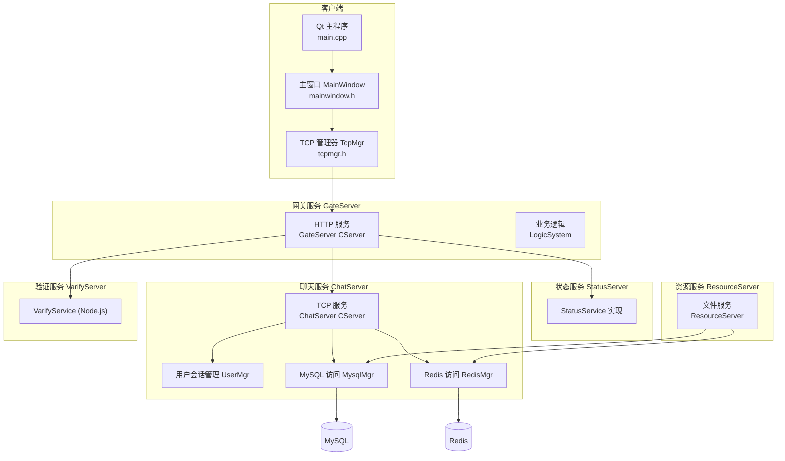
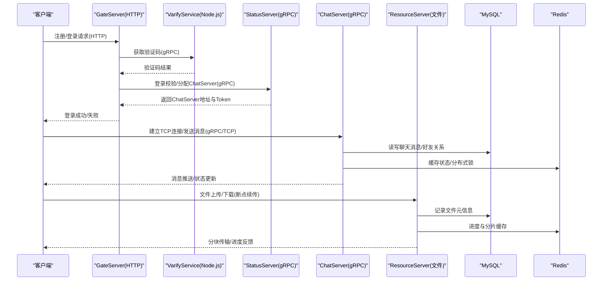
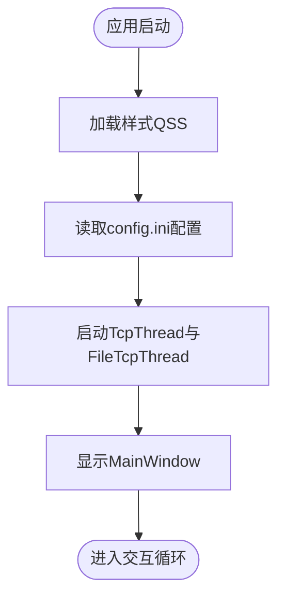
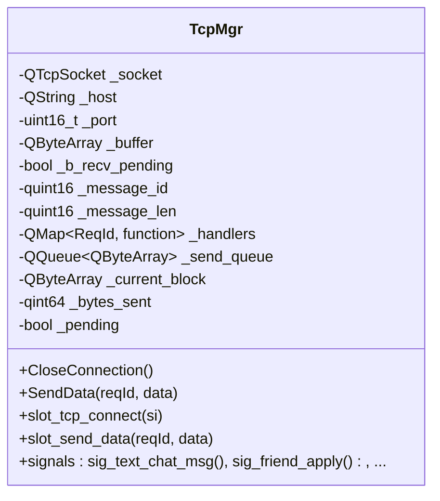
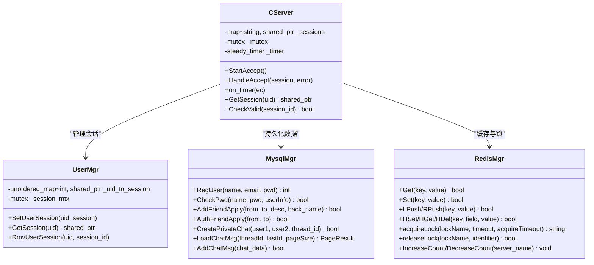
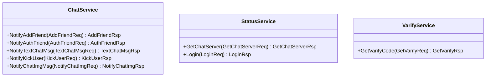
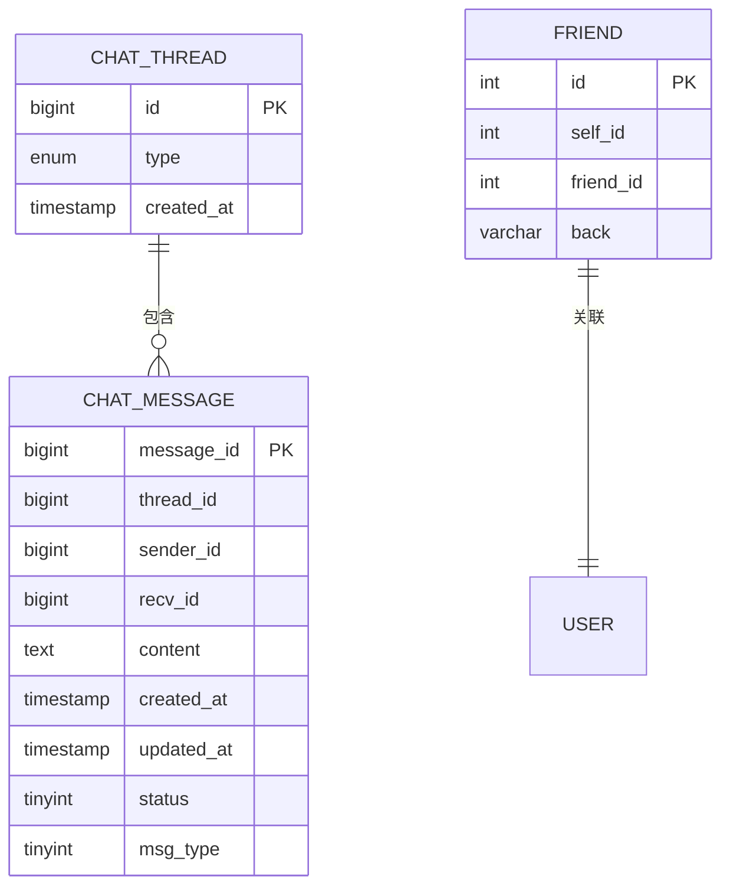
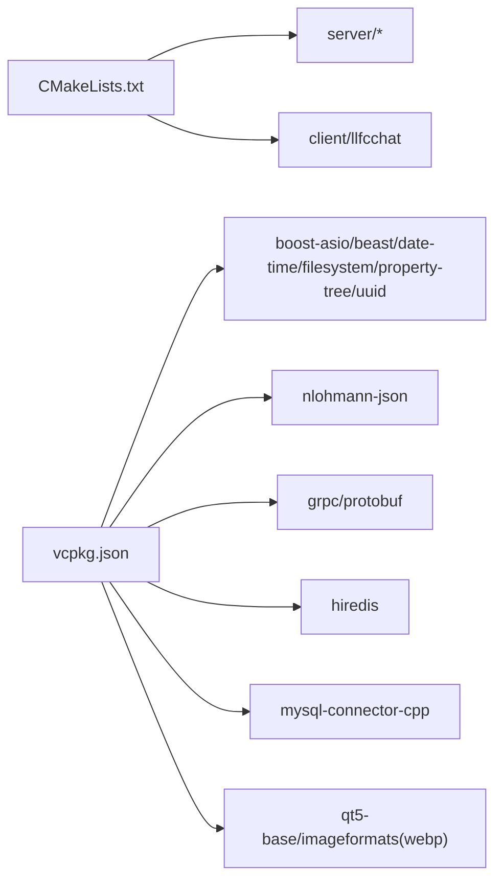

# 项目介绍

<cite>
**本文引用的文件**   
- [README.md](file://README.md)
- [CMakeLists.txt](file://CMakeLists.txt)
- [vcpkg.json](file://vcpkg.json)
- [AGENTS.md](file://AGENTS.md)
- [client/llfcchat/src/main.cpp](file://client/llfcchat/src/main.cpp)
- [client/llfcchat/config/config.ini](file://client/llfcchat/config/config.ini)
- [client/llfcchat/include/mainwindow.h](file://client/llfcchat/include/mainwindow.h)
- [client/llfcchat/include/tcpmgr.h](file://client/llfcchat/include/tcpmgr.h)
- [proto/chat_service/chat.proto](file://proto/chat_service/chat.proto)
- [proto/status_service/status.proto](file://proto/status_service/status.proto)
- [proto/verify_service/verify.proto](file://proto/verify_service/verify.proto)
- [server/CMakeLists.txt](file://server/CMakeLists.txt)
- [server/ChatServer/include/CServer.h](file://server/ChatServer/include/CServer.h)
- [server/GateServer/include/CServer.h](file://server/GateServer/include/CServer.h)
- [server/ChatServer/include/UserMgr.h](file://server/ChatServer/include/UserMgr.h)
- [server/ChatServer/include/MysqlMgr.h](file://server/ChatServer/include/MysqlMgr.h)
- [server/ChatServer/include/RedisMgr.h](file://server/ChatServer/include/RedisMgr.h)
- [sql备份/llfc.sql](file://sql备份/llfc.sql)
</cite>

## 更新摘要
**所做更改**   
- 移除了对已删除的"C++全栈聊天项目"目录结构的引用
- 更新了项目结构描述以反映当前的实际组织方式
- 修正了文档组织方式的说明，现在使用"开发文档"目录而非独立的教程目录
- 更新了构建指南和环境配置信息
- 保持了原有的技术架构和功能描述完整性

## 目录
1. [简介](#简介)
2. [项目结构](#项目结构)
3. [核心组件](#核心组件)
4. [架构总览](#架构总览)
5. [详细组件分析](#详细组件分析)
6. [依赖关系分析](#依赖关系分析)
7. [性能考量](#性能考量)
8. [故障排查指南](#故障排查指南)
9. [结论](#结论)
10. [附录](#附录)

## 简介
LLFCChat 是一个基于 C++ 与 Qt 的桌面即时通讯应用，采用微服务架构设计。系统提供实时文本聊天、好友管理、文件传输（支持断点续传）、用户认证（邮箱验证码）等核心功能。技术特色包括：
- gRPC 微服务通信：服务间通过 Protocol Buffers 定义接口，实现高内聚、低耦合的跨进程调用。
- Boost.Asio 高性能网络编程：服务端使用 Asio 构建高并发 TCP/HTTP 服务器，支撑大量连接与消息转发。
- MySQL 数据存储：持久化用户、好友关系、会话线程与聊天记录等数据。
- Redis 缓存机制：用于验证码派发、分布式锁、在线状态与计数器等场景，提升响应速度与一致性。

学习价值：涵盖现代 C++ 开发、分布式系统设计、网络编程、数据库操作、Qt GUI 开发等多种技术的综合实践，适合希望系统掌握 IM 系统与微服务架构的开发者。

**章节来源**
- [README.md:1-112](file://README.md#L1-L112)

## 项目结构
项目采用"客户端 + 多服务"的分层与分模块组织方式：
- 客户端（Qt 桌面端）：负责 UI 展示、用户交互、TCP/HTTP 通信、本地配置与资源加载。
- 网关服务 GateServer：对外暴露 HTTP API，处理注册、登录、验证码等请求，并协调其他微服务。
- 聊天服务 ChatServer：维护用户会话、转发聊天消息、管理好友关系与聊天线程。
- 状态服务 StatusServer：管理用户登录状态、分配 ChatServer 实例、维护 Token。
- 资源服务 ResourceServer：负责文件上传下载、图片等资源存储与分发。
- 验证服务 VarifyServer（Node.js）：独立实现邮箱验证码生成与发送。
- 协议定义 proto：统一 gRPC 接口契约，确保各服务间通信一致。
- 数据库脚本 sql备份：MySQL 表结构与初始数据。
- 开发文档 开发文档：详细的开发教程和实现步骤文档。

**图示来源**
- [client/llfcchat/src/main.cpp:1-44](file://client/llfcchat/src/main.cpp#L1-L44)
- [client/llfcchat/include/mainwindow.h:1-57](file://client/llfcchat/include/mainwindow.h#L1-L57)
- [client/llfcchat/include/tcpmgr.h:1-90](file://client/llfcchat/include/tcpmgr.h#L1-L90)
- [server/GateServer/include/CServer.h:1-16](file://server/GateServer/include/CServer.h#L1-L16)
- [server/ChatServer/include/CServer.h:1-33](file://server/ChatServer/include/CServer.h#L1-L33)
- [server/ChatServer/include/UserMgr.h:1-22](file://server/ChatServer/include/UserMgr.h#L1-L22)
- [server/ChatServer/include/MysqlMgr.h:1-41](file://server/ChatServer/include/MysqlMgr.h#L1-L41)
- [server/ChatServer/include/RedisMgr.h:1-305](file://server/ChatServer/include/RedisMgr.h#L1-L305)

**章节来源**
- [CMakeLists.txt:1-34](file://CMakeLists.txt#L1-L34)
- [vcpkg.json:1-32](file://vcpkg.json#L1-L32)
- [server/CMakeLists.txt:1-38](file://server/CMakeLists.txt#L1-L38)

## 核心组件
- 客户端入口与界面
  - main.cpp：初始化 Qt 应用、加载样式、读取配置文件（GateServer 地址），启动 TCP 线程与文件传输线程，显示主窗口。
  - mainwindow.h：定义主窗口状态切换（登录、注册、重置、聊天界面），管理对话框生命周期。
- 网络通信
  - tcpmgr.h：封装 QTcpSocket，实现粘包处理、发送队列、消息路由与信号回调，驱动聊天与好友申请流程。
- 服务端基础
  - ChatServer CServer.h：基于 Boost.Asio 的 TCP 服务器，管理会话、定时器、心跳与踢人逻辑。
  - GateServer CServer.h：HTTP 接入层，接收客户端请求并转发到对应微服务。
- 数据与缓存
  - MysqlMgr.h：封装用户注册、密码校验、好友申请与认证、聊天线程与消息存取等 DAO 方法。
  - RedisMgr.h：连接池、键值操作、列表操作、哈希操作、分布式锁与计数器等。
- 协议定义
  - chat.proto：聊天服务 gRPC 接口，包含好友申请、认证、文本消息、图片通知、踢人等 RPC。
  - status.proto：状态服务接口，获取 ChatServer 地址与登录校验。
  - verify.proto：验证服务接口，获取验证码。

**章节来源**
- [client/llfcchat/src/main.cpp:1-44](file://client/llfcchat/src/main.cpp#L1-L44)
- [client/llfcchat/include/mainwindow.h:1-57](file://client/llfcchat/include/mainwindow.h#L1-L57)
- [client/llfcchat/include/tcpmgr.h:1-90](file://client/llfcchat/include/tcpmgr.h#L1-L90)
- [server/ChatServer/include/CServer.h:1-33](file://server/ChatServer/include/CServer.h#L1-L33)
- [server/GateServer/include/CServer.h:1-16](file://server/GateServer/include/CServer.h#L1-L16)
- [server/ChatServer/include/MysqlMgr.h:1-41](file://server/ChatServer/include/MysqlMgr.h#L1-L41)
- [server/ChatServer/include/RedisMgr.h:1-305](file://server/ChatServer/include/RedisMgr.h#L1-L305)
- [proto/chat_service/chat.proto:1-105](file://proto/chat_service/chat.proto#L1-L105)
- [proto/status_service/status.proto:1-32](file://proto/status_service/status.proto#L1-L32)
- [proto/verify_service/verify.proto:1-19](file://proto/verify_service/verify.proto#L1-L19)

## 架构总览
系统以微服务为核心，客户端通过 GateServer 进行统一接入；聊天与状态由 ChatServer 与 StatusServer 协同完成；文件传输由 ResourceServer 承载；验证码由独立的 Node.js 服务提供。gRPC 作为服务间通信标准，Protobuf 保证强类型与高效序列化。

**图示来源**
- [proto/chat_service/chat.proto:1-105](file://proto/chat_service/chat.proto#L1-L105)
- [proto/status_service/status.proto:1-32](file://proto/status_service/status.proto#L1-L32)
- [proto/verify_service/verify.proto:1-19](file://proto/verify_service/verify.proto#L1-L19)
- [server/ChatServer/include/MysqlMgr.h:1-41](file://server/ChatServer/include/MysqlMgr.h#L1-L41)
- [server/ChatServer/include/RedisMgr.h:1-305](file://server/ChatServer/include/RedisMgr.h#L1-L305)

## 详细组件分析

### 客户端入口与界面
- main.cpp：加载样式、读取 config.ini 中的 GateServer 地址，启动 TCP 与文件传输线程，显示主窗口。
- mainwindow.h：管理登录、注册、重置、聊天界面的切换，处理离线与异常事件。

**图示来源**
- [client/llfcchat/src/main.cpp:1-44](file://client/llfcchat/src/main.cpp#L1-L44)
- [client/llfcchat/config/config.ini:1-4](file://client/llfcchat/config/config.ini#L1-L4)
- [client/llfcchat/include/mainwindow.h:1-57](file://client/llfcchat/include/mainwindow.h#L1-L57)

**章节来源**
- [client/llfcchat/src/main.cpp:1-44](file://client/llfcchat/src/main.cpp#L1-L44)
- [client/llfcchat/config/config.ini:1-4](file://client/llfcchat/config/config.ini#L1-L4)
- [client/llfcchat/include/mainwindow.h:1-57](file://client/llfcchat/include/mainwindow.h#L1-L57)

### 网络通信（TcpMgr）
- 职责：封装 QTcpSocket，处理粘包、发送队列、消息路由与信号回调，驱动聊天与好友申请流程。
- 关键能力：异步收发、错误重连、消息 ID 与长度解析、处理器映射。

**图示来源**
- [client/llfcchat/include/tcpmgr.h:1-90](file://client/llfcchat/include/tcpmgr.h#L1-L90)

**章节来源**
- [client/llfcchat/include/tcpmgr.h:1-90](file://client/llfcchat/include/tcpmgr.h#L1-L90)

### 聊天服务（ChatServer）
- CServer.h：基于 Boost.Asio 的 TCP 服务器，管理会话、定时器、心跳与踢人逻辑。
- UserMgr.h：维护 uid 到 session 的映射，支持设置、获取与移除会话。
- MysqlMgr.h：封装用户、好友、聊天线程与消息的 CRUD 操作。
- RedisMgr.h：连接池、键值/列表/哈希操作、分布式锁与计数器等。

**图示来源**
- [server/ChatServer/include/CServer.h:1-33](file://server/ChatServer/include/CServer.h#L1-L33)
- [server/ChatServer/include/UserMgr.h:1-22](file://server/ChatServer/include/UserMgr.h#L1-L22)
- [server/ChatServer/include/MysqlMgr.h:1-41](file://server/ChatServer/include/MysqlMgr.h#L1-L41)
- [server/ChatServer/include/RedisMgr.h:1-305](file://server/ChatServer/include/RedisMgr.h#L1-L305)

**章节来源**
- [server/ChatServer/include/CServer.h:1-33](file://server/ChatServer/include/CServer.h#L1-L33)
- [server/ChatServer/include/UserMgr.h:1-22](file://server/ChatServer/include/UserMgr.h#L1-L22)
- [server/ChatServer/include/MysqlMgr.h:1-41](file://server/ChatServer/include/MysqlMgr.h#L1-L41)
- [server/ChatServer/include/RedisMgr.h:1-305](file://server/ChatServer/include/RedisMgr.h#L1-L305)

### 协议与微服务接口
- chat.proto：定义聊天服务的 gRPC 接口，包括好友申请、认证、文本消息、图片通知、踢人等。
- status.proto：定义状态服务的 gRPC 接口，包括获取 ChatServer 地址与登录校验。
- verify.proto：定义验证服务的 gRPC 接口，获取验证码。

**图示来源**
- [proto/chat_service/chat.proto:1-105](file://proto/chat_service/chat.proto#L1-L105)
- [proto/status_service/status.proto:1-32](file://proto/status_service/status.proto#L1-L32)
- [proto/verify_service/verify.proto:1-19](file://proto/verify_service/verify.proto#L1-L19)

**章节来源**
- [proto/chat_service/chat.proto:1-105](file://proto/chat_service/chat.proto#L1-L105)
- [proto/status_service/status.proto:1-32](file://proto/status_service/status.proto#L1-L32)
- [proto/verify_service/verify.proto:1-19](file://proto/verify_service/verify.proto#L1-L19)

### 数据库与缓存
- MySQL：存储用户、好友关系、聊天线程与消息等核心数据，索引优化查询性能。
- Redis：连接池管理、键值/列表/哈希操作、分布式锁、在线状态与计数器等。

**图示来源**
- [sql备份/llfc.sql:1-200](file://sql备份/llfc.sql#L1-L200)

**章节来源**
- [sql备份/llfc.sql:1-200](file://sql备份/llfc.sql#L1-L200)
- [server/ChatServer/include/MysqlMgr.h:1-41](file://server/ChatServer/include/MysqlMgr.h#L1-L41)
- [server/ChatServer/include/RedisMgr.h:1-305](file://server/ChatServer/include/RedisMgr.h#L1-L305)

## 依赖关系分析
- 构建与依赖管理：CMake 作为构建系统，vcpkg 管理第三方库（Boost.Asio/Beast、gRPC、protobuf、hiredis、mysql-connector-cpp、Qt5）。
- 客户端依赖：Qt 框架、Boost.Asio（网络）、nlohmann-json（JSON 解析）。
- 服务端依赖：Boost.Asio（高并发网络）、gRPC/protobuf（服务间通信）、MySQL Connector（持久化）、hiredis（缓存）。

**图示来源**
- [CMakeLists.txt:1-34](file://CMakeLists.txt#L1-L34)
- [vcpkg.json:1-32](file://vcpkg.json#L1-L32)

**章节来源**
- [CMakeLists.txt:1-34](file://CMakeLists.txt#L1-L34)
- [vcpkg.json:1-32](file://vcpkg.json#L1-L32)

## 性能考量
- 网络 I/O：使用 Boost.Asio 的非阻塞 I/O 模型，结合 IO Service Pool 提高并发处理能力。
- 粘包处理：客户端 TcpMgr 中维护缓冲区与消息长度解析，避免粘包导致的解析错误。
- 数据库索引：聊天消息按 thread_id 与时间戳建立索引，提升分页与历史消息加载性能。
- 缓存策略：Redis 连接池与 PING 保活，降低连接开销；分布式锁保障并发安全。
- 文件传输：分块传输与断点续传，减少重复传输与内存占用，提升大文件稳定性。

## 故障排查指南
- 客户端连接问题
  - 检查 config.ini 中 GateServer 的地址与端口是否正确。
  - 确认 TcpMgr 的信号槽是否触发，观察连接成功与关闭信号。
- 登录与验证码
  - 验证 VarifyService 是否可用，检查验证码生成与缓存。
  - 查看 StatusServer 的登录接口返回码与 Token 有效性。
- 聊天消息丢失或延迟
  - 检查 ChatServer 的会话管理与消息转发逻辑。
  - 确认 MySQL 写入与 Redis 缓存一致性。
- 文件传输中断
  - 检查分块大小与断点续传状态，确认资源服务与客户端进度同步。
- Redis 连接异常
  - 观察连接池健康检查与自动重连逻辑，确认 AUTH 与 PING 正常。

**章节来源**
- [client/llfcchat/config/config.ini:1-4](file://client/llfcchat/config/config.ini#L1-L4)
- [client/llfcchat/include/tcpmgr.h:1-90](file://client/llfcchat/include/tcpmgr.h#L1-L90)
- [proto/verify_service/verify.proto:1-19](file://proto/verify_service/verify.proto#L1-L19)
- [proto/status_service/status.proto:1-32](file://proto/status_service/status.proto#L1-L32)
- [server/ChatServer/include/RedisMgr.h:1-305](file://server/ChatServer/include/RedisMgr.h#L1-L305)

## 结论
LLFCChat 通过微服务架构将 IM 系统的核心能力解耦，结合 gRPC、Boost.Asio、MySQL 与 Redis 等技术栈，实现了高并发、可扩展、易维护的桌面即时通讯应用。项目不仅覆盖现代 C++ 开发与 Qt GUI 实践，还深入分布式系统设计、网络编程与数据库操作，是学习与研究 IM 系统的优质参考。

## 附录
- 构建环境要求：CMake 3.25+、Ninja Multi-Config 生成器、vcpkg 依赖管理。
- 运行前置：部署 MySQL、Redis、VarifyService（Node.js），配置 GateServer、ChatServer、StatusServer、ResourceServer。
- 常用命令：使用 CMake 配置与构建，分别编译 server 与 client 子项目。
- 开发文档：详细的开发教程位于"开发文档"目录，涵盖从项目搭建到高级功能的完整实现过程。

**章节来源**
- [AGENTS.md:1-58](file://AGENTS.md#L1-L58)
- [README.md:1-112](file://README.md#L1-L112)