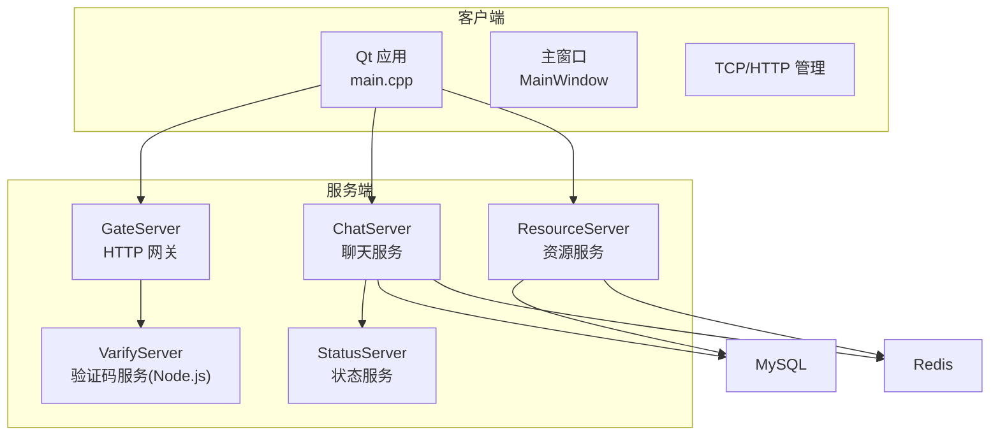
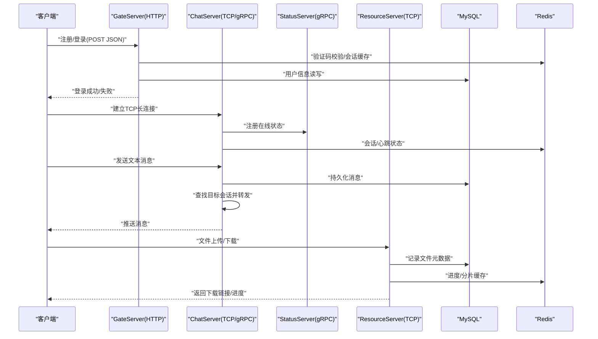
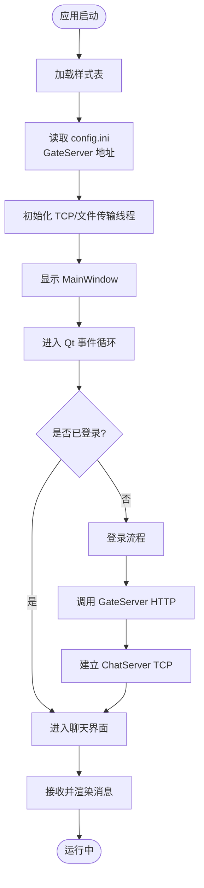
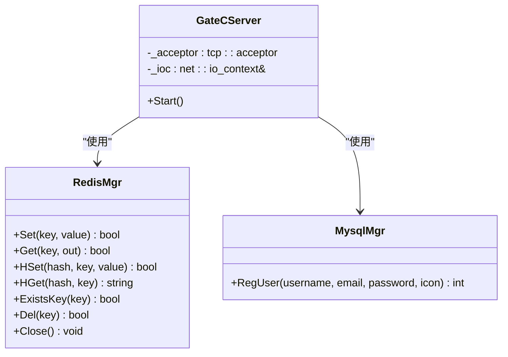
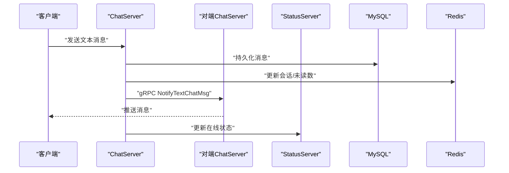
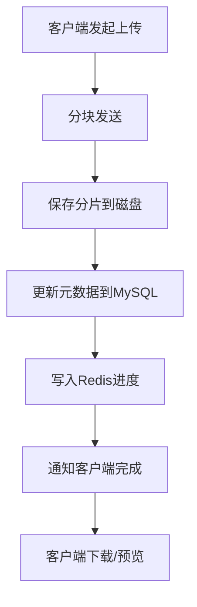
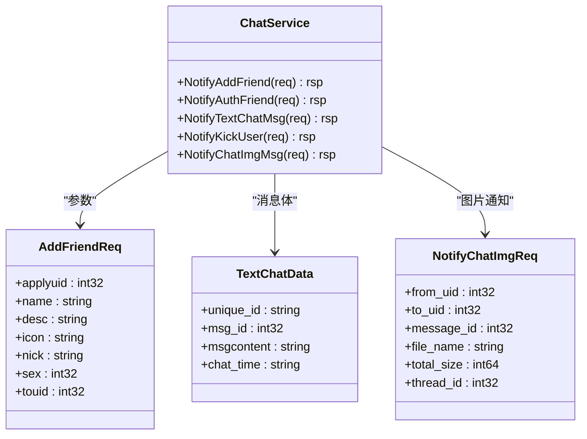
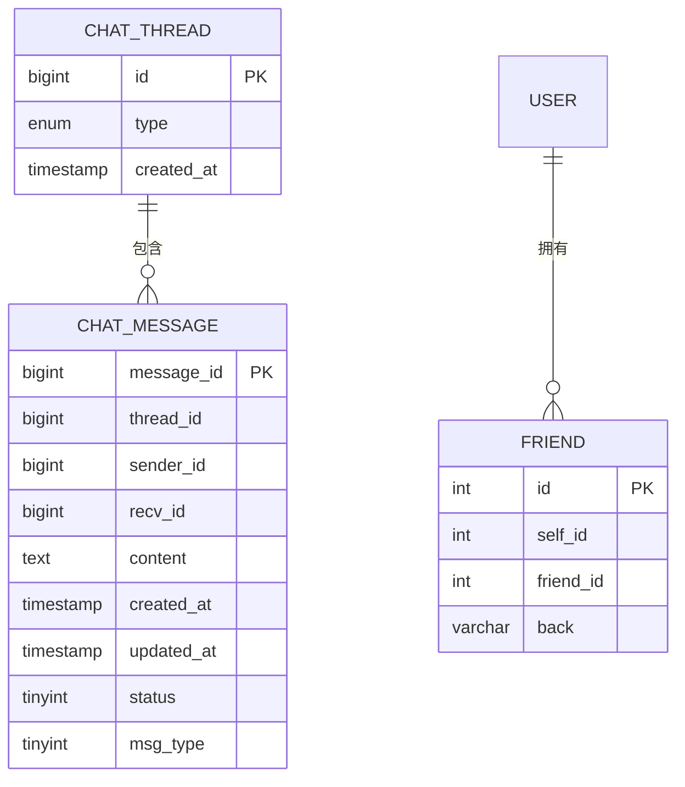
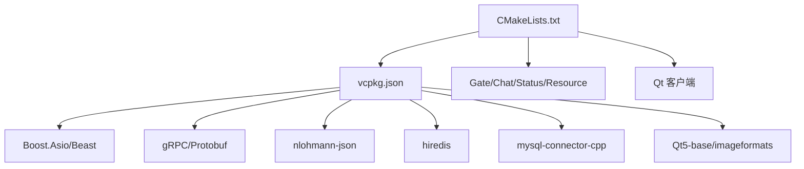

# 项目概述

<cite>
**本文引用的文件**   
- [README.md](file://README.md)
- [CMakeLists.txt](file://CMakeLists.txt)
- [vcpkg.json](file://vcpkg.json)
- [AGENTS.md](file://AGENTS.md)
- [client/llfcchat/src/main.cpp](file://client/llfcchat/src/main.cpp)
- [client/llfcchat/config/config.ini](file://client/llfcchat/config/config.ini)
- [client/llfcchat/include/mainwindow.h](file://client/llfcchat/include/mainwindow.h)
- [server/GateServer/src/GateServer.cpp](file://server/GateServer/src/GateServer.cpp)
- [server/GateServer/include/CServer.h](file://server/GateServer/include/CServer.h)
- [server/ChatServer/src/ChatServer.cpp](file://server/ChatServer/src/ChatServer.cpp)
- [server/ChatServer/include/CServer.h](file://server/ChatServer/include/CServer.h)
- [server/ResourceServer/src\ResourceServer.cpp](file://server/ResourceServer/src\ResourceServer.cpp)
- [proto/chat_service/chat.proto](file://proto/chat_service/chat.proto)
- [sql备份/llfc.sql](file://sql备份/llfc.sql)
</cite>

## 目录
1. [简介](#简介)
2. [项目结构](#项目结构)
3. [核心组件](#核心组件)
4. [架构总览](#架构总览)
5. [详细组件分析](#详细组件分析)
6. [依赖关系分析](#依赖关系分析)
7. [性能考量](#性能考量)
8. [故障排查指南](#故障排查指南)
9. [结论](#结论)
10. [附录：快速开始](#附录快速开始)

## 简介
LLFCChat 是一个基于 C++ 与 Qt 的桌面即时通讯应用，采用微服务架构实现高并发、可扩展的聊天系统。系统支持实时文本聊天、好友管理、文件传输等核心功能，并通过 gRPC 进行服务间通信，使用 MySQL 持久化消息与用户数据，Redis 作为缓存与会话状态存储，Boost.Asio 提供高性能网络 I/O。客户端通过 HTTP（Beast）与 GateServer 交互，通过 TCP 长连接与 ChatServer 进行实时通信，资源下载由 ResourceServer 负责。

本概述面向初学者提供概念性说明，同时为有经验的开发者给出技术细节与架构图表，帮助快速理解并上手该项目。

## 项目结构
仓库采用“客户端 + 多服务器”的分层组织方式：
- client/llfcchat：Qt 桌面客户端，包含 UI、网络管理、配置加载与线程模型。
- server/*：微服务集合，包括 GateServer（HTTP 网关）、ChatServer（聊天会话与转发）、StatusServer（状态服务）、ResourceServer（资源/文件服务），以及 VarifyServer（Node.js 验证码服务）。
- proto：gRPC 接口定义，如 chat_service/chat.proto。
- sql备份：MySQL 数据库脚本，包含消息、会话、好友等表结构。
- cmake、CMakeLists.txt、vcpkg.json：构建系统与依赖声明。

图表来源 
- [client/llfcchat/src/main.cpp:1-44](file://client/llfcchat/src/main.cpp#L1-L44)
- [client/llfcchat/include/mainwindow.h:1-57](file://client/llfcchat/include/mainwindow.h#L1-L57)
- [server/GateServer/src/GateServer.cpp:1-160](file://server/GateServer/src/GateServer.cpp#L1-L160)
- [server/ChatServer/src/ChatServer.cpp:1-81](file://server/ChatServer/src/ChatServer.cpp#L1-L81)
- [server/ResourceServer/src\ResourceServer.cpp:1-42](file://server/ResourceServer/src\ResourceServer.cpp#L1-L42)
- [proto/chat_service/chat.proto:1-105](file://proto/chat_service/chat.proto#L1-L105)

章节来源
- [README.md:1-112](file://README.md#L1-L112)
- [CMakeLists.txt:1-34](file://CMakeLists.txt#L1-L34)
- [vcpkg.json:1-32](file://vcpkg.json#L1-L32)

## 核心组件
- 客户端（Qt）
  - 入口 main.cpp：加载样式、读取 config.ini 获取 GateServer 地址，启动 TCP 线程与文件传输线程，显示主界面。
  - MainWindow：管理登录、注册、重置、聊天界面的切换与离线事件处理。
- 网关（GateServer）
  - 基于 Boost.Asio 的 HTTP 服务器，负责用户注册、登录、验证码等 HTTP 请求处理，并与 Redis/MySQL 交互。
- 聊天服务（ChatServer）
  - 基于 Boost.Asio 的 TCP 服务器，维护用户会话（Session），通过 gRPC 与其他 ChatServer/StatusServer 通信，完成消息转发、好友通知、踢人等操作。
- 状态服务（StatusServer）
  - 提供在线状态、心跳等能力，供 ChatServer 查询与更新。
- 资源服务（ResourceServer）
  - 提供文件上传/下载、断点续传、图片资源异步通知等功能。
- 验证码服务（VarifyServer）
  - Node.js 实现的验证码派发与校验服务，配合 Redis 存储验证码。

章节来源
- [client/llfcchat/src/main.cpp:1-44](file://client/llfcchat/src/main.cpp#L1-L44)
- [client/llfcchat/include/mainwindow.h:1-57](file://client/llfcchat/include/mainwindow.h#L1-L57)
- [server/GateServer/src/GateServer.cpp:1-160](file://server/GateServer/src/GateServer.cpp#L1-L160)
- [server/ChatServer/src/ChatServer.cpp:1-81](file://server/ChatServer/src/ChatServer.cpp#L1-L81)
- [server/ResourceServer/src\ResourceServer.cpp:1-42](file://server/ResourceServer/src\ResourceServer.cpp#L1-L42)

## 架构总览
系统采用微服务架构，职责清晰、扩展性强：
- 客户端通过 HTTP 访问 GateServer 完成认证与基础操作；通过 TCP 长连接与 ChatServer 进行实时通信；通过 ResourceServer 进行文件传输。
- ChatServer 之间通过 gRPC 进行跨服消息转发与通知；StatusServer 提供统一的状态管理能力；所有业务数据落库到 MySQL，热点数据缓存于 Redis。
- 配置文件集中管理各服务端口与地址，便于本地调试与部署。

图表来源 
- [server/GateServer/src/GateServer.cpp:1-160](file://server/GateServer/src/GateServer.cpp#L1-L160)
- [server/ChatServer/src/ChatServer.cpp:1-81](file://server/ChatServer/src/ChatServer.cpp#L1-L81)
- [proto/chat_service/chat.proto:1-105](file://proto/chat_service/chat.proto#L1-L105)
- [sql备份/llfc.sql:1-200](file://sql备份/llfc.sql#L1-L200)

## 详细组件分析

### 客户端（Qt）
- 启动流程
  - 加载样式表，读取 config.ini 中的 GateServer 主机与端口，拼接 URL 前缀。
  - 启动 TcpThread 与 FileTcpThread 两个后台线程，分别处理聊天 TCP 与文件传输 TCP。
  - 创建并显示 MainWindow，进入 Qt 事件循环。
- 界面状态管理
  - MainWindow 管理 LOGIN_UI、REGISTER_UI、RESET_UI、CHAT_UI 四种状态，并提供切换槽函数。
  - 处理离线事件与异常断开重连逻辑。

图表来源 
- [client/llfcchat/src/main.cpp:1-44](file://client/llfcchat/src/main.cpp#L1-L44)
- [client/llfcchat/config/config.ini:1-4](file://client/llfcchat/config/config.ini#L1-L4)
- [client/llfcchat/include/mainwindow.h:1-57](file://client/llfcchat/include/mainwindow.h#L1-L57)

章节来源
- [client/llfcchat/src/main.cpp:1-44](file://client/llfcchat/src/main.cpp#L1-L44)
- [client/llfcchat/config/config.ini:1-4](file://client/llfcchat/config/config.ini#L1-L4)
- [client/llfcchat/include/mainwindow.h:1-57](file://client/llfcchat/include/mainwindow.h#L1-L57)

### 网关（GateServer）
- 功能职责
  - 提供 HTTP API，处理注册、登录、验证码等请求。
  - 与 Redis 交互进行验证码校验与临时状态缓存，与 MySQL 进行用户数据读写。
- 关键实现
  - 使用 Boost.Asio 的 io_context 与 acceptor 监听端口。
  - 通过 hiredis 直接操作 Redis，MysqlMgr 封装 MySQL 操作。

图表来源 
- [server/GateServer/include/CServer.h:1-16](file://server/GateServer/include/CServer.h#L1-L16)
- [server/GateServer/src/GateServer.cpp:1-160](file://server/GateServer/src/GateServer.cpp#L1-L160)

章节来源
- [server/GateServer/src/GateServer.cpp:1-160](file://server/GateServer/src/GateServer.cpp#L1-L160)
- [server/GateServer/include/CServer.h:1-16](file://server/GateServer/include/CServer.h#L1-L16)

### 聊天服务（ChatServer）
- 功能职责
  - 维护 TCP 长连接与用户会话（Session），处理好友申请、认证、文本消息、图片消息通知、踢人等。
  - 通过 gRPC 与其他 ChatServer/StatusServer 通信，实现跨服消息转发与状态同步。
- 关键实现
  - AsioIOServicePool 提供多线程 IO 池。
  - ChatServiceImpl 实现 gRPC 服务接口，RegisterServer 注入 TCP Server 引用。
  - LogicSystem 统一管理会话与消息路由。

图表来源 
- [server/ChatServer/src/ChatServer.cpp:1-81](file://server/ChatServer/src/ChatServer.cpp#L1-L81)
- [server/ChatServer/include/CServer.h:1-33](file://server/ChatServer/include/CServer.h#L1-L33)
- [proto/chat_service/chat.proto:1-105](file://proto/chat_service/chat.proto#L1-L105)

章节来源
- [server/ChatServer/src/ChatServer.cpp:1-81](file://server/ChatServer/src/ChatServer.cpp#L1-L81)
- [server/ChatServer/include/CServer.h:1-33](file://server/ChatServer/include/CServer.h#L1-L33)
- [proto/chat_service/chat.proto:1-105](file://proto/chat_service/chat.proto#L1-L105)

### 资源服务（ResourceServer）
- 功能职责
  - 提供文件上传/下载、断点续传、图片资源异步通知等功能。
  - 与 MySQL 记录文件元数据，与 Redis 缓存进度与分片信息。
- 关键实现
  - 基于 Boost.Asio 的 TCP 服务器，处理分块传输与状态反馈。

图表来源 
- [server/ResourceServer/src\ResourceServer.cpp:1-42](file://server/ResourceServer/src\ResourceServer.cpp#L1-L42)

章节来源
- [server/ResourceServer/src\ResourceServer.cpp:1-42](file://server/ResourceServer/src\ResourceServer.cpp#L1-L42)

### gRPC 接口（chat.proto）
- 主要 RPC
  - NotifyAddFriend：好友申请通知
  - NotifyAuthFriend：好友认证结果通知
  - NotifyTextChatMsg：文本消息转发
  - NotifyKickUser：踢人通知
  - NotifyChatImgMsg：图片消息通知
- 数据结构
  - AddFriendReq/Rsp、AuthFriendReq/Rsp、TextChatData、NotifyChatImgReq/Rsp 等。

图表来源 
- [proto/chat_service/chat.proto:1-105](file://proto/chat_service/chat.proto#L1-L105)

章节来源
- [proto/chat_service/chat.proto:1-105](file://proto/chat_service/chat.proto#L1-L105)

### 数据库设计（MySQL）
- 主要表
  - chat_message：聊天记录，包含 thread_id、sender_id、recv_id、content、status、msg_type 等字段，按 thread_id 与时间索引优化查询。
  - chat_thread：会话表，区分 private/group 类型。
  - friend：好友关系表，自引用双向关联。
- 用途
  - 消息持久化与历史回放；会话类型管理；好友关系维护。

图表来源 
- [sql备份/llfc.sql:1-200](file://sql备份/llfc.sql#L1-L200)

章节来源
- [sql备份/llfc.sql:1-200](file://sql备份/llfc.sql#L1-L200)

## 依赖关系分析
- 构建系统
  - CMake 强制使用 Ninja Multi-Config 生成器，要求独立构建目录。
  - vcpkg 清单模式管理依赖，包括 Boost.Asio/Beast、nlohmann-json、grpc、protobuf、hiredis、mysql-connector-cpp、Qt5 等。
- 运行时依赖
  - MySQL、Redis、可选的 Node.js 验证码服务。
  - Windows 平台需 Visual Studio BuildTools、MSVC 工具集、CMake、Ninja、vcpkg。

图表来源 
- [CMakeLists.txt:1-34](file://CMakeLists.txt#L1-L34)
- [vcpkg.json:1-32](file://vcpkg.json#L1-L32)

章节来源
- [CMakeLists.txt:1-34](file://CMakeLists.txt#L1-L34)
- [vcpkg.json:1-32](file://vcpkg.json#L1-L32)

## 性能考量
- 网络 I/O
  - 使用 Boost.Asio 的 io_context 与线程池（AsioIOServicePool）提升并发处理能力。
  - TCP 长连接减少握手开销，适合实时聊天场景。
- 数据存储
  - MySQL 针对消息表建立复合索引（thread_id, created_at/message_id）优化查询。
  - Redis 用于验证码、会话状态、进度缓存，降低数据库压力。
- 资源传输
  - 分块上传/下载与断点续传提升大文件传输稳定性与用户体验。
- 服务解耦
  - gRPC 微服务拆分职责，便于水平扩展与独立部署。

[本节为通用指导，不直接分析具体文件]

## 故障排查指南
- 客户端无法连接 GateServer
  - 检查 client/llfcchat/config/config.ini 中的 host/port 是否正确。
  - 确认 GateServer 进程已启动且端口未被占用。
- 登录失败或验证码错误
  - 检查 Redis 是否可连接与密码配置正确。
  - 查看 VarifyServer 日志与 Redis 中验证码键值是否存在。
- 聊天消息不同步
  - 检查 ChatServer 与 StatusServer 的 gRPC 端口连通性。
  - 确认 MySQL 消息写入与 Redis 会话状态更新是否正常。
- 文件传输中断
  - 检查 ResourceServer 的分片存储路径权限与磁盘空间。
  - 核对 Redis 进度键与 MySQL 元数据一致性。

章节来源
- [client/llfcchat/config/config.ini:1-4](file://client/llfcchat/config/config.ini#L1-L4)
- [server/GateServer/src/GateServer.cpp:1-160](file://server/GateServer/src/GateServer.cpp#L1-L160)
- [server/ChatServer/src/ChatServer.cpp:1-81](file://server/ChatServer/src/ChatServer.cpp#L1-L81)
- [server/ResourceServer/src\ResourceServer.cpp:1-42](file://server/ResourceServer/src\ResourceServer.cpp#L1-L42)

## 结论
LLFCChat 以清晰的微服务架构与成熟的技术栈实现了稳定高效的桌面即时通讯系统。客户端通过 Qt 提供良好用户体验，服务端通过 Boost.Asio 与 gRPC 实现高并发与跨服通信，结合 MySQL 与 Redis 保障数据一致性与性能。该方案既适合学习网络编程与分布式系统设计，也可作为实际项目的参考模板。

[本节为总结，不直接分析具体文件]

## 附录：快速开始
- 环境要求
  - Visual Studio 2026 BuildTools、MSVC 工具集、CMake、Ninja、vcpkg。
  - MySQL、Redis、可选 Node.js（验证码服务）。
- 依赖安装
  - 使用 vcpkg 清单模式安装依赖（见 vcpkg.json）。
- 编译步骤
  - 在 PowerShell 中加载 VS 开发环境，执行 cmake --preset windows-ninja。
  - 编译全部服务器与客户端目标（Debug/Release）。
- 运行步骤
  - 启动 Redis、MySQL、VarifyServer。
  - 依次启动 GateServer、StatusServer、ChatServer、ResourceServer。
  - 配置客户端 config.ini 指向 GateServer，运行客户端。

章节来源
- [AGENTS.md:1-58](file://AGENTS.md#L1-L58)
- [CMakeLists.txt:1-34](file://CMakeLists.txt#L1-L34)
- [vcpkg.json:1-32](file://vcpkg.json#L1-L32)
- [client/llfcchat/config/config.ini:1-4](file://client/llfcchat/config/config.ini#L1-L4)