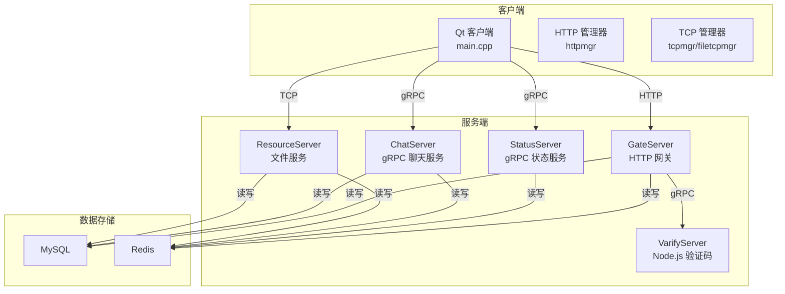
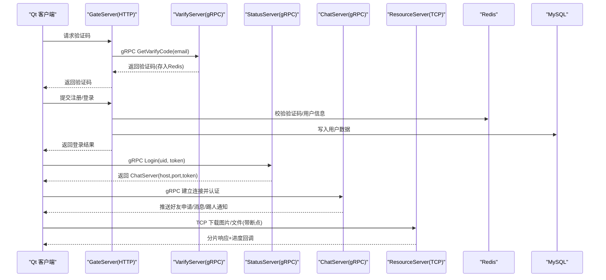
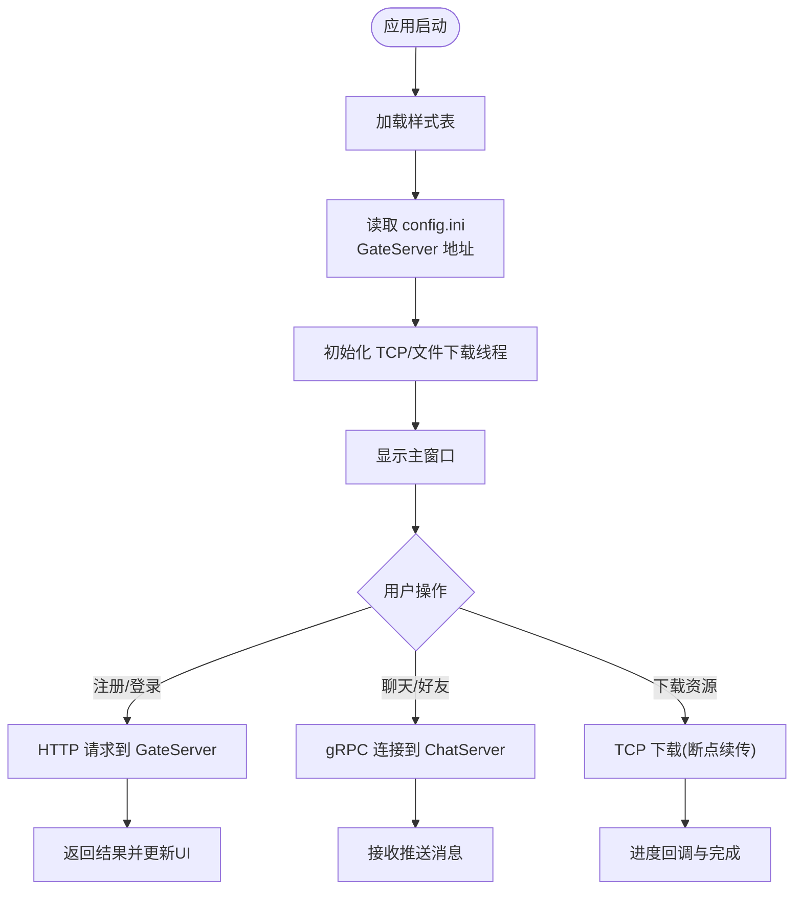
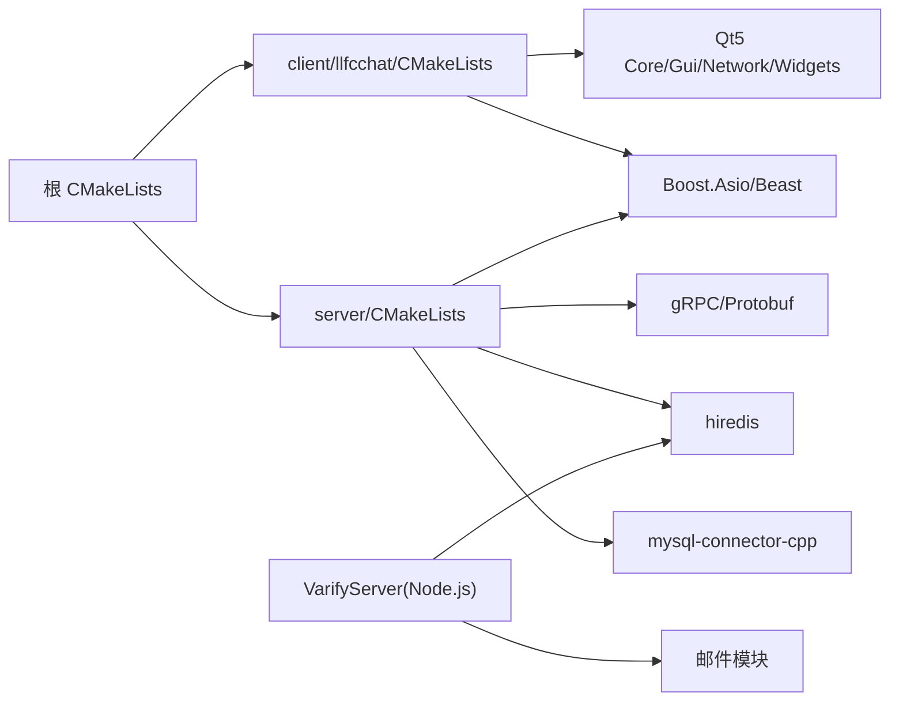

# 项目概述

<cite>
**本文引用的文件**
- [README.md](file://README.md)
- [CMakeLists.txt](file://CMakeLists.txt)
- [client/llfcchat/CMakeLists.txt](file://client/llfcchat/CMakeLists.txt)
- [server/CMakeLists.txt](file://server/CMakeLists.txt)
- [vcpkg.json](file://vcpkg.json)
- [client/llfcchat/config/config.ini](file://client/llfcchat/config/config.ini)
- [client/llfcchat/src/main.cpp](file://client/llfcchat/src/main.cpp)
- [server/GateServer/src/GateServer.cpp](file://server/GateServer/src/GateServer.cpp)
- [server/ChatServer/src/ChatServer.cpp](file://server/ChatServer/src/ChatServer.cpp)
- [server/StatusServer/src/StatusServer.cpp](file://server/StatusServer/src/StatusServer.cpp)
- [server/ResourceServer/src<ResourceServer.cpp](file://server/ResourceServer/src/ResourceServer.cpp)
- [server/VarifyServer/server.js](file://server/VarifyServer/server.js)
- [server/proto/chat/message.proto](file://server/proto/chat/message.proto)
- [server/proto/control/message.proto](file://server/proto/control/message.proto)
</cite>

## 目录
1. [简介](#简介)
2. [项目结构](#项目结构)
3. [核心组件](#核心组件)
4. [架构总览](#架构总览)
5. [详细组件分析](#详细组件分析)
6. [依赖关系分析](#依赖关系分析)
7. [性能与可扩展性](#性能与可扩展性)
8. [故障排查指南](#故障排查指南)
9. [结论](#结论)
10. [附录：关键配置与使用模式](#附录：关键配置与使用模式)

## 简介
LLFCChat 是一个基于 C++ 的全栈桌面即时通讯系统，采用 Qt 客户端 + 微服务后端架构。系统通过 gRPC 进行跨语言服务通信，使用 MySQL 持久化用户与消息数据，Redis 作为缓存与会话状态存储，同时提供 HTTP API（GateServer）用于注册、登录等控制面交互。该项目覆盖 grpc、并发线程、网络编程、Qt GUI 开发、数据库访问等多个技术栈，适合初学者系统学习，也为有经验的开发者提供了分布式聊天系统的完整实现参考。

## 项目结构
- 客户端（client/llfcchat）
  - 基于 Qt5 的桌面应用，包含 UI、网络管理（HTTP/TCP）、资源下载、用户管理等模块。
  - 构建系统使用 CMake，启用 AUTOMOC/AUTOUIC/AUTORCC，打包时复制配置文件与静态资源。
- 服务端（server）
  - GateServer：HTTP 网关，处理注册、登录等 REST 请求，并协调验证码、用户校验流程。
  - StatusServer：gRPC 状态服务，负责分配 ChatServer 实例、用户登录鉴权。
  - ChatServer：gRPC 聊天服务，处理好友申请、消息推送、踢人、图片通知等。
  - ResourceServer：资源服务，提供文件上传/下载能力，支持断点续传。
  - VarifyServer：Node.js 实现的验证码服务，通过 gRPC 对外暴露接口，结合 Redis 和邮件发送。
- 协议定义（server/proto）
  - chat/message.proto：聊天相关 RPC 与服务定义。
  - control/message.proto：控制面相关 RPC 与服务定义（含验证码、状态查询、登录）。
- 构建与依赖
  - 根 CMakeLists 统一入口，子项目分别管理各自依赖。
  - vcpkg.json 声明 Boost.Asio/Beast、jsoncpp、grpc、protobuf、hiredis、mysql-connector-cpp、Qt5 等依赖。

**图表来源**
- [client/llfcchat/src/main.cpp:1-44](file://client/llfcchat/src/main.cpp#L1-L44)
- [server/GateServer/src/GateServer.cpp:1-163](file://server/GateServer/src/GateServer.cpp#L1-L163)
- [server/StatusServer/src/StatusServer.cpp:1-72](file://server/StatusServer/src/StatusServer.cpp#L1-L72)
- [server/ChatServer/src/ChatServer.cpp:1-81](file://server/ChatServer/src/ChatServer.cpp#L1-L81)
- [server/ResourceServer/src/ResourceServer.cpp:1-42](file://server/ResourceServer/src/ResourceServer.cpp#L1-L42)
- [server/VarifyServer/server.js:1-76](file://server/VarifyServer/server.js#L1-L76)

**章节来源**
- [CMakeLists.txt:1-34](file://CMakeLists.txt#L1-L34)
- [client/llfcchat/CMakeLists.txt:1-222](file://client/llfcchat/CMakeLists.txt#L1-L222)
- [server/CMakeLists.txt:1-38](file://server/CMakeLists.txt#L1-L38)
- [vcpkg.json:1-32](file://vcpkg.json#L1-L32)

## 核心组件
- 客户端（Qt 桌面应用）
  - 启动流程：加载样式表、读取 config.ini 获取 GateServer 地址、启动 TCP 线程与资源下载线程、显示主窗口。
  - 网络层：HTTP 管理器对接 GateServer；TCP 管理器对接 ChatServer/ResourceServer；支持粘包处理与断点续传。
  - UI 层：聊天界面、联系人列表、好友申请、头像编辑、搜索联动等。
- 网关（GateServer）
  - 提供 HTTP API 处理注册、登录、验证码派发等。
  - 集成 Redis/Mysql 管理模块，完成用户信息与验证码缓存。
- 状态服务（StatusServer）
  - gRPC 服务，返回 ChatServer 的地址与令牌，处理用户登录校验。
- 聊天服务（ChatServer）
  - gRPC 服务，处理好友申请、消息推送、踢人、图片通知等。
  - 使用 AsioIOServicePool 进行高并发 IO，配合 Redis/Mysql 做会话与消息持久化。
- 资源服务（ResourceServer）
  - 提供文件上传/下载，支持分片与断点续传，与 ChatServer 协作完成图片等资源的通知与拉取。
- 验证码服务（VarifyServer）
  - Node.js 实现的 gRPC 服务，生成并缓存验证码，调用邮件模块发送验证码。

**章节来源**
- [client/llfcchat/src/main.cpp:1-44](file://client/llfcchat/src/main.cpp#L1-L44)
- [client/llfcchat/config/config.ini:1-4](file://client/llfcchat/config/config.ini#L1-L4)
- [server/GateServer/src/GateServer.cpp:1-163](file://server/GateServer/src/GateServer.cpp#L1-L163)
- [server/StatusServer/src/StatusServer.cpp:1-72](file://server/StatusServer/src/StatusServer.cpp#L1-L72)
- [server/ChatServer/src/ChatServer.cpp:1-81](file://server/ChatServer/src/ChatServer.cpp#L1-L81)
- [server/ResourceServer/src/ResourceServer.cpp:1-42](file://server/ResourceServer/src/ResourceServer.cpp#L1-L42)
- [server/VarifyServer/server.js:1-76](file://server/VarifyServer/server.js#L1-L76)

## 架构总览
系统采用“客户端-网关-微服务”的分层架构：
- 客户端通过 HTTP 与 GateServer 交互完成注册、登录、验证码等控制面操作。
- 登录后通过 StatusServer 获取 ChatServer 的连接信息，建立 gRPC 长连接进行实时消息推送。
- 大文件与图片等资源通过 ResourceServer 的 TCP 通道传输，支持断点续传与进度反馈。
- 所有服务共享 Redis 缓存与会话状态，MySQL 用于持久化用户与消息。

**图表来源**
- [server/VarifyServer/server.js:1-76](file://server/VarifyServer/server.js#L1-L76)
- [server/GateServer/src/GateServer.cpp:1-163](file://server/GateServer/src/GateServer.cpp#L1-L163)
- [server/StatusServer/src/StatusServer.cpp:1-72](file://server/StatusServer/src/StatusServer.cpp#L1-L72)
- [server/ChatServer/src/ChatServer.cpp:1-81](file://server/ChatServer/src/ChatServer.cpp#L1-L81)
- [server/ResourceServer/src/ResourceServer.cpp:1-42](file://server/ResourceServer/src/ResourceServer.cpp#L1-L42)

## 详细组件分析

### 客户端（Qt 桌面应用）
- 启动与配置
  - main.cpp 中加载样式表、读取 config.ini 中的 GateServer host/port，初始化 TCP 线程与资源下载线程，展示主窗口。
- 网络管理
  - httpmgr：封装 HTTP 请求，对接 GateServer 的注册、登录、验证码等接口。
  - tcpmgr/filetcpmgr：封装 TCP 连接与粘包处理，对接 ChatServer/ResourceServer。
- UI 与业务
  - 聊天对话框、气泡消息、联系人列表、好友申请、头像裁剪、搜索联动等。
  - 用户数据管理与本地缓存策略。

**图表来源**
- [client/llfcchat/src/main.cpp:1-44](file://client/llfcchat/src/main.cpp#L1-L44)
- [client/llfcchat/config/config.ini:1-4](file://client/llfcchat/config/config.ini#L1-L4)

**章节来源**
- [client/llfcchat/src/main.cpp:1-44](file://client/llfcchat/src/main.cpp#L1-L44)
- [client/llfcchat/CMakeLists.txt:1-222](file://client/llfcchat/CMakeLists.txt#L1-L222)

### 网关（GateServer）
- 功能
  - 提供 HTTP 接口处理注册、登录、验证码派发。
  - 集成 Redis 与 Mysql 管理模块，完成用户信息与验证码的存取。
- 运行方式
  - 使用 Boost.Asio 的 io_context 与信号处理，优雅退出。
  - 启动后监听端口，进入事件循环。

**章节来源**
- [server/GateServer/src/GateServer.cpp:1-163](file://server/GateServer/src/GateServer.cpp#L1-L163)

### 状态服务（StatusServer）
- 功能
  - gRPC 服务，提供 GetChatServer 与 Login 接口。
  - 根据 uid 返回 ChatServer 的地址与令牌，完成登录鉴权。
- 运行方式
  - 独立进程，绑定 gRPC 端口，捕获 SIGINT/SIGTERM 优雅关闭。

**章节来源**
- [server/StatusServer/src/StatusServer.cpp:1-72](file://server/StatusServer/src/StatusServer.cpp#L1-L72)

### 聊天服务（ChatServer）
- 功能
  - gRPC 服务，处理好友申请、消息推送、踢人、图片通知等。
  - 使用 AsioIOServicePool 提升并发处理能力。
- 运行方式
  - 启动 gRPC 服务器与定时器，注册逻辑系统，处理信号退出。

**章节来源**
- [server/ChatServer/src/ChatServer.cpp:1-81](file://server/ChatServer/src/ChatServer.cpp#L1-L81)

### 资源服务（ResourceServer）
- 功能
  - 提供文件上传/下载能力，支持断点续传与进度反馈。
  - 与 ChatServer 协作，完成图片资源的异步通知与拉取。
- 运行方式
  - 基于 Boost.Asio 的事件循环，监听端口并处理请求。

**章节来源**
- [server/ResourceServer/src/ResourceServer.cpp:1-42](file://server/ResourceServer/src/ResourceServer.cpp#L1-L42)

### 验证码服务（VarifyServer）
- 功能
  - Node.js 实现的 gRPC 服务，生成唯一验证码并缓存至 Redis，发送邮件。
- 运行方式
  - 绑定 gRPC 端口，提供 GetVarifyCode 接口。

**章节来源**
- [server/VarifyServer/server.js:1-76](file://server/VarifyServer/server.js#L1-L76)

### 协议定义（Proto）
- chat/message.proto
  - 定义聊天相关的 RPC 与服务，包括好友申请、消息推送、踢人、图片通知等。
- control/message.proto
  - 定义控制面相关的 RPC 与服务，包括验证码、状态查询、登录等。

**章节来源**
- [server/proto/chat/message.proto:1-167](file://server/proto/chat/message.proto#L1-L167)
- [server/proto/control/message.proto:1-143](file://server/proto/control/message.proto#L1-L143)

## 依赖关系分析
- 构建系统
  - 根 CMakeLists 指定 Ninja Multi-Config 生成器，禁止源码内构建，设置 C++17 标准。
  - 子项目分别引入 Dependencies.cmake 与 GrpcCodegen.cmake，统一管理依赖与代码生成。
- 外部依赖（vcpkg.json）
  - 网络与工具库：boost-asio、boost-beast、boost-date-time、boost-filesystem、boost-property-tree、boost-uuid。
  - JSON 与序列化：jsoncpp、grpc、protobuf。
  - 缓存与数据库：hiredis、mysql-connector-cpp。
  - 客户端框架：qt5-base、qt5-imageformats（webp）。

**图表来源**
- [CMakeLists.txt:1-34](file://CMakeLists.txt#L1-L34)
- [client/llfcchat/CMakeLists.txt:1-222](file://client/llfcchat/CMakeLists.txt#L1-L222)
- [server/CMakeLists.txt:1-38](file://server/CMakeLists.txt#L1-L38)
- [vcpkg.json:1-32](file://vcpkg.json#L1-L32)

**章节来源**
- [CMakeLists.txt:1-34](file://CMakeLists.txt#L1-L34)
- [client/llfcchat/CMakeLists.txt:1-222](file://client/llfcchat/CMakeLists.txt#L1-L222)
- [server/CMakeLists.txt:1-38](file://server/CMakeLists.txt#L1-L38)
- [vcpkg.json:1-32](file://vcpkg.json#L1-L32)

## 性能与可扩展性
- 高并发 IO
  - 服务端广泛使用 Boost.Asio 的 io_context 与 AsioIOServicePool，提升并发处理能力。
- 缓存与状态
  - Redis 用于验证码、会话状态、在线计数等，降低数据库压力，提高响应速度。
- 分布式设计
  - 多服务拆分（Gate/Status/Chat/Resource），便于水平扩展与职责分离。
- 资源传输优化
  - 支持断点续传与分片下载，提升大文件传输稳定性与用户体验。
- 建议
  - 对热点数据增加多级缓存（内存+Redis）。
  - 消息推送采用批量合并与去重机制，减少带宽占用。
  - 引入连接池与限流保护，防止突发流量导致服务抖动。

[本节为通用指导，不直接分析具体文件]

## 故障排查指南
- 客户端无法连接 GateServer
  - 检查 client/llfcchat/config/config.ini 中的 host/port 是否正确。
  - 确认 GateServer 已启动且端口未被占用。
- 验证码获取失败
  - 检查 VarifyServer 是否正常运行，Redis 是否可连接。
  - 查看邮件模块配置与网络连通性。
- 登录失败或 Token 无效
  - 检查 StatusServer 的 Login 逻辑与 Redis 中的会话状态。
  - 确认客户端传递的 uid/token 与服务器端一致。
- 聊天消息未推送
  - 检查 ChatServer 的 gRPC 服务是否正常，客户端是否成功建立连接。
  - 查看 Redis 中的在线用户映射与消息队列。
- 文件下载中断
  - 确认 ResourceServer 的分片逻辑与客户端断点续传实现一致。
  - 检查网络稳定性与磁盘 I/O 性能。

**章节来源**
- [client/llfcchat/config/config.ini:1-4](file://client/llfcchat/config/config.ini#L1-L4)
- [server/VarifyServer/server.js:1-76](file://server/VarifyServer/server.js#L1-L76)
- [server/StatusServer/src/StatusServer.cpp:1-72](file://server/StatusServer/src/StatusServer.cpp#L1-L72)
- [server/ChatServer/src/ChatServer.cpp:1-81](file://server/ChatServer/src/ChatServer.cpp#L1-L81)
- [server/ResourceServer/src/ResourceServer.cpp:1-42](file://server/ResourceServer/src/ResourceServer.cpp#L1-L42)

## 结论
LLFCChat 提供了一个完整的即时通讯系统实现，涵盖从客户端 UI 到服务端微服务的端到端实践。通过 gRPC、Asio、Redis、MySQL 等技术组合，系统在并发、可靠性与可扩展性方面具备良好基础。对于初学者，本项目是学习现代 C++ 全栈开发的优质案例；对于有经验的开发者，其分布式设计与工程化实践具有参考价值。

[本节为总结性内容，不直接分析具体文件]

## 附录：关键配置与使用模式
- 客户端配置（config.ini）
  - [GateServer]host/port：GateServer 的地址与端口。
- 构建与运行
  - 使用 Ninja Multi-Config 生成器，避免源码内构建。
  - 客户端构建后自动复制 config.ini 与静态资源。
- 服务启动顺序
  - 先启动 Redis、MySQL、VarifyServer。
  - 再启动 GateServer、StatusServer、ChatServer、ResourceServer。
- 协议与服务
  - 控制面：control/message.proto（验证码、状态、登录）。
  - 聊天面：chat/message.proto（好友、消息、踢人、图片通知）。

**章节来源**
- [client/llfcchat/config/config.ini:1-4](file://client/llfcchat/config/config.ini#L1-L4)
- [CMakeLists.txt:1-34](file://CMakeLists.txt#L1-L34)
- [client/llfcchat/CMakeLists.txt:1-222](file://client/llfcchat/CMakeLists.txt#L1-L222)
- [server/proto/control/message.proto:1-143](file://server/proto/control/message.proto#L1-L143)
- [server/proto/chat/message.proto:1-167](file://server/proto/chat/message.proto#L1-L167)