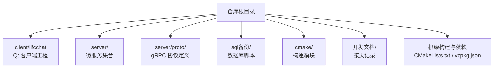
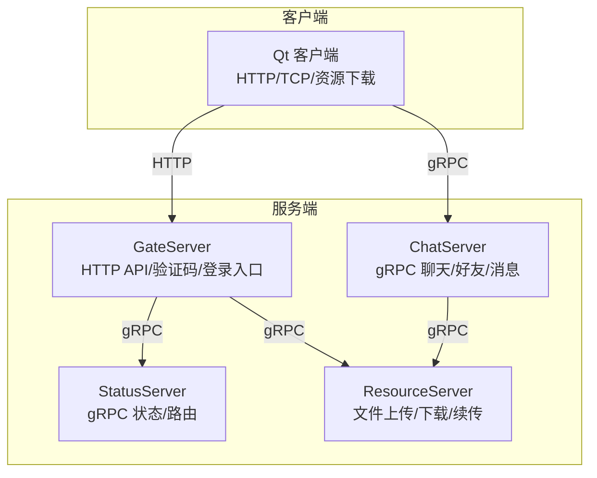
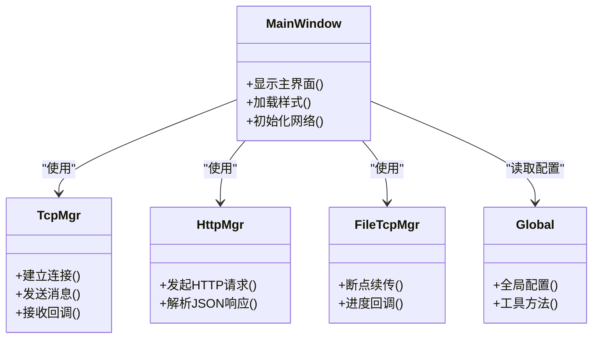
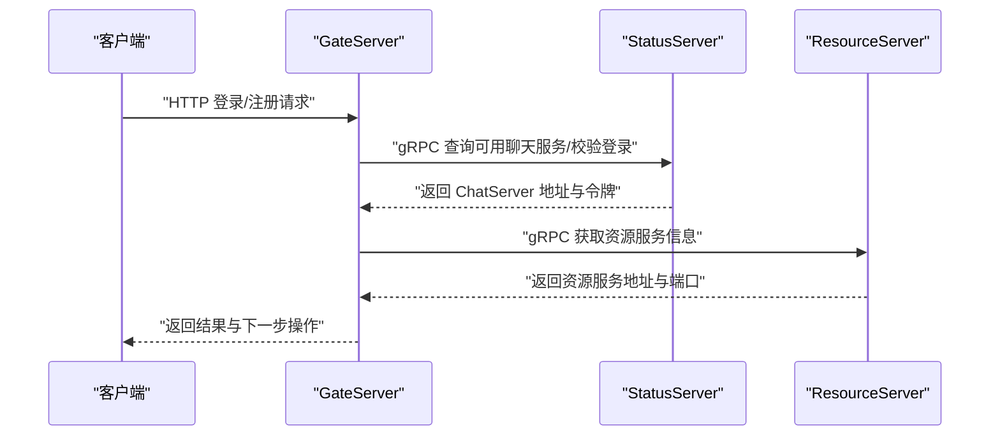
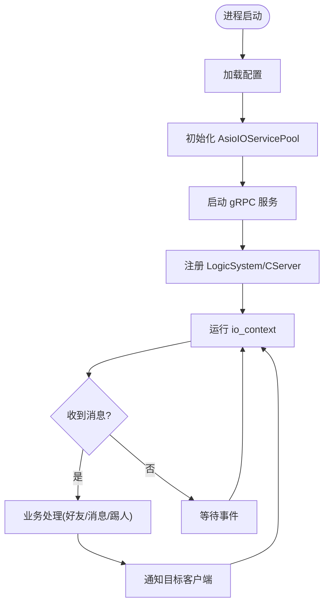
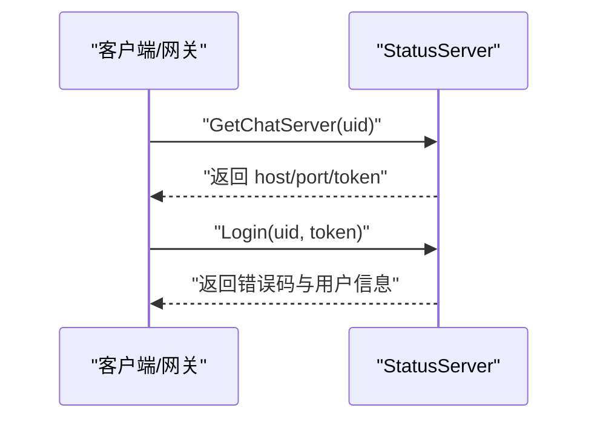
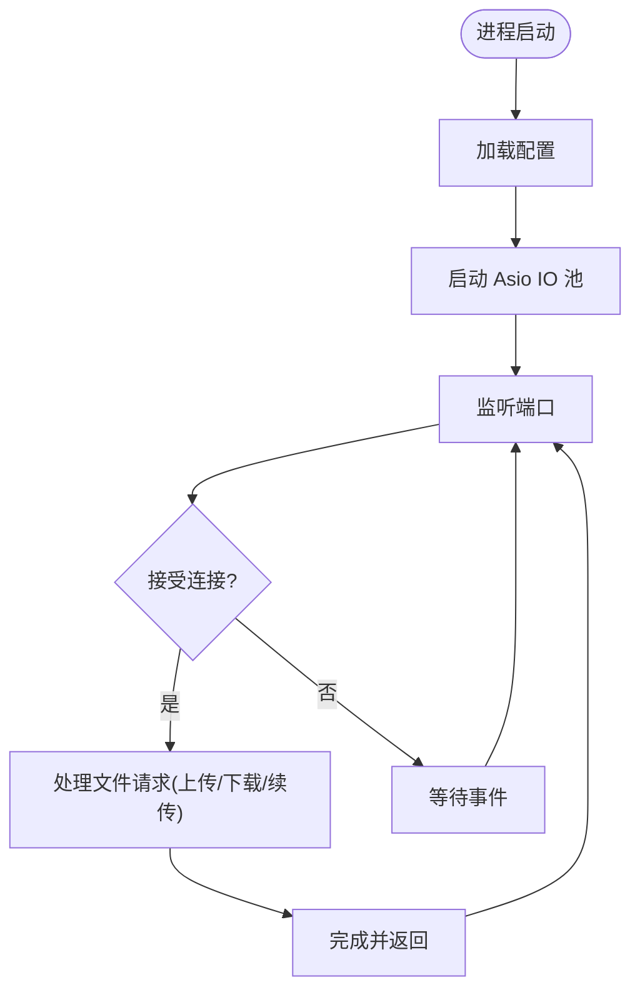
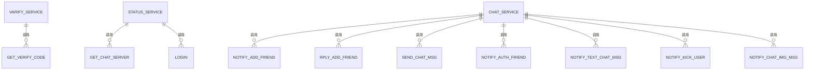
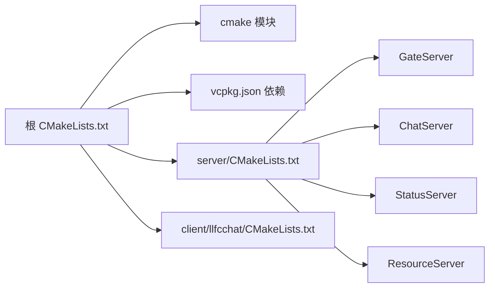

# 项目结构说明

<cite>
**本文引用的文件**   
- [README.md](file://README.md)
- [CMakeLists.txt](file://CMakeLists.txt)
- [vcpkg.json](file://vcpkg.json)
- [client/llfcchat/CMakeLists.txt](file://client/llfcchat/CMakeLists.txt)
- [client/llfcchat/config/config.ini](file://client/llfcchat/config/config.ini)
- [client/llfcchat/src/main.cpp](file://client/llfcchat/src/main.cpp)
- [server/CMakeLists.txt](file://server/CMakeLists.txt)
- [server/GateServer/config/config.ini](file://server/GateServer/config/config.ini)
- [server/GateServer/src/GateServer.cpp](file://server/GateServer/src/GateServer.cpp)
- [server/ChatServer/config/chatserver1.ini](file://server/ChatServer/config/chatserver1.ini)
- [server/ChatServer/src/ChatServer.cpp](file://server/ChatServer/src/ChatServer.cpp)
- [server/ResourceServer/src/ResourceServer.cpp](file://server/ResourceServer/src/ResourceServer.cpp)
- [server/StatusServer/src/StatusServer.cpp](file://server/StatusServer/src/StatusServer.cpp)
- [server/proto/chat/message.proto](file://server/proto/chat/message.proto)
- [server/proto/control/message.proto](file://server/proto/control/message.proto)
- [server/proto/resource/message.proto](file://server/proto/resource/message.proto)
</cite>

## 目录
1. [简介](#简介)
2. [项目结构总览](#项目结构总览)
3. [核心组件](#核心组件)
4. [架构总览](#架构总览)
5. [详细组件分析](#详细组件分析)
6. [依赖关系分析](#依赖关系分析)
7. [性能与构建特性](#性能与构建特性)
8. [故障排查指南](#故障排查指南)
9. [结论](#结论)
10. [附录：开发文档与脚本导航](#附录开发文档与脚本导航)

## 简介
LLFCChat 是一个基于 C++ 的聊天系统实战项目，涵盖 gRPC、并发线程、网络编程、Qt 客户端开发、数据库（MySQL）与缓存（Redis）等技术的综合应用。项目采用多服务微服务架构，包含客户端与多个服务器端服务，并通过 Protocol Buffers 定义跨服务通信协议。

本说明文档面向开发者，系统化梳理项目的目录组织、客户端 Qt 工程结构、各微服务职责与文件组织、配置与构建脚本位置与作用，并提供快速定位代码与配置的导航指引。

## 项目结构总览
仓库根目录采用“客户端 + 服务端 + 协议 + 数据库脚本 + 开发文档”的分层组织方式：
- client/llfcchat：Qt 客户端工程，包含 include、src、ui、resources、config 等子目录
- server：服务端微服务集合，包含 GateServer、ChatServer、StatusServer、ResourceServer 以及 proto 协议定义
- sql备份：数据库初始化与迁移脚本
- cmake：CMake 模块与自定义脚本
- 开发文档：按天记录的开发日志与实现要点
- 根级构建与依赖管理：CMakeLists.txt、vcpkg.json、CMakePresets.json

**章节来源**
- [CMakeLists.txt:1-34](file://CMakeLists.txt#L1-L34)
- [server/CMakeLists.txt:1-38](file://server/CMakeLists.txt#L1-L38)
- [README.md:1-112](file://README.md#L1-L112)

## 核心组件
- 客户端（Qt）：负责用户界面、HTTP/HTTPS 请求、TCP 长连接、资源下载、样式与资源加载
- 网关服务（GateServer）：对外暴露 HTTP API，处理注册、登录、验证码等流程，协调状态服务与资源服务
- 聊天服务（ChatServer）：维护用户会话、消息转发、好友关系、踢人通知、图片消息通知等
- 状态服务（StatusServer）：提供 gRPC 接口用于查询可用聊天服务与登录校验
- 资源服务（ResourceServer）：提供文件上传/下载、分片续传、头像与聊天图片等资源管理
- 协议定义（proto）：统一的消息结构与 RPC 接口定义，贯穿客户端与各服务

**章节来源**
- [server/proto/chat/message.proto:1-167](file://server/proto/chat/message.proto#L1-L167)
- [server/proto/control/message.proto:1-143](file://server/proto/control/message.proto#L1-L143)
- [server/proto/resource/message.proto:1-169](file://server/proto/resource/message.proto#L1-L169)

## 架构总览
整体架构由客户端通过 HTTP 接入网关，再由网关协调状态服务与聊天/资源服务；聊天与资源服务之间通过 gRPC 进行内部通信。

**图示来源**
- [server/GateServer/src/GateServer.cpp:131-163](file://server/GateServer/src/GateServer.cpp#L131-L163)
- [server/StatusServer/src/StatusServer.cpp:20-55](file://server/StatusServer/src/StatusServer.cpp#L20-L55)
- [server/ChatServer/src/ChatServer.cpp:20-74](file://server/ChatServer/src/ChatServer.cpp#L20-L74)
- [server/ResourceServer/src/ResourceServer.cpp:15-42](file://server/ResourceServer/src/ResourceServer.cpp#L15-L42)

## 详细组件分析

### 客户端（Qt）工程结构
- include：头文件目录，存放 UI 控件、网络管理、用户数据、单例模式等核心类声明
- src：源代码目录，对应 include 中的实现，包括主程序、窗口逻辑、HTTP/TCP 管理、资源下载等
- ui：Qt Designer 界面文件，定义各窗体布局与控件
- resources：资源文件，包含样式表 qss、图标、静态资源与 Windows 资源文件
- config：运行时配置文件，如 GateServer 的连接地址与端口

**图示来源**
- [client/llfcchat/src/main.cpp:1-44](file://client/llfcchat/src/main.cpp#L1-L44)
- [client/llfcchat/CMakeLists.txt:36-197](file://client/llfcchat/CMakeLists.txt#L36-L197)

**章节来源**
- [client/llfcchat/CMakeLists.txt:1-222](file://client/llfcchat/CMakeLists.txt#L1-L222)
- [client/llfcchat/config/config.ini:1-4](file://client/llfcchat/config/config.ini#L1-L4)
- [client/llfcchat/src/main.cpp:1-44](file://client/llfcchat/src/main.cpp#L1-L44)

### 网关服务（GateServer）
- 职责：对外提供 HTTP API，处理验证码获取、用户注册与登录，协调状态服务与资源服务
- 关键文件：
  - config/config.ini：服务端口、下游服务地址（验证、状态、资源）、MySQL/Redis 连接信息
  - src/GateServer.cpp：启动 Asio IO 池、初始化 Redis/MySQL 管理器、监听端口并启动服务

**图示来源**
- [server/GateServer/config/config.ini:1-25](file://server/GateServer/config/config.ini#L1-L25)
- [server/GateServer/src/GateServer.cpp:131-163](file://server/GateServer/src/GateServer.cpp#L131-L163)

**章节来源**
- [server/GateServer/config/config.ini:1-25](file://server/GateServer/config/config.ini#L1-L25)
- [server/GateServer/src/GateServer.cpp:1-163](file://server/GateServer/src/GateServer.cpp#L1-L163)

### 聊天服务（ChatServer）
- 职责：维护用户会话、消息转发、好友申请与认证、踢人通知、图片消息通知
- 关键文件：
  - config/chatserver1.ini：自身服务名、监听端口、RPC 端口、对端 ChatServer 列表、MySQL/Redis 配置
  - src/ChatServer.cpp：启动 Asio IO 池、注册 gRPC 服务、处理信号与优雅关闭

**图示来源**
- [server/ChatServer/config/chatserver1.ini:1-30](file://server/ChatServer/config/chatserver1.ini#L1-L30)
- [server/ChatServer/src/ChatServer.cpp:20-74](file://server/ChatServer/src/ChatServer.cpp#L20-L74)

**章节来源**
- [server/ChatServer/config/chatserver1.ini:1-30](file://server/ChatServer/config/chatserver1.ini#L1-L30)
- [server/ChatServer/src/ChatServer.cpp:1-81](file://server/ChatServer/src/ChatServer.cpp#L1-L81)

### 状态服务（StatusServer）
- 职责：提供 gRPC 接口用于查询可用聊天服务与登录校验
- 关键文件：
  - src/StatusServer.cpp：启动 gRPC 服务、绑定 io_context、捕获信号优雅关闭

**图示来源**
- [server/StatusServer/src/StatusServer.cpp:20-55](file://server/StatusServer/src/StatusServer.cpp#L20-L55)

**章节来源**
- [server/StatusServer/src/StatusServer.cpp:1-72](file://server/StatusServer/src/StatusServer.cpp#L1-L72)

### 资源服务（ResourceServer）
- 职责：提供文件上传/下载、分片续传、头像与聊天图片等资源管理
- 关键文件：
  - src/ResourceServer.cpp：启动 Asio IO 池、监听端口、处理信号

**图示来源**
- [server/ResourceServer/src/ResourceServer.cpp:15-42](file://server/ResourceServer/src/ResourceServer.cpp#L15-L42)

**章节来源**
- [server/ResourceServer/src/ResourceServer.cpp:1-42](file://server/ResourceServer/src/ResourceServer.cpp#L1-L42)

### 协议定义（proto）
- chat/message.proto：聊天相关 RPC 与服务定义（好友、消息、踢人、图片通知）
- control/message.proto：控制相关 RPC 与服务定义（验证码、状态、登录）
- resource/message.proto：资源相关 RPC 与服务定义（文件传输、续传）

**图示来源**
- [server/proto/chat/message.proto:1-167](file://server/proto/chat/message.proto#L1-L167)
- [server/proto/control/message.proto:1-143](file://server/proto/control/message.proto#L1-L143)
- [server/proto/resource/message.proto:1-169](file://server/proto/resource/message.proto#L1-L169)

**章节来源**
- [server/proto/chat/message.proto:1-167](file://server/proto/chat/message.proto#L1-L167)
- [server/proto/control/message.proto:1-143](file://server/proto/control/message.proto#L1-L143)
- [server/proto/resource/message.proto:1-169](file://server/proto/resource/message.proto#L1-L169)

## 依赖关系分析
- 构建系统与依赖管理：
  - 根 CMakeLists.txt 指定生成器与 vcpkg 路径，引入 cmake 模块与 grpc 代码生成
  - vcpkg.json 声明 Boost、jsoncpp、grpc、protobuf、hiredis、mysql-connector-cpp、Qt5 等依赖
- 客户端 CMake：
  - 启用 AUTOMOC/AUTOUIC/AUTORCC，链接 Qt5 Core/Gui/Network/Widgets
  - 静态导入平台插件与图像格式插件
  - 构建后复制配置文件与静态资源到输出目录
- 服务端 CMake：
  - server/CMakeLists.txt 聚合各微服务子目录

**图示来源**
- [CMakeLists.txt:1-34](file://CMakeLists.txt#L1-L34)
- [vcpkg.json:1-32](file://vcpkg.json#L1-L32)
- [server/CMakeLists.txt:1-38](file://server/CMakeLists.txt#L1-L38)
- [client/llfcchat/CMakeLists.txt:1-222](file://client/llfcchat/CMakeLists.txt#L1-L222)

**章节来源**
- [CMakeLists.txt:1-34](file://CMakeLists.txt#L1-L34)
- [vcpkg.json:1-32](file://vcpkg.json#L1-L32)
- [server/CMakeLists.txt:1-38](file://server/CMakeLists.txt#L1-L38)
- [client/llfcchat/CMakeLists.txt:1-222](file://client/llfcchat/CMakeLists.txt#L1-L222)

## 性能与构建特性
- 构建要求：
  - 必须使用 “Ninja Multi-Config” 生成器，禁止源码目录内构建
  - C++ 标准：客户端 C++11，服务端 C++17
- 依赖管理：
  - 通过 vcpkg 统一管理第三方库版本与特性（如 Qt5-imageformats 启用 webp）
- 客户端插件与资源：
  - 静态导入平台集成插件与图像格式插件，确保可移植性
  - 构建后自动部署配置文件与静态资源，简化运行环境准备
- 服务端异步模型：
  - 广泛使用 Boost.Asio 的 io_context 与信号处理，支持优雅关闭与高并发

[本节为通用指导，不直接分析具体文件]

## 故障排查指南
- 客户端无法连接网关：
  - 检查 client/llfcchat/config/config.ini 中 GateServer 的 host/port 是否正确
  - 确认 main.cpp 中读取配置并拼接 URL 的逻辑是否生效
- 服务端启动失败：
  - 检查各服务的 config/config.ini 或 chatserver*.ini 中的端口、MySQL/Redis 连接参数
  - 查看 GateServer/ChatServer/StatusServer/ResourceServer 的 main 函数异常捕获输出
- 数据库/缓存连接问题：
  - 核对 MySQL/Redis 的 Host、Port、User、Passwd、Schema 等配置项
  - 确认服务已启动且防火墙允许访问

**章节来源**
- [client/llfcchat/config/config.ini:1-4](file://client/llfcchat/config/config.ini#L1-L4)
- [client/llfcchat/src/main.cpp:24-35](file://client/llfcchat/src/main.cpp#L24-L35)
- [server/GateServer/config/config.ini:1-25](file://server/GateServer/config/config.ini#L1-L25)
- [server/ChatServer/config/chatserver1.ini:1-30](file://server/ChatServer/config/chatserver1.ini#L1-L30)
- [server/GateServer/src/GateServer.cpp:131-163](file://server/GateServer/src/GateServer.cpp#L131-L163)
- [server/ChatServer/src/ChatServer.cpp:20-74](file://server/ChatServer/src/ChatServer.cpp#L20-L74)
- [server/StatusServer/src/StatusServer.cpp:20-55](file://server/StatusServer/src/StatusServer.cpp#L20-L55)
- [server/ResourceServer/src/ResourceServer.cpp:15-42](file://server/ResourceServer/src/ResourceServer.cpp#L15-L42)

## 结论
本项目以清晰的目录划分与模块化设计实现了完整的聊天系统。客户端采用 Qt 工程组织，服务端按职责拆分为网关、状态、聊天与资源四个微服务，并通过 proto 定义统一的通信契约。借助 CMake 与 vcpkg 的构建与依赖管理，项目具备良好的可移植性与扩展性。开发者可依据本文档快速定位代码与配置，高效开展功能开发与问题排查。

[本节为总结性内容，不直接分析具体文件]

## 附录：开发文档与脚本导航
- 开发文档：位于“开发文档/”目录，按天记录从架构概述到 WebRTC 信令服务器的实现要点，适合循序渐进学习
- 构建脚本：根目录 CMakeLists.txt 与 server/CMakeLists.txt 聚合子项目；client/llfcchat/CMakeLists.txt 定义 Qt 客户端构建规则
- 依赖清单：vcpkg.json 集中管理所有第三方库与特性开关
- 数据库脚本：sql备份/目录下包含 llfc.sql 及多个版本脚本，用于初始化与迁移

**章节来源**
- [README.md:1-112](file://README.md#L1-L112)
- [CMakeLists.txt:1-34](file://CMakeLists.txt#L1-L34)
- [server/CMakeLists.txt:1-38](file://server/CMakeLists.txt#L1-L38)
- [client/llfcchat/CMakeLists.txt:1-222](file://client/llfcchat/CMakeLists.txt#L1-L222)
- [vcpkg.json:1-32](file://vcpkg.json#L1-L32)