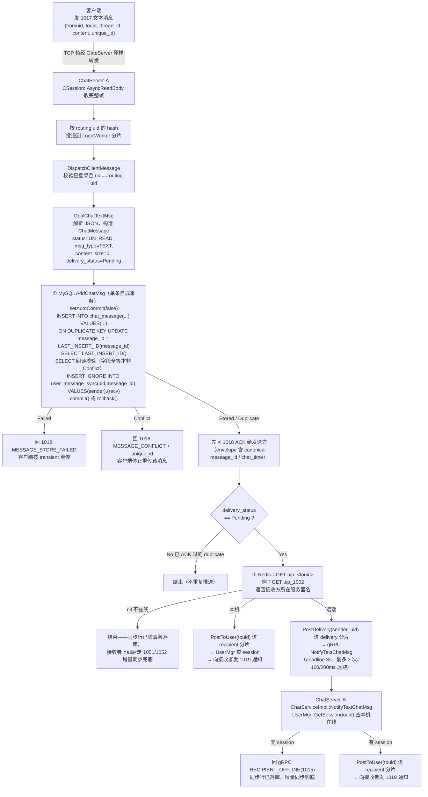
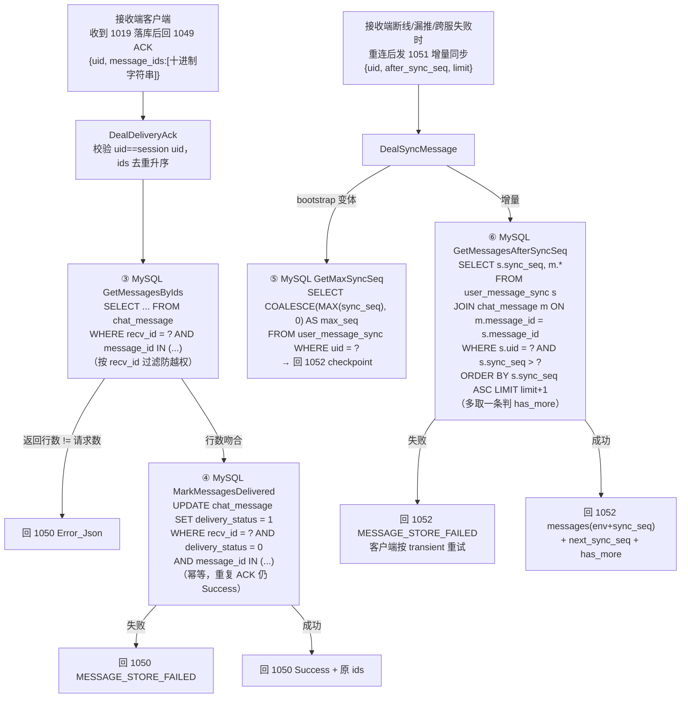

# 服务端处理发送文本消息（1017）完整业务流程

## 图一：主流程（发送侧 + 实时投递）

## 图二：接收端闭环 —— 1049 投递 ACK 与 1051/1052 增量同步兜底

## 语句清单（与源码一一对应）

### MySQL（库 llfc，均为 PreparedStatement 参数化）

| # | 语句 | 出处 |
|---|------|------|
| ①a | `INSERT INTO chat_message (thread_id, sender_id, recv_id, content, created_at, updated_at, status, msg_type, resource_status, unique_id, content_size, content_hash, mime_type, delivery_status) VALUES (?,?,?,?,?,?,?,?,?,?,?,?,?,?) ON DUPLICATE KEY UPDATE message_id = LAST_INSERT_ID(message_id)` | `MysqlDao::UpsertChatMessage` |
| ①b | `SELECT LAST_INSERT_ID()` | 同上（取 canonical message_id） |
| ①c | `SELECT thread_id, recv_id, content, msg_type, content_size, status, resource_status, content_hash, mime_type, created_at, delivery_status FROM chat_message WHERE message_id = ?` | 同上（回读核对冲突） |
| ①d | `INSERT IGNORE INTO user_message_sync (uid, message_id) VALUES (?, ?), (?, ?)`（sender、recv 各一行，文本消息随主事务提交） | `InsertSyncRowsIgnore` |
| ③ | `SELECT message_id, thread_id, sender_id, recv_id, content, created_at, updated_at, status, msg_type, resource_status, unique_id, content_size, content_hash, mime_type, delivery_status FROM chat_message WHERE recv_id = ? AND message_id IN (?,?,...)` | `MysqlDao::GetMessagesByIds` |
| ④ | `UPDATE chat_message SET delivery_status = 1 WHERE recv_id = ? AND delivery_status = 0 AND message_id IN (?,?,...)` | `MysqlDao::MarkMessagesDelivered` |
| ⑤ | `SELECT COALESCE(MAX(sync_seq), 0) AS max_seq FROM user_message_sync WHERE uid = ?` | `MysqlDao::GetMaxSyncSeq` |
| ⑥ | `SELECT s.sync_seq, m.message_id, m.thread_id, m.sender_id, m.recv_id, m.content, m.created_at, m.updated_at, m.status, m.msg_type, m.resource_status, m.unique_id, m.content_size, m.content_hash, m.mime_type, m.delivery_status FROM user_message_sync s JOIN chat_message m ON m.message_id = s.message_id WHERE s.uid = ? AND s.sync_seq > ? ORDER BY s.sync_seq ASC LIMIT ?`（limit 取 limit+1） | `MysqlDao::GetMessagesAfterSyncSeq` |

### Redis（hiredis 命令）

| # | 命令 | 时机 | 出处 |
|---|------|------|------|
| ② | `GET uip_<touid>`（如 `GET uip_1002`）→ 返回服务器名 `chatserver1` | 文本消息事务提交后，查接收方路由 | `LogicSystem::DealChatTextMsg` |
| — | `SET uip_<uid> <server_name>` / `SET usession_<uid> <session_id>` | 登录时写入（本流程前置条件） | `LogicSystem::LoginHandler` |
| — | `SET lock:<uid> <uuid> NX EX <timeout>` 与 `EVAL "if redis.call('get',KEYS[1])==ARGV[1] then return redis.call('del',KEYS[1]) else return 0 end" 1 lock:<uid> <uuid>` | 登录/清理时分布式锁（发送路径不涉及） | `DistLock` |

## 关键设计点

- **先持久化、后 ACK、再推送**：`DealChatTextMsg` 中 ① 事务提交后立即回 1018 给发送方，随后才做 live delivery——顺序不可颠倒（避免 live 先于 sender ACK）。
- **幂等 UPSERT**：以 `(sender_id, unique_id)` 唯一键去重，`LAST_INSERT_ID(expr)` 把 canonical message_id 暴露出来且不改原行；重传/重复包分别落到 Stored/Duplicate。
- **同步行兜底**：`user_message_sync` 的 sender/recv 两行与消息同一事务写入，live 推送失败（离线/跨服失败/停机）都不丢消息，接收端靠 1051/1052 增量同步补拉。
- **发送路径上的 Redis 只有一次 `GET uip_<touid>` 读路由**；Redis 不再保存离线消息（旧 `offline_msg` ZSET 已删除）。
